# 003_Переключение_светлой_темной_темы

Взгляем на header

```js
import styled from 'styled-components';
import {useEffect} from 'react';
import { Link } from 'react-router-dom';
import { IoMoon, IoMoonOutline } from 'react-icons/io5';

import { Container } from './Container';

const HeaderEl = styled.header`
  box-shadow: var(--shadow);
  background-color: var(--colors-ui-base);
`;

const Wrapper = styled.div`
  display: flex;
  justify-content: space-between;
  align-items: center;
  padding: 2rem 0;
`;

const Title = styled(Link).attrs({
  to: '/',
})`
  color: var(--colors-text);
  font-size: var(--fs-sm);
  text-decoration: none;
  font-weight: var(--fw-bold);
`;

const ModeSwitcher = styled.div`
  color: var(--colors-text);
  font-size: var(--fs-sm);
  cursor: pointer;
  // font-weight: var(--fw-bold);
  text-transform: capitalize;
`;

export const Header = () => {
  const theme = 'light';

  useEffect(() => {
    document.body.setAttribute('data-theme', theme);
  }, [theme]);

  return (
    <HeaderEl>
      <Container>
        <Wrapper>
          <Title>Where is the world?</Title>
          <ModeSwitcher>
            {theme === 'light' ? (
              <IoMoonOutline size="14px" />
            ) : (
              <IoMoon size="14px" />
            )}{' '}
            <span style={{ marginLeft: '0.75rem' }}>{theme} Theme</span>
          </ModeSwitcher>
        </Wrapper>
      </Container>
    </HeaderEl>
  );
};

```

Есть набор разметки HeaderEl, Container,  Wrapper это все стилевые компоненты которые используют css переменные что бы задать светлый или темный цвет.

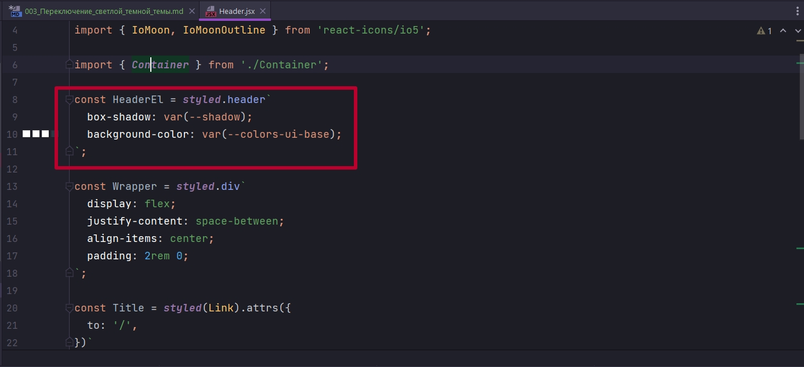


Title это просто стилизованный компонент Link импотрированный из React-router-dom. И он всегда зашит у меня на главную страницу.

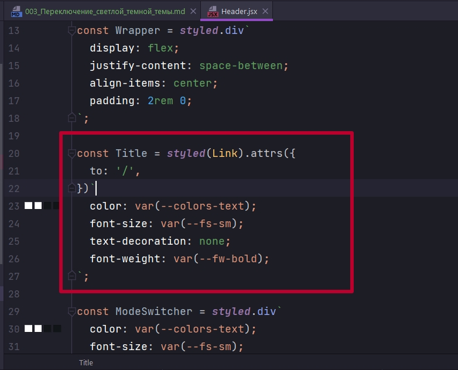

При клике на Title 

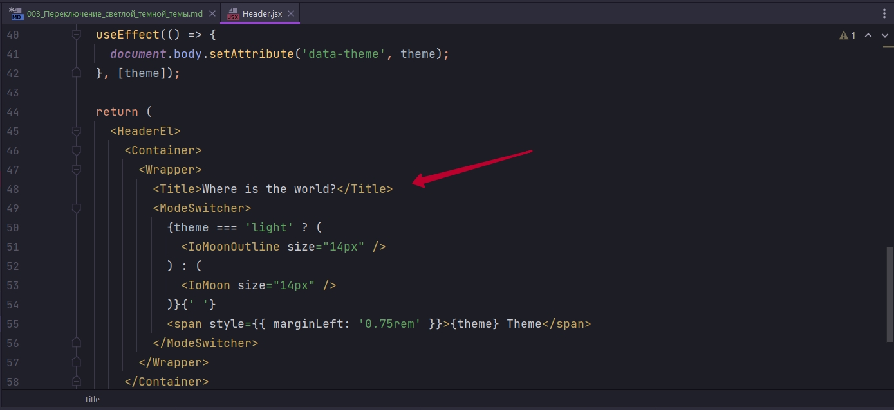

Я просто попадаю на главную страницу.

ModeSwitcher это просто div c определенными настройками.

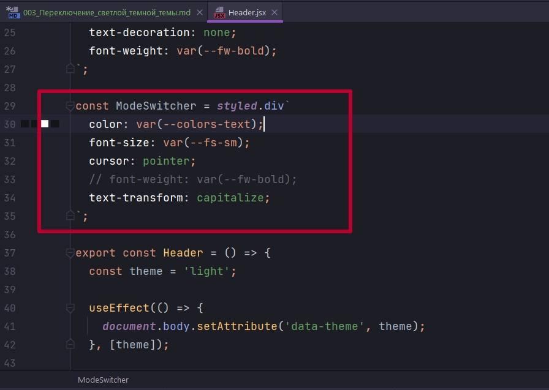


И на уровне компонента я сейчас захардкодил светлую тему.

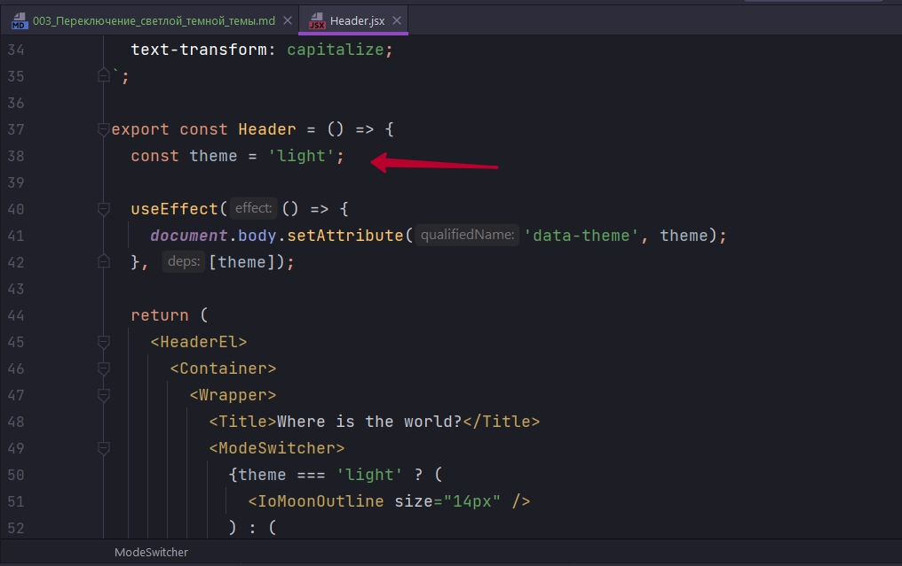

И в момент монтирования приложения  на document.body я устанавливаю data атрибут с тем значением которое  у меня есть.

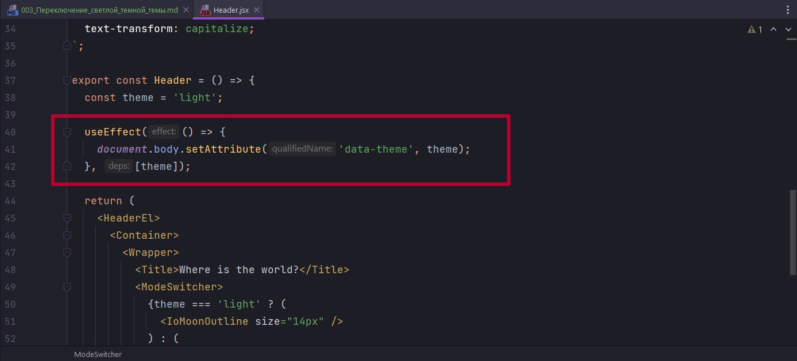

Напомню что что все сессии у меня на этот data атрибут назначаются либо одни цветовые настройки по css переменным.

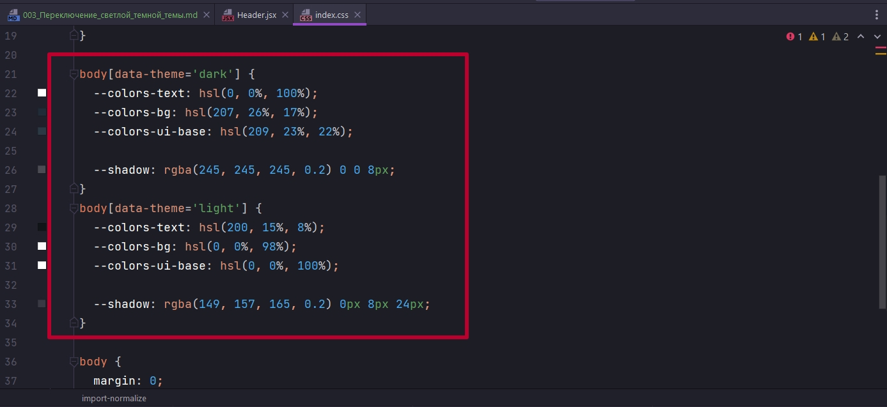

```css
@import-normalize;
@import url('https://fonts.googleapis.com/css2?family=Nunito+Sans:wght@300;600;800&display=swap');

* {
  box-sizing: border-box;
}

:root {
  /* Typography */
  --family: 'Nunito Sans', sans-serif;
  --fs-sm: 14px;
  --fs-md: 16px;
  --fw-light: 300;
  --fw-normal: 600;
  --fw-bold: 800;

  /* Other */
  --radii: 0.5rem;
}

body[data-theme='dark'] {
  --colors-text: hsl(0, 0%, 100%);
  --colors-bg: hsl(207, 26%, 17%);
  --colors-ui-base: hsl(209, 23%, 22%);

  --shadow: rgba(245, 245, 245, 0.2) 0 0 8px;
}
body[data-theme='light'] {
  --colors-text: hsl(200, 15%, 8%);
  --colors-bg: hsl(0, 0%, 98%);
  --colors-ui-base: hsl(0, 0%, 100%);

  --shadow: rgba(149, 157, 165, 0.2) 0px 8px 24px;
}

body {
  margin: 0;
  font-family: var(--family);
  color: var(--colors-text);
  font-weight: var(--fw-light);
  background-color: var(--colors-bg);
}

```

ModeSwitcher так же проверяет светлая или темная тема у меня сейчас

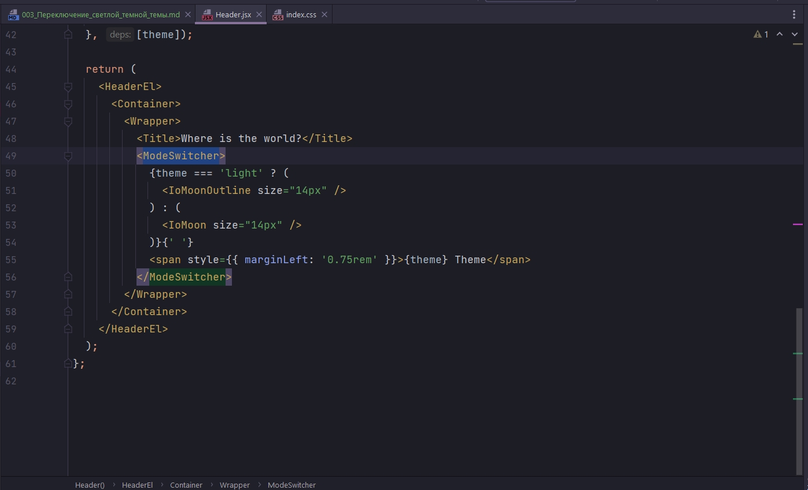


<br/>
<br/>
<br/>
<br/>

Наша задача добавить redux логику. 

В store создаю папку theme и в ней будет всего два файлика theme-actions.js и theme-reducer.js

```js
//src/store/theme-actions.js
export const SET_THEME = "@@theme/SET_THEME";

export const setTheme = (theme) => ({
    type: SET_THEME,
    payload: theme,
});

```

Action setTheme будет принимать конкретную тему.

```js
//src/store/theme-reducer.js
import { SET_THEME } from "./theme-actions";

export const themeReducer = (state = "light", { type, payload }) => {
  switch (type) {
    case SET_THEME:
      return payload;
    default:
      return state;
  }
};

```

```js
//src/store/root-reducer.js
import { combineReducers } from "redux";
import { themeReducer } from "./theme/theme-reducer";

export const rootReducer = combineReducers({
  theme: themeReducer,
});

```

И теперь осталось на уровне приложения это как-то использовать.


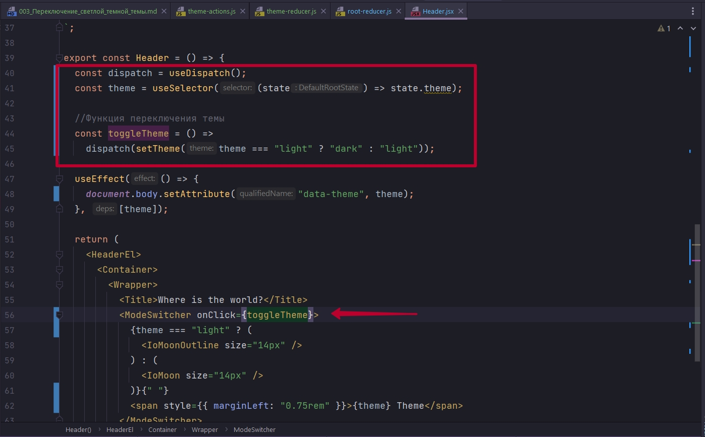

```js
import styled from "styled-components";
import { useSelector, useDispatch } from "react-redux";
import { useEffect } from "react";
import { Link } from "react-router-dom";
import { IoMoon, IoMoonOutline } from "react-icons/io5";

import { Container } from "./Container";
import { setTheme } from "../store/theme/theme-actions";

const HeaderEl = styled.header`
  box-shadow: var(--shadow);
  background-color: var(--colors-ui-base);
`;

const Wrapper = styled.div`
  display: flex;
  justify-content: space-between;
  align-items: center;
  padding: 2rem 0;
`;

const Title = styled(Link).attrs({
  to: "/",
})`
  color: var(--colors-text);
  font-size: var(--fs-sm);
  text-decoration: none;
  font-weight: var(--fw-bold);
`;

const ModeSwitcher = styled.div`
  color: var(--colors-text);
  font-size: var(--fs-sm);
  cursor: pointer;
  // font-weight: var(--fw-bold);
  text-transform: capitalize;
`;

export const Header = () => {
  const dispatch = useDispatch();
  const theme = useSelector((state) => state.theme);

  //Функция переключения темы
  const toggleTheme = () =>
    dispatch(setTheme(theme === "light" ? "dark" : "light"));

  useEffect(() => {
    document.body.setAttribute("data-theme", theme);
  }, [theme]);

  return (
    <HeaderEl>
      <Container>
        <Wrapper>
          <Title>Where is the world?</Title>
          <ModeSwitcher onClick={toggleTheme}>
            {theme === "light" ? (
              <IoMoonOutline size="14px" />
            ) : (
              <IoMoon size="14px" />
            )}{" "}
            <span style={{ marginLeft: "0.75rem" }}>{theme} Theme</span>
          </ModeSwitcher>
        </Wrapper>
      </Container>
    </HeaderEl>
  );
};

```

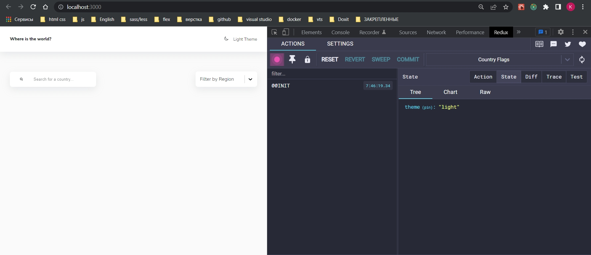

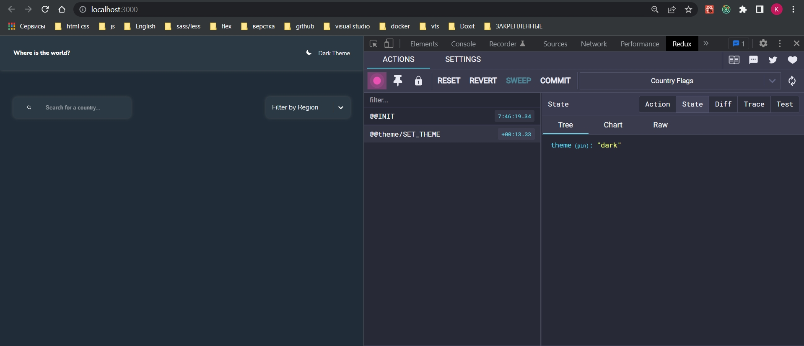

