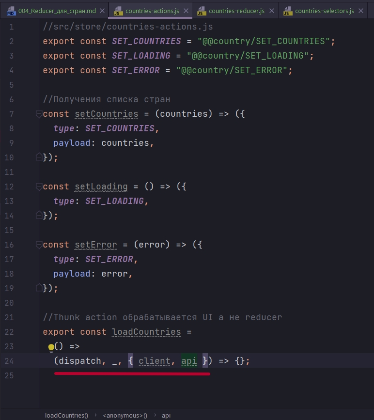

# 004_Reducer_для_стран

В папке store создаю дирректорию countries, countries-actions.js countries-reducer.js countries-selectors.js



Напомню client и api мы передаем в withExtraArgument. И можем их отлавливать в thunk action. client это библиотека axios а api это ссылка на наш config.js. 

```js
//src.config.js
const BASE_URL = "https://restcountries.com/v2/";

export const ALL_COUNTRIES =
  BASE_URL + "all?fields=name,capital,flags,population,region";

export const searchByCountry = (name) => BASE_URL + "name/" + name;

export const filterByCode = (codes) =>
  BASE_URL + "alpha?codes=" + codes.join(",");

```

И вот готовые actions

```js
//src/store/countries-actions.js
import { ALL_COUNTRIES } from "../../config";

export const SET_COUNTRIES = "@@country/SET_COUNTRIES";
export const SET_LOADING = "@@country/SET_LOADING";
export const SET_ERROR = "@@country/SET_ERROR";

//Получения списка стран
const setCountries = (countries) => ({
  type: SET_COUNTRIES,
  payload: countries,
});

const setLoading = () => ({
  type: SET_LOADING,
});

const setError = (error) => ({
  type: SET_ERROR,
  payload: error,
});

//Thunk action обрабатывается UI а не reducer
export const loadCountries =
  () =>
  (dispatch, _, { client, api }) => {
    dispatch(setLoading());
    client
      .get(api.ALL_COUNTRIES)
      .then(({ data }) => dispatch(setCountries(data)))
      .catch((error) => dispatch(setError(error)));
  };

```

Перехожу к reducer.

```js
//src/store/countries-reducer.js

import { SET_COUNTRIES, SET_ERROR, SET_LOADING } from "./countries-actions";

const initialState = {
  status: "idle", //loading | received | reject
  list: [],
  error: null,
};

export const countriesReducer = (state = initialState, { type, payload }) => {
  switch (type) {
    case SET_LOADING:
      return { ...state, status: "loading", error: null };
    case SET_COUNTRIES:
      return { ...state, status: "received", list: [...state.list, payload] };
    case SET_ERROR:
      return { ...state, status: "reject", list: [], error: payload };
    default:
      return state;
  }
};

```

Ну и selectors. Для начало мы будем выбирать все страны, а потом мы это дело поправим. Нам нужно будет фильтровать страны. И для удобной фильтрации нам нужно будет использовать соответствующий селестор.

```js
//src/store/countries-selectors.js

export const selectCountriesInfo = (state) => ({
  status: state.countries.status,
  error: state.countries.error,
  quantity: state.countries.list.length,
});

export const selectAllCountries = (state) => state.countries.list;

```

