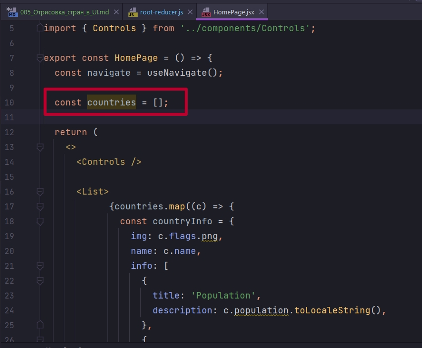
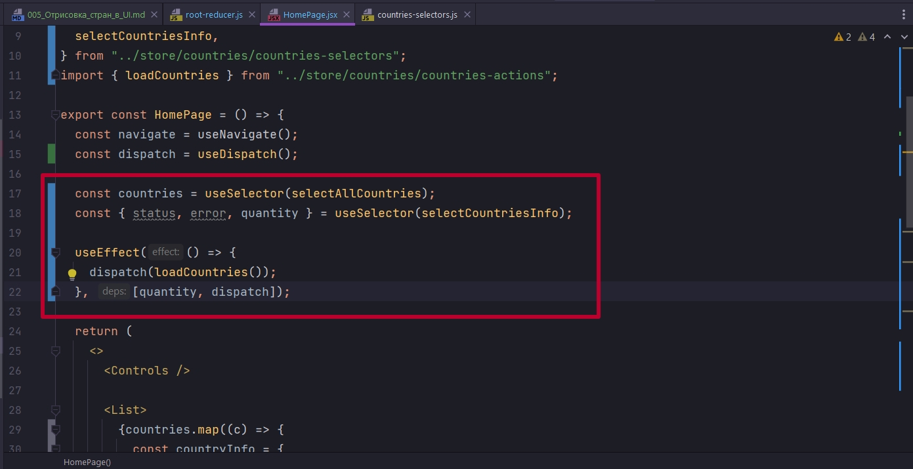
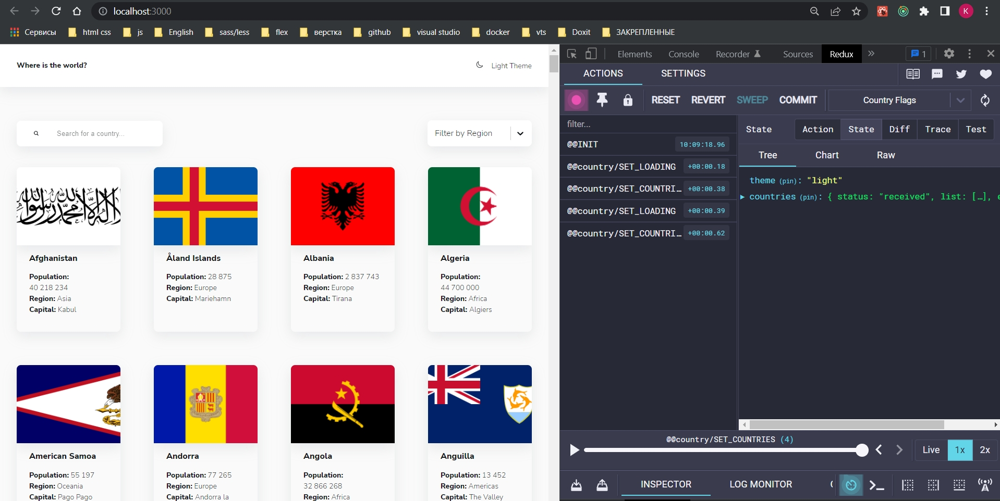
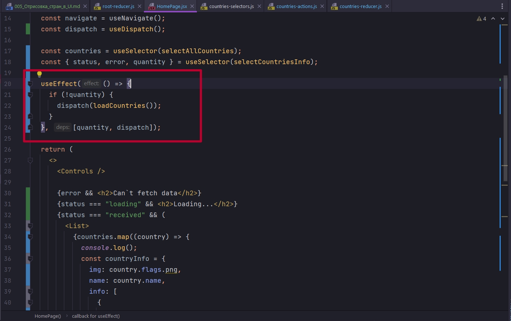
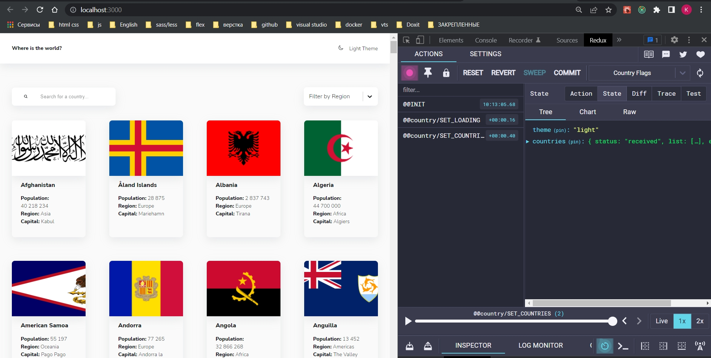

# 005_Отрисовка_стран_в_UI

Подключение к приложению нам конечно нужно начать с rootReducer.

```js
//src/store/root-reducer.js
import { combineReducers } from "redux";
import { themeReducer } from "./theme/theme-reducer";
import { countriesReducer } from "./countries/countries-reducer";

export const rootReducer = combineReducers({
  theme: themeReducer,
  countries: countriesReducer,
});

```

Смотрим в UI. В HomePage указывается что countries пустой массив.





Обычно вся асинхронная логика у нас происходит после монтирования компонента. По этому мы говорим useEffect как только компонент смонтирован я хочу выполнить dispatch моего thunk loadCountries.

Разумеется мне нужно уточнить в какой момент мне нужно заново запускать useEffect. Потому что сейчас useEffect отрабатывает единажды. Но у меня SPA приложение. Я могу уйди со страницы, а потом вернуться. По этому в качестве зависимости указываю quantity, dispatch. dispatch потому что useEffect требует.

С точки зрения разметки я могу добавить инфу об ошибке.

И вот ошибка на уровне моего reducer. В SET_COUNTRIES я создавал новый массив. Думал что мутировать массив не буду. Однако обычно создается массив в массиве и в этом и проблема.

В массив list просто передаю payload

```js
//src/store/countries-reducer.js

import { SET_COUNTRIES, SET_ERROR, SET_LOADING } from "./countries-actions";

const initialState = {
  status: "idle", //loading | received | reject
  list: [],
  error: null,
};

export const countriesReducer = (state = initialState, { type, payload }) => {
  switch (type) {
    case SET_LOADING:
      return { ...state, status: "loading", error: null };
    case SET_COUNTRIES:
      return { ...state, status: "received", list: payload };
    case SET_ERROR:
      return { ...state, status: "reject", list: [], error: payload };
    default:
      return state;
  }
};

```

```js
import { useNavigate } from "react-router-dom";
import { useDispatch, useSelector } from "react-redux";
import { useEffect } from "react";
import { List } from "../components/List";
import { Card } from "../components/Card";
import { Controls } from "../components/Controls";
import {
  selectAllCountries,
  selectCountriesInfo,
} from "../store/countries/countries-selectors";
import { loadCountries } from "../store/countries/countries-actions";

export const HomePage = () => {
  const navigate = useNavigate();
  const dispatch = useDispatch();

  const countries = useSelector(selectAllCountries);
  const { status, error, quantity } = useSelector(selectCountriesInfo);

  useEffect(() => {
    dispatch(loadCountries());
  }, [quantity, dispatch]);

  return (
    <>
      <Controls />

      {error && <h2>Can`t fetch data</h2>}
      {status === "loading" && <h2>Loading...</h2>}
      {status === "received" && (
        <List>
          {countries.map((country) => {
            console.log();
            const countryInfo = {
              img: country.flags.png,
              name: country.name,
              info: [
                {
                  title: "Population",
                  description: country.population.toLocaleString(),
                },
                {
                  title: "Region",
                  description: country.region,
                },
                {
                  title: "Capital",
                  description: country.capital,
                },
              ],
            };

            return (
              <Card
                key={country.name}
                onClick={() => navigate(`/country/${country.name}`)}
                {...countryInfo}
              />
            );
          })}
        </List>
      )}
    </>
  );
};

```



Как видим у нас загрузка произошла два раза. Все по тому что dispatch должен происходить только при пустом количестве стран. Делаю проверку в useEffect.



Проблем в этом не должно возникнуть. Когда мы переходим на другую страницу у нас список размонтируется, и если мы хотим попасть назад, количество измениться и useEffect снова отработает.




