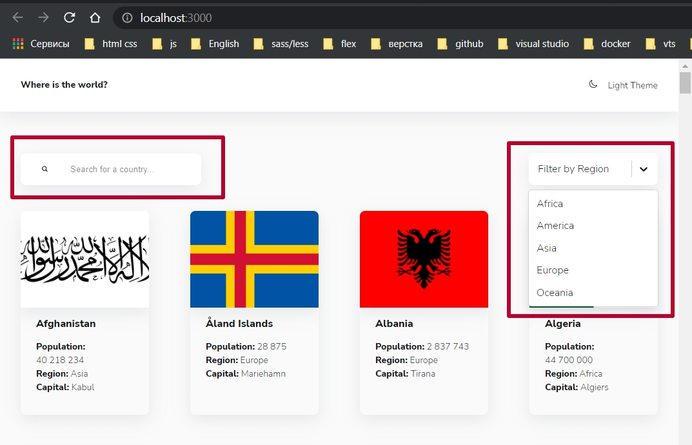
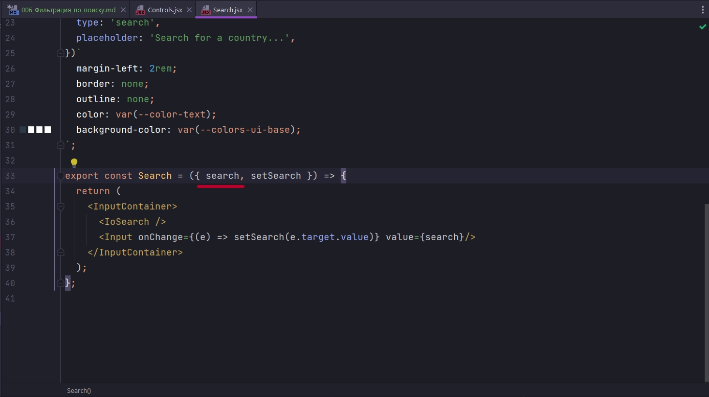
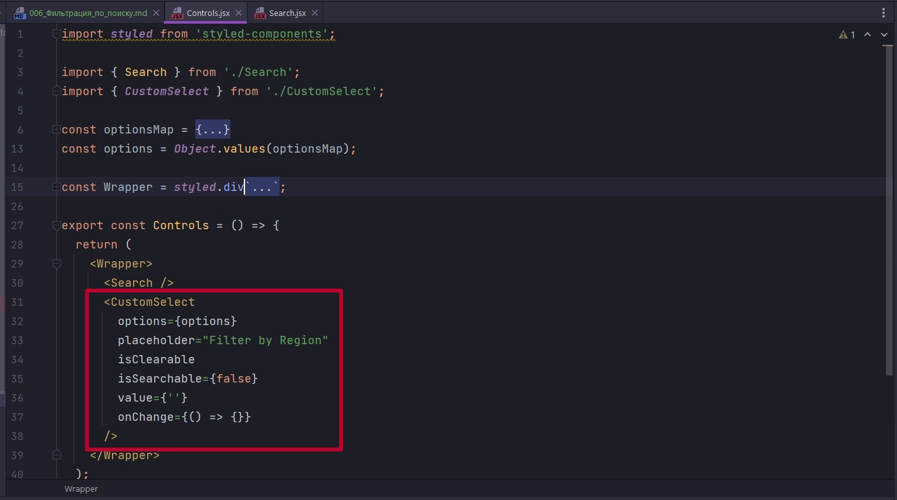
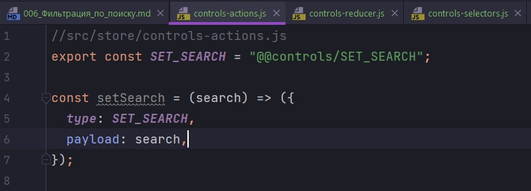
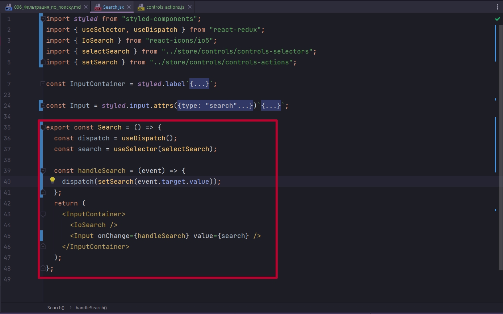
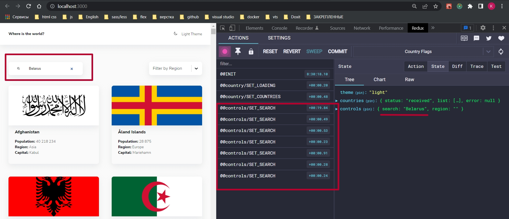
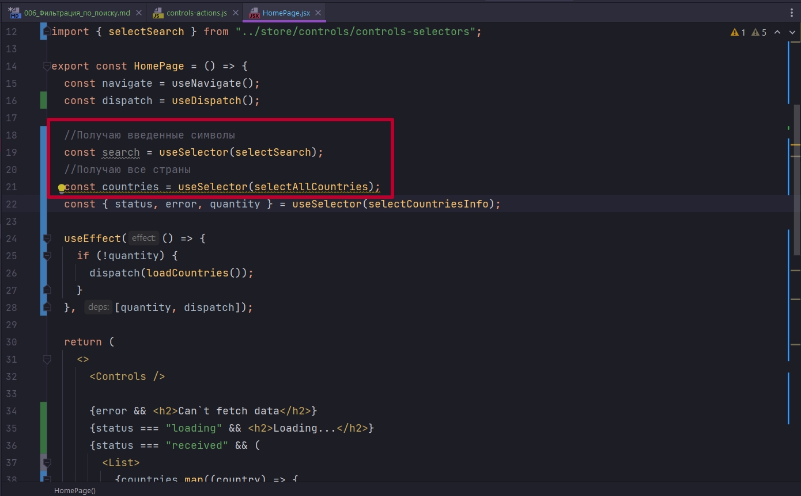
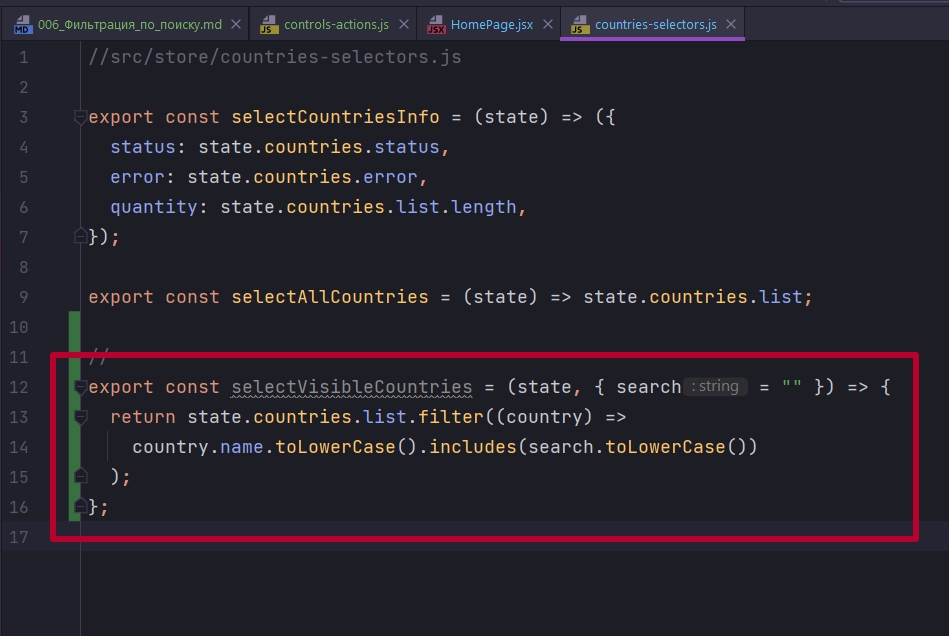
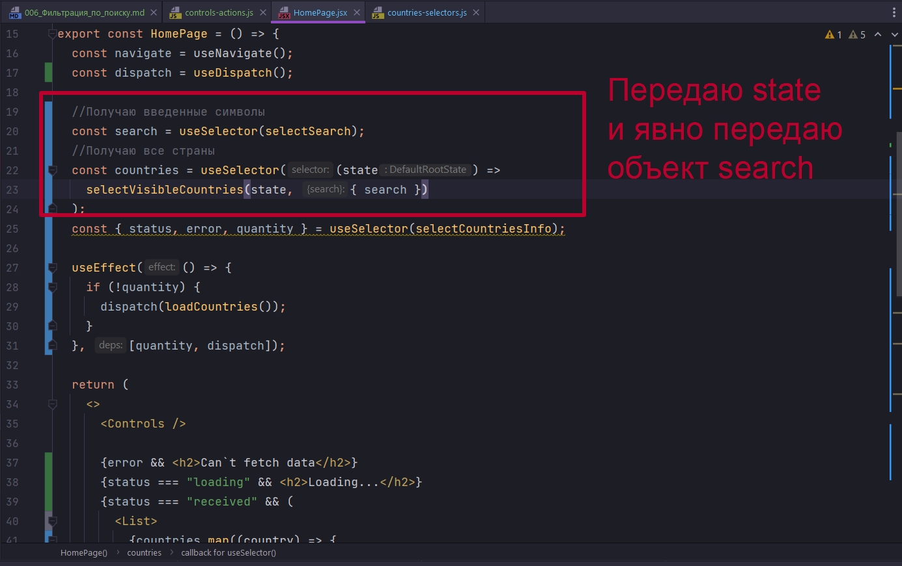
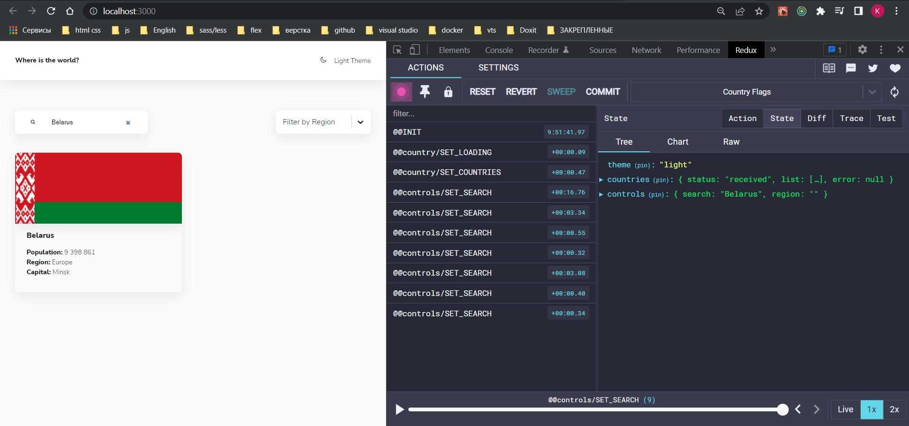

# 006_Фильтрация_по_поиску

Редюсер назову controls. C точки зрения контролсов, если мы взглянем на наш UI, у нас есть строка поиска, и у нас есть фильтры.



Они у нас нахожятся в едином компоненте

```js
import styled from 'styled-components';

import { Search } from './Search';
import { CustomSelect } from './CustomSelect';

const optionsMap = {
  'Africa': { value: 'Africa', label: 'Africa' },
  'America': { value: 'America', label: 'America' },
  'Asia': { value: 'Asia', label: 'Asia' },
  'Europe': { value: 'Europe', label: 'Europe' },
  'Oceania': { value: 'Oceania', label: 'Oceania' },
}
const options = Object.values(optionsMap);

const Wrapper = styled.div`
  display: flex;
  flex-direction: column;
  align-items: flex-start;

  @media (min-width: 767px) {
    flex-direction: row;
    justify-content: space-between;
    align-items: center;
  }
`;

export const Controls = () => {
  return (
    <Wrapper>
      <Search />
      <CustomSelect
        options={options}
        placeholder="Filter by Region"
        isClearable
        isSearchable={false}
        value={''}
        onChange={() => {}}
      />
    </Wrapper>
  );
};

```

CustomSelect мы рассмортим чуть позже. А сейчас нас интересует Search.

```js
import styled from 'styled-components';

import { IoSearch } from 'react-icons/io5';

const InputContainer = styled.label`
  background-color: var(--colors-ui-base);
  padding: 1rem 2rem;
  display: flex;
  align-items: center;

  border-radius: var(--radii);
  box-shadow: var(--shadow);
  width: 100%;
  margin-bottom: 1rem;

  @media (min-width: 767px) {
    margin-bottom: 0;
    width: 280px;
  }
`;

const Input = styled.input.attrs({
  type: 'search',
  placeholder: 'Search for a country...',
})`
  margin-left: 2rem;
  border: none;
  outline: none;
  color: var(--color-text);
  background-color: var(--colors-ui-base);
`;

export const Search = ({ search, setSearch }) => {
  return (
    <InputContainer>
      <IoSearch />
      <Input onChange={(e) => setSearch(e.target.value)} value={search}/>
    </InputContainer>
  );
};

```

Search пердставляет собой набор двух стилевых компонентов. InputContainer это некий label со стилями. Сам по себе Input со стилями. И дополнительно используется иконка IoSearch.

<br/>
<br/>
<br/>

И здесь может быть разный подход. У нас Search может быть независимым т.е. здесь в компоненте Search подключать себе dispatch исоотвествующий селектор search



Единственное то что он тогда будет не переиспользуемым.


А можем делать это все на уровне Controls, получать нужные данные и спускать search через пропсы как search, setSearch. Тогда компонент Search можно много раз переиспользовать. 

Но тогда когда мы каждый раз будем вводить любой символ, у нас будет происходить перерендер еще и вложенного компонента



По этому скорее всего мы будем работать на уровне самого Search.

<br/>
<br/>
<br/>

В controls создаю  controls-actions.js controls-reducer.js controls-selectors.js.

Начну controls. Как обычно создаю константу. И одноименный ей  синхронный action который будет принимать строковое значение search.



Теперь reducer.

```js
//src/store/controls-reducer.js

import { SET_SEARCH } from "./controls-actions";

const initialState = {
  search: "",
  region: "",
};

export const controlsReducer = (state = initialState, { type, payload }) => {
  switch (type) {
    case SET_SEARCH:
      return { ...state, search: payload };
    default:
      return state;
  }
};

```

```js
//src/store/root-reducer.js
import { combineReducers } from "redux";
import { themeReducer } from "./theme/theme-reducer";
import { countriesReducer } from "./countries/countries-reducer";
import { controlsReducer } from "./controls/controls-reducer";

export const rootReducer = combineReducers({
  theme: themeReducer,
  countries: countriesReducer,
  controls: controlsReducer,
});

```

Сделаем пока что один селектор selectSearch.

```js
//src/store/controls-selectors.js
export const selectSearch = (state) => state.controls.search;

```

Идем на уровень компоненте Search.



```js
import styled from "styled-components";
import { useSelector, useDispatch } from "react-redux";
import { IoSearch } from "react-icons/io5";
import { selectSearch } from "../store/controls/controls-selectors";
import { setSearch } from "../store/controls/controls-actions";

const InputContainer = styled.label`
  background-color: var(--colors-ui-base);
  padding: 1rem 2rem;
  display: flex;
  align-items: center;

  border-radius: var(--radii);
  box-shadow: var(--shadow);
  width: 100%;
  margin-bottom: 1rem;

  @media (min-width: 767px) {
    margin-bottom: 0;
    width: 280px;
  }
`;

const Input = styled.input.attrs({
  type: "search",
  placeholder: "Search for a country...",
})`
  margin-left: 2rem;
  border: none;
  outline: none;
  color: var(--color-text);
  background-color: var(--colors-ui-base);
`;

export const Search = () => {
  const dispatch = useDispatch();
  const search = useSelector(selectSearch);

  const handleSearch = (event) => {
    dispatch(setSearch(event.target.value));
  };
  return (
    <InputContainer>
      <IoSearch />
      <Input onChange={handleSearch} value={search} />
    </InputContainer>
  );
};

```



<br/>
<br/>
<br/>

Замечательно!! Теперь мы должны фильтровать всю эту историю. Что бы все это дело фильтровать, нам на самом деле на нашей страничке выдачи HomePage, будем немножко по другому использовать селектор. Но что бы этот селектор использовать, здесь нужно будет получать введенные символы. И после чего мне нужно search использовать в countries



Т.е. мне нужно получать не все страны, а только те страны которые соответствуют нашей поисковой строке.

По этому я иду в countries-selectors.js и прописываю новый селектор selectVisibleCountries. И здесь я хочу получать не только state, а так же некий объект с информацией о том что вообще храниться в поиске и в дальнейшем еще и в регионе. Я буду получать свойство search, деструктурировать его, а потом делать выборку.



```js
//src/store/countries-selectors.js

export const selectCountriesInfo = (state) => ({
  status: state.countries.status,
  error: state.countries.error,
  quantity: state.countries.list.length,
});

export const selectAllCountries = (state) => state.countries.list;

//
export const selectVisibleCountries = (state, { search = "" }) => {
  return state.countries.list.filter((country) =>
    country.name.toLowerCase().includes(search.toLowerCase())
  );
};

```

Разберем подробнее. Фильтрую наш список из состояния. Я буду говорить что для каждой страны мне нужно сделать проверку что эта страна country.name. Имена стран мы приведем к нижнему регистру. И с помощью includes проверим что это название включает у нас то что мы получали через поиск. И то что мы получили через поиск тоже приведем к нижнему регистру.

И на уровне главной страницы мы должны использовать другой селектор. Для countries мы теперь используем



```js
import { useNavigate } from "react-router-dom";
import { useDispatch, useSelector } from "react-redux";
import { useEffect } from "react";
import { List } from "../components/List";
import { Card } from "../components/Card";
import { Controls } from "../components/Controls";
import {
  selectAllCountries,
  selectCountriesInfo,
  selectVisibleCountries,
} from "../store/countries/countries-selectors";
import { loadCountries } from "../store/countries/countries-actions";
import { selectSearch } from "../store/controls/controls-selectors";

export const HomePage = () => {
  const navigate = useNavigate();
  const dispatch = useDispatch();

  //Получаю введенные символы
  const search = useSelector(selectSearch);
  //Получаю все страны
  const countries = useSelector((state) =>
    selectVisibleCountries(state, { search })
  );
  const { status, error, quantity } = useSelector(selectCountriesInfo);

  useEffect(() => {
    if (!quantity) {
      dispatch(loadCountries());
    }
  }, [quantity, dispatch]);

  return (
    <>
      <Controls />

      {error && <h2>Can`t fetch data</h2>}
      {status === "loading" && <h2>Loading...</h2>}
      {status === "received" && (
        <List>
          {countries.map((country) => {
            console.log();
            const countryInfo = {
              img: country.flags.png,
              name: country.name,
              info: [
                {
                  title: "Population",
                  description: country.population.toLocaleString(),
                },
                {
                  title: "Region",
                  description: country.region,
                },
                {
                  title: "Capital",
                  description: country.capital,
                },
              ],
            };

            return (
              <Card
                key={country.name}
                onClick={() => navigate(`/country/${country.name}`)}
                {...countryInfo}
              />
            );
          })}
        </List>
      )}
    </>
  );
};

```




