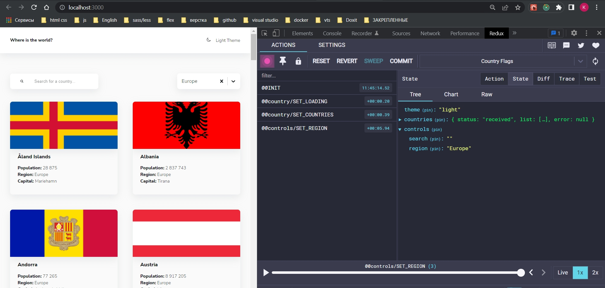

# 007_Фильтрация_по_региону

Для фильтрации по региону нам нужно расширить нашу историю с controls-actions.js Я добавлю дополнительную константу и дополнительный action.


Так же принимаем region как строковое значение. И будем возвращать объект с соответствующим типом и соответствующим payload.

```js
//src/store/controls-actions.js
export const SET_SEARCH = "@@controls/SET_SEARCH";
export const SET_REGION = "@@controls/SET_REGION";

export const setSearch = (search) => ({
  type: SET_SEARCH,
  payload: search,
});

export const setRegion = (region) => ({
  type: SET_REGION,
  payload: region,
});

```

Все это дело конечно мы будем обрабатывать в reducer.

```js
//src/store/controls-reducer.js

import { SET_REGION, SET_SEARCH } from "./controls-actions";

const initialState = {
  search: "",
  region: "",
};

export const controlsReducer = (state = initialState, { type, payload }) => {
  switch (type) {
    case SET_SEARCH:
      return { ...state, search: payload };
    case SET_REGION:
      return { ...state, region: payload };
    default:
      return state;
  }
};

```

Ну и с точки зрения наших селекторов мы можем захотеть выбирать регионы.


```js
//src/store/controls-selectors.js
export const selectSearch = (state) => state.controls.search;

//Выбираю регион
export const selectRegion = (state) => state.controls.region;

//Выбираю все регионы
export const selectControls = (state) => state.controls;

```

Перехожу в компонент Controls. И смотрим что здесь помимо Search мы используем некий кастомный селект 


Взглянем на него 

```js
import styled from 'styled-components';

import Select from 'react-select';

export const CustomSelect = styled(Select).attrs({
  styles: {
    control: (provided) => ({
      ...provided,
      backgroundColor: 'var(--colors-ui-base)',
      color: 'var(--colors-text)',
      borderRadius: 'var(--radii)',
      padding: '0.25rem',
      border: 'none',
      boxShadow: 'var(--shadow)',
      height: '50px',
    }),
    option: (provided, state) => ({
      ...provided,
      cursor: 'pointer',
      color: 'var(--colors-text)',
      backgroundColor: state.isSelected
        ? 'var(--colors-bg)'
        : 'var(--colors-ui-base)',
    }),
  },
})`
  width: 200px;
  border-radius: var(--radii);
  font-family: var(--family);
  border: none;

  & > * {
    box-shadow: var(--shadow);
  }

  & input {
    padding-left: 0.25rem;
  }

  & * {
    color: var(--colors-text) !important;
  }

  & > div[id] {
    background-color: var(--colors-ui-base);
  }
`;

```

Кастомный селект представляет собой Select из библиотеки react-select. Мы здесь используем стилизацию на базе того что предоставляет сама библиотека.


И вот как это должно выглядеть.


Мы в этот Select должны что-то передать. 


options, placeholder, isClearable - говорю что по крестику я могу очищать это поле, isSearchable - я запрещаю здесь поиск по тому что бы что-то вбивать, value - и пока что я сюда передаю просто пустое значение.

Опять же ямогу создать функции на уровне Controls. А можем пойти в сам CustomSelect и все это дело там насоздавать. Но я создам на уровне Controls.


Библиотека работает достаточно хитрым образом, она потребляет данные в формате массива. options должны представлять собй массив вот таких вот объектов.


value и label предоставляет нам возможность в выпадающем списке т.е. в label на русском языке, а в качестве значения value хранить на анлийском.

По этому каждый раз когда мы выбираем значение, у нас в наш handler, который мы будем сейчас писать, тоже будут попадать такого рода объекты. А нам в reducer нужно складывать что-то одно из этого.

Т.е. в дальнейшем я ожидаю что в моем region будет храниться строка.


Вполне коткретная строка Africa, America,Asia,Europe, Oceania что-то из этого.

И сюда в качестве значения


Я могу запускать конкретный объект


По этому у меня подготовлена структура этих строк, значения которые я хочу видеть в своем приложении.


И я буду делать определенный мапинг. Соответственно я буду передавать не просто region в value я буду говорить что обратись к optionsMap, к переменной [region] т.е. возьми значение конкретного региона. В region содержится то что придет к нам с reducer.


Создаю handleSelect. Он у меня будет принимать текущее значение региона, назову это region


region попадает вот этот объект.


В dispatch указываю что region это опциональный параметр и что если в нем нет value я возвращаю пустую строку.

```js
import styled from "styled-components";
import { useSelector, useDispatch } from "react-redux";

import { Search } from "./Search";
import { CustomSelect } from "./CustomSelect";
import { selectRegion } from "../store/controls/controls-selectors";
import { setRegion } from "../store/controls/controls-actions";

const optionsMap = {
  Africa: { value: "Africa", label: "Africa" },

  America: { value: "America", label: "America" },
  Asia: { value: "Asia", label: "Asia" },
  Europe: { value: "Europe", label: "Europe" },
  Oceania: { value: "Oceania", label: "Oceania" },
};
const options = Object.values(optionsMap);

const Wrapper = styled.div`
  display: flex;
  flex-direction: column;
  align-items: flex-start;

  @media (min-width: 767px) {
    flex-direction: row;
    justify-content: space-between;
    align-items: center;
  }
`;

export const Controls = () => {
  const dispatch = useDispatch();
  const region = useSelector(selectRegion);

  const handleSelect = (region) => {
    dispatch(setRegion(region?.value || ""));
  };

  return (
    <Wrapper>
      <Search />
      <CustomSelect
        options={options}
        placeholder="Filter by Region"
        isClearable
        isSearchable={false}
        value={optionsMap[region]}
        onChange={handleSelect}
      />
    </Wrapper>
  );
};

```


<br/>
<br/>
<br/>

Осталось добавить что бы эта вся история фильтровалась.

Идем в HomePage и дополнительно достаем не только search. И по этому я говорю что мне нужен selectControls т.е. все контроли достать. И мы дбудем в деструктуризации получать не только search но и region


```js
import { useNavigate } from "react-router-dom";
import { useDispatch, useSelector } from "react-redux";
import { useEffect } from "react";
import { List } from "../components/List";
import { Card } from "../components/Card";
import { Controls } from "../components/Controls";
import {
    selectCountriesInfo,
    selectVisibleCountries,
} from "../store/countries/countries-selectors";
import { loadCountries } from "../store/countries/countries-actions";
import { selectControls } from "../store/controls/controls-selectors";

export const HomePage = () => {
    const navigate = useNavigate();
    const dispatch = useDispatch();

    //Получаю введенные символы
    const { search, region } = useSelector(selectControls);
    //Получаю все страны
    const countries = useSelector((state) =>
        selectVisibleCountries(state, { search, region })
    );
    const { status, error, quantity } = useSelector(selectCountriesInfo);

    useEffect(() => {
        if (!quantity) {
            dispatch(loadCountries());
        }
    }, [quantity, dispatch]);

    return (
        <>
            <Controls />

            {error && <h2>Can`t fetch data</h2>}
            {status === "loading" && <h2>Loading...</h2>}
            {status === "received" && (
                <List>
                    {countries.map((country) => {
                        const countryInfo = {
                            img: country.flags.png,
                            name: country.name,
                            info: [
                                {
                                    title: "Population",
                                    description: country.population.toLocaleString(),
                                },
                                {
                                    title: "Region",
                                    description: country.region,
                                },
                                {
                                    title: "Capital",
                                    description: country.capital,
                                },
                            ],
                        };

                        return (
                            <Card
                                key={country.name}
                                onClick={() => navigate(`/country/${country.name}`)}
                                {...countryInfo}
                            />
                        );
                    })}
                </List>
            )}
        </>
    );
};

```

И этот region на уровне нашего селектора мы тоже будем обрабатывать. И я буду проверять что моя страна во-первых соответствует поиску search, а во вторых что у этой страны поле country.region включает includes тот регион который мы выбрали.

```js
//src/store/countries-selectors.js

export const selectCountriesInfo = (state) => ({
  status: state.countries.status,
  error: state.countries.error,
  quantity: state.countries.list.length,
});

export const selectAllCountries = (state) => state.countries.list;

//
export const selectVisibleCountries = (state, { search = "", region = "" }) => {
  return state.countries.list.filter(
    (country) =>
      country.name.toLowerCase().includes(search.toLowerCase()) &&
      country.region.includes(region)
  );
};

```



Все норм!!!


