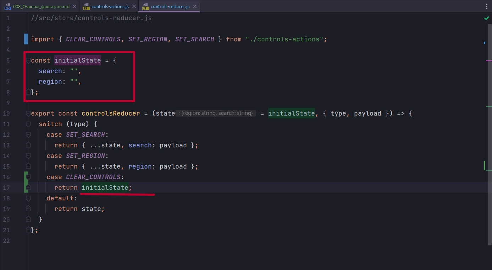
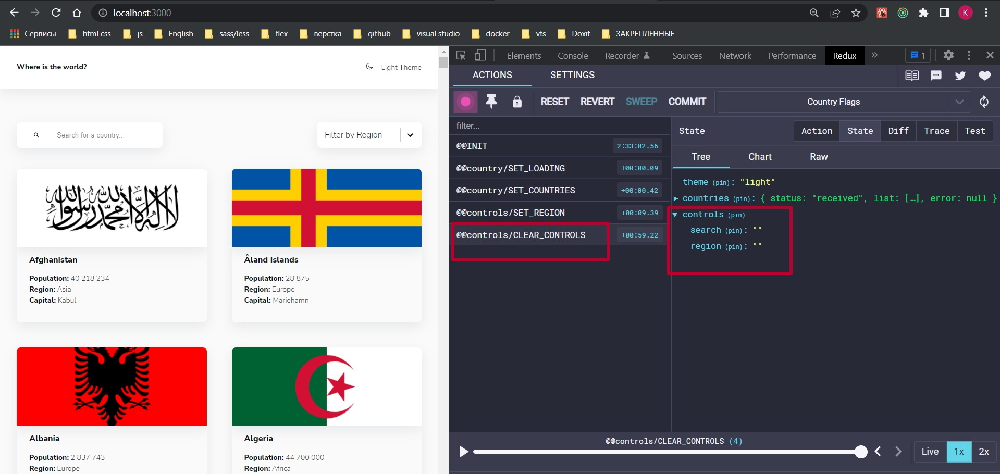

# 008_Очистка_фильтров

Заканчивая история наших Controls имеет смысл поговорить о таком поведении как. Перешли мы к примеру на детальное описание страны


Ожидем ли мы что сдесь сохраняться наши фильтры? По кнопке назад такое поведение действительно наверное должно нас устроить.

А если с детального описания страны кликнуть на логотип  и перейти на главную страницу? На верное фильтры должны сбразываться? Но не сбрасываются.


При клике на кнопку назад я фильтры оставлю. А при клике на логотип я буду фильтры обнулять.


```js
//src/store/controls-actions.js
export const SET_SEARCH = "@@controls/SET_SEARCH";
export const SET_REGION = "@@controls/SET_REGION";
export const CLEAR_CONTROLS = "@@controls/CLEAR_CONTROLS";

export const setSearch = (search) => ({
  type: SET_SEARCH,
  payload: search,
});

export const setRegion = (region) => ({
  type: SET_REGION,
  payload: region,
});

export const clearControls = () => ({
  type: CLEAR_CONTROLS,
});

```



```js
//src/store/controls-reducer.js

import { CLEAR_CONTROLS, SET_REGION, SET_SEARCH } from "./controls-actions";

const initialState = {
  search: "",
  region: "",
};

export const controlsReducer = (state = initialState, { type, payload }) => {
  switch (type) {
    case SET_SEARCH:
      return { ...state, search: payload };
    case SET_REGION:
      return { ...state, region: payload };
    case CLEAR_CONTROLS:
      return initialState;
    default:
      return state;
  }
};

```

Теперь идем в Header. На стилизованый Title из библиотеки react-router-dom вешаю слушатель события cleanUp

```js
import styled from "styled-components";
import { useSelector, useDispatch } from "react-redux";
import { useEffect } from "react";
import { Link } from "react-router-dom";
import { IoMoon, IoMoonOutline } from "react-icons/io5";

import { Container } from "./Container";
import { setTheme } from "../store/theme/theme-actions";
import { clearControls } from "../store/controls/controls-actions";

const HeaderEl = styled.header`
  box-shadow: var(--shadow);
  background-color: var(--colors-ui-base);
`;

const Wrapper = styled.div`
  display: flex;
  justify-content: space-between;
  align-items: center;
  padding: 2rem 0;
`;

const Title = styled(Link).attrs({
  to: "/",
})`
  color: var(--colors-text);
  font-size: var(--fs-sm);
  text-decoration: none;
  font-weight: var(--fw-bold);
`;

const ModeSwitcher = styled.div`
  color: var(--colors-text);
  font-size: var(--fs-sm);
  cursor: pointer;
  // font-weight: var(--fw-bold);
  text-transform: capitalize;
`;

export const Header = () => {
  const dispatch = useDispatch();
  const theme = useSelector((state) => state.theme);

  //Функция переключения темы
  const toggleTheme = () =>
    dispatch(setTheme(theme === "light" ? "dark" : "light"));

  useEffect(() => {
    document.body.setAttribute("data-theme", theme);
  }, [theme]);

  const cleanUp = () => dispatch(clearControls());

  return (
    <HeaderEl>
      <Container>
        <Wrapper>
          <Title onClick={cleanUp}>Where is the world?</Title>
          <ModeSwitcher onClick={toggleTheme}>
            {theme === "light" ? (
              <IoMoonOutline size="14px" />
            ) : (
              <IoMoon size="14px" />
            )}{" "}
            <span style={{ marginLeft: "0.75rem" }}>{theme} Theme</span>
          </ModeSwitcher>
        </Wrapper>
      </Container>
    </HeaderEl>
  );
};

```




