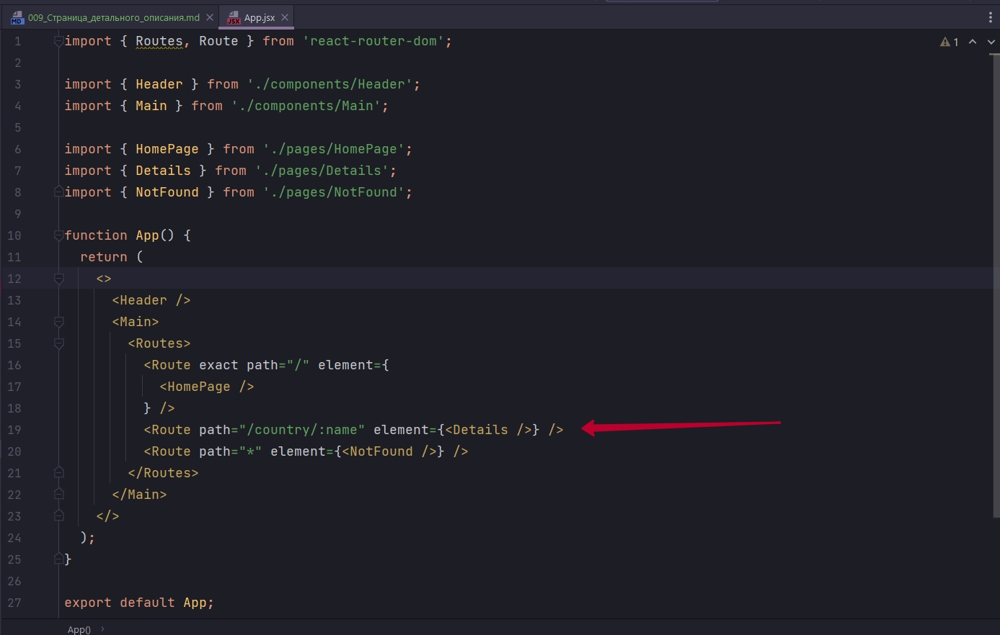
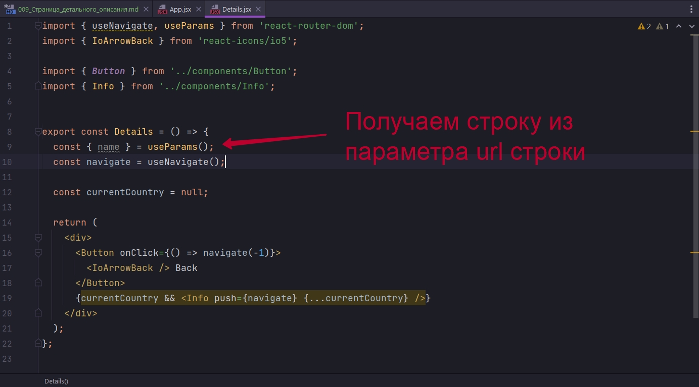
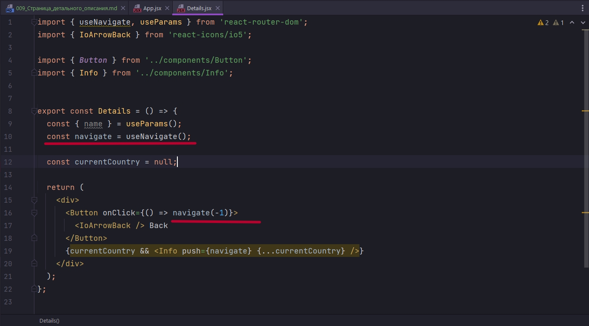
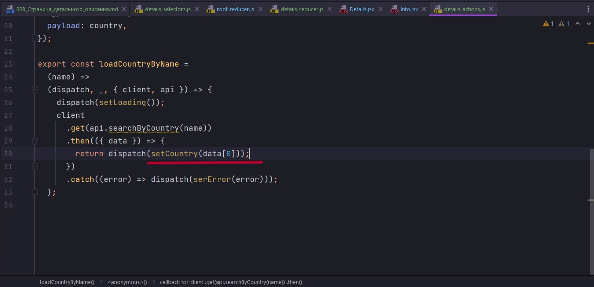
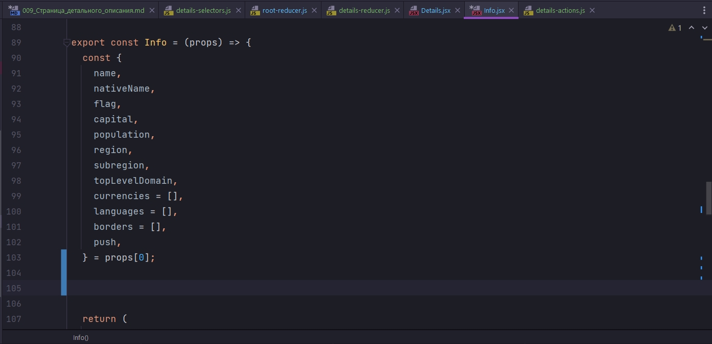
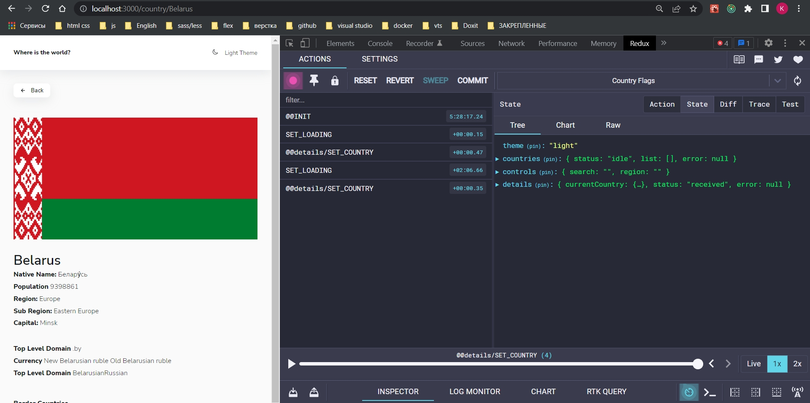

# 009_Страница_детального_описания

Настало время поработать с компонентом Details, с сылкой на конкретную страну и по параметру какое-то имя мы туда передаем.



Детальная страница будет из параметров получать эту строку



Пока что она ни делает ничего. Рна должна каким-то образом получить текущую страну currentCountry.

Мы уже использовали кнопку назад. Она использует метод navigate передавая просто -1.



При наличие страны мы эту страну отрисовываем с помощью компонента Info

```js
import styled from 'styled-components';

const Wrapper = styled.section`
  margin-top: 3rem;
  width: 100%;
  display: grid;
  grid-template-columns: 100%;
  gap: 2rem;

  @media (min-width: 767px) {
    grid-template-columns: minmax(100px, 400px) 1fr;
    align-items: center;
    gap: 5rem;
  }
  @media (min-width: 1024px) {
    grid-template-columns: minmax(400px, 600px) 1fr;
  }
`;

const InfoImage = styled.img`
  display: block;
  width: 100%;
  height: 100%;
  object-fit: contain;
`;

const InfoTitle = styled.h1`
  margin: 0;
  font-weight: var(--fw-normal);
`;

const ListGroup = styled.div`
  display: flex;
  flex-direction: column;

  gap: 2rem;

  @media (min-width: 1024px) {
    flex-direction: row;
    gap: 4rem;
  }
`;

const List = styled.ul`
  list-style: none;
  margin: 0;
  padding: 0;
`;

const ListItem = styled.li`
  line-height: 1.8;

  & > b {
    font-weight: var(--fw-bold);
  }
`;

const Meta = styled.div`
  margin-top: 3rem;
  display: flex;
  gap: 1.5rem;
  flex-direction: column;
  align-items: flex-start;

  & > b {
    font-weight: var(--fw-bold);
  }

  @media (min-width: 767px) {
    flex-direction: row;
    align-items: center;
  }
`;

const TagGroup = styled.div`
  display: flex;
  gap: 1rem;
  flex-wrap: wrap;
`;

const Tag = styled.span`
  padding: 0 1rem;
  background-color: var(--colors-ui-base);
  box-shadow: var(--shadow);
  line-height: 1.5;
  cursor: pointer;
`;

export const Info = (props) => {
  const {
    name,
    nativeName,
    flag,
    capital,
    population,
    region,
    subregion,
    topLevelDomain,
    currencies = [],
    languages = [],
    borders = [],
    push,
  } = props;

  return (
    <Wrapper>
      <InfoImage src={flag} alt={name} />

      <div>
        <InfoTitle>{name}</InfoTitle>
        <ListGroup>
          <List>
            <ListItem>
              <b>Native Name:</b> {nativeName}
            </ListItem>
            <ListItem>
              <b>Population</b> {population}
            </ListItem>
            <ListItem>
              <b>Region:</b> {region}
            </ListItem>
            <ListItem>
              <b>Sub Region:</b> {subregion}
            </ListItem>
            <ListItem>
              <b>Capital:</b> {capital}
            </ListItem>
          </List>
          <List>
            <ListItem>
              <b>Top Level Domain</b>{' '}
              {topLevelDomain.map((d) => (
                <span key={d}>{d}</span>
              ))}
            </ListItem>
            <ListItem>
              <b>Currency</b>{' '}
              {currencies.map((c) => (
                <span key={c.code}>{c.name} </span>
              ))}
            </ListItem>
            <ListItem>
              <b>Top Level Domain</b>{' '}
              {languages.map((l) => (
                <span key={l.name}>{l.name}</span>
              ))}
            </ListItem>
          </List>
        </ListGroup>
        <Meta>
          <b>Border Countries</b>
          {!borders.length ? (
            <span>There is no border countries</span>
          ) : (
            <TagGroup>
              {[].map((b) => (
                <Tag key={b} onClick={() => push(`/country/${b}`)}>
                  {b}
                </Tag>
              ))}
            </TagGroup>
          )}
        </Meta>
      </div>
    </Wrapper>
  );
};

```

Тут есть нюансы. Главный нюанс будет связан с работой с соседями. И изначально чего то особенного с этим делать не будем.

В config.js у нас уже есть метод searchByCountry

```js
//src.config.js
const BASE_URL = "https://restcountries.com/v2/";

export const ALL_COUNTRIES =
  BASE_URL + "all?fields=name,capital,flags,population,region";

export const searchByCountry = (name) => BASE_URL + "name/" + name;

export const filterByCode = (codes) =>
  BASE_URL + "alpha?codes=" + codes.join(",");

```

Что бы с этим работать нам в store понадобится новая сущность details и  details-actions.js details-reducer.js details-selectors.js.

```js
//src/store/details/details-actions.js

export const SET_LOADING = "@@details/SET_LOADING";
export const SET_ERROR = "@@details/SET_ERROR";
export const SET_COUNTRY = "@@details/SET_COUNTRY";

const setLoading = () => ({
  type: "SET_LOADING",
});

const serError = (error) => ({
  type: SET_ERROR,
  payload: error,
});

const setCountry = (country) => ({
  type: SET_COUNTRY,
  payload: country,
});

export const loadCountryByName =
  (name) =>
  (dispatch, _, { client, api }) => {
    dispatch(setLoading());
    client
      .get(api.searchByCountry(name))
      .then(({ data }) => dispatch(setCountry(data)))
      .catch((error) => dispatch(serError(error)));
  };

```

```js
//src/store/details/details-reducer.js
import { SET_COUNTRY, SET_ERROR, SET_LOADING } from "./details-actions";

const initialState = {
  currentCountry: null,
  status: "idle",
  error: null,
};

export const detailsReducer = (state = initialState, { type, payload }) => {
  switch (type) {
    case SET_LOADING:
      return { ...state, status: "loading", error: null };
    case SET_COUNTRY:
      return { ...state, status: "received", currentCountry: payload };
    case SET_ERROR:
      return { ...state, status: "rejected", error: payload };

    default:
      return state;
  }
};

```

```js
//src/store/root-reducer.js
import { combineReducers } from "redux";
import { themeReducer } from "./theme/theme-reducer";
import { countriesReducer } from "./countries/countries-reducer";
import { controlsReducer } from "./controls/controls-reducer";
import { detailsReducer } from "./details/details-reducer";

export const rootReducer = combineReducers({
  theme: themeReducer,
  countries: countriesReducer,
  controls: controlsReducer,
  details: detailsReducer,
});

```

```js
//src/store/details/details-selectors.js

//Выбор текущей страны
export const selectCurrentCountry = (state) => state.details.currentCountry;

//Выбор всей детальной информации
export const selectDetails = (state) => state.details;

```

Переходим в Details

```js
import { useNavigate, useParams } from "react-router-dom";
import { IoArrowBack } from "react-icons/io5";
import { useSelector, useDispatch } from "react-redux";

import { Button } from "../components/Button";
import { Info } from "../components/Info";
import {
  selectCurrentCountry,
  selectDetails,
} from "../store/details/details-selectors";
import { useEffect } from "react";
import { loadCountryByName } from "../store/details/details-actions";

export const Details = () => {
  const { name } = useParams();
  const dispatch = useDispatch();

  const { currentCountry, error, status } = useSelector(selectDetails);

  const navigate = useNavigate();

  useEffect(() => {
    dispatch(loadCountryByName(name));
    /*Так как я перехожу по разным страницам с детальной информацией
     * То мне нужно следить за изменениями в url строке query параметра name*/
  }, [name, dispatch]);

  return (
    <div>
      <Button onClick={() => navigate(-1)}>
        <IoArrowBack /> Back
      </Button>
      {status === "loading" && <h2>Loading...</h2>}
      {error && <h2>{error}</h2>}
      {currentCountry && <Info push={navigate} {...currentCountry} />}
    </div>
  );
};

```

И тут проблема. Запрос на поиск страны всегда дает нам одну страну, т.е. объект. Это вопрос к API почему он возвращает нам именно массив. Исправить это я могу на прямую обратившись к нулевому индексу массива т.к. страна одна их больше и не может быть. И справить это я могу при получении данных или уже на уровне приложения при деструктурировании пропсов.



Или же в самом компоненте Info




