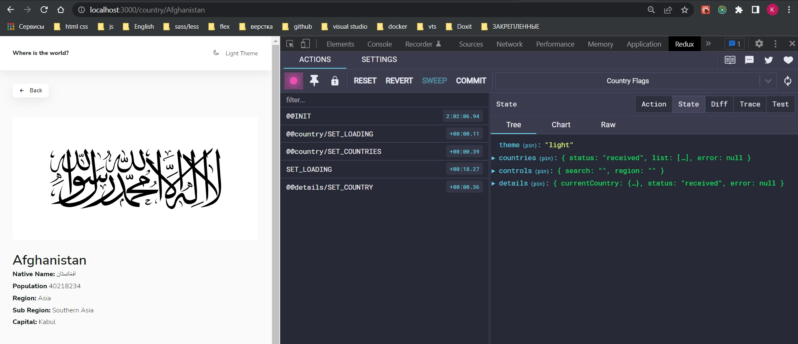

# 010_Очистка_детальной_страницы

Установим функционал сбоса текущей выбранной страны.

```js
//src/store/details/details-actions.js

export const SET_LOADING = "@@details/SET_LOADING";
export const SET_ERROR = "@@details/SET_ERROR";
export const SET_COUNTRY = "@@details/SET_COUNTRY";
export const CLEAR_DETAILS = "@@details/CLEAR_DETAILS";

const setLoading = () => ({
  type: "SET_LOADING",
});

const serError = (error) => ({
  type: SET_ERROR,
  payload: error,
});

const setCountry = (country) => ({
  type: SET_COUNTRY,
  payload: country,
});

//Сброс подробной информации о стране
export const clearDetails = () => ({
  type: CLEAR_DETAILS,
});

export const loadCountryByName =
  (name) =>
  (dispatch, _, { client, api }) => {
    dispatch(setLoading());
    client
      .get(api.searchByCountry(name))
      .then(({ data }) => {
        return dispatch(setCountry(data[0]));
      })
      .catch((error) => dispatch(serError(error)));
  };

```

```js
//src/store/details/details-reducer.js
import {
  CLEAR_DETAILS,
  SET_COUNTRY,
  SET_ERROR,
  SET_LOADING,
} from "./details-actions";

const initialState = {
  currentCountry: null,
  status: "idle",
  error: null,
};

export const detailsReducer = (state = initialState, { type, payload }) => {
  switch (type) {
    case SET_LOADING:
      return { ...state, status: "loading", error: null };
    case SET_COUNTRY:
      return { ...state, status: "received", currentCountry: payload };
    case SET_ERROR:
      return { ...state, status: "rejected", error: payload };
    case CLEAR_DETAILS:
      return initialState;

    default:
      return state;
  }
};

```

И теперь самое важное. В какой момент мы будем его вызывать?

А вызывать мы будем в useEffect. useEffect у нас так же отрабатывает при размонтировании компонента. При размонтировании он нам может вызвать функцию котрая идет в return. При этом она может вызваться не только при размонтировании, но и при обновлении каждого значения указанного в массиве dependencies. Это гарантирует что если мы уши на главную страницу, а потом вернулись, то вызовется возвращаемая функция. Ну либо если у нас обновился name и мы перешли на другую страницу со страной, то тоже вызовется возвращаемая фунция из useEffect.

```js
import { useNavigate, useParams } from "react-router-dom";
import { IoArrowBack } from "react-icons/io5";
import { useSelector, useDispatch } from "react-redux";

import { Button } from "../components/Button";
import { Info } from "../components/Info";
import {
  selectCurrentCountry,
  selectDetails,
} from "../store/details/details-selectors";
import { useEffect } from "react";
import {
  clearDetails,
  loadCountryByName,
} from "../store/details/details-actions";

export const Details = () => {
  const { name } = useParams();
  const dispatch = useDispatch();

  const { currentCountry, error, status } = useSelector(selectDetails);
  console.log(currentCountry);

  const navigate = useNavigate();

  useEffect(() => {
    dispatch(loadCountryByName(name));
    /*Так как я перехожу по разным страницам с детальной информацией
     * То мне нужно следить за изменениями в url строке query параметра name*/
    /*А так же нужно очищать страницу с детальной информацией при переходе
     * на другую страницу или при обновлении name*/
    /*return отрабатывает только при размонтировании или обновлении компонента*/
    return ()=> dispatch(clearDetails());
  }, [name, dispatch]);

  return (
    <div>
      <Button onClick={() => navigate(-1)}>
        <IoArrowBack /> Back
      </Button>
      {status === "loading" && <h2>Loading...</h2>}
      {error && <h2>{error}</h2>}
      {currentCountry && <Info push={navigate} {...currentCountry} />}
    </div>
  );
};

```





