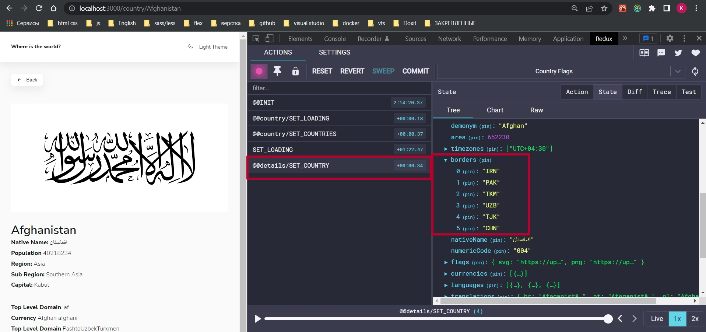
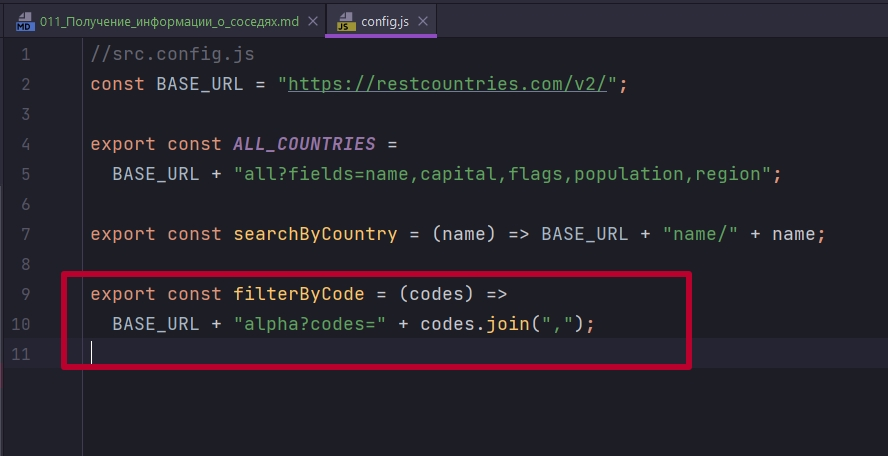
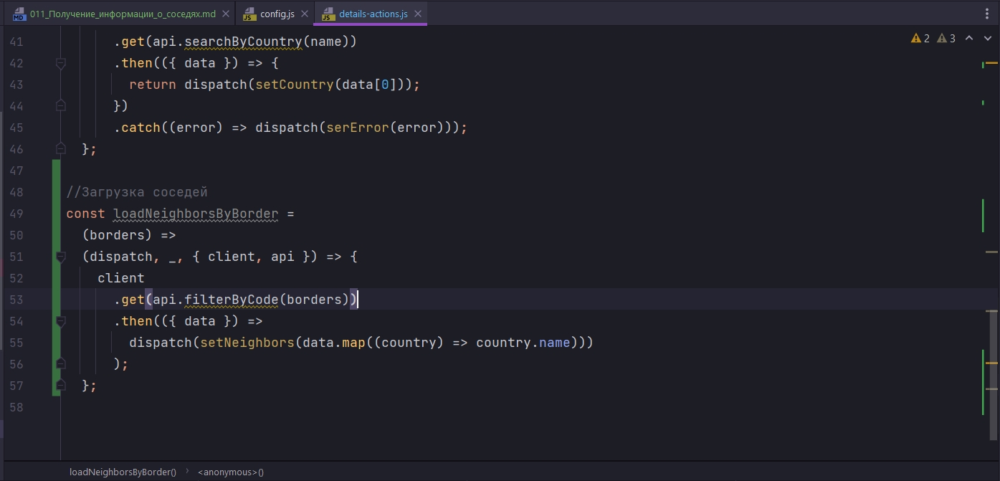
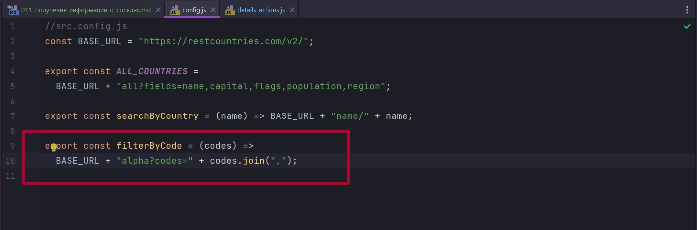
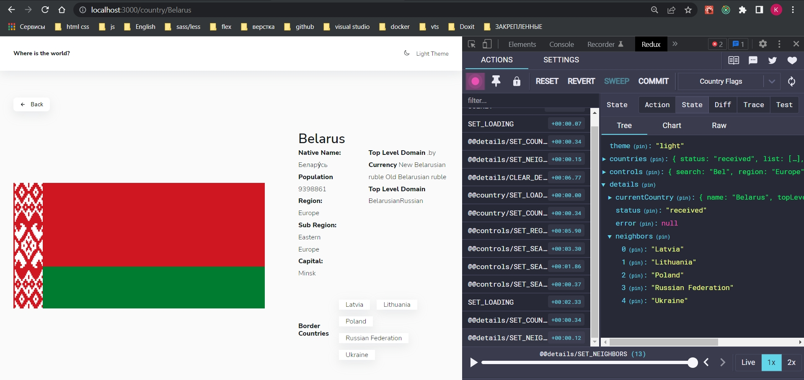
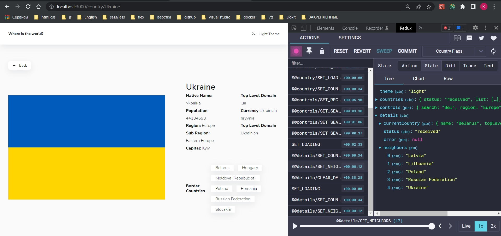

# 011_Получение_информации_о_соседях

В компоненте Info у нас есть некие borders. В API borders выглядит как коды стран



А нам бы хотелось что бы у нас выводились названия. Мало того что их название отрисовывается, мы хотим на них кликать и переходить на другие страны. Просто кодов нам недостаточно!!!

Для того что бы это реализовать у нас api предоставляет свою фишку. Она называется возможность по alpha кодам



Мы можем получить конкретный ответ с соответствующими странами. По этому мы просто должны сформировать правильно ссылку. Базовая ссылка, добавить к ней alpha как вложенность и get параметр передать коды, эти коды откуда-то получить, с помощью codes.join(',') соеденить их в строку и все это дело организовать.

Начнем с actions



В filterByCode попадает массив borders. За него мы можем не беспокоится, он обработается вот здесь



Далее приходит ответ с API. axios возвращает data по этому стразу деструктурирую. Партянка со странами огромная, но мне нужны только имена. Все остальные данные мне не нужны.

Ну и в случае ошибки я скажу console.error. Сдесь могла бы быть история с установкой ошибки и т.д. 

У нас есть обработка ошибки которая отвечает за всю деталку, а здесь у нас может не подгрузится какая то одна часть. И ломать всю деталку  из-за одной ошибки в узком месте не хочется. По этому опять же с точки зрения UI сдесь можно придумать разные фокусы. А с точки зрения логики мы бы просто вызвали бы другой action.

```js
//src/store/details/details-actions.js

import { filterByCode } from "../../config";

export const SET_LOADING = "@@details/SET_LOADING";
export const SET_ERROR = "@@details/SET_ERROR";
export const SET_COUNTRY = "@@details/SET_COUNTRY";
export const CLEAR_DETAILS = "@@details/CLEAR_DETAILS";
export const SET_NEIGHBORS = "@@details/SET_NEIGHBORS"; // константа соседей

const setLoading = () => ({
  type: "SET_LOADING",
});

const serError = (error) => ({
  type: SET_ERROR,
  payload: error,
});

const setCountry = (country) => ({
  type: SET_COUNTRY,
  payload: country,
});

//Получение соседей
const setNeighbors = (countries) => ({
  type: SET_NEIGHBORS,
  payload: countries,
});

//Сброс подробной информации о стране
export const clearDetails = () => ({
  type: CLEAR_DETAILS,
});

export const loadCountryByName =
  (name) =>
  (dispatch, _, { client, api }) => {
    dispatch(setLoading());
    client
      .get(api.searchByCountry(name))
      .then(({ data }) => {
        return dispatch(setCountry(data[0]));
      })
      .catch((error) => dispatch(serError(error)));
  };

//Загрузка соседей
const loadNeighborsByBorder =
  (borders) =>
  (dispatch, _, { client, api }) => {
    client
      .get(api.filterByCode(borders))
      .then(({ data }) =>
        dispatch(setNeighbors(data.map((country) => country.name))).catch(
          (error) => console.error(error)
        )
      );
  };

```

ОБРАБОТКА REDUCER
```js
//src/store/details/details-reducer.js
import {
  CLEAR_DETAILS,
  SET_COUNTRY,
  SET_ERROR,
  SET_LOADING,
  SET_NEIGHBORS,
} from "./details-actions";

const initialState = {
  currentCountry: null,
  status: "idle",
  error: null,
  neighbors: [],
};

export const detailsReducer = (state = initialState, { type, payload }) => {
  switch (type) {
    case SET_LOADING:
      return { ...state, status: "loading", error: null };
    case SET_COUNTRY:
      return { ...state, status: "received", currentCountry: payload };
    case SET_ERROR:
      return { ...state, status: "rejected", error: payload };
    case CLEAR_DETAILS:
      return initialState;
    case SET_NEIGHBORS:
      return { ...state, neighbors: payload };
    default:
      return state;
  }
};

```

```js
//src/store/details/details-selectors.js

//Выбор текущей страны
export const selectCurrentCountry = (state) => state.details.currentCountry;

//Выбор всей детальной информации
export const selectDetails = (state) => state.details;

// Получаю соседей
export const selectNeighbors = (state) => state.details.neighbors;

```

Теперь в Info.

```js
import styled from "styled-components";
import { useSelector, useDispatch } from "react-redux";
import { selectNeighbors } from "../store/details/details-selectors";
import { useEffect } from "react";
import { loadNeighborsByBorder } from "../store/details/details-actions";

const Wrapper = styled.section`
  margin-top: 3rem;
  width: 100%;
  display: grid;
  grid-template-columns: 100%;
  gap: 2rem;

  @media (min-width: 767px) {
    grid-template-columns: minmax(100px, 400px) 1fr;
    align-items: center;
    gap: 5rem;
  }
  @media (min-width: 1024px) {
    grid-template-columns: minmax(400px, 600px) 1fr;
  }
`;

const InfoImage = styled.img`
  display: block;
  width: 100%;
  height: 100%;
  object-fit: contain;
`;

const InfoTitle = styled.h1`
  margin: 0;
  font-weight: var(--fw-normal);
`;

const ListGroup = styled.div`
  display: flex;
  flex-direction: column;

  gap: 2rem;

  @media (min-width: 1024px) {
    flex-direction: row;
    gap: 4rem;
  }
`;

const List = styled.ul`
  list-style: none;
  margin: 0;
  padding: 0;
`;

const ListItem = styled.li`
  line-height: 1.8;

  & > b {
    font-weight: var(--fw-bold);
  }
`;

const Meta = styled.div`
  margin-top: 3rem;
  display: flex;
  gap: 1.5rem;
  flex-direction: column;
  align-items: flex-start;

  & > b {
    font-weight: var(--fw-bold);
  }

  @media (min-width: 767px) {
    flex-direction: row;
    align-items: center;
  }
`;

const TagGroup = styled.div`
  display: flex;
  gap: 1rem;
  flex-wrap: wrap;
`;

const Tag = styled.span`
  padding: 0 1rem;
  background-color: var(--colors-ui-base);
  box-shadow: var(--shadow);
  line-height: 1.5;
  cursor: pointer;
`;

export const Info = (props) => {
  const {
    name,
    nativeName,
    flag,
    capital,
    population,
    region,
    subregion,
    topLevelDomain,
    currencies = [],
    languages = [],
    borders = [],
    push,
  } = props;

  const dispatch = useDispatch();
  const neighbors = useSelector(selectNeighbors);

  useEffect(() => {
    if (borders.length) {
      dispatch(loadNeighborsByBorder(borders));
    }
  }, [borders, dispatch]);

  return (
    <Wrapper>
      <InfoImage src={flag} alt={name} />

      <div>
        <InfoTitle>{name}</InfoTitle>
        <ListGroup>
          <List>
            <ListItem>
              <b>Native Name:</b> {nativeName}
            </ListItem>
            <ListItem>
              <b>Population</b> {population}
            </ListItem>
            <ListItem>
              <b>Region:</b> {region}
            </ListItem>
            <ListItem>
              <b>Sub Region:</b> {subregion}
            </ListItem>
            <ListItem>
              <b>Capital:</b> {capital}
            </ListItem>
          </List>
          <List>
            <ListItem>
              <b>Top Level Domain</b>{" "}
              {topLevelDomain.map((d) => (
                <span key={d}>{d}</span>
              ))}
            </ListItem>
            <ListItem>
              <b>Currency</b>{" "}
              {currencies.map((c) => (
                <span key={c.code}>{c.name} </span>
              ))}
            </ListItem>
            <ListItem>
              <b>Top Level Domain</b>{" "}
              {languages.map((l) => (
                <span key={l.name}>{l.name}</span>
              ))}
            </ListItem>
          </List>
        </ListGroup>
        <Meta>
          <b>Border Countries</b>
          {!borders.length ? (
            <span>There is no border countries</span>
          ) : (
            <TagGroup>
              {neighbors.map((countryName) => (
                <Tag
                  key={countryName}
                  onClick={() => push(`/country/${countryName}`)}
                >
                  {countryName}
                </Tag>
              ))}
            </TagGroup>
          )}
        </Meta>
      </div>
    </Wrapper>
  );
};

```



