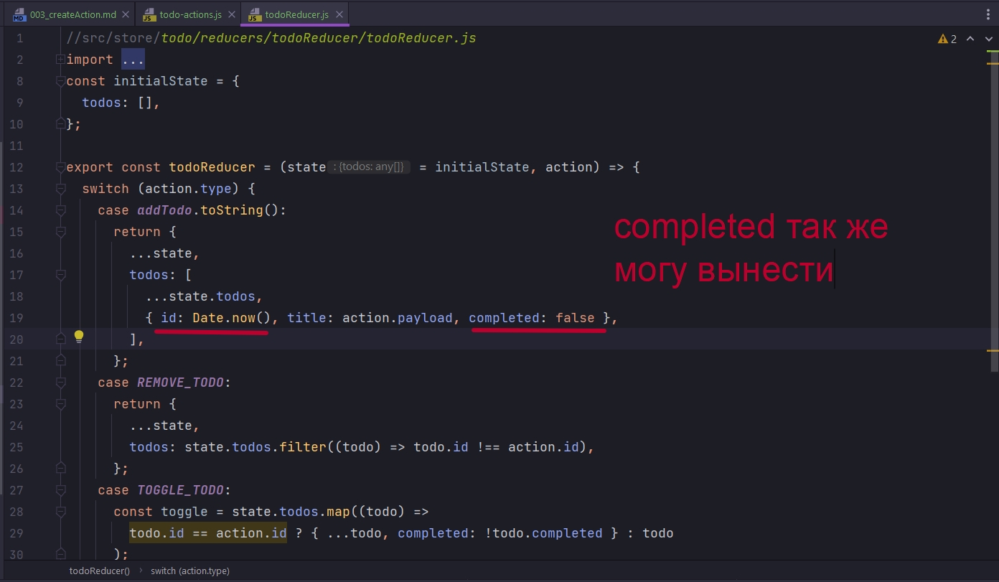

# 003_createAction

Возьму за основу свой старый проект с Todo List. Удаляю redux

```shell
npm uninstall redux
```

У устанавливаю 

```shell
npm install @reduxjs/toolkit
```

В todo-actions.js закоментирую addTodo. И пишу пример с помощью createAction. 

По факту createAction принимает просто строку, а эта строка соответствует нашему типу. Это может быть строка или переменная содержащая строку.


И смотрим что происходит.


Первый лог мы видим что это функция обозначенная как actionCreator.

Во втором логе мы получаем объект события с type как раз той строкой которой мы указали при создании, а второе значение это payload. Соответственно если мы вызываем функцию и передаем какое-то значение, то это значение автоматом попадает в ключик payload. Т.е. подход Redux Toolkit подразумевает что мы всегда работаем с ключом payload. И если раньше у нас были варианты т.е. вместо payload мы могли передать что-то еще, то на Toolkit предполагается что все то что мы хотим передать в качестве данных попадает в ключ payload.


Соответственно как получить строку с котороя я хочу поработать с проверкой этого значения в reducer?

Мы можем вызвать функцию toString которая вернет это строковое значение.


Теперь я могу в reducer вызвать свой action и привести его к строке.


Это первая часть.

<br/>
<br/>
<br/>

Вторая часть заключается в том что функция createAction ожет принимать два параметра.

Вообще у нас в todo получается так что мы создаем id случайным значением.


При работе с reducer это не правильно!!! Reducer должен быть чистой функцией, а значит что он должен всегда вести себя предсказуемо. id у нас в reducer не предсказуем.

Мы можем доверить это actionCreator. И для того что бы это было возможно нам дается опциоальный второй параметр. Второй параметр представляет собой функцию, функцию подготовки нашего объекта action. Эта функция в качестве параметра принимает тот самый payload.

Я могу этот параметр обозначить как title. А в возвращаемом объекте обязательно должен быть ключик payload. Так же еще может быть ключик meta для какой-то вспомогательной информации, но в минимальном варианте это просто payload. Передаю наш title. И так же дополнительно могу сформировать id


На самом деле Redux Toolkit сделана так что все необходимое она предоставляет из коробки. У нас есть метод nanoid, вызов которого приведет к созданию индентификатора.





В payload формирую вот такой вот объект. И теперь в reducer я могу просто использую spreed поператор для объекта просто все деструктурировать.


На примере удаления. Я так правильно понимаю что раньше мы отлавливали к примеру id и передавал его в payload. А сейчас это все происходит под капотом. И если я хочу все же что то поменять, я могу во втором параметре отловить это значение и что-то сделать. Проверю


Или же вот так. Будет одинаково.


```js
//src/store/todo/todo-actions/todo-actions.js
import { createAction, nanoid } from "@reduxjs/toolkit";

import {
  ADD_TODO,
  REMOVE_TODO,
  TOGGLE_TODO,
} from "../constants/todo-constants";

export const addTodo = createAction(ADD_TODO, (title) => ({
  payload: { title, id: nanoid(), completed: false },
}));

export const removeTodo = createAction(REMOVE_TODO);

export const toggleTodo = createAction(TOGGLE_TODO);

```

```js
//src/store/todo/reducers/todoReducer/todoReducer.js
import {
  ADD_TODO,
  REMOVE_TODO,
  TOGGLE_TODO,
} from "../../constants/todo-constants";
import {
  addTodo,
  removeTodo,
  toggleTodo,
} from "../../todo-actions/todo-actions";
const initialState = {
  entities: [],
};

export const todoReducer = (state = initialState, action) => {
  switch (action.type) {
    case addTodo.toString():
      return {
        ...state,
        todos: [...state.entities, { ...action.payload }],
      };

    case removeTodo.toString():
      return {
        ...state,
        todos: state.entities.filter((todo) => todo.id !== action.payload),
      };
    case toggleTodo.toString():
      const toggle = state.entities.map((todo) =>
        todo.id == action.payload
          ? { ...todo, completed: !todo.completed }
          : todo
      );
      return {
        ...state,
        todos: toggle,
      };
    default:
      return state;
  }
};

```


