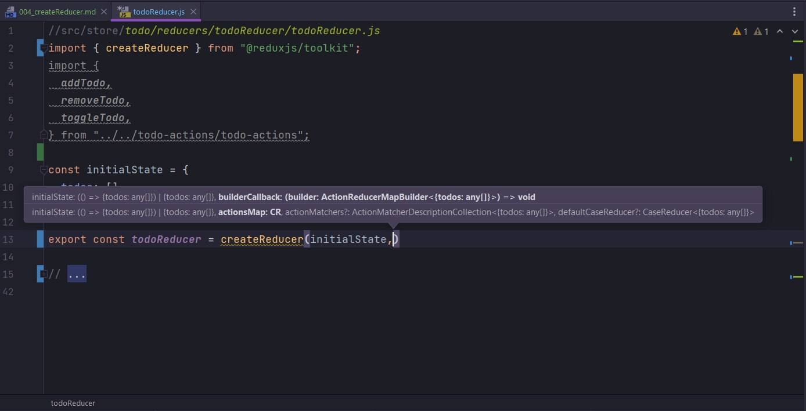
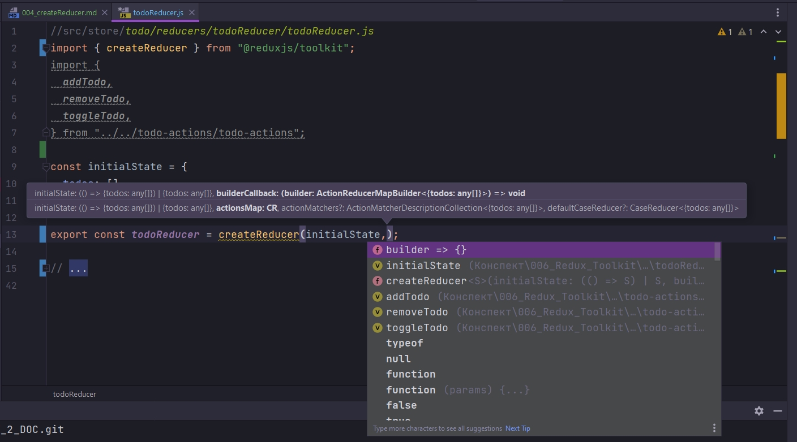
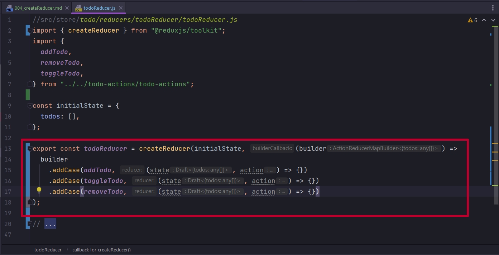
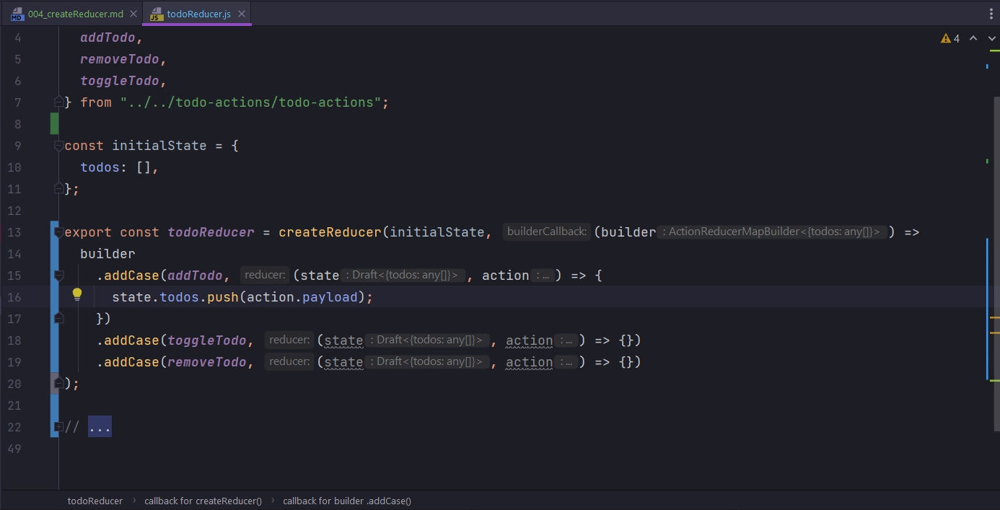
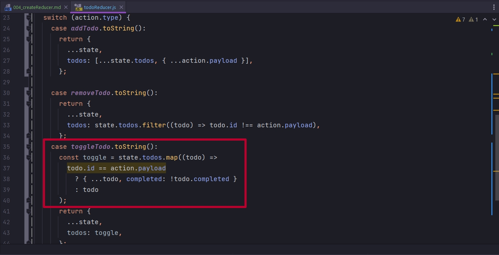
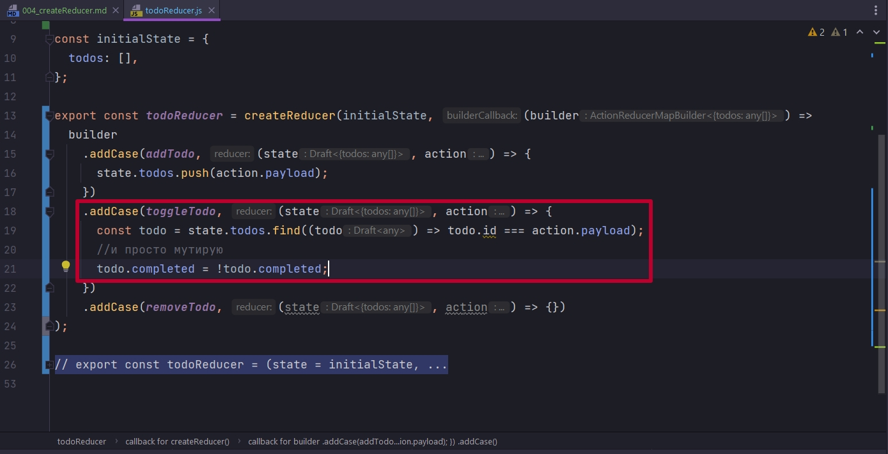
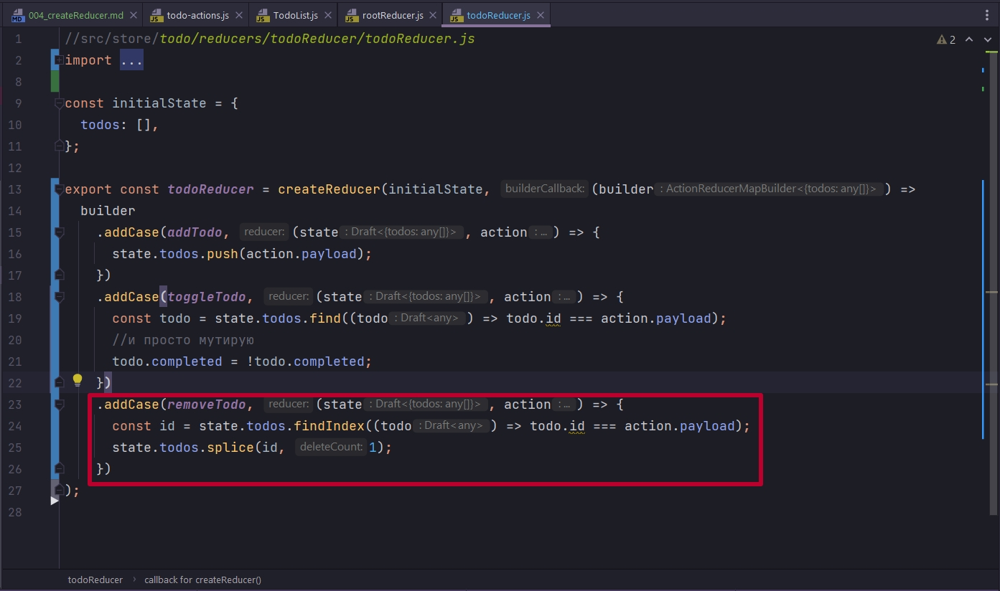
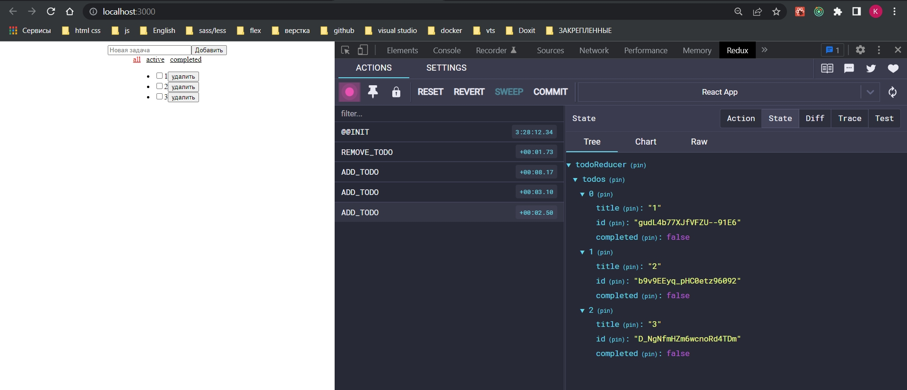
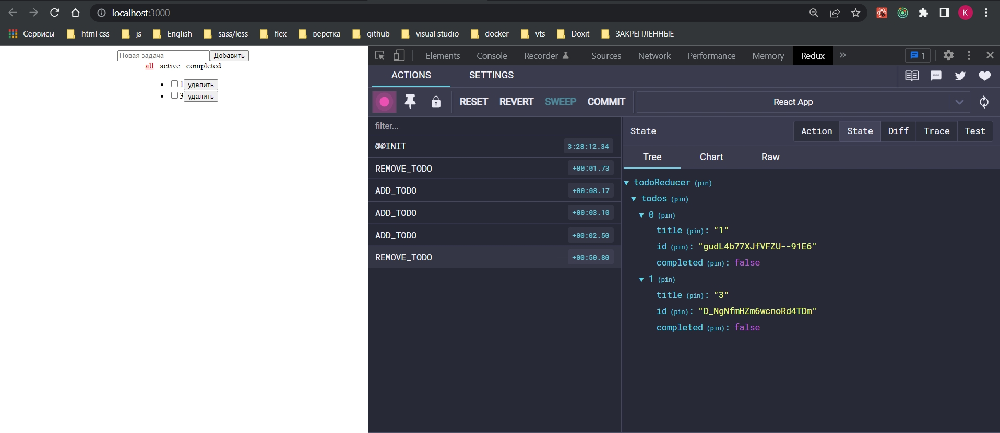
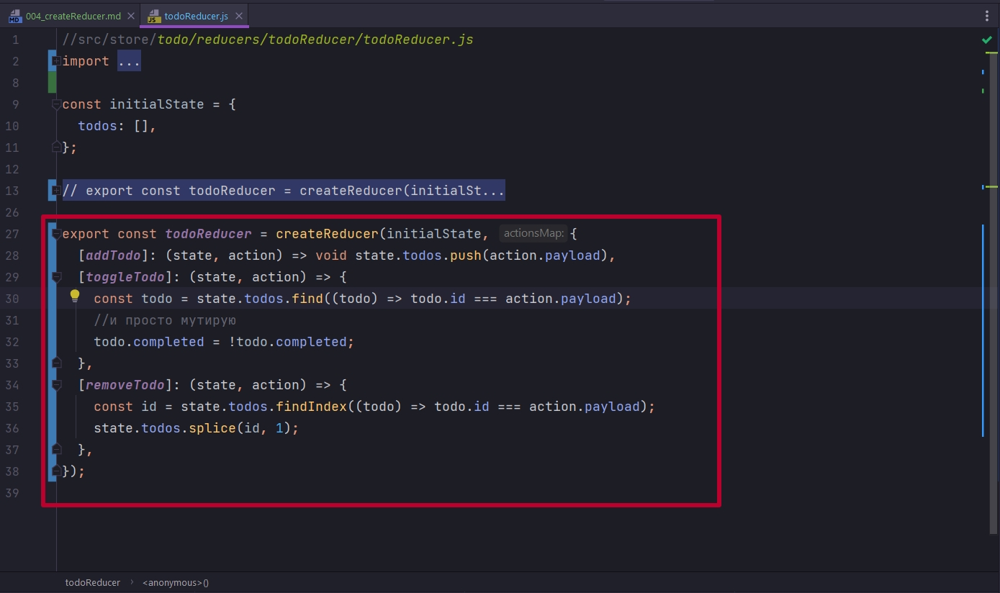

# 004_createReducer

Теперь посмотрим как можно reducer создавать по новому.

Теперь todoReducer равен нейкому createReducer который в свою очередь принимает default значение. Можем как сразу указать первым значением, так и передать в нее переменную. 

Вторым параметром может быть как объект, так и функция



Как видим в подсказке это builderCallback



Параметром builder redux нас обеспечивает самостоятельно, и на базе этого builder мы уже создаем конкретные случаи. Для создания использую addCase т.е. switch case по сути, но только теперь addCase.

Сам по себе addCase() представляет какой то action. addCase() принимает два параметра. Первый это наш action который мы создали. А вторым параметром принимаю функцию которая параметрами принимает state action. Только здесь эти state и action лежат в каждом addCase.



Обратите внимание что в addCase я передаю прямо название action. Я не доста строку из action. Не делаю преобразование в toString просто название action.

Теперь к телу функции. Теперь здесь все происходит в мутабельном стиле.

До этого что бы создать новое состояние я создавал новый массив, копировал все со старого массива, и только после что-то добавлял. Здесь я конкретно пушу в массив.



Тоже самое и для других историй. Для toggleTodo. Раньше я проходился по массиву и обрабатывал каждый сценарий. Проверял отдельную Todo и ту которую надо изменить в объекте.



Сейчас вот так. Я с помощью метода find ищу тот id.



Даже возвращать ничего не надо!!! Это очень важный момент. И сейчас до него доберемся.

Кажется что я мутирую данные, но под капотом используется тот самый immer, отдельная библиотека которая создает так называемый proxy, JS объект proxy и перехватывает события которые мы делаем, и уже дополнительно обеспечивает нам иммутабельность.

C удалением тоже будет отличаться. До этого мы использовали filter что бы конструкцию state видоизменить. Здесь если использовать filter мы будем создавать новую структуру, потому что метод filter он иммутабельный, создает новый массив.

Кароче если метод создает новую структуру эту структуру нужно использовать.

Если метод не создает новую структуру и мы хотим поместить все в одну строку при использовании Arrow function, то он не явным образом использует return. Для того что бы этого не происходило после стрелки явным образом указываю что эта функция ничего не должна возвражать с помощью void.

И так как всегда с новым инструментом пока разберешься!!! Полная дичь. С теми методами кторые являются иммутабельными, полная дичь. Удалять-то он удаляет, но удаляет весь массив данных. Начал копаться. Судя по условию filter все отрабатывает правильно. Судя по условию на каждой итерации он проверяет данный id не соответствует id в action.payload, да не соответствует, и добавляет этот id в новый массив, и так до тех пор пока не отработает условие, данный id не равен id в action.payload, нет равен, значит отфильтровать его т.е. не помещать в новый массив. ВСЕ ОТРАБАТЫВАЕТ. хоть и явно прописываю вернуть новую структуру c помощью return, НЕ ОТРАБАТЫВАЕТ. С помощью метода splice который так же возвращает новый массив, тоже не сработало.

А вот методы которые конкретно мутируют исходный массив, который явно является не иммутабельным, под капотом Toolkit делает иммутабельным. 



Теперь удаление работает нормально.

```js
//src/store/todo/reducers/todoReducer/todoReducer.js
import { createReducer } from "@reduxjs/toolkit";
import {
    addTodo,
    removeTodo,
    toggleTodo,
} from "../../todo-actions/todo-actions";

const initialState = {
    entities: [],
};

export const todoReducer = createReducer(initialState, (builder) =>
    builder
        .addCase(addTodo, (state, action) => void state.entities.push(action.payload))
        .addCase(toggleTodo, (state, action) => {
            const todo = state.entities.find((todo) => todo.id === action.payload);
            //и просто мутирую
            todo.completed = !todo.completed;
        })
        .addCase(removeTodo, (state, action) => {
            const id = state.entities.findIndex((todo) => todo.id === action.payload);
            state.entities.splice(id, 1);
        })
);


```



Теперь удалю второй элемент.



Т.е. все пучком. И localStorage тоже не ругается!!!! СУТКИ....

<br/>
<br/>
<br/>


Следующий момент это то что у нас есть два варианта создания наших редюссеров. Первый который мы рассмотрели это использование builder. И builder у нас добавляет addCase в любом количистве. У него на самом деле есть еще два варианта. Он может добавлять некое дефолтное значение addDefaultCase. И метод addMatcher который позволяет за раз выполнять действия за самые разные экшены.

Нас может заинтересовать альтернативный синтаксис всего того же. Это вариант создания нашего редюсер без функции builder.



```js
//src/store/todo/reducers/todoReducer/todoReducer.js
import { createReducer } from "@reduxjs/toolkit";
import {
  addTodo,
  removeTodo,
  toggleTodo,
} from "../../todo-actions/todo-actions";

const initialState = {
  entities: [],
};


export const todoReducer = createReducer(initialState, {
  [addTodo]: (state, action) => void state.todos.push(action.payload),
  [toggleTodo]: (state, action) => {
    const todo = state.todos.find((todo) => todo.id === action.payload);
    //и просто мутирую
    todo.completed = !todo.completed;
  },
  [removeTodo]: (state, action) => {
    const id = state.todos.findIndex((todo) => todo.id === action.payload);
    state.todos.splice(id, 1);
  },
});

```

Сдесь мы в квадратных скобках передаем наш action который равен функции редюсер. Понятное дело что такой вариант более компактный.

Но с точки зрения того что рекомендует нам документация, лучше использовать метод с функцией builder. Он предпочтительнее хотя бы с той точки зрения что редакторы кода понимают что такое builder, что это такое, особенно если вы работаете с TS.

ВАЖНО ТЕМУ С ИММУТАБЕЛЬНОСТЮ ПОНЯТЬ!!! 

1. Мы не должны возвращать зачение если мы мутируем state.
2. Если мы создаем новый state сами, то мы должны его вернуть.

