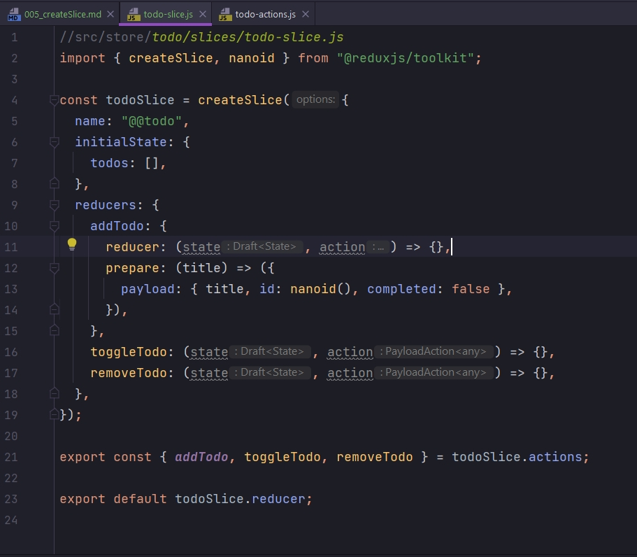

# 005_createSlice

Использование createSlice подразумвает что createAction и createReducer мы так же не захотим отдельно создавать. Создаю папку slices и в ней todo-slice.js.

```js
//src/store/todo/slices/todo-slice.js
import {createSlice} from "@reduxjs/toolkit";

export const todoSlice = createSlice({})
```

createSlice принимает объект с настройками. У этого объекта есть несколько обязательных полей.


* name - это так называемый домен, префикс который мы использовали при создании констант.


Далее у нас идет initialState


Дальше у нас идет набор редюссеров.


Сдесь уже редюссеры сами по себе создаются. Не отдельно мы их где-то создаем, а прямо в срезе.


Четвертый параметр так называемый extraReducers. Они выглядят по факту как тот вариант редюсеров который принимает builder. И на базе этого builder мы можем создавать различные addCase. 

Любо ту альтернативную запись с объектом, вместо функции builder. По сути это дополнительные редюсеры которые мы учились создавать через createReducer, только сдесь они идут как нейкие дополнительные редюсеры extraReducers, которые не попадают в этот name space расширение имен.


т.е. они вне этого домена name: "@@todo", могут обрабатываться в extraReducers. Скажем у нас есть reducer-ы связанные только с todo. Но мы можем захотеть в этом slice делать что-то со стейтом из reducers


Но при этом получать события из вне. Наиболее частый кейс это когда у нас есть тема с user и он может быть залогинен или разлогинен. Если пользователь разлогинен, мы можем в extraReducers обработать это событие, не связанное с этим name: "@@todo" расширением имени, таким образом что к примеру у нас обнуляться todo, либо наоборот загрузятся. Ну и чаще всего  extraReducers используются для работы с асинхронностью. Мы это увидим.

НАМ ВАЖНО ЧТО СИНТАКСИС extraReducers ЭТО СИНТАКСИС createReducer.

<br/>
<br/>
<br/>

Следующий нюанс это что вооще возвращает нам createSlice?

Сдесь на самом деле хитрая и очень интересная история. 

Возвращает он во-первых name во внешний мир. И этот name можно где-то использовать.

Во-вторых он возвращает сам reducer. Т.е. у todoSlice есть ключик reducer.


todoReducer что бы приложение работало. И по факту мое приложение должно работать как раньше, даже без configureStore который мы еще не рассмотрели.

Но это еще не все. Нам же нужны actions. Экспортирую во внешний мир нечто, что я беру из todoSlice.actions. И он автоматически создает нам actions по названию редюссеров. Деструктурирую их. И эти названия будут корректно отображаться и использоваться внутри нашего приложения.


Дополнительно у todoSlice есть caseReducers


И getInitialState. Всегда можем запросить getInitialState и использовать его где то. 

caseReducers это некая сущность которая чаще всего используется для тестирования.

<br/>
<br/>
<br/>

Теперь немножко по нюансам. У нас на этапе actions была вот такая предподготовка данных.


И эту преподготовку данных мы можем использовать и в todoSlice в reducers.

Конечно мы можем описать генерирование значений прямо в внутри функции reducer, так тоже можно. 

Но с учетом рекомендаций лучше вместо функции передавать объект. В объекте есть ключ reducer который принимает функцию reducer.


И дополнительно мы можем создать метод prepare. И в этом prepare мы можем описать все то же самое что мы описывали при создании createAction.




Наш экшен addTodo который получить action.payload. Этот action.payload мы получаем в prepare в нашем параметре title, и спользуем его. В данном случае я говорю что создай новый payload, помести title, сгенерируй id, и поле completed: false.

И уже эти предподготовленные данные, которые мы подготовили в prepare, попадут в action.payload в функцию reducer


У toggleTodo и removeTodo преподготовку данных мы не делали. По этому просту туда передаю их функционал

```js
//src/store/todo/slices/todo-slice.js
import { createSlice, nanoid } from "@reduxjs/toolkit";

const todoSlice = createSlice({
  name: "@@todo",
  initialState: {
    todos: [],
  },
  reducers: {
    addTodo: {
      reducer: (state, action) => void state.todos.push(action.payload),
      prepare: (title) => ({
        payload: { title, id: nanoid(), completed: false },
      }),
    },
    toggleTodo: (state, action) => {
      const todo = state.todos.find((todo) => todo.id === action.payload);
      //и просто мутирую
      todo.completed = !todo.completed;
    },
    removeTodo: (state, action) => {
      const id = state.todos.findIndex((todo) => todo.id === action.payload);
      state.todos.splice(id, 1);
    },
  },
});

export const { addTodo, toggleTodo, removeTodo } = todoSlice.actions;

export default todoSlice.reducer;

```


