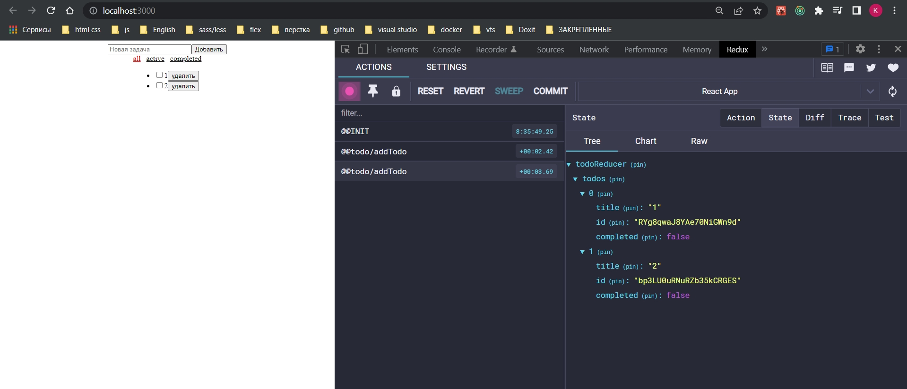
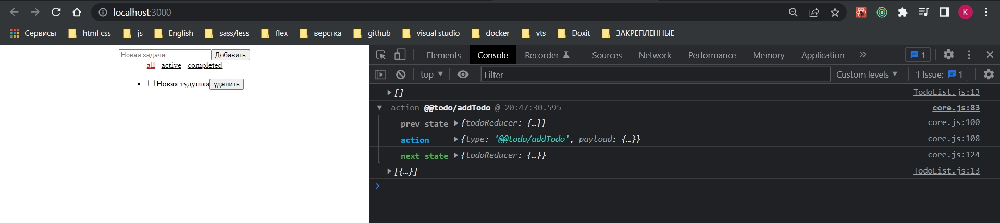
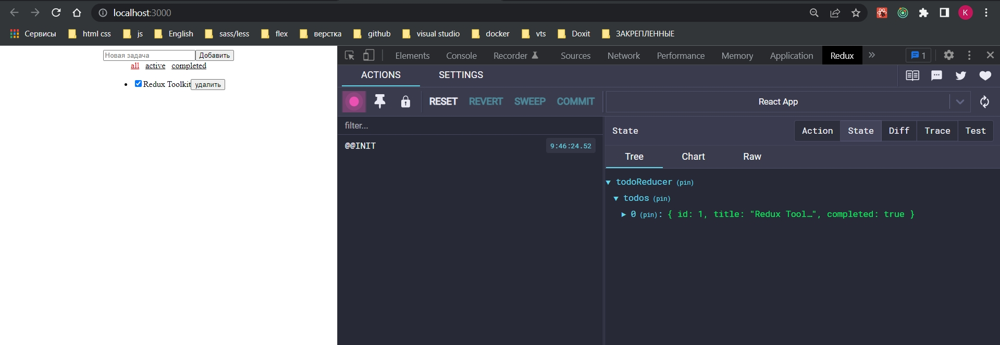

# 006_configureStore

Мы дошли до важной части когда нам нужно создавать store. Мы умеем создавать slice без всяких внешних action и reducer.

Для того что бы создавать store методами Redux Toolkit. Мы используем configureStore. Основное отличие в том что мы тепер не передаем три параметра, мы передаем просто объект. Единственное обязательное поле это reducer.

Мы можем не использовать combineReducers, а прямо в reducer передать объект и прямо сдесь собирать какие-то сущности.

```js
//src/store/store.js
import { configureStore } from "@reduxjs/toolkit";
import todoSlice from "./todo/slices/todo-slice";

const store = configureStore({
  reducer: {
    todoReducer: todoSlice,
  },
});

```

При этом все что мы делали раньше в combineReducers сдесь произойдет автоматически.

Теперь если нам нужен devTools мы просто ставим true в devTools.

```js
//src/store/store.js
import { configureStore } from "@reduxjs/toolkit";
import todoSlice from "./todo/slices/todo-slice";

export const store = configureStore({
  reducer: {
    todoReducer: todoSlice,
  },
  devTools: true,
});

```



combineReducers у меня теперь нет. Я все собираю в configureStore в объекте reducer. И плюс у меня теперь есть devTools.

Мы можем захотеть использовать дополнительные middleware.

```shell
npm install redux-logger
```

```js
//src/store/store.js
import { configureStore } from "@reduxjs/toolkit";
import todoSlice from "./todo/slices/todo-slice";
import { logger } from "redux-logger/src";

export const store = configureStore({
  reducer: {
    todoReducer: todoSlice,
  },
  devTools: true,
  middleware: (getDefaultMiddleware) => {
    //getDefaultMiddleware это middleware Toolkit
   return getDefaultMiddleware().concat(logger);
  },
});

```

Как мы помним middleware представляют собой массив функций. В данном случае мы получаем исходный массив middleware с помощью  getDefaultMiddleware(), а потом пополняю его с помощью метода concat.



Если раньше мы могли загружать какое то состояние по умолчанию, разумеется ото сдесь тоже есть. Для этого использую preloadedState. Часик пришлось повозиться. Если у меня initialState представляет объект с вложенныйм в него методом который представляет массив, как у меня entities, то помимо к обращению ключа который я прописываю в reducer при составлении редисеров. Напомню reducer это замена combineReducer. Мне нужно обратится к массиву entities.

```js
//src/store/store.js
import { configureStore } from "@reduxjs/toolkit";
import todoSlice from "./todo/slices/todo-slice";
import { logger } from "redux-logger/src";

export const store = configureStore({
    reducer: {
        todoReducer: todoSlice,
    },

    devTools: true,
    middleware: (getDefaultMiddleware) => {
        //getDefaultMiddleware это middleware Toolkit
        return getDefaultMiddleware().concat(logger);
    },
    preloadedState: {
        todoReducer: {
            todos: [{ id: 1, title: "Redux Toolkit", completed: true }],
        },
    },
});


```



И вот с помощью preloadedState мы инициализируем начальное состояние. Это опционально. Но если например мы храним данные например в localStorage мы можем захотеть например их оттуда выгрузить. И положить их в preloadedState.

Ну и дополнитеьно если вы используете помимо middleware какие-то усилители, дополнительные enhancers, для них тоже есть ключик. Это массив. Опять же это внешние какие-то библиотеки которые устанавливаются импортируются  и вкладываются вот в такого вида массив.

```js
//src/store/store.js
import { configureStore } from "@reduxjs/toolkit";
import todoSlice from "./todo/slices/todo-slice";
import { logger } from "redux-logger/src";

export const store = configureStore({
  reducer: {
    todoReducer: todoSlice,
  },

  devTools: true,
  middleware: (getDefaultMiddleware) => {
    //getDefaultMiddleware это middleware Toolkit
    return getDefaultMiddleware().concat(logger);
  },
  preloadedState: {
    todoReducer: {
      todos: [{ id: 1, title: "Redux Toolkit", completed: true }],
    },
  },
  enhancers: [
    //Дополнительные усилители библиотеки
  ],
});

```


