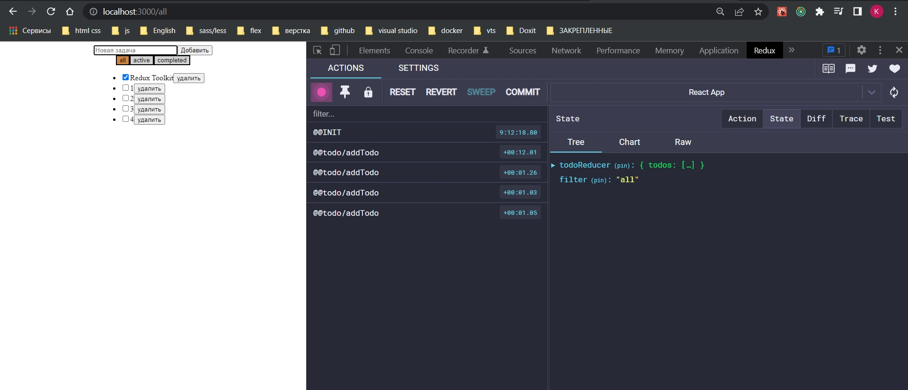
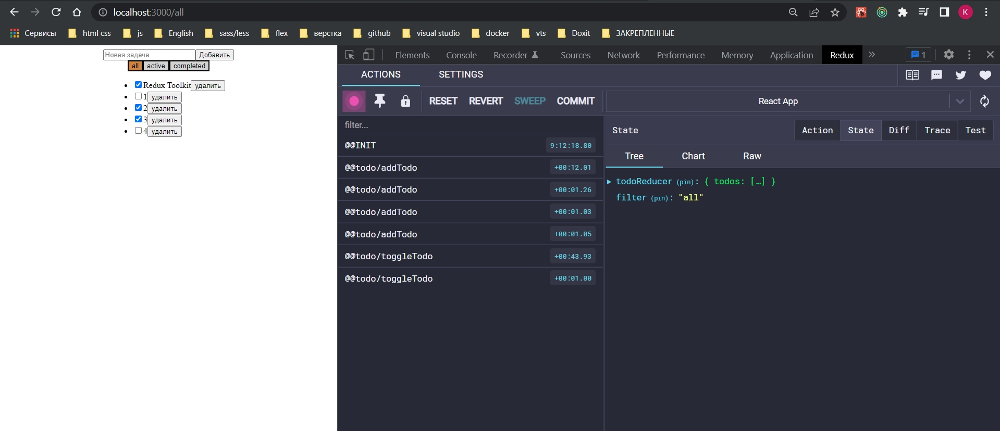
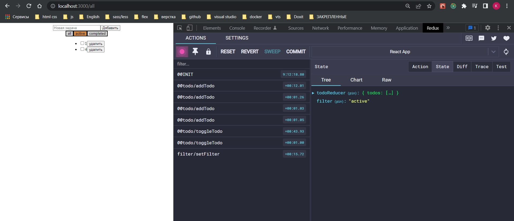

# 007_filterSlice

И так для того что бы продолжить дальше пришлось фильтры опять переписать на кнопки. И так без особых пояснений.

```js
import React from "react";

import { useSelector, useDispatch } from "react-redux";
import { toggleTodo, removeTodo } from "../../store/todo/slices/todo-slice";
import { selectVisibleTodos } from "../../store/todo/selectors/todo-selectors";

const TodoList = () => {
  //Получаю активный фильтр
  const activeFilter = useSelector((state) => state.filter);
  //передаю активный фильтр
  const entities = useSelector((state) => selectVisibleTodos(state, activeFilter));
  const dispatch = useDispatch();
  return (
    <ul>
      {entities === undefined
        ? null
        : entities.map((todo) => (
            <li key={todo.id}>
              <input
                type="checkbox"
                checked={todo.completed}
                onChange={() => dispatch(toggleTodo(todo.id))}
              />
              {todo.title}
              <button onClick={() => dispatch(removeTodo(todo.id))}>
                удалить
              </button>
            </li>
          ))}
    </ul>
  );
};

export default TodoList;

```

```js
import React from "react";
import { useSelector, useDispatch } from "react-redux";
import { setFilter } from "../store/filters/slices/filter-slice";

const Filters = () => {
  const dispatch = useDispatch();
  const activeFilter = useSelector((state) => state.filter);

  const handleFilter = (val) => dispatch(setFilter(val));

  return (
    <div>
      <button
        style={{
          backgroundColor: activeFilter === "all" ? "peru" : "lightgray",
        }}
        onClick={() => handleFilter("all")}
      >
        all
      </button>
      <button
        style={{
          backgroundColor: activeFilter === "active" ? "peru" : "lightgray",
        }}
        onClick={() => handleFilter("active")}
      >
        active
      </button>
      <button
        style={{
          backgroundColor: activeFilter === "completed" ? "peru" : "lightgray",
        }}
        onClick={() => handleFilter("completed")}
      >
        completed
      </button>
    </div>
  );
};

export default Filters;

```

```js
import { createSlice } from "@reduxjs/toolkit";

const filterSlice = createSlice({
  name: "filter",
  initialState: "all",
  reducers: {
    setFilter: (_, action) => {
      return action.payload;
    },
  },
});

export const { setFilter } = filterSlice.actions;

export default filterSlice.reducer;

```

```js
//src/store/store.js
import { configureStore } from "@reduxjs/toolkit";
import todoSlice from "./todo/slices/todo-slice";
import { logger } from "redux-logger/src";
import filterSlice from "./filters/slices/filter-slice";

export const store = configureStore({
  reducer: {
    todoReducer: todoSlice,
    filter: filterSlice,
  },

  devTools: true,
  middleware: (getDefaultMiddleware) => {
    //getDefaultMiddleware это middleware Toolkit
    return getDefaultMiddleware().concat(logger);
  },
  preloadedState: {
    todoReducer: {
      todos: [{ id: 1, title: "Redux Toolkit", completed: true }],
    },
  },
  enhancers: [
    //Дополнительные усилители библиотеки
  ],
});

```









