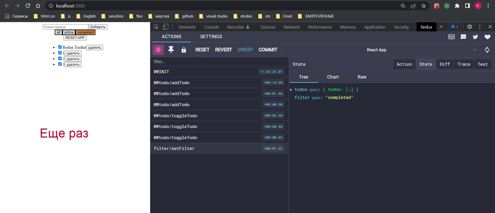

# extraReducers

И дабы завершить базовую историю по API Redux Toolkit создадим extraReducers.

Для этого нам понадобиться createAction. Для этого создам отдельный action resetToDefaults, называю его root/reset-app

```js
import { createAction } from "@reduxjs/toolkit";

export const actionResetToDefaults = createAction("root/reset-app");

```

Как я его буду использовать? 

Я буду добавлять в кажды из моих reducers, где я хочу использовать это событие, набор extraReducers. extraReducers по сути нечто напоминающе функцию createReducer будет принимать функцию с builder, и возвращать нам историю в которой этот builder что то создает.


Для этого action создаем соответствующий reducer. 

Для чего это нужно?

У нас, когда мы говорим про како-то конкретный слайс, это история которая может работать относительно конкретной ветки.


Когда мы работаем на уровне редюссера todoSlice мы работаем только на уровне этого ключа todoReducer, лучше называть просто todo.

Изменил

```js
//src/store/store.js
import { configureStore } from "@reduxjs/toolkit";
import todoSlice from "./todo/slices/todo-slice";
import { logger } from "redux-logger/src";
import filterSlice from "./filters/slices/filter-slice";

export const store = configureStore({
  reducer: {
    todos: todoSlice,
    filter: filterSlice,
  },

  devTools: true,
  middleware: (getDefaultMiddleware) => {
    //getDefaultMiddleware это middleware Toolkit
    return getDefaultMiddleware().concat(logger);
  },
  preloadedState: {
    todos: {
      todos: [{ id: 1, title: "Redux Toolkit", completed: true }],
    },
  },
  enhancers: [
    //Дополнительные усилители библиотеки
  ],
});

```

```js
export const allTodos = (state) => state.todos.todos;

export const selectVisibleTodos = (state, filter) => {
  switch (filter) {
    case "all": {
      return state.todos.todos;
    }
    case "active": {
      return state.todo.todos.filter((todo) => !todo.completed);
    }
    case "completed": {
      return state.todos.todos.filter((todo) => todo.completed);
    }
    default: {
      return state.todos.todos;
    }
  }
};

```


Когда мы работаем на уровне редюссера todoSlice мы работаем только на уровне этого ключа entities, мы ничего не знаем про filter.

Тоже самое когда мы работаем в filterSlice мы ничего не знаем про entities.

И если нам вдруг нужна какая-то общая логика мы должны ее вынести на уровень выше.

Я говорю что вот этот state, который изначально был массивом entities:[], я сейчас хочу перезаписать.


И я говрю что верни мне просто пустой массив entities. Для этого проще инициализацию начального сотсояния вынести в отдельную переменную и возвращать начальное состояние.

C фильтрами тоже самое.

```js
//src/store/todo/slices/todo-slice.js
import { createSlice, nanoid } from "@reduxjs/toolkit";
import { actionResetToDefaults } from "../actions/action-resetToDefaults";

const initialState = {
  entities: [],
};

const todoSlice = createSlice({
  name: "@@todo",
  initialState,
  reducers: {
    addTodo: {
      reducer: (state, action) => void state.todos.push(action.payload),
      prepare: (title) => ({
        payload: { title, id: nanoid(), completed: false },
      }),
    },
    toggleTodo: (state, action) => {
      const todo = state.todos.find((todo) => todo.id === action.payload);
      //и просто мутирую
      todo.completed = !todo.completed;
    },
    removeTodo: (state, action) => {
      const id = state.todos.findIndex((todo) => todo.id === action.payload);
      state.todos.splice(id, 1);
    },
  },
  extraReducers: (builder) => {
    return builder.addCase(actionResetToDefaults, (state, action) => {
      return initialState.entities;
    });
  },
});

export const { addTodo, toggleTodo, removeTodo } = todoSlice.actions;

export default todoSlice.reducer;

```

```js
import { createSlice } from "@reduxjs/toolkit";
import { actionResetToDefaults } from "../../todo/actions/action-resetToDefaults";

const filterSlice = createSlice({
    name: "filter",
    initialState: "all",
    reducers: {
        setFilter: (_, action) => {
            return action.payload;
        },
    },
    extraReducers: (builder) => {
        return builder.addCase(actionResetToDefaults, () => {
            return "all";
        });
    },
});

export const { setFilter } = filterSlice.actions;

export default filterSlice.reducer;

```

Теперь я могу создать компонент ResetApp который будет содержать одну только кнопку.

```js
import React from "react";
import { useDispatch } from "react-redux";
import { actionResetToDefaults } from "../store/todo/actions/action-resetToDefaults";

const ResetApp = () => {
  const dispatch = useDispatch();
  return (
    <button onClick={() => dispatch(actionResetToDefaults())}>RESET APP</button>
  );
};

export default ResetApp;

```

```js
import React from "react";
import NewTodo from "./components/Todo/NewTodo";
import TodoList from "./components/Todo/TodoList";
import Filters from "./components/Filters";
import ResetApp from "./components/resetApp";

function App() {
  return (
    <>
      <NewTodo />
      <Filters />
      <ResetApp />
      <TodoList />
    </>
  );
}

export default App;

```


Как видим один action отработал, но он привел к тому что наши фильтры сбросились на all, и массив todo стал пустым.




Вот такой простой пример использования extraReducers c каким то общим actionResetToDefaults который будет одинаково действовать в разных слайсах.


