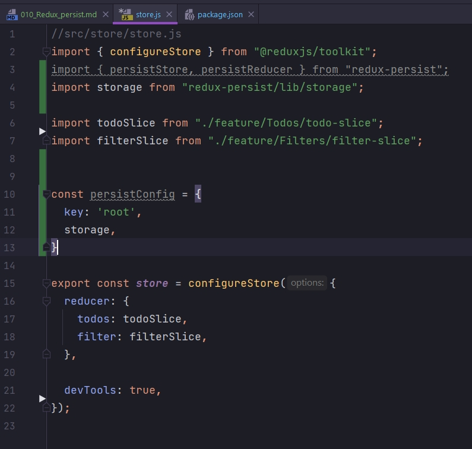
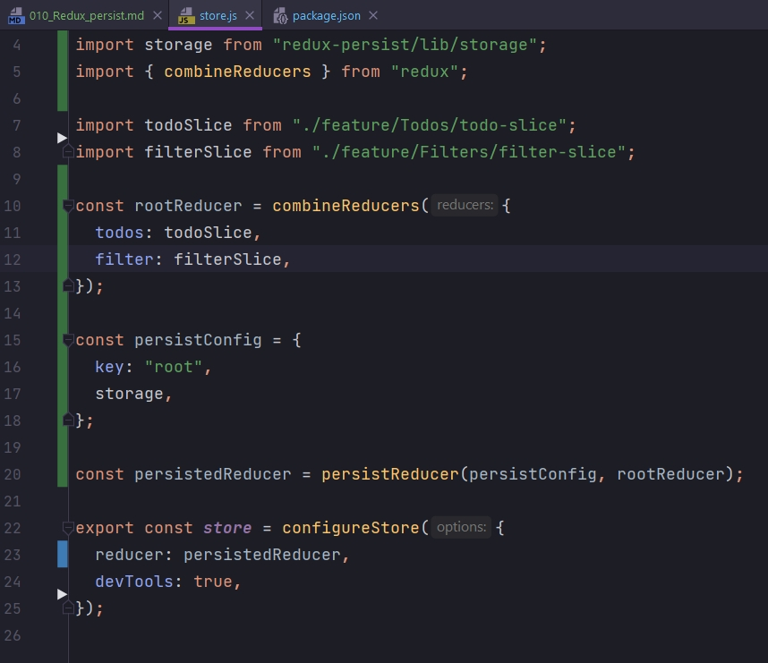
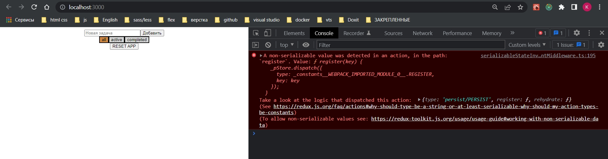
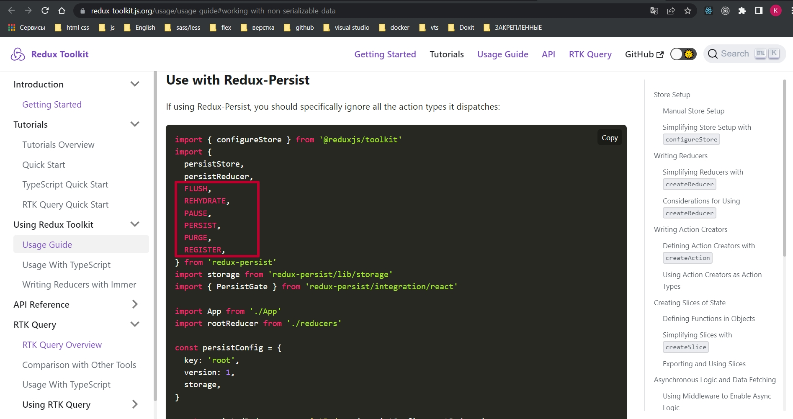
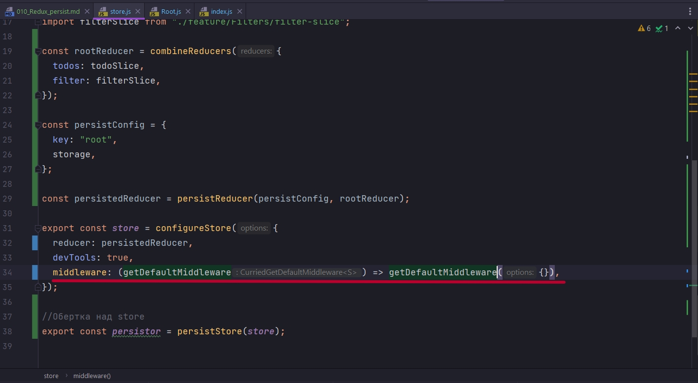
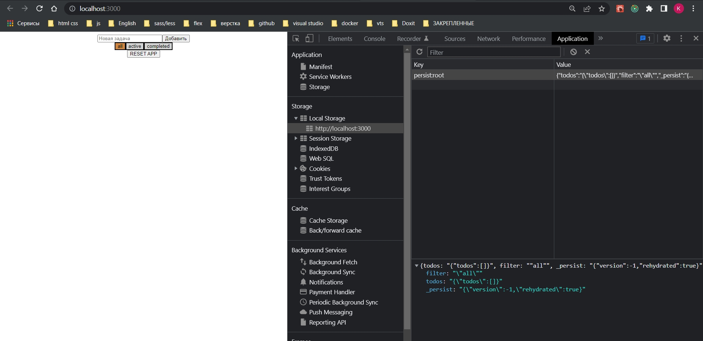
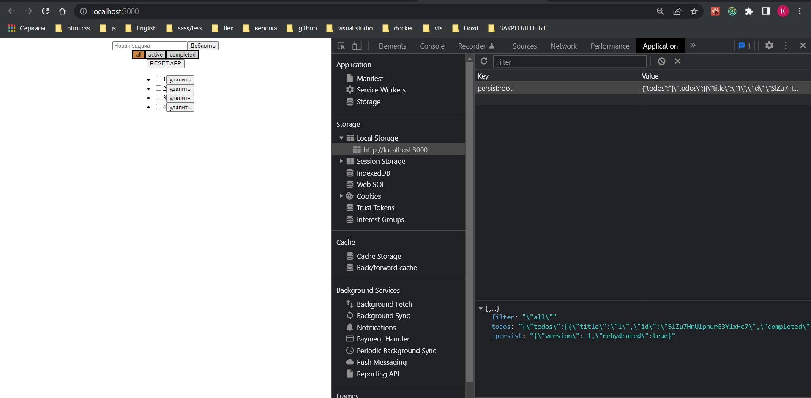
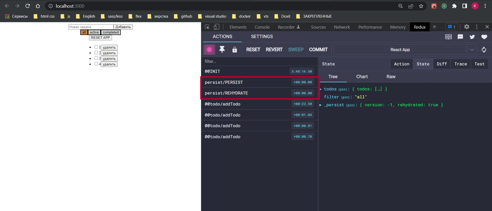

# 010_Redux_persist

<https://www.npmjs.com/package/redux-persist>

Переходя на Redux Toolkit всплывают нюансы по взаимодействию с какими либо инструментами. Мы используем другой подход нежели как в обычном Redux.

Напомню что когда мы работаем с persist, нам нужно поработать с двумя файлами а именно со store.js и корневым index.js.

Касаемо store. Мы должны добавить несколько импортов, persistStore и persistReducer из redux-persist, а так же storage.

Поесле чего мы должны подготовить persistConfig 



Ну и для того что бы создать persistReducer нам все таки придеться использовать combineReducers из самого redux. 

В combineReducers мы должны передать наши редюссеры, потому что нам нужно создать persistReducer.

И далее инициализирую persistedReducer = persistReducer(). В вызов persistReducer мы должны передать persistConfig, и вторым параметром передать rootReducer.

И уже в configureStore в reducer передаю persistedReducer.



Но этого не достаточно. Нам нужно еще сделать обертку над store. Создаю констатну persistor, инициализирую ее с помощью persistStore(store) в который передаю наше хранилище.

```js
//src/store/store.js
import { configureStore } from "@reduxjs/toolkit";
import { persistStore, persistReducer } from "redux-persist";
import storage from "redux-persist/lib/storage";
import { combineReducers } from "redux";

import todoSlice from "./feature/Todos/todo-slice";
import filterSlice from "./feature/Filters/filter-slice";

const rootReducer = combineReducers({
  todos: todoSlice,
  filter: filterSlice,
});

const persistConfig = {
  key: "root",
  storage,
};

const persistedReducer = persistReducer(persistConfig, rootReducer);

export const store = configureStore({
  reducer: persistedReducer,
  devTools: true,
});

//Обертка над store
export const persistor = persistStore(store);

```

На уровне index, у меня это Root, импортирую PersistGate. Обернуть в него наше приложение. И передать ему несколько значений. Значение loading c каким-то прелоудером, я передам null. Ну и сам persistor.

```js
import React from "react";
import ReactDOM from "react-dom/client";
import { Root } from "./Root";
import { store, persistor } from "./store";
import "./index.css";

const root = ReactDOM.createRoot(document.getElementById("root"));
root.render(<Root store={store} persistor={persistor} />);

```

```js
import { Provider } from "react-redux";
import { PersistGate } from "redux-persist/integration/react";
import App from "./App";

export const Root = ({ store, persistor }) => {
  return (
    <Provider store={store}>
      <PersistGate loading={null} persistor={persistor}>
        <App />
      </PersistGate>
    </Provider>
  );
};

```

Но и тут еще не все... Если мы запусим приложение мы увидим ошибку



И сдесь дается две статьи. Соответственно мне нужно по Redux Toolkit. 
Мне нужны константы.



FLUSH,
REHYDRATE,
PAUSE,
PERSIST,
PURGE,
REGISTER,

Эти константы по факту некие экшены, на которые мы тоже можем подписываться. Они нужны для того что бы в  момент создания нашего store, в middleware, мы их отключили и сказали что они нам больше не нужны.



Для этого дополнительно настраиваю наши getDefaultMiddleware. Мы должны передать вот такой вот ключик serializableCheck, и сказать что мы должны игнорировать определенные ignoreActions.

```js
//src/store/store.js
import { configureStore } from "@reduxjs/toolkit";
import {
  persistStore,
  persistReducer,
  FLUSH,
  REHYDRATE,
  PAUSE,
  PERSIST,
  PURGE,
  REGISTER,
} from "redux-persist";
import storage from "redux-persist/lib/storage";
import { combineReducers } from "redux";

import todoSlice from "./feature/Todos/todo-slice";
import filterSlice from "./feature/Filters/filter-slice";

const rootReducer = combineReducers({
  todos: todoSlice,
  filter: filterSlice,
});

const persistConfig = {
  key: "root",
  storage,
};

const persistedReducer = persistReducer(persistConfig, rootReducer);

export const store = configureStore({
  reducer: persistedReducer,
  devTools: true,
  middleware: (getDefaultMiddleware) =>
    getDefaultMiddleware({
      serializableCheck: {
        ignoreActions: [FLUSH, REHYDRATE, PAUSE, PERSIST, PURGE, REGISTER],
      },
    }),
});

//Обертка над store
export const persistor = persistStore(store);

```

Этих экшенов больше, но именно эти должны игнорироваться.

Зачем это нужно?

У нас по умолчанию middleware подключаются, Redux Toolkit нам из коробки какие-то middleware дает, И что бы эти middleware не конфликтовали с Redux-Persister мы дожны сказать. У тебя есть определенные события FLUSH, REHYDRATE, PAUSE, PERSIST, PURGE, REGISTER, не обращай на них внимания.







