# 002_Базовое_использование_createAsyncThunk

```shell
 npm install --save-dev concurrently json-server
```

```json
{
  "name": "todo",
  "version": "0.1.0",
  "private": true,
  "dependencies": {
    "@reduxjs/toolkit": "^1.8.1",
    "@testing-library/jest-dom": "^5.16.4",
    "@testing-library/react": "^13.2.0",
    "@testing-library/user-event": "^13.5.0",
    "lodash": "^4.17.21",
    "react": "^18.1.0",
    "react-dom": "^18.1.0",
    "react-redux": "^8.0.1",
    "react-router-dom": "^6.3.0",
    "react-scripts": "5.0.1",
    "redux-devtools-extension": "^2.13.9",
    "redux-logger": "^3.0.6",
    "redux-persist": "^6.0.0",
    "web-vitals": "^2.1.4"
  },
  "scripts": {
    "server": "json-server --watch -p 5000 db.json",
    "dev": "react-scripts start",
    "start": "concurrently \"npm run dev\" \"npm run server\"",
    "build": "react-scripts build",
    "test": "react-scripts test",
    "eject": "react-scripts eject"
  },
  "proxy": "http://localhost:5000"
,
  "eslintConfig": {
    "extends": [
      "react-app",
      "react-app/jest"
    ]
  },
  "browserslist": {
    "production": [
      ">0.2%",
      "not dead",
      "not op_mini all"
    ],
    "development": [
      "last 1 chrome version",
      "last 1 firefox version",
      "last 1 safari version"
    ]
  },
  "devDependencies": {
    "concurrently": "^7.2.0",
    "json-server": "^0.17.0"
  }
}


```

```json
{
  "entities": [
    {
      "id": 1,
      "title": "Learn Toolkit",
      "completed": false
    },
    {
      "id": 2,
      "title": "Learn React",
      "completed": true
    },
    {
      "id": 3,
      "title": "Learn English",
      "completed": false
    },
    {
      "id": 4,
      "title": "Learn Redux",
      "completed": true
    },
    {
      "id": 5,
      "title": "Something new",
      "completed": false
    },
    {
      "title": "asdasd",
      "completed": false,
      "id": 6
    },
    {
      "title": "asdasd",
      "completed": false,
      "id": 7
    },
    {
      "title": "asdasd",
      "completed": false,
      "id": 8
    }
  ]
}
```

Иду в todoSlice. Если я буду работать асинхронно, то мне как минимум не понадобится генерирать id потому что я их буду получать с сервера.

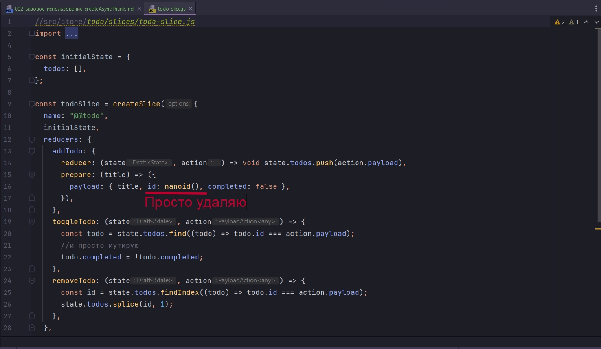

И мне понадобится createAsyncThunk. Как помним Thunk идет прямой зависимостью в Redux Toolkit. Это означает что мы могли бы совершенно спокойно импортировать thunk из redux-thunk, и мы могли бы использовать обычны thunk так как мы это делали раньше.

Но нам это делать не нужно. В данном случае thunks будут представлять собой набор определенных экшенов. 

Создаю константу createTodo.

и теперь смотрите у нас раньше был вот такой Thunk

```js
const createTodo = (title) => (dispatch, getState, {})=>{}
//{} - третий параметр это extra параметр
```

Сейчас это все выглядит немножко иначе.

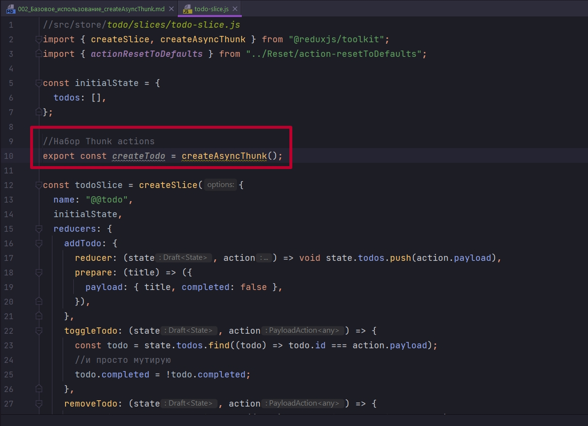

Первым параметром передаем некую уникальную строку, которой мы обзываем это событие thunk. По сути это какой-то action

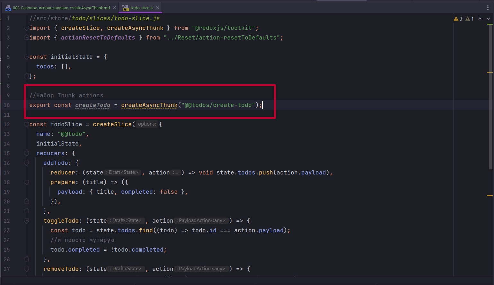

После чего я как раз описываю некую асинхронную логику.

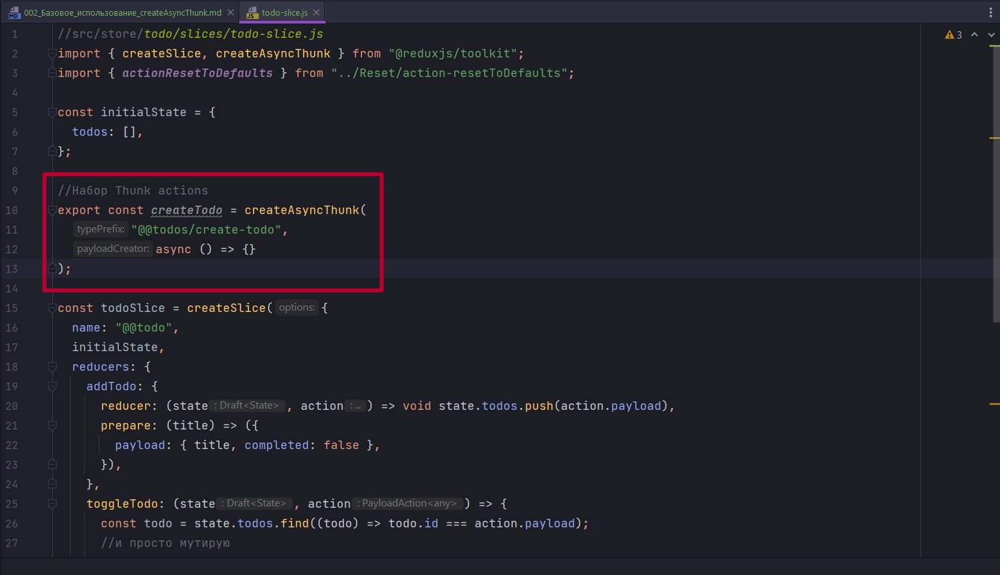

Первым параметром она предлагает получить что-то из нашего UI, т.е. то что мы раньше принимали первым параметром,  первой функции, в нашем thunk.

Вторым параметром я передаю thunkAPI. Это объект, которым нас обеспечивает redux. И в этом объекте много чего есть.

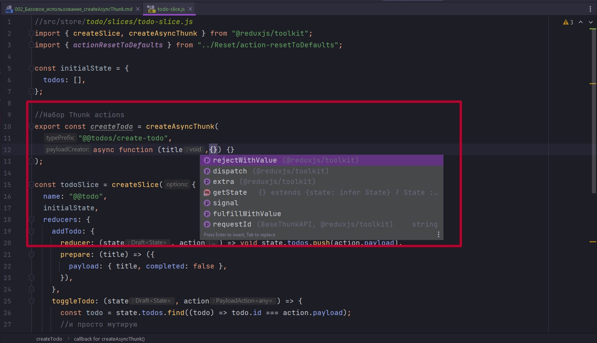

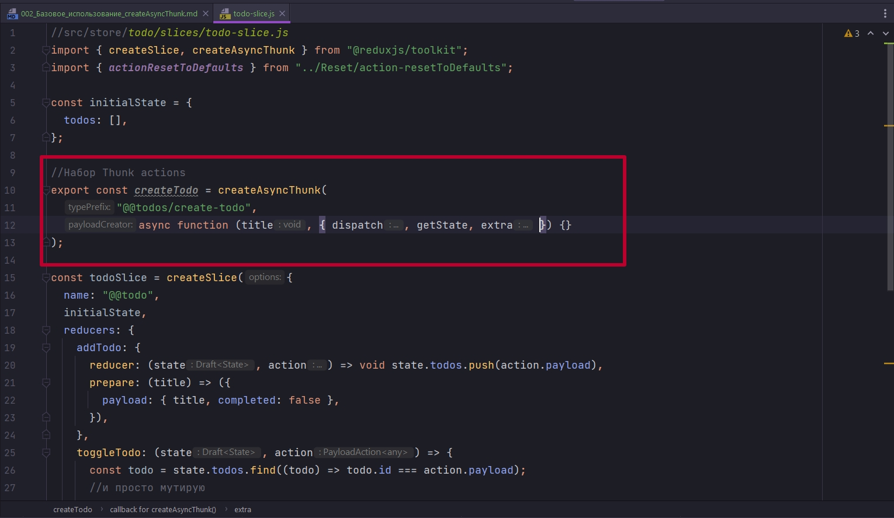

В теле мы можем делать самые разные штуки. Ну и как раньше я могу сделать dispatch лоудинга, после fetch запрос.

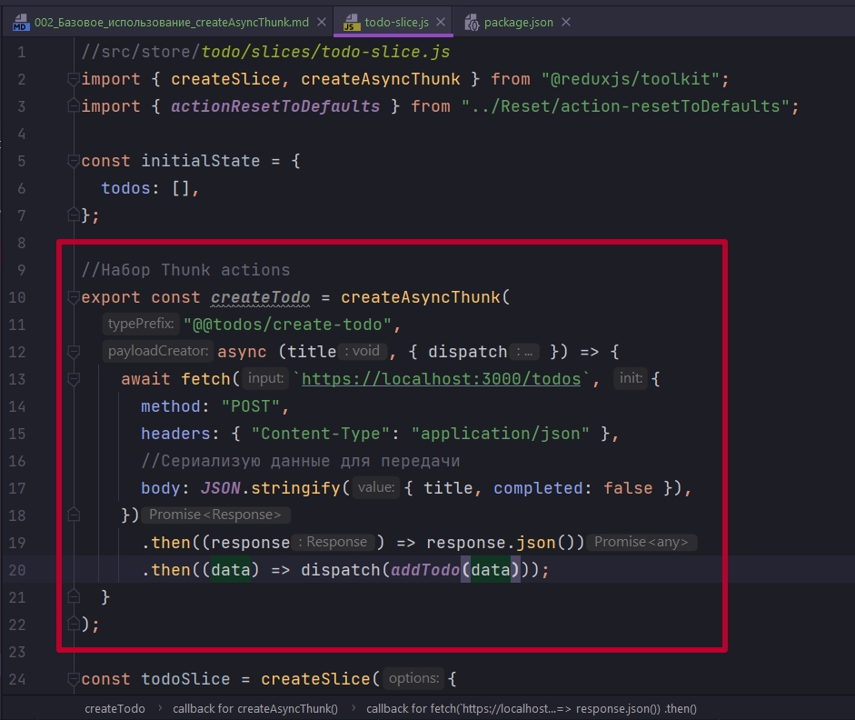

```js
//src/store/todo/slices/todo-slice.js
import { createSlice, createAsyncThunk } from "@reduxjs/toolkit";
import { actionResetToDefaults } from "../Reset/action-resetToDefaults";

const initialState = {
  entities: [],
};

//Набор Thunk actions
export const createTodo = createAsyncThunk(
  "@@entities/create-todo",
  async (title, { dispatch }) => {
    await fetch(`http://localhost:3000/entities`, {
      method: "POST",
      headers: { "Content-Type": "application/json" },
      //Сериализую данные для передачи
      body: JSON.stringify({ title, completed: false }),
    })
      .then((response) => response.json())
      .then((data) => dispatch(addTodo(data)));
  }
);

const todoSlice = createSlice({
  name: "@@todo",
  initialState,
  reducers: {
    addTodo: {
      reducer: (state, action) => void state.todos.push(action.payload),
      prepare: (title) => ({
        payload: { title, completed: false },
      }),
    },
    toggleTodo: (state, action) => {
      const todo = state.todos.find((todo) => todo.id === action.payload);
      //и просто мутирую
      todo.completed = !todo.completed;
    },
    removeTodo: (state, action) => {
      const id = state.todos.findIndex((todo) => todo.id === action.payload);
      state.todos.splice(id, 1);
    },
  },
  extraReducers: (builder) => {
    return builder.addCase(actionResetToDefaults, (state, action) => {
      return initialState.entities;
    });
  },
});

export const { addTodo, toggleTodo, removeTodo } = todoSlice.actions;

export default todoSlice.reducer;

```

Далее в обработчике фармы использую наш Thunk Action createTodo

```js
import React, { useState } from "react";
import { useDispatch } from "react-redux";
import { addTodo, createTodo } from "./todo-slice";

const NewTodo = () => {
  const [value, setValue] = useState("");
  const dispatch = useDispatch();

  const handleSubmit = (event) => {
    if (value) {
      event.preventDefault();
      dispatch(createTodo(value));
      setValue("");
    } else {
      event.preventDefault();
    }
  };

  return (
    <form onSubmit={handleSubmit}>
      <input
        type="text"
        name="title"
        placeholder="Новая задача"
        value={value}
        onChange={(event) => setValue(event.target.value)}
      />
      <input type="submit" value="Добавить" />
    </form>
  );
};

export default NewTodo;

```

И немного поправляю вывод данных

```import React from "react";

import { useSelector, useDispatch } from "react-redux";
import { toggleTodo, removeTodo } from "./todo-slice";
import { selectVisibleTodos } from "./todo-selectors";

const TodoList = () => {
  //Получаю активный фильтр
  const activeFilter = useSelector((state) => state.filter);
  //передаю активный фильтр
  const entities = useSelector((state) => selectVisibleTodos(state, activeFilter));
  const dispatch = useDispatch();
  console.log(entities);
  return (
    <ul>
      {entities === undefined
        ? null
        : entities.map((todo) => (
            <li key={todo.title.id}>
              <input
                type="checkbox"
                checked={todo.title.completed}
                onChange={() => dispatch(toggleTodo(todo.title.id))}
              />
              {todo.title.title}
              <button onClick={() => dispatch(removeTodo(todo.title.id))}>
                удалить
              </button>
            </li>
          ))}
    </ul>
  );
};

export default TodoList;
```

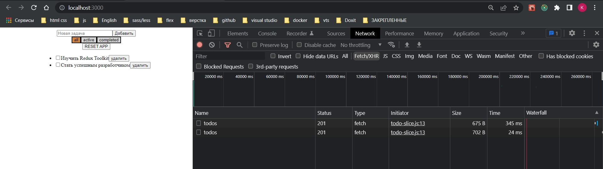

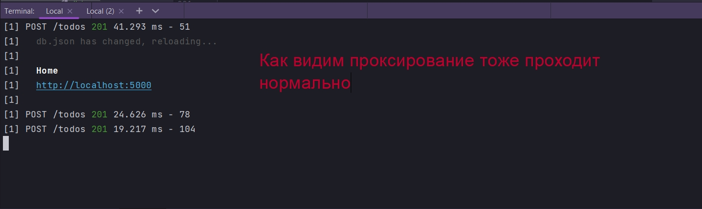

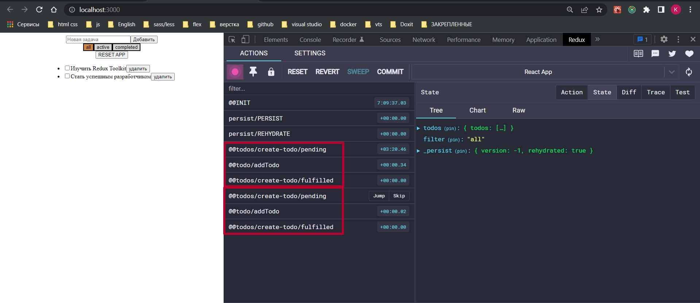

Итого. Сам по себе createAsyncThunk, в базовом его варианте, представляет собой функцию, с двумя параметрами. Первый параметр это некое строковое значение, по сути строка для action "@@entities/create-todo". Тут тоже есть свои нюансы.

А второй параметр это как раз асинхронная функция которая представляет собой Thunk

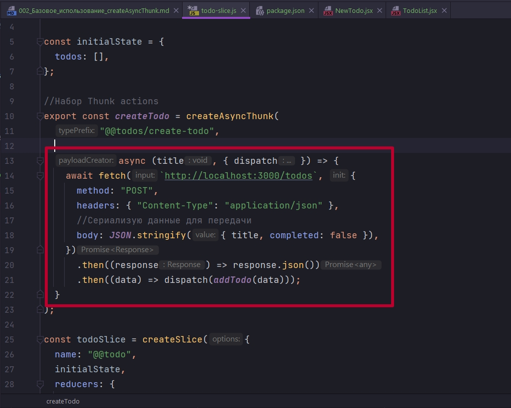

Первым параметром мы получаем что-то из UI, этот параметр title, если мы вообще сюда что-то парадаем.

Вторым параметром мы принимаем некий ThunkAPI, объект, где мы можем достать разные значения. В теле функции мы можем работать как по старинке. Ну конечно можно было бы сделать try catch.

Но этот подход который мы использовали выше. Он хоть и возможен, но он избыточен.


