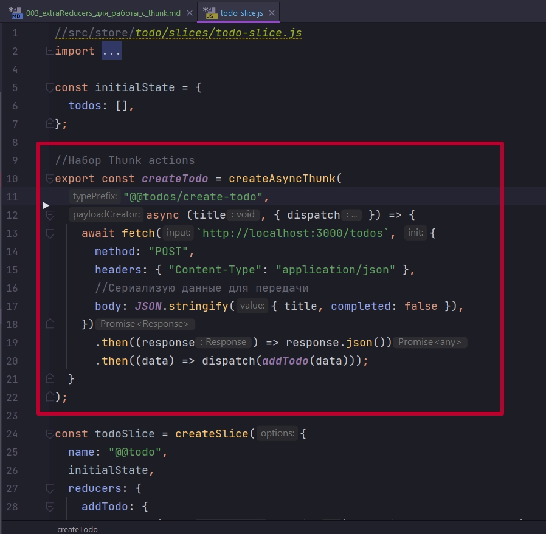
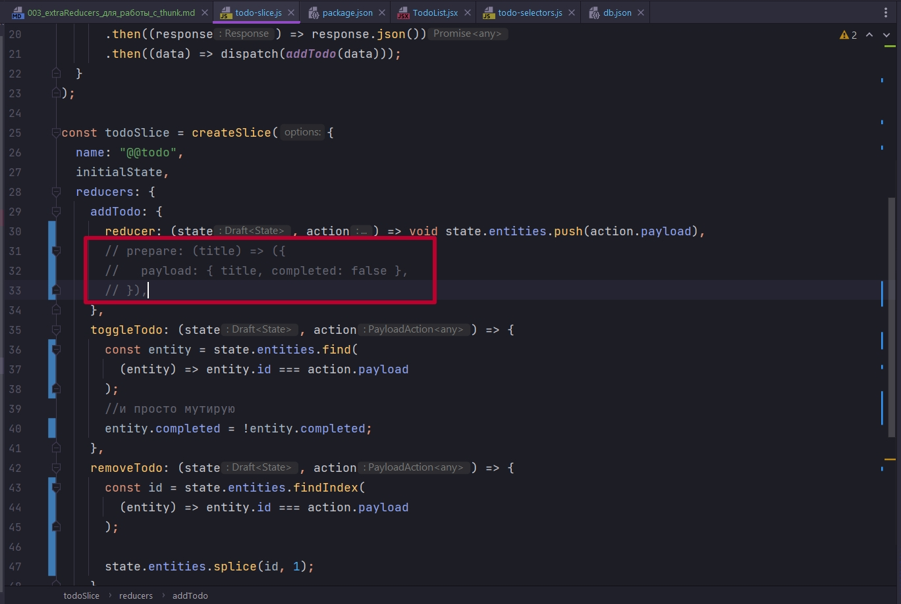
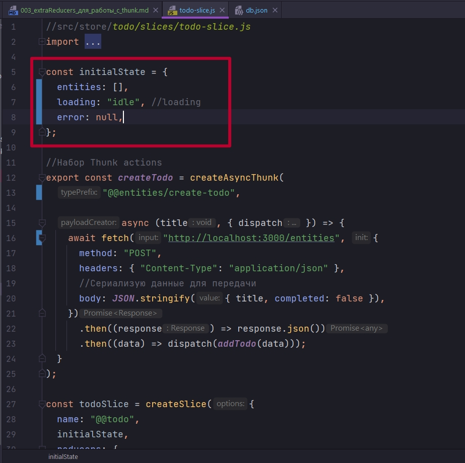
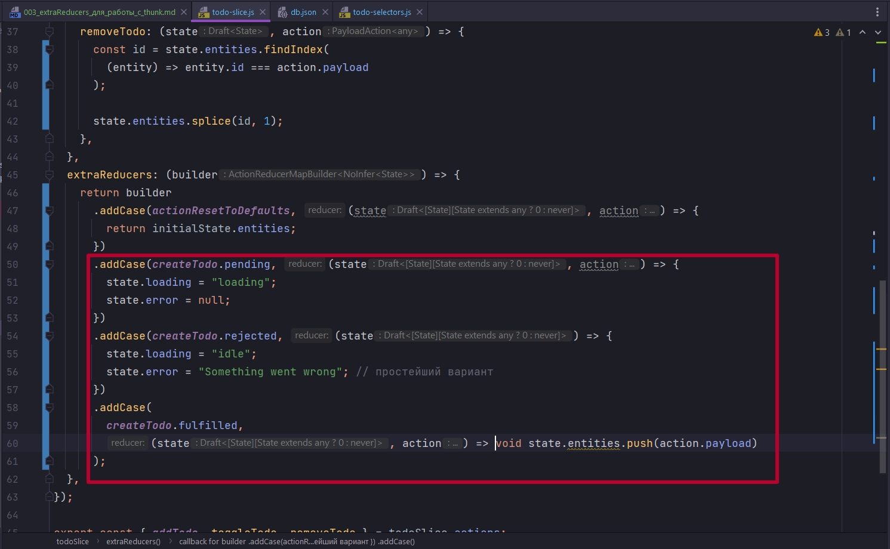
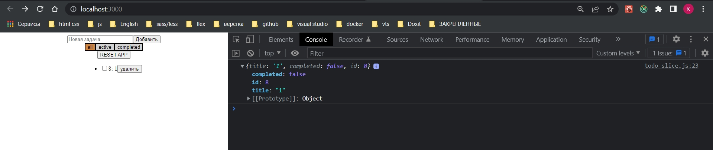
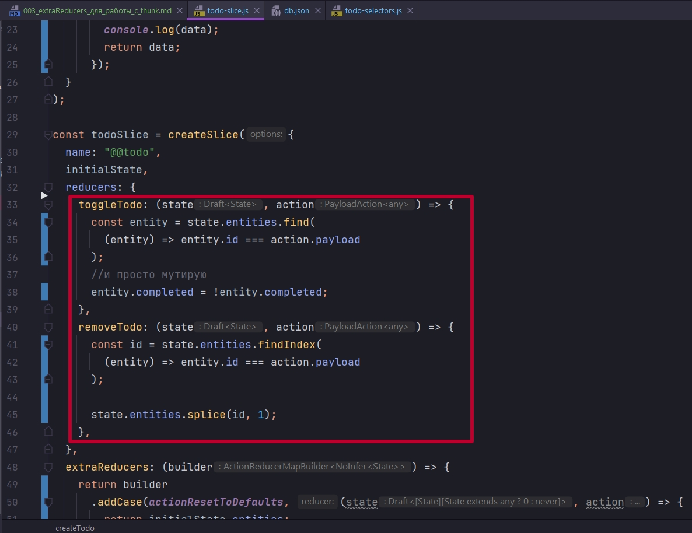

# 003_extraReducers_для_работы_с_thunk

Работая с createAsyncThunk нам окажутся очень полезными окажуться такие сущности как extraReducers. C точки зрения extraReducers  мы будем добавлять новые addCase для обработки асинхронной логики.

Выглядеть это будет следующим образом. Вот этот createTodo который мы создали благодаря createAsyncThunk



помимо всего прочего, имеет некие ключи, как объект. В addCase добавляю наш createTodo и через точку смотрю ключи pending,fulfilled,rejected. Это три разных action которые мы можем добавить в extraReducer добавить, обработать и сделать различные операции.

Для этого наш initialState притерпит изменения. Мы добавим entities, у меня todo. Буду его примеру следовать.

И так при удалении у меня slice возвращал -1, а это значит что мояфильтрация не отрабатывала так как перебираемый массив был undefined. В payload id с клиента прилетает.

Проблема в том что я при добавлении в ключе prepare формировал данные, это так называемое предформирование данных, создавал объект title. 

Соответственно возникли проблемы при переборе массива в других методах.



```js
//src/store/todo/slices/todo-slice.js
import { createSlice, createAsyncThunk } from "@reduxjs/toolkit";
import { actionResetToDefaults } from "../Reset/action-resetToDefaults";

const initialState = {
  entities: [],
};

//Набор Thunk actions
export const createTodo = createAsyncThunk(
  "@@entities/create-todo",

  async (title, { dispatch }) => {
    await fetch("http://localhost:3000/entities", {
      method: "POST",
      headers: { "Content-Type": "application/json" },
      //Сериализую данные для передачи
      body: JSON.stringify({ title, completed: false }),
    })
      .then((response) => response.json())
      .then((data) => dispatch(addTodo(data)));
  }
);

const todoSlice = createSlice({
  name: "@@todo",
  initialState,
  reducers: {
    addTodo: {
      reducer: (state, action) => void state.entities.push(action.payload),
      // prepare: (title) => ({
      //   payload: { title, completed: false },
      // }),
    },
    toggleTodo: (state, action) => {
      const entity = state.entities.find(
        (entity) => entity.id === action.payload
      );
      //и просто мутирую
      entity.completed = !entity.completed;
    },
    removeTodo: (state, action) => {
      const id = state.entities.findIndex(
        (entity) => entity.id === action.payload
      );

      state.entities.splice(id, 1);
    },
  },
  extraReducers: (builder) => {
    return builder.addCase(actionResetToDefaults, (state, action) => {
      return initialState.entities;
    });
  },
});

export const { addTodo, toggleTodo, removeTodo } = todoSlice.actions;

export default todoSlice.reducer;

```

При переименовании массива в начальном состоянии, переименовываю и в url, это не взаимосвязано. Переименование в url вязано с названием массива который у нас имитирует БД db.json.

```json

{
  "entities": []
}
```

<br/>
<br/>
<br/>

И вот теперь по extraReducers. Так же еще в начальное состояние у нас добавиться событие loading:"idle" и error.



Так же исправляю

```js
export const allTodos = (state) => state.todos.entities;

export const selectVisibleTodos = (state, filter) => {
  switch (filter) {
    case "all": {
      return state.todos.entities;
    }
    case "active": {
      return state.todos.entities.filter((todo) => !todo.completed);
    }
    case "completed": {
      return state.todos.entities.filter((todo) => todo.completed);
    }
    default: {
      return state.todos.entities;
    }
  }
};

```

Теперь в extraReducer я буду говорить: когда у меня начинается событие pending, это значит я инициировал запрос, я хочу создать соответственно reducer который будет говорить что в моем состоянии поле loading:"loading", мое событие ошибки, если она раньше была, теперь error:null.



После чего я могу избавиться от метода addTodo в reducer, и немного почистить createTodo, он dispatch в частности.

```js
//src/store/todo/slices/todo-slice.js
import { createSlice, createAsyncThunk } from "@reduxjs/toolkit";
import { actionResetToDefaults } from "../Reset/action-resetToDefaults";

const initialState = {
  entities: [],
  loading: "idle", //loading
  error: null,
};

//Набор Thunk actions
export const createTodo = createAsyncThunk(
  "@@entities/create-todo",
  async (title) => {
    return await fetch("http://localhost:3000/entities", {
      method: "POST",
      headers: { "Content-Type": "application/json" },
      //Сериализую данные для передачи
      body: JSON.stringify({ title, completed: false }),
    })
      .then((response) => response.json())
      .then((data) => data);
  }
);

const todoSlice = createSlice({
  name: "@@todo",
  initialState,
  reducers: {
    toggleTodo: (state, action) => {
      const entity = state.entities.find(
        (entity) => entity.id === action.payload
      );
      //и просто мутирую
      entity.completed = !entity.completed;
    },
    removeTodo: (state, action) => {
      const id = state.entities.findIndex(
        (entity) => entity.id === action.payload
      );

      state.entities.splice(id, 1);
    },
  },
  extraReducers: (builder) => {
    return builder
      .addCase(actionResetToDefaults, (state, action) => {
        return initialState.entities;
      })
      .addCase(createTodo.pending, (state, action) => {
        state.loading = "loading";
        state.error = null;
      })
      .addCase(createTodo.rejected, (state) => {
        state.loading = "idle";
        state.error = "Something went wrong"; // простейший вариант
      })
      .addCase(
        createTodo.fulfilled,
        (state, action) => void state.entities.push(action.payload)
      );
  },
});

export const { addTodo, toggleTodo, removeTodo } = todoSlice.actions;

export default todoSlice.reducer;

```

Сдесь есть как свои плюсы так и минусы. Сам факт что у нас логика немного меняется.



Мы так именно и будем работать с createAsyncThunk. И не важно, хотим ли мы делать Remove, Toggle



Мы создаем createAsyncThunk, делаем запрос, получаем результат. А все что кассется обработки ошибок, обработки статусов загрузки и результатов того что мы получили, мы будем использовать логику в extraReducers.

