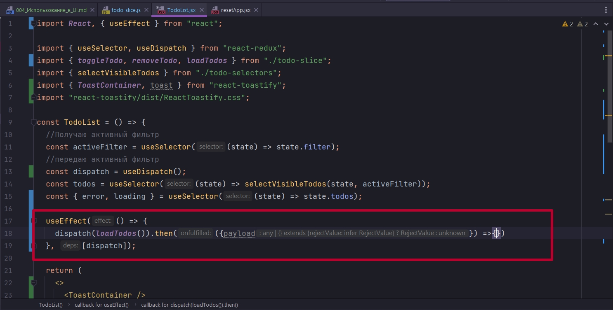
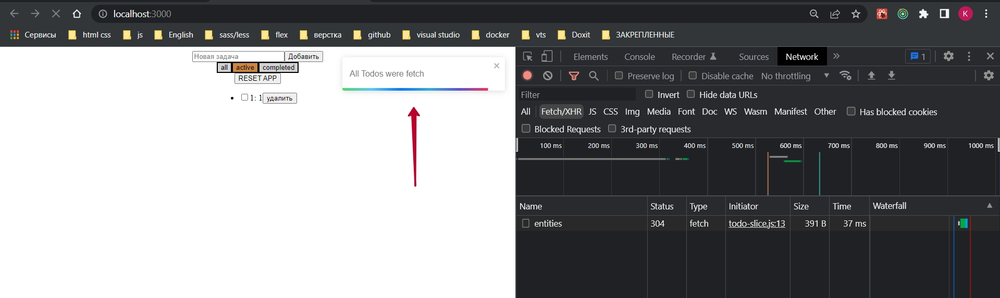
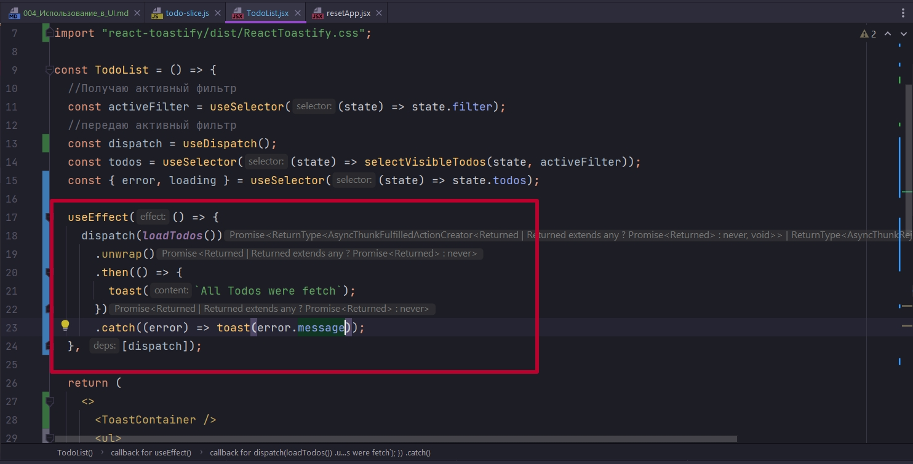
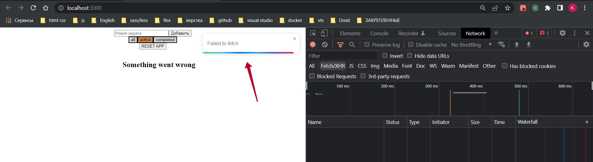

# 004_Использование_в_UI


И так прежде чем продолжить работать с UI дописал основную осинхронную логику.

```js
//src/store/todo/slices/todo-slice.js
import { createSlice, createAsyncThunk } from "@reduxjs/toolkit";
import { actionResetToDefaults } from "../Reset/action-resetToDefaults";

const initialState = {
    entities: [],
    loading: "idle", //loading
    error: null,
};

//Получение данных
export const loadTodos = createAsyncThunk("@@todos/load-all", async () => {
    return await fetch("http://localhost:3000/entities")
        .then((response) => response.json())
        .then((data) => {
            console.log(data);
            return data;
        });
});

//Создание todo
export const createTodo = createAsyncThunk(
    "@@todos/create-todo",
    async (title) => {
        return await fetch("http://localhost:3000/entities", {
            method: "POST",
            headers: { "Content-Type": "application/json" },
            //Сериализую данные для передачи
            body: JSON.stringify({ title, completed: false }),
        })
            .then((response) => response.json())
            .then((data) => data);
    }
);

// Удаление
export const removeTodo = createAsyncThunk(
    "@@todos/remove-todo",
    //Произвожу действия на сервере и преобразую полученный ответ
    async (id) => {
        await fetch(`http://localhost:3000/entities/${id}`, {
            method: "DELETE",
            headers: {
                "Content-type": "application/json",
            },
        }).then((response) => response.json);
        //в reducer в action.payload передаю полученный id с клиента
        return id;
    }
);

//Обновление
export const toggleTodo = createAsyncThunk(
    "@@todos/toggle-todo",
    async (id, { getState }) => {
        // Получаю нужный объект
        const todo = getState().todos.entities.find((todo) => todo.id === id);
        //Делаю запрос на сервер и указываю что в completed мне нужно сделать reverse
        return await fetch(`http://localhost:3000/entities/${id}`, {
            method: "PATCH",
            headers: {
                "Content-type": "application/json",
            },
            body: JSON.stringify({ completed: !todo.completed }),
        })
            .then((response) => response.json())
            .then((data) => {
                console.log(data);
                return data;
            });
    }
);

const todoSlice = createSlice({
    name: "@@todos",
    initialState,
    reducers: {},
    extraReducers: (builder) => {
        return builder
            .addCase(actionResetToDefaults, (state, action) => {
                state.entities = [];
            })
            .addCase(loadTodos.pending, (state, action) => {
                state.loading = "loading";
                state.error = null;
            })
            .addCase(loadTodos.rejected, (state) => {
                state.loading = "idle";
                state.error = "Something went wrong"; // простейший вариант
            })
            .addCase(loadTodos.fulfilled, (state, action) => {
                state.loading = "idle";
                state.entities = action.payload;
            })
            .addCase(
                createTodo.fulfilled,
                (state, action) => void state.entities.push(action.payload)
            )
            .addCase(removeTodo.fulfilled, (state, action) => {
                //Объект на сервере уже удален,
                //Фильтрую массив в состоянии что бы ит туда удалить этот объект
                state.entities = state.entities.filter(
                    (todo) => todo.id !== action.payload
                );
            })
            .addCase(toggleTodo.fulfilled, (state, action) => {
                //обновленный объект
                const updatedTodo = action.payload;

                //Получаю index объекта
                const index = state.entities.findIndex(
                    (todo) => todo.id === updatedTodo.id
                );
                //Заменяю объект
                state.entities[index] = updatedTodo;
            });
    },
});

// export const { addTodo, toggleTodo, removeTodo } = todoSlice.actions;

export default todoSlice.reducer;

```

И теперь я могу обработать компоненте TodoList. Теперь я могу получить из состояния и error и loading.

```js
import React, { useEffect } from "react";

import { useSelector, useDispatch } from "react-redux";
import { toggleTodo, removeTodo, loadTodos } from "./todo-slice";
import { selectVisibleTodos } from "./todo-selectors";

const TodoList = () => {
  //Получаю активный фильтр
  const activeFilter = useSelector((state) => state.filter);
  //передаю активный фильтр
  const dispatch = useDispatch();
  const todos = useSelector((state) => selectVisibleTodos(state, activeFilter));
  const { error, loading } = useSelector((state) => state.todos);

  useEffect(() => {
    dispatch(loadTodos());
  }, [dispatch]);

  return (
    <ul>
      {error && <h2>{error}</h2>}
      {loading === "loading" && <h2>Loading...</h2>}
      {/*Если loading="idle" и нет ошибки*/}
      {loading === "idle" &&
        !error &&
        todos.map((todo) => (
          <li key={todo.id}>
            <input
              type="checkbox"
              checked={todo.completed}
              onChange={() => dispatch(toggleTodo(todo.id))}
            />
            {todo.id}: {todo.title}
            <button onClick={() => dispatch(removeTodo(todo.id))}>
              удалить
            </button>
          </li>
        ))}
    </ul>
  );
};

export default TodoList;

```

Но работая с Toolkit, у нас добавляется еще одна крутая штука.

```shell
npm i react-toastify
```

Я должен сделать несколько дополнительных импортов ToastContainer, toast из react-toastify. ToastContainer мне нужно добавить в свою разметку. Так же импортирую стили import "react-toastify/dist/ReactToastify.css";

Теперь я в useEffect хочу в момент, коша у меня все todos загружены, я хочу сделать соответствующее уведомление. Могу я это сделать использую then. createAsyncThunk работает таким образом, что сам по себе он нам возвращает Promise. И этот Promise мы можем не только в extraReducers обрабатывать, но и у useEffect тоже.

Именно в этот then будет приходить результат, даже если мы получим ошибку. Т.е. не зависимо от того какой у нас от сервера пришел результат rejected или resolve, мы попадем в этот then, а не в catch. И получим мы в then объект, в котором будет содержаться ключик payload.



Но в простейшем варианте мне не важно что там пришло. Могу сказать вот тебе toast() и напечатай мне некое сообщение.

```js
import React, { useEffect } from "react";

import { useSelector, useDispatch } from "react-redux";
import { toggleTodo, removeTodo, loadTodos } from "./todo-slice";
import { selectVisibleTodos } from "./todo-selectors";
import { ToastContainer, toast } from "react-toastify";
import "react-toastify/dist/ReactToastify.css";

const TodoList = () => {
  //Получаю активный фильтр
  const activeFilter = useSelector((state) => state.filter);
  //передаю активный фильтр
  const dispatch = useDispatch();
  const todos = useSelector((state) => selectVisibleTodos(state, activeFilter));
  const { error, loading } = useSelector((state) => state.todos);

  useEffect(() => {
    dispatch(loadTodos()).then(() => {
      toast(`All Todos were fetch`);
    });
  }, [dispatch]);

  return (
    <>
      <ToastContainer />
      <ul>
        {error && <h2>{error}</h2>}
        {loading === "loading" && <h2>Loading...</h2>}
        {/*Если loading="idle" и нет ошибки*/}
        {loading === "idle" &&
          !error &&
          todos.map((todo) => (
            <li key={todo.id}>
              <input
                type="checkbox"
                checked={todo.completed}
                onChange={() => dispatch(toggleTodo(todo.id))}
              />
              {todo.id}: {todo.title}
              <button onClick={() => dispatch(removeTodo(todo.id))}>
                удалить
              </button>
            </li>
          ))}
      </ul>
    </>
  );
};

export default TodoList;

```



Это имеет больше смысла на добавление вешать.

И здесь может встать вопрос. Ok, очень крутой функционал, любую какую-то логику мы можем повесить прямо в UI.

Но оно всегда будет действовать одинаково, и на ошибку, и на корректное отрабатывание. 

И что бы мы могли обрабатывать разные сценарии, нам дается достаточно гибкий инструмент. Тот промис который возвращается, имеет внутри себя метод unwrap. И уже вызвав его, у нас появляется возможность обрабатывать еще и catch.



```js
import React, { useEffect } from "react";

import { useSelector, useDispatch } from "react-redux";
import { toggleTodo, removeTodo, loadTodos } from "./todo-slice";
import { selectVisibleTodos } from "./todo-selectors";
import { ToastContainer, toast } from "react-toastify";
import "react-toastify/dist/ReactToastify.css";

const TodoList = () => {
  //Получаю активный фильтр
  const activeFilter = useSelector((state) => state.filter);
  //передаю активный фильтр
  const dispatch = useDispatch();
  const todos = useSelector((state) => selectVisibleTodos(state, activeFilter));
  const { error, loading } = useSelector((state) => state.todos);

  useEffect(() => {
    dispatch(loadTodos())
      .unwrap()
      .then(() => {
        toast(`All Todos were fetch`);
      })
      .catch((error) => toast(error.message));
  }, [dispatch]);

  return (
    <>
      <ToastContainer />
      <ul>
        {error && <h2>{error}</h2>}
        {loading === "loading" && <h2>Loading...</h2>}
        {/*Если loading="idle" и нет ошибки*/}
        {loading === "idle" &&
          !error &&
          todos.map((todo) => (
            <li key={todo.id}>
              <input
                type="checkbox"
                checked={todo.completed}
                onChange={() => dispatch(toggleTodo(todo.id))}
              />
              {todo.id}: {todo.title}
              <button onClick={() => dispatch(removeTodo(todo.id))}>
                удалить
              </button>
            </li>
          ))}
      </ul>
    </>
  );
};

export default TodoList;

```




