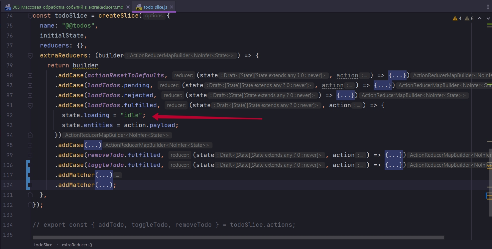

# 005_Массовая_обработка_событий_в_extraReducers

В некоторой ситуации, когда у нас асинхрнной логики много, и мы хотим как то похожим образом обрабатывать ошибки и статус загрузки, у нас может произойти некоторое дублирование.

Мы можем выносить все во внешнии переиспользуемы функции, это как то решит проблему...

На самом деле когда мы работаем с builder, именно с builder, а не когда мы работаем как с объектом. У нас есть возможность добавлять не только addCase, у нас есть возможность добавлять еще два метода.


Есть defaultCase, но он больше подходит для того что бы считать какую-то аналитику считать, собирать общее количество actions, анализировать что произошло и т.д.

Нам подойдет метод addMatcher, он принимает некую функцию predicate(сказуемое) в которой мы что-то проверяем. Эта функция которая принимает action, и в теле функции буду возвращать true или false, для этого в теле вызываю action.type и у строки есть метод endsWith и я буду смотреть что мой action.type будет заканчиваться на '/pending'.


А если мы вспомним как у нас эти события отображались в Redux-devTools, то они именно так и отображались. Т.е. то что я тут пишу loadTodos.pending


Это означает что слово pending будет добавлено, ополнительно к вот этой строке которую я написал


т.е. через слеш "@@todos/load-all/pending", если же в extraReducers пишу loadTodos.fulfilled, то к написанному в createAsyncThunk добавиться fulfilled т.е. "@@todos/create-todo/fulfilled".

По этому в addMatch я могу сказать что все экшены которые заканчиваются на pending, Пускай выполняют одно и тоже действие.


addMatcher по сути тот же самый addCase, но боее хитрый, он отрабатывает на разные экшены, не на один конкретный, а на экшены соответствующие определенной теме.

Чаще функция predicate(сказуемое), которая идет первым параметром в addMatch, мы ее описываем выше. Мы ее просто импортируем и используем по ссылке.

То же самое я могу сделать в случае ошибки.


 Мы можем добавить даже fulfilled. Сдесь на самом деле важен порядок. Сначало в extraReducer builder формирует все case, и после всех addCase, он формирует addMatcher. И даже если у нас какой-то case отработал, мы потом можем попасть еще и в addMatcher. Т.е. если на окончание fulfilled  требуется еще и операцию загрузки выполнить,
 


Если она выполняется для всех экшенов, мы ее вполне можем вынести в отдельную логику, что бы опять же код не дубировать.


Теперь я подразумеваю что любой асинхронный экшен у меня вызовет прелоудер. Три матчера на все асинхронные действия у нас будет загружаться state.loading.

На все асинхронные действия у нас выставиться ошибка и лоудинг загружаться перестанет. И на все завершенные действия fulfilled мы отключим наш прелоудер.


```js
//src/store/todo/slices/todo-slice.js
import { createSlice, createAsyncThunk } from "@reduxjs/toolkit";
import { actionResetToDefaults } from "../Reset/action-resetToDefaults";

const initialState = {
  entities: [],
  loading: "idle", //loading
  error: null,
};

//Получение данных
export const loadTodos = createAsyncThunk("@@todos/load-all", async () => {
  return await fetch("http://localhost:3000/entities")
    .then((response) => response.json())
    .then((data) => {
      console.log(data);
      return data;
    });
});

//Создание todo
export const createTodo = createAsyncThunk(
  "@@todos/create-todo",
  async (title) => {
    return await fetch("http://localhost:3000/entities", {
      method: "POST",
      headers: { "Content-Type": "application/json" },
      //Сериализую данные для передачи
      body: JSON.stringify({ title, completed: false }),
    })
      .then((response) => response.json())
      .then((data) => data);
  }
);

// Удаление
export const removeTodo = createAsyncThunk(
  "@@todos/remove-todo",
  //Произвожу действия на сервере и преобразую полученный ответ
  async (id) => {
    await fetch(`http://localhost:3000/entities/${id}`, {
      method: "DELETE",
      headers: {
        "Content-type": "application/json",
      },
    }).then((response) => response.json);
    //в reducer в action.payload передаю полученный id с клиента
    return id;
  }
);

//Обновление
export const toggleTodo = createAsyncThunk(
  "@@todos/toggle-todo",
  async (id, { getState }) => {
    // Получаю нужный объект
    const todo = getState().todos.entities.find((todo) => todo.id === id);
    //Делаю запрос на сервер и указываю что в completed мне нужно сделать reverse
    return await fetch(`http://localhost:3000/entities/${id}`, {
      method: "PATCH",
      headers: {
        "Content-type": "application/json",
      },
      body: JSON.stringify({ completed: !todo.completed }),
    })
      .then((response) => response.json())
      .then((data) => {
        console.log(data);
        return data;
      });
  }
);

const todoSlice = createSlice({
  name: "@@todos",
  initialState,
  reducers: {},
  extraReducers: (builder) => {
    return builder
      .addCase(actionResetToDefaults, (state, action) => {
        state.entities = [];
      })
      .addCase(loadTodos.pending, (state, action) => {
        state.error = null;
      })
      .addCase(loadTodos.rejected, (state) => {
        state.error = "Something went wrong"; // простейший вариант
      })
      .addCase(loadTodos.fulfilled, (state, action) => {
        state.entities = action.payload;
      })
      .addCase(
        createTodo.fulfilled,
        (state, action) => void state.entities.push(action.payload)
      )
      .addCase(removeTodo.fulfilled, (state, action) => {
        //Объект на сервере уже удален,
        //Фильтрую массив в состоянии что бы ит туда удалить этот объект
        state.entities = state.entities.filter(
          (todo) => todo.id !== action.payload
        );
      })
      .addCase(toggleTodo.fulfilled, (state, action) => {
        //обновленный объект
        const updatedTodo = action.payload;

        //Получаю index объекта
        const index = state.entities.findIndex(
          (todo) => todo.id === updatedTodo.id
        );
        //Заменяю объект
        state.entities[index] = updatedTodo;
      })
      .addMatcher(
        (action) => action.type.endsWith("/pending"),
        (state, action) => {
          state.loading = "loading";
          state.error = null;
        }
      )
      .addMatcher(
        (action) => action.type.endsWith("/rejected"),
        (state, action) => {
          state.loading = "idle";
          state.error = "Something went wrong"; // простейший вариант
        }
      )
      .addMatcher(
        (action) => action.type.endsWith("fulfilled"),
        (state, action) => {
          state.loading = "idle";
        }
      );
  },
});

export default todoSlice.reducer;

```


Теперь несколько reducers отрабатывают на один action. Собственно это одно из причин покоторой официальная документация советует использовать функцию builder.

```js
import React from "react";
import NewTodo from "./feature/Todos/NewTodo";
import TodoList from "./feature/Todos/TodoList";
import Filter from "../src/feature/Filters/Filter";
import ResetApp from "./feature/Reset/resetApp";
import { useSelector } from "react-redux";

function App() {
  const { loading } = useSelector((state) => state.todos);
  return (
    <>
      {loading === "loading" ? null : (
        <>
          <NewTodo />
          <Filter />
          <ResetApp />
        </>
      )}

      <TodoList />
    </>
  );
}

export default App;

```