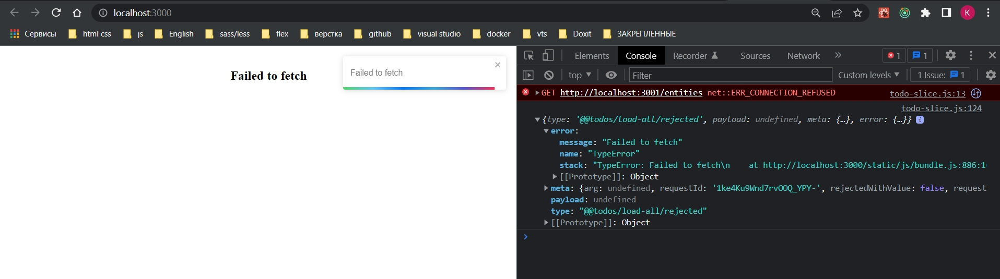

# 006_Обработка_ошибок

При работе с отловкой ошибок у нас есть два сценария поведения.

Во-первых если у нас случается ошибка, у нас в action есть некий объект ошибки. Посмотрим action.

И делаю url не правильным.

И вот он наш объект action в котором есть поле error. Этот error содержит message и даже stack ошибки. Мы можем это как то использовать в нашем приложении.

Разумеется мы можем это обработать и добавить в ошибку state.error

Таким образом мы можем выводить ошибки с сервера.

Нам еще важно что сдесь нет payload, его нам никто не вернул.

 
 
 

Альтернативный подход. Мы можем захотеть сами определить что за ошибка случилась и этой ошибкой как-то управлять. 

Для этого в createAsyncThunk, в функции которую м принимает вторым параметром, в качестве параметров, мы помним:

1. Первый параметр это то что мы получаем с нашего UI, 
2. А второй параметр это некий thunkAPI - это объект, и среди прочего в этом объекте есть метод который называется rejectWithValue

rejectWithValue это некая возможность, вручную генерировать ошибку.

Как оно будет себя вести?

Ну во-первых все наше тело в данной асинхронной функции нужно обернуть в конструкцию try catch.

Еще раз, метод rejectWithValue который достается с помощью деструктуризации из объекта thunkAPI, через try catch мы ловим ошибку, и при отлове этой ошибки мы можем пользователю показывать дружественное сообщение од ошибке. Если же мы в payload ничего не отлавливаем, то показываем ошибку с сервера.

