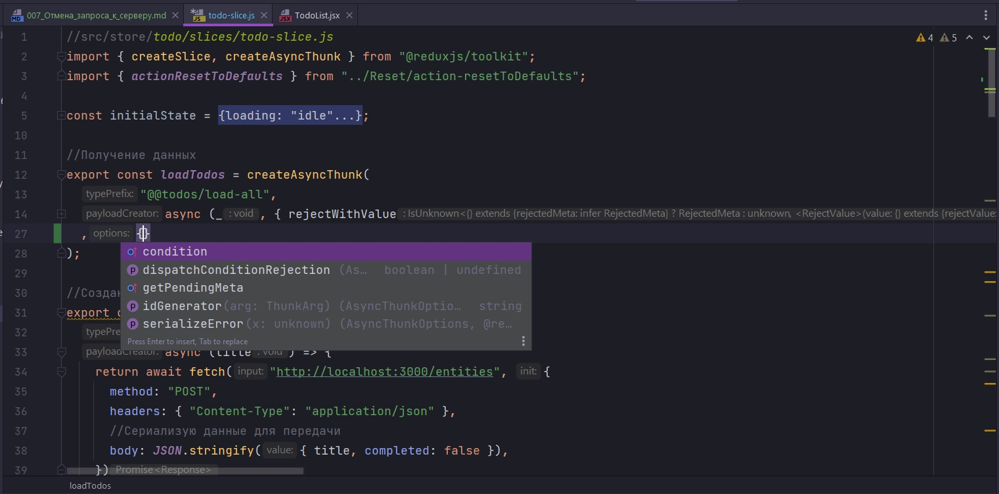
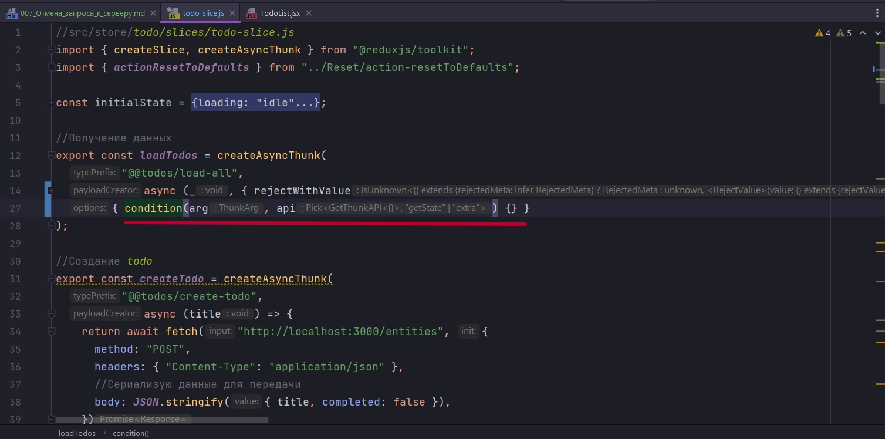
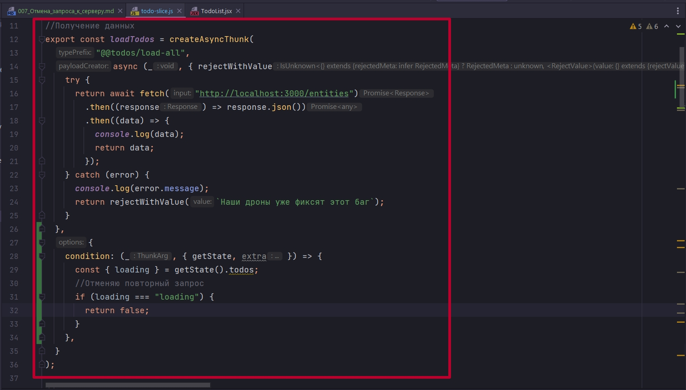
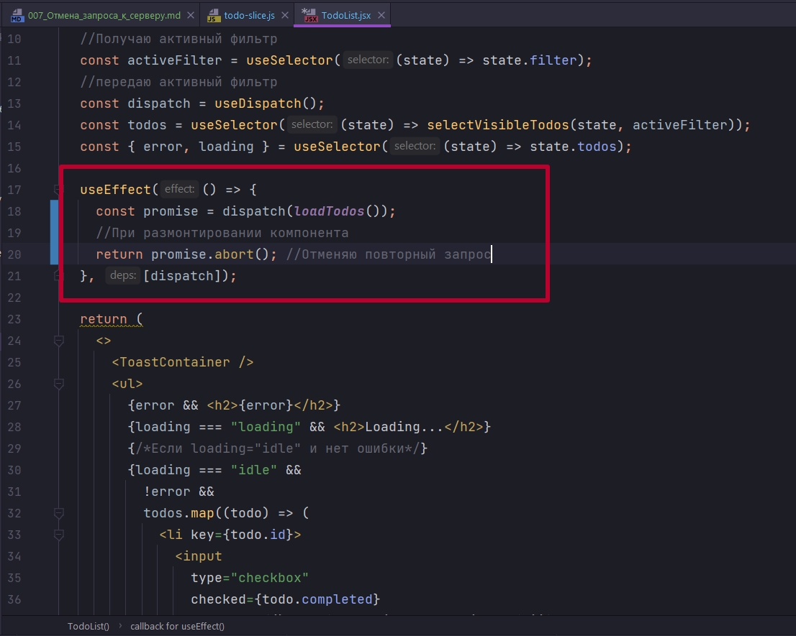

# 007_Отмена_запроса_к_серверу

Redux Toolkit дополнительно предоставляет нам инструменты для отмены запросов. Мы можем во-первых проверить выполняетсяли этот запрос уже, и не выполнять его второй раз.

А можем отменить запрос, если у нас пользователь вдруг покинул страницу т.е. если у нас размонтировался компонент что бы тот или иной запрос не выполнялся.

В случае если мы хотим проверить запущенли у на уже запрос, мы можем сделать примерно следующую штуку.

createAsyncThunk может принимать третий параметр. Это некие опции



Как видим опций всего пять.

Посмотрим на опцию condition. condition принимает некую функцию. Эта функция так же как и во втором параметре async функция, первым параметром принимает то что мы ожидает от UI, то может быть id, текст какой-то.

Вторым параметром мы принимаем некий объект. Там всего два ключа getState и extra.



У меня это будет стелочной функцией. getState как бы понятен, extra у нас как бы еще не существует, мы туда ничего не передаем. И вот в данном случае по этому condition мы хотим сделать проверку. Я хочу в состоянии getState() обратиться к своему списку todos и достать ключик loading.



Проверяю что если loading === "loading", то мне не нужно выполнять запрос указанный в функции которой я парадал вторым параметром, у меня он уже выполняеться. Это сценарий когда пользователь может послать два одновременно одинаковых запроса.

Если condition просто ничего не возвращает, то это опять же не воспрепятьсвует выполнению нашей асинхронной логики.

Опять же сценарии поведения могут быть разные, могут быть еще какие-то  проверки. Тем более что когда мы работаем с Toolkit у нас action помоми payload содержит еще некое поле meta. На досуге посмотри что в ней содержится. 

У нас например может быть еще какое-нибудь дополнительно поле в initialState. Поле к примеру изначально равно null. Но мы это поле можем перезаписывать допустим в момент запроса.


Что касается UI. У нас в функции useEffect мы можем использовать ключевое слово return и вернуть функцию. И в базовом варианте, когда мы ожидаем что useEffect у нас отработает всего один раз, то этот return отработает в момент размонтирования компонента. И мы можем захотеть отменить загрузку еще до того как мы получили ответ.

Наш запрос я могу сохранить в отдельную переменную. Сохраняю ее как promise, потому что она возвращает promise. И при размонтировании компонента я могу сказать что вызови метод abort. И тогда наш запрос будет остановлен. И опятьже определенные ресурсы на стороне пользователя будут съэкономлены.



Это два разных подхода. Первый в loadTodos

```js
//src/store/todo/slices/todo-slice.js
import { createSlice, createAsyncThunk } from "@reduxjs/toolkit";
import { actionResetToDefaults } from "../Reset/action-resetToDefaults";

const initialState = {
  entities: [],
  loading: "idle", //loading
  error: null,
};

//Получение данных
export const loadTodos = createAsyncThunk(
  "@@todos/load-all",
  async (_, { rejectWithValue }) => {
    try {
      return await fetch("http://localhost:3000/entities")
        .then((response) => response.json())
        .then((data) => {
          console.log(data);
          return data;
        });
    } catch (error) {
      console.log(error.message);
      return rejectWithValue(`Наши дроны уже фиксят этот баг`);
    }
  },
  {
    condition: (_, { getState, extra }) => {
      const { loading } = getState().todos;
      //Отменяю повторный запрос
      if (loading === "loading") {
        return false;
      }
    },
  }
);

//Создание todo
export const createTodo = createAsyncThunk(
  "@@todos/create-todo",
  async (title) => {
    return await fetch("http://localhost:3000/entities", {
      method: "POST",
      headers: { "Content-Type": "application/json" },
      //Сериализую данные для передачи
      body: JSON.stringify({ title, completed: false }),
    })
      .then((response) => response.json())
      .then((data) => data);
  }
);

// Удаление
export const removeTodo = createAsyncThunk(
  "@@todos/remove-todo",
  //Произвожу действия на сервере и преобразую полученный ответ
  async (id) => {
    await fetch(`http://localhost:3000/entities/${id}`, {
      method: "DELETE",
      headers: {
        "Content-type": "application/json",
      },
    }).then((response) => response.json);
    //в reducer в action.payload передаю полученный id с клиента
    return id;
  }
);

//Обновление
export const toggleTodo = createAsyncThunk(
  "@@todos/toggle-todo",
  async (id, { getState }) => {
    // Получаю нужный объект
    const todo = getState().todos.entities.find((todo) => todo.id === id);
    //Делаю запрос на сервер и указываю что в completed мне нужно сделать reverse
    return await fetch(`http://localhost:3000/entities/${id}`, {
      method: "PATCH",
      headers: {
        "Content-type": "application/json",
      },
      body: JSON.stringify({ completed: !todo.completed }),
    })
      .then((response) => response.json())
      .then((data) => {
        console.log(data);
        return data;
      });
  }
);

const todoSlice = createSlice({
  name: "@@todos",
  initialState,
  reducers: {},
  extraReducers: (builder) => {
    return builder
      .addCase(actionResetToDefaults, (state, action) => {
        state.entities = [];
      })
      .addCase(loadTodos.pending, (state, action) => {
        state.error = null;
      })
      .addCase(loadTodos.rejected, (state) => {
        state.error = "Something went wrong"; // простейший вариант
      })
      .addCase(loadTodos.fulfilled, (state, action) => {
        state.entities = action.payload;
      })
      .addCase(
        createTodo.fulfilled,
        (state, action) => void state.entities.push(action.payload)
      )
      .addCase(removeTodo.fulfilled, (state, action) => {
        //Объект на сервере уже удален,
        //Фильтрую массив в состоянии что бы ит туда удалить этот объект
        state.entities = state.entities.filter(
          (todo) => todo.id !== action.payload
        );
      })
      .addCase(toggleTodo.fulfilled, (state, action) => {
        //обновленный объект
        const updatedTodo = action.payload;

        //Получаю index объекта
        const index = state.entities.findIndex(
          (todo) => todo.id === updatedTodo.id
        );
        //Заменяю объект
        state.entities[index] = updatedTodo;
      })
      .addMatcher(
        (action) => action.type.endsWith("/pending"),
        (state, action) => {
          state.loading = "loading";
          state.error = null;
        }
      )
      .addMatcher(
        (action) => action.type.endsWith("/rejected"),
        (state, action) => {
          console.log(action);
          state.loading = "idle";
          state.error = action.payload || action.error.message;
        }
      )
      .addMatcher(
        (action) => action.type.endsWith("fulfilled"),
        (state, action) => {
          state.loading = "idle";
        }
      );
  },
});

export default todoSlice.reducer;

```

Второй непосредственно в самом компоненте

```js
import React, { useEffect } from "react";

import { useSelector, useDispatch } from "react-redux";
import { toggleTodo, removeTodo, loadTodos } from "./todo-slice";
import { selectVisibleTodos } from "./todo-selectors";
import { ToastContainer, toast } from "react-toastify";
import "react-toastify/dist/ReactToastify.css";

const TodoList = () => {
    //Получаю активный фильтр
    const activeFilter = useSelector((state) => state.filter);
    //передаю активный фильтр
    const dispatch = useDispatch();
    const todos = useSelector((state) => selectVisibleTodos(state, activeFilter));
    const { error, loading } = useSelector((state) => state.todos);

    useEffect(() => {
        const promise = dispatch(loadTodos());
        //При размонтировании компонента
        return () => promise.abort(); //Отменяю повторный запрос
    }, [dispatch]);

    return (
        <>
            <ToastContainer />
            <ul>
                {error && <h2>{error}</h2>}
                {loading === "loading" && <h2>Loading...</h2>}
                {/*Если loading="idle" и нет ошибки*/}
                {loading === "idle" &&
                    !error &&
                    todos.map((todo) => (
                        <li key={todo.id}>
                            <input
                                type="checkbox"
                                checked={todo.completed}
                                onChange={() => dispatch(toggleTodo(todo.id))}
                            />
                            {todo.id}: {todo.title}
                            <button onClick={() => dispatch(removeTodo(todo.id))}>
                                удалить
                            </button>
                        </li>
                    ))}
            </ul>
        </>
    );
};

export default TodoList;

```

