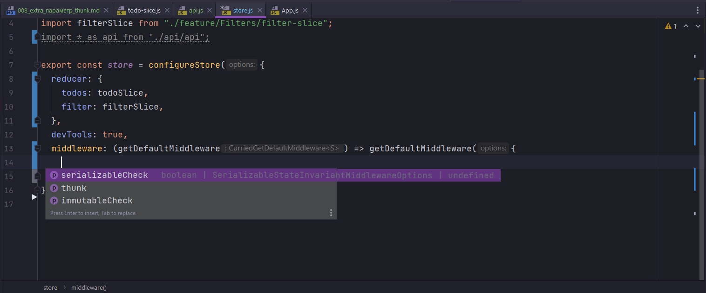
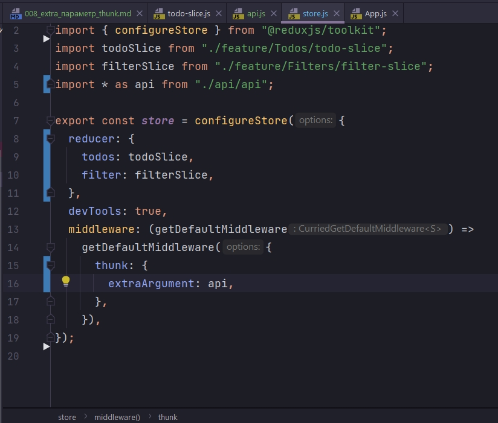

# 008_extra_параметр_thunk

Когда мы работали с библиотекой Redux Thunk мы передавали некий extra параметр. Некую абстакцию по работе с API которой было удобно пользоваться, вместо того что бы у нас было все захламлено в нашем коде.

То же самое нам позволяет и работа с createAsyncThunk. По этому выношу всю логику которая отвечает за логику fetch запросов.

И так написал новую асинхронную логику для всех четырех thunk. При этом пока не трогал старую логику. Внедряем так сказать все постепенно.

```js
//api/api.js

//Получение данных
export const loadTodos = async () => {
    return await fetch("http://localhost:3000/entities")
        .then((response) => response.json())
        .then((data) => {
            console.log(data);
            return data;
        });
};

//Создание todo
export const createTodo = async (title) => {
    return await fetch("http://localhost:3000/entities", {
        method: "POST",
        headers: { "Content-Type": "application/json" },
        //Сериализую данные для передачи
        body: JSON.stringify({ title, completed: false }),
    })
        .then((response) => response.json())
        .then((data) => data);
};

// Удаление
export const removeTodo = async (id) => {
    await fetch(`http://localhost:3000/entities/${id}`, {
        method: "DELETE",
        headers: {
            "Content-type": "application/json",
        },
    }).then((response) => response.json);
    //в reducer в action.payload передаю полученный id с клиента
    return id;
};

//Обновление
export const toggleTodo = async (id, fields) => {
    //Делаю запрос на сервер и указываю что в completed мне нужно сделать reverse
    return await fetch(`http://localhost:3000/entities/${id}`, {
        method: "PATCH",
        headers: {
            "Content-type": "application/json",
        },
        body: JSON.stringify(fields),
    })
        .then((response) => response.json())
        .then((data) => {
            console.log(data);
            return data;
        });
};

```

Теперь эту логику мы можем точно так же пробросить в extra параметр, и благополучно оттуда потреблять.

На уровне store мы импортируем все содержимое из нашего файла api. По ка что от persister избавлюсь.

```js
//src/store/store.js
import { configureStore } from "@reduxjs/toolkit";
import todoSlice from "./feature/Todos/todo-slice";
import filterSlice from "./feature/Filters/filter-slice";
import * as api from "./api/api";

export const store = configureStore({
  reducer: {
    todos: todoSlice,
    filter: filterSlice,
  },
  devTools: true,
});

```

И что бы пробросить api в extra параметр, мы должны обязательно писать middleware. Они не обязательны. даже если мы не прописываем middleware в момент создания store, работа thunk у нас все равно деступна. Но если мы хотим добавить extra параметр, то мы должны вернуть все дефолтные middleware, вспоминаю что getDefaultMiddleware это функция, в которую я передаю объект с настройками.



Среди настроек у нас есть Thunk. И для thunk мы можем сказать что вот тебе extraArgument и  он будет равен api



Опять же это может быть объект в нутри которого у нас несколько ключей.

```js
//src/store/store.js
import { configureStore } from "@reduxjs/toolkit";
import todoSlice from "./feature/Todos/todo-slice";
import filterSlice from "./feature/Filters/filter-slice";
import * as api from "./api/api";

export const store = configureStore({
  reducer: {
    todos: todoSlice,
    filter: filterSlice,
  },
  devTools: true,
  middleware: (getDefaultMiddleware) =>
    getDefaultMiddleware({
      thunk: {
        extraArgument: {
          api: api,
        },
      },
    }),
});

```

Сточки зрения потребления. Мы идем в наши slices. И в асинхронной функции как мы помним первый параметр это что то что мы передаем с UI. Второй параметр это некий объект, в котором есть тот самый ключ extra. 

По коду будет более понятно. Все отрефакторил.

```js
//src/store/todo/slices/todo-slice.js
import { createSlice, createAsyncThunk } from "@reduxjs/toolkit";
import { actionResetToDefaults } from "../Reset/action-resetToDefaults";

const initialState = {
  entities: [],
  loading: "idle", //loading
  error: null,
};

//Получение данных
export const loadTodos = createAsyncThunk(
  "@@todos/load-all",
  async (_, { rejectWithValue, extra }) => {
    try {
      return extra.api.loadTodos();
    } catch (error) {
      console.log(error.message);
      return rejectWithValue(`Наши дроны уже фиксят этот баг`);
    }
  },
  {
    condition: (_, { getState, extra }) => {
      const { loading } = getState().todos;
      //Отменяю повторный запрос
      if (loading === "loading") {
        return false;
      }
    },
  }
);

//Создание todo
export const createTodo = createAsyncThunk(
  "@@todos/create-todo",
  async (title, { rejectWithValue, extra }) => {
    try {
      return extra.api.createTodo(title);
    } catch (error) {
      return rejectWithValue(`Наши дроны уже фиксят этот баг`);
    }
  }
);

// Удаление
export const removeTodo = createAsyncThunk(
  "@@todos/remove-todo",
  //Произвожу действия на сервере и преобразую полученный ответ
  async (id, { rejectWithValue, extra }) => {
    try {
      return extra.api.removeTodo(id);
    } catch (e) {
      return rejectWithValue(`Наши дроны уже фиксят этот баг`);
    }
  }
);

//Обновление
export const toggleTodo = createAsyncThunk(
  "@@todos/toggle-todo",
  async (id, { getState, rejectWithValue, extra }) => {
    try {
      // Получаю нужный объект
      const todo = getState().todos.entities.find((todo) => todo.id === id);
      return extra.api.toggleTodo(id, { completed: !todo.completed });
    } catch (error) {
      return rejectWithValue(`Наши дроны уже фиксят этот баг`);
    }
  }
);

const todoSlice = createSlice({
  name: "@@todos",
  initialState,
  reducers: {},
  extraReducers: (builder) => {
    return builder
      .addCase(actionResetToDefaults, (state, action) => {
        state.entities = [];
      })
      .addCase(loadTodos.pending, (state, action) => {
        state.error = null;
      })
      .addCase(loadTodos.rejected, (state) => {
        state.error = "Something went wrong"; // простейший вариант
      })
      .addCase(loadTodos.fulfilled, (state, action) => {
        state.entities = action.payload;
      })
      .addCase(
        createTodo.fulfilled,
        (state, action) => void state.entities.push(action.payload)
      )
      .addCase(removeTodo.fulfilled, (state, action) => {
        //Объект на сервере уже удален,
        //Фильтрую массив в состоянии что бы ит туда удалить этот объект
        state.entities = state.entities.filter(
          (todo) => todo.id !== action.payload
        );
      })
      .addCase(toggleTodo.fulfilled, (state, action) => {
        //обновленный объект
        const updatedTodo = action.payload;

        //Получаю index объекта
        const index = state.entities.findIndex(
          (todo) => todo.id === updatedTodo.id
        );
        //Заменяю объект
        state.entities[index] = updatedTodo;
      })
      .addMatcher(
        (action) => action.type.endsWith("/pending"),
        (state, action) => {
          state.loading = "loading";
          state.error = null;
        }
      )
      .addMatcher(
        (action) => action.type.endsWith("/rejected"),
        (state, action) => {
          console.log(action);
          state.loading = "idle";
          state.error = action.payload || action.error.message;
        }
      )
      .addMatcher(
        (action) => action.type.endsWith("fulfilled"),
        (state, action) => {
          state.loading = "idle";
        }
      );
  },
});

export default todoSlice.reducer;

```


Все работает.
