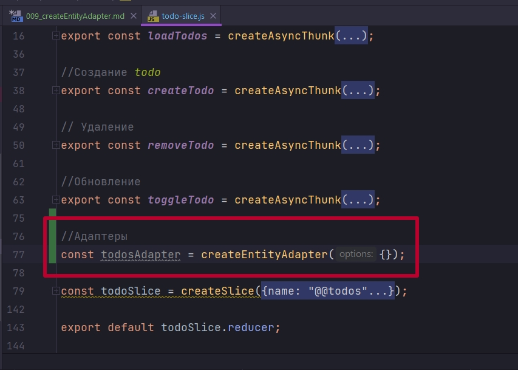
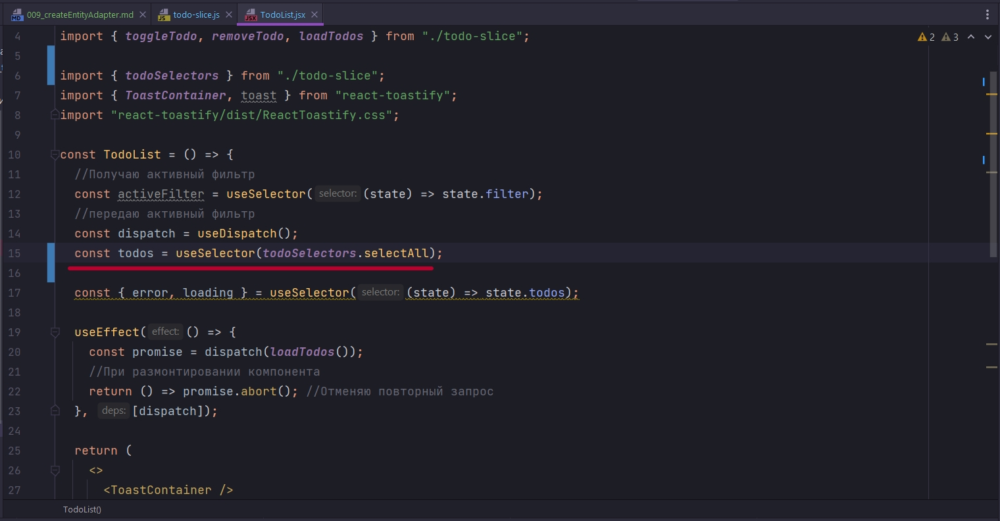
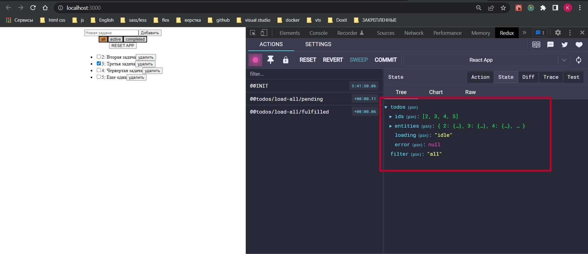

# 009_createEntityAdapter

createEntityAdapter позволяет вынести на уровень абстракции нашу работу с какими то сущностями. И эти сущности в нашес случае это todos будут обрабатываться адаптером.

Мы будем создавать некий todosAdapter



Он принимает некоторые настройки.


Как видим он принимает две настройки. Что бы понять что в нашем db.json, который мы используем как иммитацию сервера, за поле id отвечает вполне конкретное поле, с помощью selectId укази какое поле.


Второй вариант так же опциональный. Мы можем добавить функцию сортировки sortComparer, если мы хотим указать как именно мы хотим сортировать. Ну к примеру если мы хотим сортировать по title ф не по id.

Ну и как это будет использоваться? 

На момент создания нашего slice, мы будем подругому генерировать state. Теперь state будет равняться нашему todoAdapter и методу getInitialState.


И вообще вот сколько методов у todoAdapter.


Обращаясь к самому адаптеру мы можем добавлять много сущностей addMany, можем добавлять дну сущность addOne, получать getInitialState, получать getSelector, удалять все removeAll, удалять многое removeMany, удалять одно removeOne  т.д. Т.е. испозуя эти методы мы будем взаимодействовать с нашими сущностями.

В данном случае для создания state мы берем getInitialState, и это будет пустой массив, и если мы хотим еще какие-то значения добавить мы указываем их дополнительно через объект. Сам по себе todosAdapter.getInitialState вернет нам entities. По мимо этого  я хочу добавить ключик loading и error.


Ну и в дальнейшем в наших редюссерах я работаю не со state. Допустим в момент загрузки. Теперь ты не через state.entities должен работать, а через todosAdapter через его метод добавь многие addMany(), и уже в него я должен передать несколько настроек. Первым параметром передаю state. А вторым параметром я указываю что я в этот state должен положить.


Если же я хочу менять те параметры которые я указал в настройках getInitialState, то мы к ним образаемся по старинке через state. Адаптер заних ни как не отвечает. 

todosAdapter отвечает только за те сущности которыми он оперирует, в данном случае это todos. Соответственно мы ожидаем что он добавить туда массив.


Тоже самое и с одним элементом.


Встает вопрос как мы будем это все потреблять? 

Мы из slice будем возвращать не что, что называется selector. Создаю константу и экспортирую todosSelectors, присваиваю ей селекторые которые беру из todosAdapter по ключу getSelectors(). И сюда мы должны передать из какой ветки state мы должны искать те или иные значения.


И теперь посмотрим сколько методов для выборки предоставляет нам todoSelectors


И вот он нам предоставляет пять методов для выборки. selectAll выбрать все, selectById выбрать по id, selectEntities выбрать сущности, selectIds выбрать по id несколько сущностей, selectAll посчитать сколько всего у нас там храниться todos. 

```js
//src/store/todo/slices/todo-slice.js
import {
    createSlice,
    createAsyncThunk,
    createEntityAdapter,
} from "@reduxjs/toolkit";
import { actionResetToDefaults } from "../Reset/action-resetToDefaults";


//Получение данных
export const loadTodos = createAsyncThunk(
    "@@todos/load-all",
    async (_, { rejectWithValue, extra }) => {
        try {
            return extra.api.loadTodos();
        } catch (error) {
            console.log(error.message);
            return rejectWithValue(`Наши дроны уже фиксят этот баг`);
        }
    },
    {
        condition: (_, { getState, extra }) => {
            const { loading } = getState().todos;
            //Отменяю повторный запрос
            if (loading === "loading") {
                return false;
            }
        },
    }
);

//Создание todo
export const createTodo = createAsyncThunk(
    "@@todos/create-todo",
    async (title, { rejectWithValue, extra }) => {
        try {
            return extra.api.createTodo(title);
        } catch (error) {
            return rejectWithValue(`Наши дроны уже фиксят этот баг`);
        }
    }
);

// Удаление
export const removeTodo = createAsyncThunk(
    "@@todos/remove-todo",
    //Произвожу действия на сервере и преобразую полученный ответ
    async (id, { rejectWithValue, extra }) => {
        try {
            return extra.api.removeTodo(id);
        } catch (e) {
            return rejectWithValue(`Наши дроны уже фиксят этот баг`);
        }
    }
);

//Обновление
export const toggleTodo = createAsyncThunk(
    "@@todos/toggle-todo",
    async (id, { getState, rejectWithValue, extra }) => {
        try {
            // Получаю нужный объект
            const todo = getState().todos.entities.find((todo) => todo.id === id);
            return extra.api.toggleTodo(id, { completed: !todo.completed });
        } catch (error) {
            return rejectWithValue(`Наши дроны уже фиксят этот баг`);
        }
    }
);

//Адаптеры
const todosAdapter = createEntityAdapter({
    //Связываю с конретным полем id в API
    selectId: (todo) => todo.id,
});

const todoSlice = createSlice({
    name: "@@todos",

    initialState: todosAdapter.getInitialState({
        loading: "idle", //loading
        error: null,
    }),

    reducers: {},
    extraReducers: (builder) => {
        return builder
            .addCase(actionResetToDefaults, (state, action) => {
                state.entities = [];
            })
            .addCase(loadTodos.pending, (state, action) => {
                state.error = null;
            })
            .addCase(loadTodos.rejected, (state) => {
                state.error = "Something went wrong"; // простейший вариант
            })
            .addCase(loadTodos.fulfilled, (state, action) => {
                todosAdapter.addMany(state, action.payload);
                // state.entities = action.payload;
            })
            .addCase(
                createTodo.fulfilled,
                (state, action) => void todosAdapter.addOne(state, action.payload)
            )
            .addCase(removeTodo.fulfilled, (state, action) => {
                //Объект на сервере уже удален,
                //Фильтрую массив в состоянии что бы ит туда удалить этот объект
                state.entities = state.entities.filter(
                    (todo) => todo.id !== action.payload
                );
            })
            .addCase(toggleTodo.fulfilled, (state, action) => {
                //обновленный объект
                const updatedTodo = action.payload;

                //Получаю index объекта
                const index = state.entities.findIndex(
                    (todo) => todo.id === updatedTodo.id
                );
                //Заменяю объект
                state.entities[index] = updatedTodo;
            })
            .addMatcher(
                (action) => action.type.endsWith("/pending"),
                (state, action) => {
                    state.loading = "loading";
                    state.error = null;
                }
            )
            .addMatcher(
                (action) => action.type.endsWith("/rejected"),
                (state, action) => {
                    console.log(action);
                    state.loading = "idle";
                    state.error = action.payload || action.error.message;
                }
            )
            .addMatcher(
                (action) => action.type.endsWith("fulfilled"),
                (state, action) => {
                    state.loading = "idle";
                }
            );
    },
});

export const todoSelectors = todosAdapter.getSelectors((state) => state.todos);

export default todoSlice.reducer;

```

Наш selectVisibleTodos не сможет работать с этой штукой. И теперь в useSelector я вызываю todosSelectors.selectAll  выбираю все todos.





Как видим у нас теперь todos представяет собой ids массив просто id. И entities которые не являются массивом.


Это по сути у нас некая хеш таблица. Это объект, где ключ представляет собой тот самый id, а значение это уже все тело нашего объекта который мы ожидаем в массиве. СДЕСЬ НЕТ МАССИВОВ!!!!


По этому selectAll выбирает нам сущность приведенную к массиву, ту которую мы уже можем использовать в нашем UI. 

Если мы делаем selectEntities мы получаем такую структуру как в состоянии. И уже мапить ее обычным способом не получится. Соответственно если же мы потом ее сами руками приведем к массиву.

Опять же фильтры теперь не работают. Для того что бы фильтры работали нам нужно selectVisibleTodos использовать


Рас у нас поменялся подход, он у нас должен поменяться и в selectVisibleTodos


```js
export const allTodos = (state) => state.todos.entities;

export const selectVisibleTodos = (todos, filter) => {
  switch (filter) {
    case "all": {
      return todos;
    }
    case "active": {
      return todos.filter((todo) => !todo.completed);
    }
    case "completed": {
      return todos.filter((todo) => todo.completed);
    }
    default: {
      return todos;
    }
  }
};

```


Исправлю дальше.