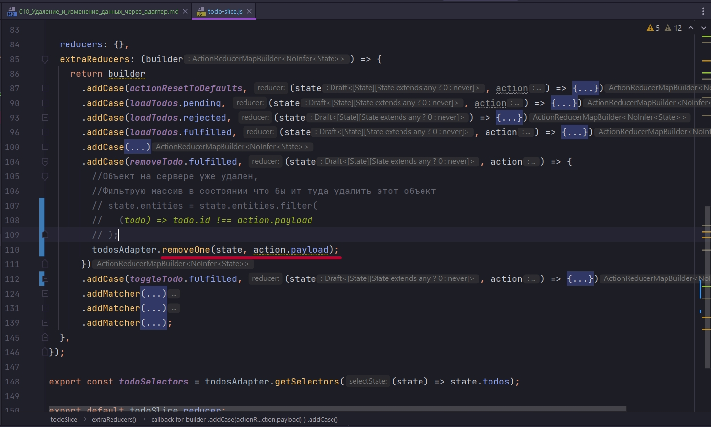

# 010_Удаление_и_изменение_данных_через_адаптер

Мы начали внедрять подход работы с адаптером todosAdapter который мы получили с помощью createEntityAdapter. И значит что все наши попытки работать с добавлением, изменением и удалением конкретных todos должны происходить черех этот адаптер. 

По этому нам нужно все это дело переписать.

Теперь при обновлении я говорб что я вызываю todosAdapter и говорю что я хочу обновить одну конкретную сущность todosAdapter.updateOne() снова туда мы должны передать state,  вторым параметром мы должны уточнить что именно мы хотим изменить. В данном случае мы передаем некий объект, мы говорим что мы хотим изменить сущность у которой конкретный id.


Закоментированные значения это то что нам уже не нужно. Соответственно нам не нужно искать index. НАМ ТЕМ БОЛЕЕ НЕ НУЖНО МУТИРОВАТЬ НАПРЯМУЮ state.entities[index] = updatedTodo; 

Мы просто в payload получили значение и точно сказали что измени одну сущность.


то же самое касается remove.



Вторым параметром указываю id который у нас храниться в action.payload.

Как раз таки по этому action.payload мы делали фильтрацию. Сдесь, нам фильтрация не нужна, нам не нужно перебирать целый массив, наш todosAdapter сделает все сам.

Мы видили что все данные храняться в хэш таблице. Он по этому id найдет нужный элемент и удалит его. Эта операция будет быстрее чем удаление из массива.

И теперь остается починить наши thunk.

Раньше мы обрабатывали массив,


А теперь мы работаем с объектом. Теперь мне не нужно искать значение в массиве, мне нужно просто передать id как параменную.


Приложение стало намного быстрее, за счет того что нам не нужно перебирать массивы. 

Сдесь главное помнить что адаптер создается, и далее все операции над этой сущностью, slice, идут через адаптер. Либо если мы работаем через выборку, мы можем из хеш таблицы, по id информацию оттуда доставать.

На первых этапах сложностью может оказаться работа с селекторами

```js
//src/store/todo/slices/todo-slice.js
import {
  createSlice,
  createAsyncThunk,
  createEntityAdapter,
} from "@reduxjs/toolkit";
import { actionResetToDefaults } from "../Reset/action-resetToDefaults";

//Получение данных
export const loadTodos = createAsyncThunk(
  "@@todos/load-all",
  async (_, { rejectWithValue, extra }) => {
    try {
      return extra.api.loadTodos();
    } catch (error) {
      console.log(error.message);
      return rejectWithValue(`Наши дроны уже фиксят этот баг`);
    }
  },
  {
    condition: (_, { getState, extra }) => {
      const { loading } = getState().todos;
      //Отменяю повторный запрос
      if (loading === "loading") {
        return false;
      }
    },
  }
);

//Создание todo
export const createTodo = createAsyncThunk(
  "@@todos/create-todo",
  async (title, { rejectWithValue, extra }) => {
    try {
      return extra.api.createTodo(title);
    } catch (error) {
      return rejectWithValue(`Наши дроны уже фиксят этот баг`);
    }
  }
);

// Удаление
export const removeTodo = createAsyncThunk(
  "@@todos/remove-todo",
  //Произвожу действия на сервере и преобразую полученный ответ
  async (id, { rejectWithValue, extra }) => {
    try {
      return extra.api.removeTodo(id);
    } catch (e) {
      return rejectWithValue(`Наши дроны уже фиксят этот баг`);
    }
  }
);

//Обновление
export const toggleTodo = createAsyncThunk(
  "@@todos/toggle-todo",
  async (id, { getState, rejectWithValue, extra }) => {
    try {
      // Получаю нужный объект
      const todo = getState().todos.entities[id];
      return extra.api.toggleTodo(id, { completed: !todo.completed });
    } catch (error) {
      return rejectWithValue(`Наши дроны уже фиксят этот баг`);
    }
  }
);

//Адаптеры
const todosAdapter = createEntityAdapter({
  //Связываю с конретным полем id в API
  selectId: (todo) => todo.id,
});

const todoSlice = createSlice({
  name: "@@todos",

  initialState: todosAdapter.getInitialState({
    loading: "idle", //loading
    error: null,
  }),

  reducers: {},
  extraReducers: (builder) => {
    return builder
      .addCase(actionResetToDefaults, (state, action) => {
        state.entities = [];
      })
      .addCase(loadTodos.pending, (state, action) => {
        state.error = null;
      })
      .addCase(loadTodos.rejected, (state) => {
        state.error = "Something went wrong"; // простейший вариант
      })
      .addCase(loadTodos.fulfilled, (state, action) => {
        todosAdapter.addMany(state, action.payload);
        // state.entities = action.payload;
      })
      .addCase(
        createTodo.fulfilled,
        (state, action) => void todosAdapter.addOne(state, action.payload)
      )
      .addCase(removeTodo.fulfilled, (state, action) => {
        //Объект на сервере уже удален,
        todosAdapter.removeOne(state, action.payload);
      })
      .addCase(toggleTodo.fulfilled, (state, action) => {
        //обновленный объект
        const updatedTodo = action.payload;

        todosAdapter.updateOne(state, {
          id: updatedTodo.id, //Указываю id
          // Далее говорю что я хочу поменять
          changes: {
            completed: updatedTodo.completed,
          },
        });
      })

      .addMatcher(
        (action) => action.type.endsWith("/rejected"),
        (state, action) => {
          console.log(action);
          state.loading = "idle";
          state.error = action.payload || action.error.message;
        }
      )
      .addMatcher(
        (action) => action.type.endsWith("fulfilled"),
        (state, action) => {
          state.loading = "idle";
        }
      );
  },
});

export const todoSelectors = todosAdapter.getSelectors((state) => state.todos);

export default todoSlice.reducer;

```


