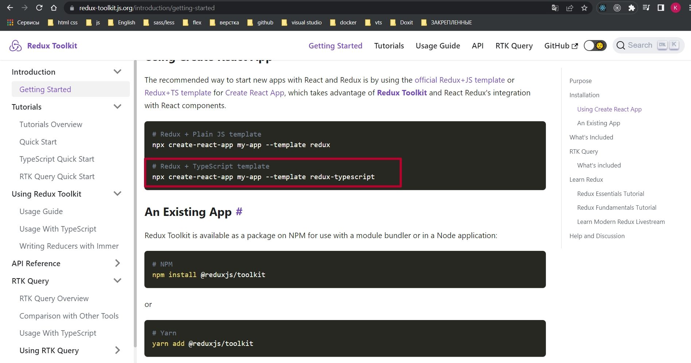
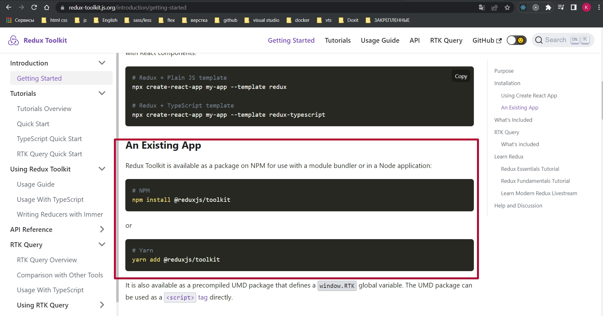
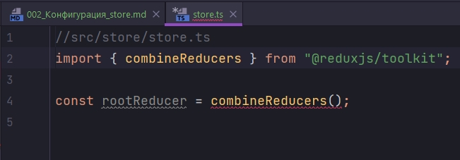
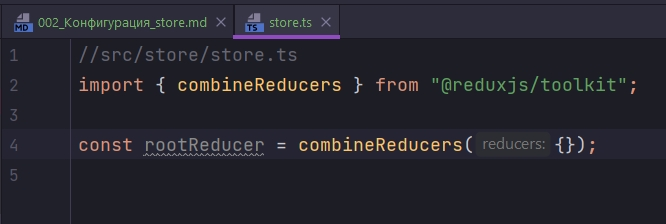
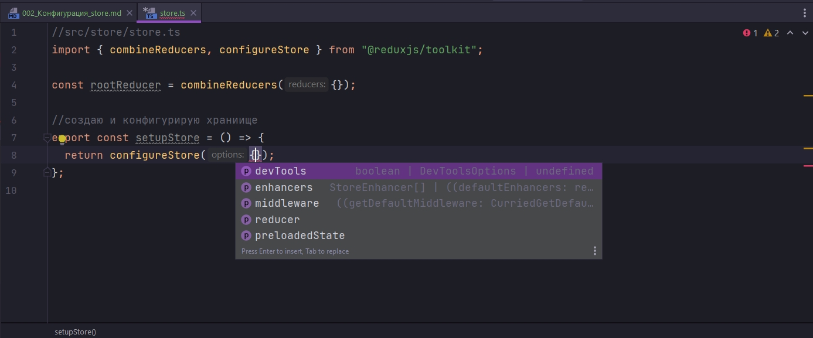
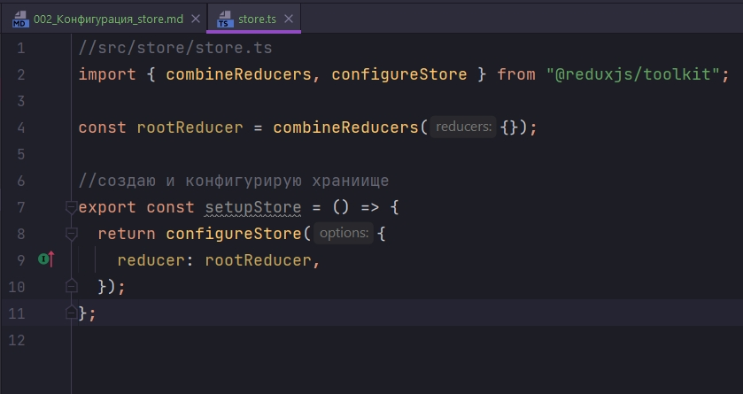

# 002_Конфигурация_store

```shell
npx create-react-app . --template typescript
```

Создаю пустое приложение с минимальными стилями. App.css

```css
.post__list {
    width: 100%;
    padding: 20px;
}

.user {
    padding: 20px;
    border: 1px solid orange;
    margin-top: 15px;
    width: 100%;
    display: flex;
    justify-content: space-between;
}

.w100 {
    width: 100%;
}

.post {
    padding: 20px;
    border: 1px solid teal;
    margin-top: 15px;
    width: 100%;
    display: flex;
    justify-content: space-between;
}
```

В первую очередь начнем с того что подключим Redux Toolkit к нашему проекту.

Есть примеры для того что бы сразу развернуть приложение с подключенным Redux Toolkit



А можно установить его через npm или yarn отдельно.



```shell
npm install @reduxjs/toolkit react-redux @types/react-redux
```

Создадим файловую структуру для нашего store. Создаю дирректорию store, в ней store.ts. И внутри дирректории store создаю дирректорию reducers.

Теперь займемся конфигурацией store. Первое что мы сделаем это создает корневой reducer. Обратите внимание что по умолчанию в Redux вы используете функцию combineReducers для того то бы объеденить все reducers в один.



В Redux Toolkit это делать не обязательно. В качестве корневого редюсера можно использовать просто объект.

Но мы будем использовать combineReducers.



Следующим этапом создадим функцию. Назовем ее setupStore и внутри нее мы будем конфигурировать наше Redux хранилище. 

Без использования Toolkit, для создания store мы использовали функцию createStore.

В данном случае мы используем функцию configureStore которую импортируем из redux-toolkit



Опции здесь мы передаем те же самые devTools, middleware, reducer. Мы с этим должны быть знакомы.

Сразу хочется отметить что когда мы используем Redux Toolkit у нас нет нужды подключать инструменты разработчика Redux для отладки. И так же нет нужды подключать Redux Thunk middleware поскольку все это идет уже из коробки.

Следующим шагом мы указываем в configureStore наш корневой rootReducer.



Затем нам понадобятся некоторые типы с помощью которых мы будем с нашим хранилищем взаимодействовать.

В первую очередь нам нужно получить тип нашего состояния. Его можно получить либо из редюсера rootReducer, либо напрямую из самого хранилища setupStore.

Так же получим тип самого setupStore. С помощью ReturnType мы можем получить тот тип который вернет нам функция setupStore.

И так же получу тип самого диспатча нашего хранилища. Определив тип dispatch мы не сможем задиспатчить те экшены которые мы не определили.

```ts
//src/store/store.ts
import { combineReducers, configureStore } from "@reduxjs/toolkit";

const rootReducer = combineReducers({});

//создаю и конфигурирую храниище
export const setupStore = () => {
  return configureStore({
    reducer: rootReducer,
  });
};

//Типы для взаимодействия с хранилищем
export type RootState = ReturnType<typeof rootReducer>;
export type AppStore = ReturnType<typeof setupStore>;
export type AppDispatch = AppStore["dispatch"];

```

RootState, AppStore, AppDispatch это три базовых типа которые нам вдальнейшем в работе понадобятся.

Оборачиваю приложение в Provider

```tsx
import React from "react";
import ReactDOM from "react-dom/client";
import App from "./App";
import { Provider } from "react-redux";
import { setupStore } from "./store/store";

//создаю хранилище
const store = setupStore();

const root = ReactDOM.createRoot(
  document.getElementById("root") as HTMLElement
);
root.render(
  <Provider store={store}>
    <App />
  </Provider>
);

```
