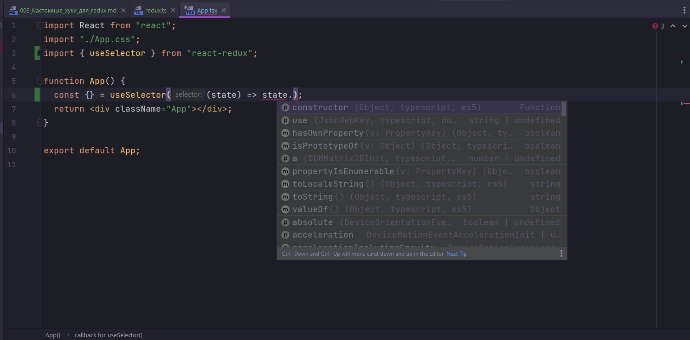

# 003_Кастомные_хуки_для_redux

Создаю дирректорию hooks в дирректории src. И в дирретории hooks созаю файл redux.ts.

Первым создаю хук useAppDispatch. По сути это обычный useDispatch который возвращает нам dispatch, но здесь у нас будет типизация. В useDispatch в generic указываю AppDispatch.

Затем создадим еще один хук useAppSelector. Сдесь делаем все по аналогии. Это будет обычный useSelector, но типизирванный. Для его типизации использую специальный тип TypedUseSelectorHook в generic которого передаю RootState который мы получали в файле store.ts.

```ts
//src/hooks/redux.ts
import { TypedUseSelectorHook, useDispatch, useSelector } from "react-redux";
import { AppDispatch, RootState } from "../store/store";

export const useAppDispatch = () => useDispatch<AppDispatch>();
export const useAppSelector: TypedUseSelectorHook<RootState> = useSelector;

```

Если в компоненте мы воспользуемся обычным useSelector, то мы не будем знать какого типа у нас state.



В данном случае мы не знаем какого типа у нас state, не знаем какие у нас есть редюссеры, не знаем какие поля есть в состоянии каждого редюссера.

Но при использовании типизированного useAppSelector мы знаем какой у нас там находится тип. И будут подхватываться все редюссеры и все поля в этих редюссерах.


Пока что это посмотреть нельзя потому что мы не один reducer еще не сделали.