# 004_Redux_toolkit_slice

В Redux reducer по сути просто чистая функция которая принимает state, action. И в зависимости от action как то изменяет state, и возвращает его нам в обновленном виде.

В Redux Toolkit есть так называемые slice. Это некоторая обертка над редюссерами, которая добавляет дополнительный функционал и упрощает работу. 

Создаю в reducers UserSlice.ts

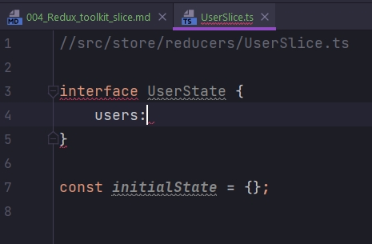


Сейчас попробуем с этим поработать. Но в первую очередь нам необходимо state типизировать, что бы изначально определить какие поля, какого типа у нас будут. Работать мы будем со списком пользователей, по этому сделаем interface в котором опишем какие поля у каждого пользователя у нас будут.

В src создаю дирректорию models и в ней IUser.ts

```ts
//src/models/IUser.ts
export interface IUser {
  id: number;
  name: string;
  email: string;
}

```

Теперь в UserSlice.ts указываю что reducer у нас будет работать с состоянием userState. Там будет поле users - это как раз массив пользователей

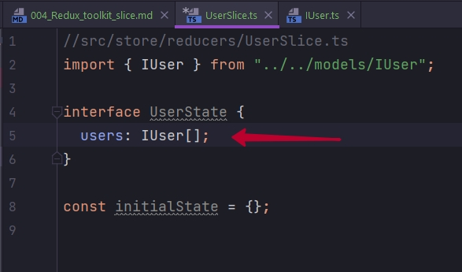

поле isLoading: boolean типа и error типа string. Там мы будем хранить сообщение с ошибкой если она вдруг произошла.

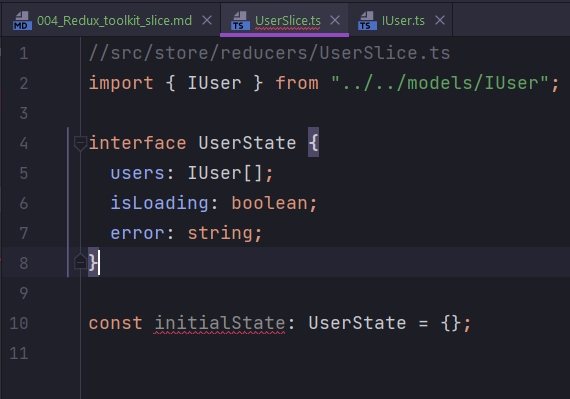

Теперь создаю объект состояния initialState, указываю что он будет типа UserState. И это будет дефолтное состояние в данном reducer. users инициализирую пустым массивом, isLoading: это у нас false, и error пустое сообщение.

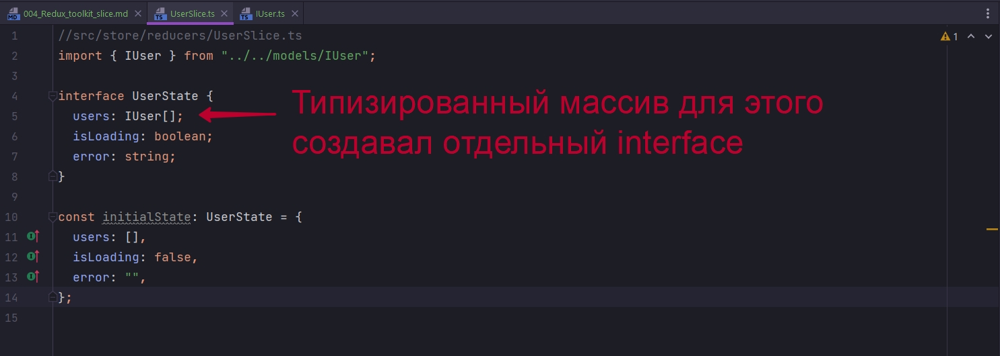

Теперь создадим сам reducer. Или как я уже сказал в контексте Redux Toolkit подобные редюссеры называются slice. Создаются они с помощью специальной функции createSlice. 

createSlice принимает параметром объект с опциями. 

* У каждого такого slice должно быть уникальное название name, в данном случае можно оставить просто user. 

* initialState мы передаем дефолтное состояние. 

* И так же есть поле reducers.

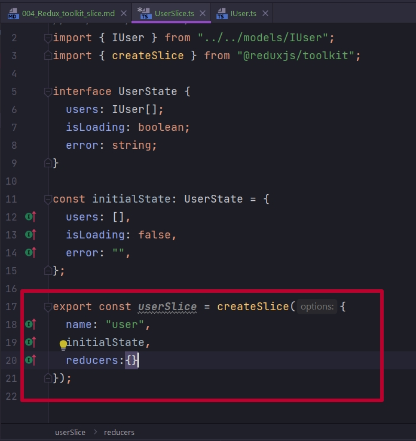

Поле reducers аналогично конструкции switch case которое мы используем в обычном reducer, т.е. каждый case идет как отдельный reducer. И внутри него мы будем определять как мы изменим наше состояние.

После создания slice мы можем вытащить из него отдельно reducer и отдельно action creator.

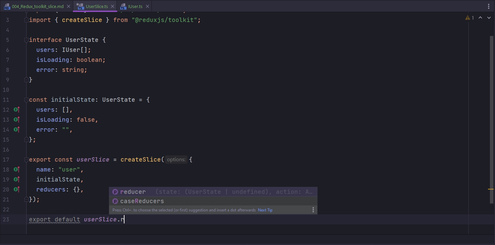

```ts
//src/store/reducers/UserSlice.ts
import { IUser } from "../../models/IUser";
import { createSlice } from "@reduxjs/toolkit";

interface UserState {
  users: IUser[];
  isLoading: boolean;
  error: string;
}

const initialState: UserState = {
  users: [],
  isLoading: false,
  error: "",
};

export const userSlice = createSlice({
  name: "user",
  initialState,
  reducers: {},
});

export default userSlice.reducer;

```

Откроем store.ts где мы создавали rootReducer и сюда передадим userReducer.

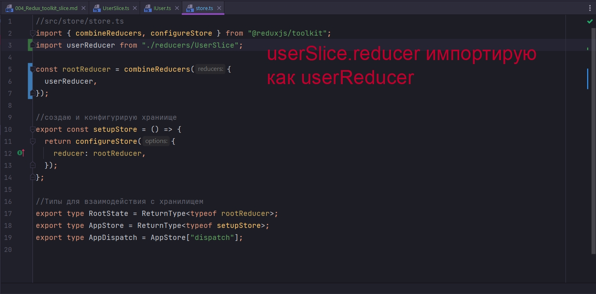

```ts
//src/store/store.ts
import { combineReducers, configureStore } from "@reduxjs/toolkit";
import userReducer from "./reducers/UserSlice";

const rootReducer = combineReducers({
  userReducer,
});

//создаю и конфигурирую храниище
export const setupStore = () => {
  return configureStore({
    reducer: rootReducer,
  });
};

//Типы для взаимодействия с хранилищем
export type RootState = ReturnType<typeof rootReducer>;
export type AppStore = ReturnType<typeof setupStore>;
export type AppDispatch = AppStore["dispatch"];

```

После этого мы вернемся к компоненту  и попробуем к этому редюссеру обратиться и вытащить какие-нибудь поля из state.

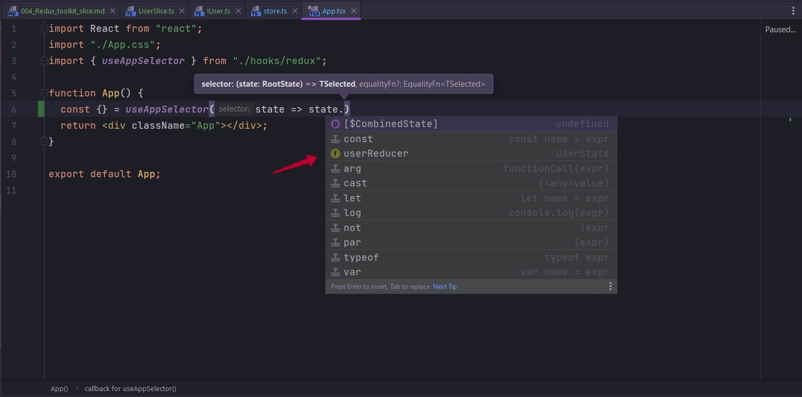

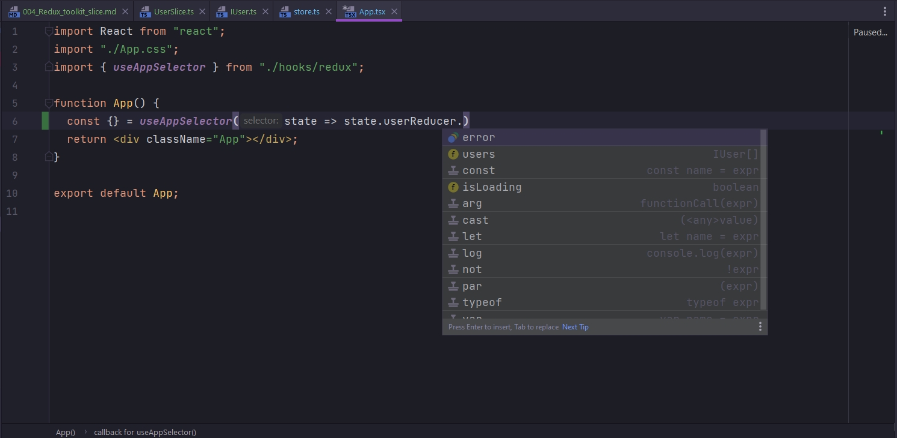


Теперь сделаем самый класический пример со счетчиком. Добавим в состояние поле count и проинициализируем его по дефолту нулем.

И как я уже сказал внутри поля reducers мы создаем функции, в нутри которых как то изменяем состояние. Такие функции аргументом принимают сам state и некоторый action т.е. все как в обычном reducer. И payload экшена мы можем сразу типизировать вот таким вот образом.

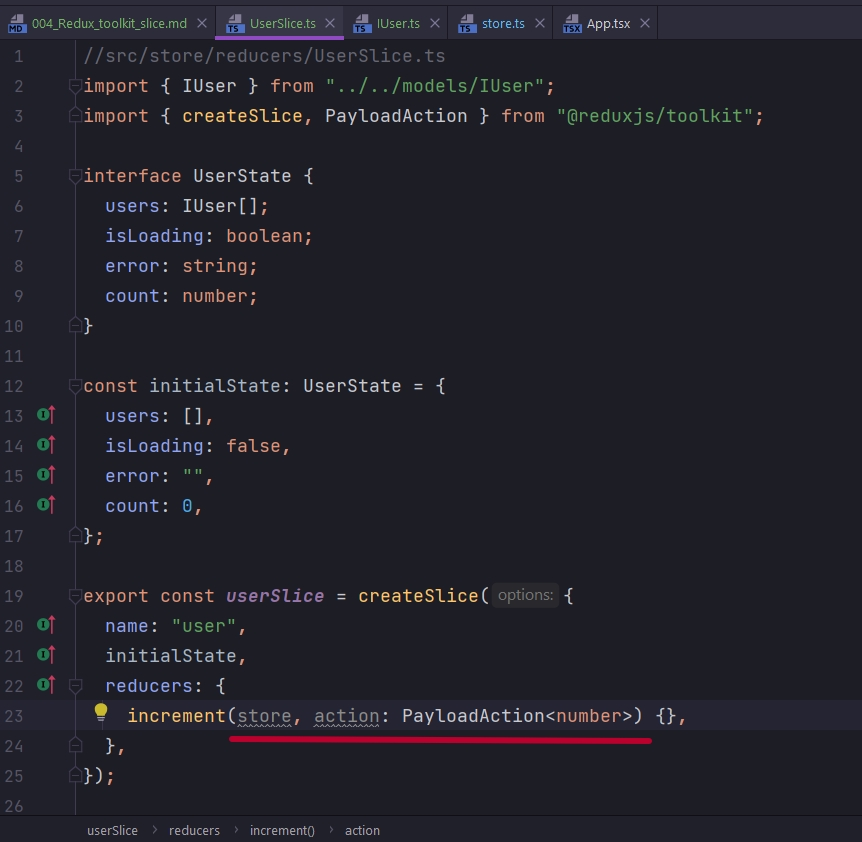

И перед тем как двигаться дальше рассмотрим вот такой пример.

```
Redux без TOOLKIT

return { ...state, field: action.payload }

```

Redux пропагандирует иммутабельный подход. Reducer - это чистая функция и каждый раз она должна возвращать новое состояние. Т.е. мы возвращаем новый объект, в него разворачиваем старое состояние и изменяем какое-то поле у этого объекта.

Redux Toolkit

```
Redux Toolkit

state.field = action.payload

```

Redux Toolkit наоборот, мы можем взять и изменить конкретное поле у состояния.

Подобного поведения можно добится использую библиотеку immer.js <https://www.npmjs.com/package/immer>

Но в Redux Toolkit она идет опять же под капотом.

И еще один пример в котором можно четко заметить удобство

```
Redux без TOOLKIT

return { ...state, object:{ ...state.object, field:action.payload} }


Redux Toolkit

state.object.field = action.payload

```

Возвращаюсь к нашему reducer и изменю значение счетчика. В state.count приплюсовываю то что нам пришло в поле action.payload

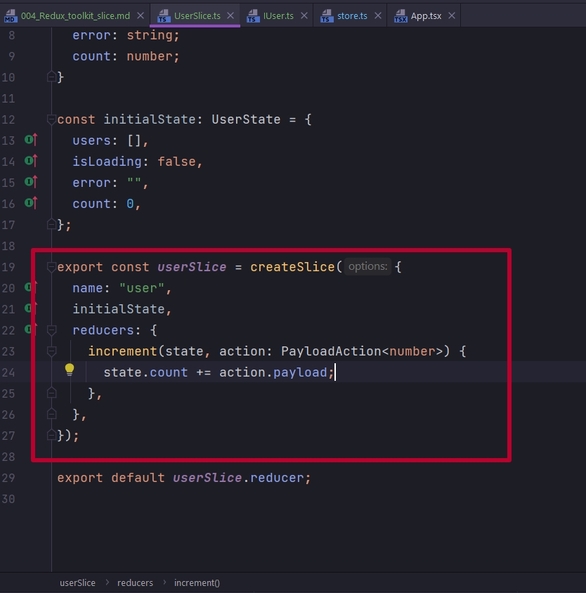

```ts
//src/store/reducers/UserSlice.ts
import { IUser } from "../../models/IUser";
import { createSlice, PayloadAction } from "@reduxjs/toolkit";

interface UserState {
  users: IUser[];
  isLoading: boolean;
  error: string;
  count: number;
}

const initialState: UserState = {
  users: [],
  isLoading: false,
  error: "",
  count: 0,
};

export const userSlice = createSlice({
  name: "user",
  initialState,
  reducers: {
    increment(state, action: PayloadAction<number>) {
      state.count += action.payload;
    },
  },
});

export default userSlice.reducer;

```

Перейдем в компонент App. Как я говорил userSlice содержит в себе actions creators и reducer. Соответственно action creator можно деструктурировать

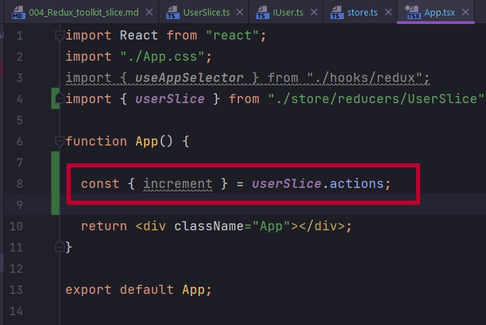


Т.е. ни actions ни action creators ни типы для action мы не создаем вручную. Все за нас в даннм случае делает Redux Toolkit. Нам остается созданный, с помощью Redux Toolkit action creator только задиспатчить.

```tsx
import React from "react";
import "./App.css";
import { useAppDispatch, useAppSelector } from "./hooks/redux";
import { userSlice } from "./store/reducers/UserSlice";

function App() {
    const { count } = useAppSelector((state) => state.userReducer);
    const { increment } = userSlice.actions;
    const dispatch = useAppDispatch();

    console.log(count);

    return (
        <div className="App">
            <h1>{count}</h1>
            <button onClick={() => dispatch(increment(1))}>INCREMENT</button>
        </div>
    );
}

export default App;

```

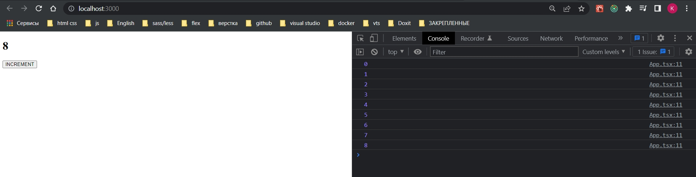

Это был вводный базовый пример для того что бы люди которые не знакомы с Redux Toolkit в целом оценили что это такое и поняли как с этим работать


