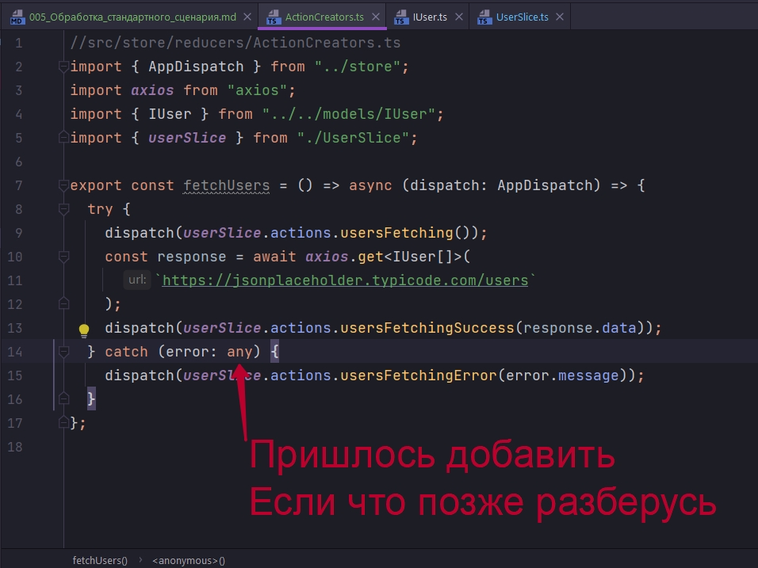
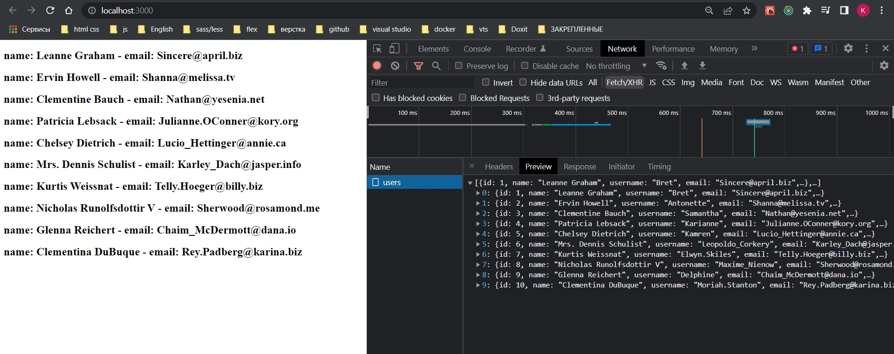

# 005_Обработка_стандартного_сценария

Теперь рассмотрим часто встречающийся case который приходится обрабатывать это получение каких то данных, обработка ошибки и обработка загрузки этих данных.

Получение данных  от сервера это асинхронный процесс по этому нам понадобится сделать асинхронный action creator.

По класике асинхронные экшены создаются с помощью middleware Redux Thunk. В Redux Toolkit Redux Thunk идет уже под капотом и по этому его вручную подключать не надо.

В reducers создаю ActionCreator.ts. И в нем создаю фунцию fetchUsers. Для того что бы этим функционалом пользоваться мы из action creator не возвращаем сразу action, а мы возвращаем другую функцию которая аргументом принимает dispatch.


И уже из этой функции мы будем производить какие-то асинхронные действия.

Получать данные мы будем от сервиса <https://jsonplaceholder.typicode.com/>

Для запросов будем использовать axios.

```shell
npm install axios
```
Делаю запрос. И так же с помощью интерфейса IUser[] указываю в generic что я буду ожидать в поле data у response.


Т.е. я ожидаю вот эти поля

```ts
//src/models/IUser.ts
export interface IUser {
  id: number;
  name: string;
  email: string;
}

```

```ts
//src/store/reducers/ActionCreators.ts
import { AppDispatch } from "../store";
import axios from "axios";
import { IUser } from "../../models/IUser";

export const fetchUsers = () => async (dispatch: AppDispatch) => {
  try {
    const response = await axios.get<IUser[]>(
      `https://jsonplaceholder.typicode.com/users`
    );
  } catch (error) {}
};

```

Теперь нам необходимо указать некоторые редюссеры с помощью которых мы будем менять state.

Создаем первый такой редюсер usersFetching(){}, принимает state, action. И он будет вызываться в тот момент когда мы начинаем подгрузку пользователей.

И так же создадим еще два подобный редюссера usersFetchingSuccess и usersFetchingError.

И так по коду больше понятнее нежели я буду словесно описывать.


```ts
//src/store/reducers/UserSlice.ts
import { IUser } from "../../models/IUser";
import { createSlice, PayloadAction } from "@reduxjs/toolkit";

interface UserState {
  users: IUser[];
  isLoading: boolean;
  error: string;
}

const initialState: UserState = {
  users: [],
  isLoading: false,
  error: "",
};

export const userSlice = createSlice({
  name: "user",
  initialState,
  reducers: {
    //Начало запроса
    usersFetching(state) {
      state.isLoading = true;
    },
    //Запрос пошел успешно
    usersFetchingSuccess(state, action: PayloadAction<IUser[]>) {
      state.isLoading = false;
      state.error = "";
      state.users = action.payload;
    },
    //запрос вернул ошибку
    usersFetchingError(state, action: PayloadAction<string>) {
      state.isLoading = false;
      state.error = action.payload;
    },
  },
});

export default userSlice.reducer;

```

Вот эти три сценария самые распостраненные, когда мы делаем запрос на сервер. Не важно, с созданием, обновлением, или получением каких то данных. Нам необходимо обработать три ситуации. Это сам запрос, индикация его загрузки, и обработка ошибки.

Как я говорил slice создает для нас action creators по этому мы можем их сразу же задиспатчить.



У него предупреждений нет

```ts
//src/store/reducers/ActionCreators.ts
import { AppDispatch } from "../store";
import axios from "axios";
import { IUser } from "../../models/IUser";
import { userSlice } from "./UserSlice";

export const fetchUsers = () => async (dispatch: AppDispatch) => {
    try {
        dispatch(userSlice.actions.usersFetching());
        const response = await axios.get<IUser[]>(
            `https://jsonplaceholder.typicode.com/users`
        );
        dispatch(userSlice.actions.usersFetchingSuccess(response.data));
    } catch (error: any) {
        dispatch(userSlice.actions.usersFetchingError(error.message));
    }
};

```

Теперь возвращаюсь в компонент App и реализовываю этот функционал.

```tsx
import React, { useEffect } from "react";
import "./App.css";
import { useAppDispatch, useAppSelector } from "./hooks/redux";
import { fetchUsers } from "./store/reducers/ActionCreators";

function App() {
  const dispatch = useAppDispatch();
  const { users, isLoading, error } = useAppSelector(
    (state) => state.userReducer
  );

  useEffect(() => {
    dispatch(fetchUsers());
  }, []);

  return (
    <div className="App">
      {isLoading && <h1>Идет загрузка...</h1>}
      {error && <h1>{error}</h1>}
      {users.map((user) => (
        <div>
          <h2>
            name: {user.name} - email: {user.email}
          </h2>
        </div>
      ))}
    </div>
  );
}

export default App;

```




Ошибки


<br/>
<br/>
<br/>

Redux Toolkit позволяет немного упростить обработку этих сценариев.

Для того что бы использовать Redux Thunk мы создавали функцию которая аргументом принимает dispatch, и возвращает другую функцию.

Теперь мы можем воспользоваться специальной надстройкой, функцией createAsyncThunk которая сделает это за нас.

Первым аргументом мы указываем название этого асинхронного thunk 'user/fetchAll'.

А вторым аргументом передаем уже сам callback внутри которого мы будем как раз реализовывать какие-то действия. В нашем случае мы должны отправить запрос и вернуть какие то данные.


и теперь возникает вполне резонный вопрос. Мы ничего не диспатчили. Как Redux узнает какие данные и куда ему их помещать?

Для этого есть специальное поле внутри slice которое называется 


И давайте посмотрим как с этим работать. Когда мы используем createAsyncThunk для нас создается уже три состояния pending, rejected и fulfilled. Как раз те три сценария которые мы обрабатывали сами вручную.

```ts
//src/store/reducers/UserSlice.ts
import { IUser } from "../../models/IUser";
import { createSlice, PayloadAction } from "@reduxjs/toolkit";
import { fetchUsers } from "./ActionCreators";

interface UserState {
  users: IUser[];
  isLoading: boolean;
  error: string;
}

const initialState: UserState = {
  users: [],
  isLoading: false,
  error: "",
};

export const userSlice = createSlice({
  name: "user",
  initialState,
  reducers: {},
  extraReducers: {
    //Ожидание загрузки
    [fetchUsers.pending.type]: (state) => {
      state.isLoading = true;
    },
    //Успешная загрузка
    [fetchUsers.fulfilled.type]: (state, action: PayloadAction<IUser[]>) => {
      state.isLoading = false;
      state.error = "";
      state.users = action.payload;
    },

    // Ошибка загрузки
    [fetchUsers.rejected.type]: (state, action: PayloadAction<string>) => {
      state.isLoading = false;
      state.error = action.payload;
    },
  },
});

export default userSlice.reducer;

```

```ts
//src/store/reducers/ActionCreators.ts
import axios from "axios";
import { IUser } from "../../models/IUser";
import { createAsyncThunk } from "@reduxjs/toolkit";

export const fetchUsers = createAsyncThunk("user/fetchAll", async () => {
  const response = await axios.get<IUser[]>(
    `https://jsonplaceholder.typicode.com/users`
  );
  return response.data;
});

```

Не сказать что этот подход значительно упрощает нам жизнь, но все же упрощает. Какую то часть логики Redux Toolkit забирает на себя. Как минимум создает уникальные названия для вот этих вот редюссеров


Создает action creators и так с помощью createAsyncThunk мы создаем асинхронные action creator внутри которого мы можем выполнять какие-то запросы на сервер или впринципе любые асинхронные действия.


Код внутри компонента у нас ни как не меняется. Индикация загрузки и подгрузка данных у нас остается.


Но если мы сломаем запрос, то обработка ошибки у нас не происходит.


В данной ситуации обработка ошибки автоматически конечно не происходит и нам необходимо сделать это вручную

```ts
//src/store/reducers/ActionCreators.ts
import axios from "axios";
import { IUser } from "../../models/IUser";
import { createAsyncThunk } from "@reduxjs/toolkit";

export const fetchUsers = createAsyncThunk(
  "user/fetchAll",
  async (_, thukAPI) => {
    try {
      const response = await axios.get<IUser[]>(
        `ttps://jsonplaceholder.typicode.com/users`
      );
      return response.data;
    } catch (error: any) {
      return thukAPI.rejectWithValue(error.message);
    }
  }
);

```


