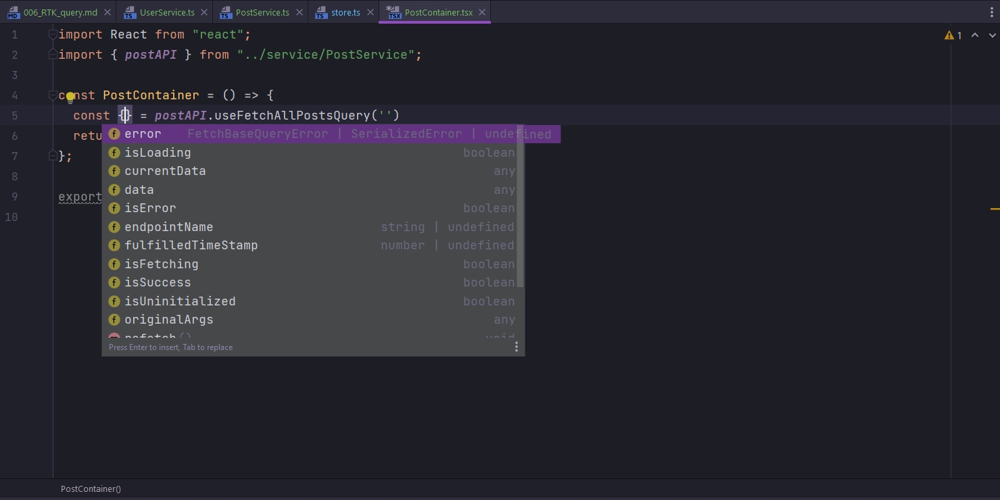
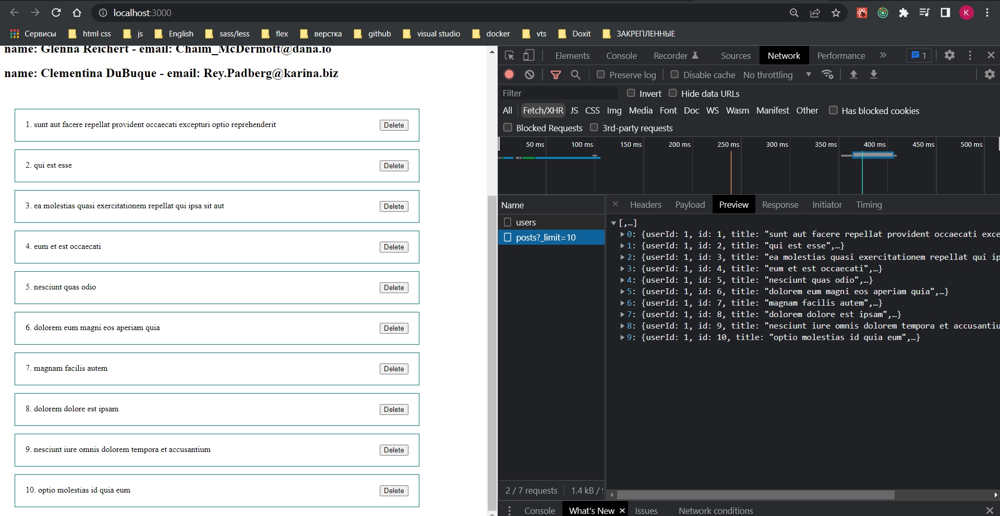

# 006_RTK_query

<https://redux-toolkit.js.org/rtk-query/overview>

Рассмотрим еще одну достаточно крутую штуку которая называется RTK query. Если вы работали с такой библиотекой как React query то многое сейчас вам покажется знакомым.

Создаю папку service и UserService.ts. Отсюда экспортируем константу userAPI. И воспользуемся функцией createApi() по аналогии с тем что было в документации. При вызове этой функции мне необходимо передать ряд некоторых опций.


Первая опция это reducerPath - это некоторый уникальный ключ который будет однозначно определять текущий сервис.


Следующая опция это baseQuery. Здесь необходимо воспользоваться функцией fetchBaseQuery и в нее так же передать ряд опций, но самое важное это базовый url на который этот сервис будет отправлять запросы.


Следующая важное свойство это endpoints, именно там мы будем описывать все endpoints на которые мы будем отправлять запросы и как-то изменять наше состояние. endpoints это у нас функция которая возвращает некоторый объект. Что бы сразу вернуть объект в стрелочной функции необходимо обернуть его в круглые скобки. И уже в этом объекте мы указываем название метода с помощью которого мы будем получать или изменять какие-то данные fetchAllUsers, а в значение мы передаем результат вызова метода query или же mutation.

query предназначен для того что бы получать какие-то данные от сервера. Это GET запрос.

mutation предназначен для того что бы их изменять. Это может быть POST запрос или PUT.


Указываем поле query у объекта, это опять должна быть некоторая функция которая возвращает объект. Сама эта функция будет принимать аргументы которые необходимы для запроса.


Как мы видим это может быть тело запроса body, какие то параметры params, какой-то url. Здесь мы указываем url до конкретного endpoint.

```ts
//src/service/UserService.ts

import { createApi, fetchBaseQuery } from "@reduxjs/toolkit/query";

export const userAPI = createApi({
  reducerPath: "reducerAPI",
  baseQuery: fetchBaseQuery({
    baseUrl: `https://jsonplaceholder.typicode.com`,
  }),
  endpoints: (build) => ({
    fetchAllUsers: build.query({
      query: () => ({
        url: `/users`,
      }),
    }),
  }),
});

```

И вот таким образом мы формируем некоторые endpoints.

На первый взгляд может показаться достаточно нагромажденно. Но не спешите делать выводы.

Посмотрим как это работает в действии.


<br/>
<br/>
<br/>

И так берет комментирует все в App.tsx. И переписывает UserService на PostService. 

И ТАК НА СКРИНАХ ЕСТЬ ОШИБКИ!!! СМОТРИ ВНИМАТЕЛЬНО В КОД И НА СКРИНЫ. СЛОЖНОВА ТО

Я же создам отдельный PostService.

ИСПРАВЛЕННЫЙ UserService

```ts
//src/service/UserService.ts

import { createApi, fetchBaseQuery } from "@reduxjs/toolkit/query";

export const userAPI = createApi({
  reducerPath: "userAPI",
  baseQuery: fetchBaseQuery({
    baseUrl: `https://jsonplaceholder.typicode.com`,
  }),
  endpoints: (build) => ({
    fetchAllUsers: build.query({
      query: () => ({
        url: `/users`,
      }),
    }),
  }),
});

```

И PostService

```ts
//src/service/UserService.ts

import { createApi, fetchBaseQuery } from "@reduxjs/toolkit/query";

export const postAPI = createApi({
  reducerPath: "postAPI",
  baseQuery: fetchBaseQuery({
    baseUrl: `https://jsonplaceholder.typicode.com`,
  }),
  endpoints: (build) => ({
    fetchAllPosts: build.query({
      query: () => ({
        url: `/posts`,
      }),
    }),
  }),
});

```

Теперь нам необходимо зарегистрировать reducer.

В combineReducer мы добавляем вот такую запись. [postAPI.reducerPath] как ключ объекта указываю reducerPath т.е. путь этого редюссера, т.е. тот уникальный ключ который мы записывали. А как значение передаем сам редюсер


И так же необхлжимо добавить некоторый middleware.  При конфигурации store у нас опять же есть поле middleware. Это будет стрелочная функция которая аргументом так же принимает стрелочную функцию с помощью которого мы можем получить getDefaultMiddleware которые уже подключены к Redux Toolkit


И вот таким вот образом с помощью функции concat мы просто добавляем middleware который получаем из нашего postAPI.

Создаю папку components и внутри нее PostContainer.tsx

И вот сейчас будет творится некоторая магия для тех кто никогда не использовал Redux Toolkit.

Обращаемся к нашему postAPI. Самый интересный это автосгенерированные хуки useFetchAllPostsQuery которые генерируются на основании тех endpoints которые мы описываем.

Первым аргументом хук useFetchAllPostsQuery ожидает параметр который будет как-то использоваться в запросе. я так понял это params. В нашем случае таких параметров нет. По этому можно просто передать пустую строку.


КАРОЧЕ У МЕНЯ ЭТОТ ХУК useFetchAllPostsQuery даже автокомплин не подтягивает. 




Нас интересует поле data это как раз тот самый список posts.


Но как видим posts у нас типа any


И TS не видит что это у нас массив определенного типа. И это вполне логично потому что мы нигде его не укзывали. Для того что бы обозначить что этот хук ам будет возвращать список постов в query как generic указываю интерфейс IPost[]


В папке models создаю IPost.ts

```ts
//src/models/IPost.ts

export interface IPost {
  id: number;
  title: string;
  body: string;
}

```


А в качестве второго generic мы можем указать тип аргумента который будет ожидать этот хук useFetchAllPostsQuery. Указываю number.


В данном случае мы будем делать постраничный вывод, пагинацию и можем указать limit на количество получаемых постов. 

И соответственно нам необходимо указать сам query параметр который будет уходить не сервер. Для этого в params передаю _limit:limit


```ts
//src/service/UserService.ts
import { createApi, fetchBaseQuery } from "@reduxjs/toolkit/dist/query/react";
import { IPost } from "../models/IPost";

export const postAPI = createApi({
  reducerPath: "postAPI",
  baseQuery: fetchBaseQuery({
    baseUrl: `https://jsonplaceholder.typicode.com`,
  }),
  endpoints: (build) => ({
    fetchAllPosts: build.query<IPost[], number>({
      query: (limit: number = 5) => ({
        url: `/posts`,
        params: {
          _limit: limit,
        },
      }),
    }),
  }),
});

```

Т.е. это те самые параметры которые мы указываем в строке запроса после вопросительного знака.

И в сгенерированном хуке useFetchAllPostsQuery первым аргументом мы можем передать этот limit.

Для каждого объекта в массиве posts отрисую компонент PostItem и как пропс в этот компонент будем передавать сам объект post


Создаю компонент PostItem указываю что это функциональный компонент. И в generic передаю какого типа у нас будут пропсы. 

Создаю для этого дела interface PostItemProps


```tsx
import React, { FC } from "react";
import { IPost } from "../models/IPost";

interface PostItemProps {
    post: IPost;
}

const PostItem: FC<PostItemProps> = ({ post }) => {
    return (
        <div className="post">
            {post.id}. {post.title}
            <button>Delete</button>
        </div>
    );
};

export default PostItem;

```


Если мы взглянем на массив posts то увидим что TS нам подсказывает что массив может быть 


По этому нужно сделать проверку. Если у нас posts есть, то тогда мы итерируемся по массиву.

```tsx
import React from "react";
import { postAPI } from "../service/PostService";
import PostItem from "./PostItem";

const PostContainer = () => {
    const { data: posts } = postAPI.useFetchAllPostsQuery(5);
    return (
        <div>
            <div className="post__list">
                {posts && posts.map((post) => <PostItem key={post.id} post={post} />)}
            </div>
        </div>
    );
};

export default PostContainer;

```

И так для пользователей сделаю два компонента UserContainer и UserItem и перенсу всю логику из компонента App.

```tsx
import React, { useEffect } from "react";
import { useAppDispatch, useAppSelector } from "../hooks/redux";
import { fetchUsers } from "../store/reducers/ActionCreators";
import UserItem from "./UserItem";

const UserContainer = () => {
    const dispatch = useAppDispatch();
    const { users, isLoading, error } = useAppSelector(
        (state) => state.userReducer
    );

    useEffect(() => {
        dispatch(fetchUsers());
    }, []);

    return (
        <div>
            {isLoading && <h1>Идет загрузка...</h1>}
            {error && <h1>{error}</h1>}
            {users.map((user) => (
                <UserItem key={user.id} user={user} />
            ))}
        </div>
    );
};

export default UserContainer;

```

```tsx
import React, { FC } from "react";
import { IUser } from "../models/IUser";

interface UserItemProps {
  user: IUser;
}

const UserItem: FC<UserItemProps> = ({ user }) => {
  return (
    <div>
      <h2>
        name: {user.name} - email: {user.email}
      </h2>
    </div>
  );
};

export default UserItem;


```

```tsx
import React from "react";
import "./App.css";
import UserContainer from "./components/UserContainer";
import PostContainer from "./components/PostContainer";

function App() {
  return (
    <div className="App">
      <UserContainer />
      <PostContainer />
    </div>
  );
}

export default App;

```


Немного итогов: Мы написали некоторый endpoint, указали какой у него будет url, какие будут параметры. Какого типа этот запрос. GET, POST, PUT. 

Нопомню что query это GET, a mutation это POST, PUT ну и наверное DELETE.


RTK query в свою очередь сгенерировал для нас хук useFetchAllPostsQuery


С помощью этого хука мы можем получать какие-то данные. Изменю limit на 10




Вся прелесть в том что ошибки обрабатываются автоматически и индикация загрузки так же делается автоматически.

```tsx
import React from "react";
import { postAPI } from "../service/PostService";
import PostItem from "./PostItem";

const PostContainer = () => {
  const { data: posts, error, isLoading } = postAPI.useFetchAllPostsQuery(10);
  return (
    <div>
      <div className="post__list">
        {isLoading && <h1>Идет загрузка</h1>}
        {error && <h1>Произошла ошибка</h1>}
        {posts && posts.map((post) => <PostItem key={post.id} post={post} />)}
      </div>
    </div>
  );
};

export default PostContainer;


```


Проведем некоторый эксперемент. Продублируем PostContainer И создадим точно такой же второй компонент. Он будет работать с тем же источником данных что и первый компонент

```tsx
import React from "react";
import { postAPI } from "../service/PostService";
import PostItem from "./PostItem";

const PostContainer_2 = () => {
  const { data: posts, error, isLoading } = postAPI.useFetchAllPostsQuery(10);
  return (
    <div>
      <div className="post__list">
        {isLoading && <h1>Идет загрузка</h1>}
        {error && <h1>Произошла ошибка</h1>}
        {posts && posts.map((post) => <PostItem key={post.id} post={post} />)}
      </div>
    </div>
  );
};

export default PostContainer_2;

```

```tsx
import React from "react";
import "./App.css";
import UserContainer from "./components/UserContainer";
import PostContainer from "./components/PostContainer";
import PostContainer_2 from "./components/PostContainer_2";

function App() {
  return (
    <div className="App">
      <PostContainer />
      <PostContainer_2 />
    </div>
  );
}

export default App;

```


Как видим мы получаем одни и те же данные в разных местах. Мы имеем два списка. Но запрос в Network у нас один.

Это говорит нам о том что мы можем не заботится о том что запросы у нас продублируются. И когда мы используем хук мы можем быть уверены что если эти данные где то используются еще, то лишний запрос у нас выполнятся не будет. И мы возьмем эти данные из хранилища и будем использовать там где нам необходимо. В свою очередь RTK query позаботиться о том что бы эти данные закешировать и своевременно обновить если в этом будет необходимость.

Посмотрим еще на одном примере. Откроем PostContainer и сделаем здесь локальное состояние как раз в котором мы будем хранить limit.

```ts
import React, { useEffect, useState } from "react";
import { postAPI } from "../service/PostService";
import PostItem from "./PostItem";

const PostContainer = () => {
  //Локальное состояние
  const [limit, setLimit] = useState(10);

  const {
    data: posts,
    error,
    isLoading,
  } = postAPI.useFetchAllPostsQuery(limit);

  useEffect(() => {
    setTimeout(() => {
      setLimit(3);
    }, 2000);
  }, []);

  return (
    <div>
      <div className="post__list">
        {isLoading && <h1>Идет загрузка</h1>}
        {error && <h1>Произошла ошибка</h1>}
        {posts && posts.map((post) => <PostItem key={post.id} post={post} />)}
      </div>
    </div>
  );
};

export default PostContainer;

```


Первый запрос у нас ушел с limit=10. Но через какое-то время limit, который находится в локальном состоянии компонента PostContainer, обновился, и RTK query обновил данные. Но обновил он эти данные только в одном компоненте. При этом запрос у нас улетел один с limit=10, а второй с limit=3.

Вот таким вот образом происходит кеширование данных. Это бывает крайне полезно когда у нас есть например какие-нибудь выпадающие списки с данными которые подгружаются асинхронно.  Эти списки используются в приложении повсеместно. И что бы получить данные  для этих списков нам достаточно использовать хуки  и быть уверенным в том что у нас не будет лишних запросов.

Но если возникнет ситуация в которой нам нужно по какой то причине данные перезаписать, то есть функция refetch которую мы можем вызывать на какое то событие. И в таком случае данные будут подгружены заново.

```tsx
import React, { useEffect, useState } from "react";
import { postAPI } from "../service/PostService";
import PostItem from "./PostItem";

const PostContainer = () => {
  //Локальное состояние
  const [limit, setLimit] = useState(10);

  const {
    data: posts,
    error,
    isLoading,
    refetch,
  } = postAPI.useFetchAllPostsQuery(limit);

  return (
    <div>
      <div className="post__list">
        <button onClick={() => refetch()}>REFETCH</button>
        {isLoading && <h1>Идет загрузка</h1>}
        {error && <h1>Произошла ошибка</h1>}
        {posts && posts.map((post) => <PostItem key={post.id} post={post} />)}
      </div>
    </div>
  );
};

export default PostContainer;

```


Если мы нажимаем refetch то у нас отправляется запрос вновь и вновь, но списки у нас не перерисовываются поскольку мы получаем одни и теже данные.

<br/>
<br/>
<br/>

long Polling

Так же есть возможность реализовать так называемый longPulling это когда в определенный промежуток времени мы получаем обновленные данные. Например это можно использовать в чатах, уведомлениях. Своего рода аналог webSockets. Для этого в наш сгнерированный хук useFetchAllPostsQuery вторым параметром мы передаем pollingInterval.


```tsx
import React, { useEffect, useState } from "react";
import { postAPI } from "../service/PostService";
import PostItem from "./PostItem";

const PostContainer = () => {
  //Локальное состояние
  const [limit, setLimit] = useState(10);

  const {
    data: posts,
    error,
    isLoading,
    refetch,
  } = postAPI.useFetchAllPostsQuery(limit, { pollingInterval: 1000 });

  return (
    <div>
      <div className="post__list">
        <button onClick={() => refetch()}>REFETCH</button>
        {isLoading && <h1>Идет загрузка</h1>}
        {error && <h1>Произошла ошибка</h1>}
        {posts && posts.map((post) => <PostItem key={post.id} post={post} />)}
      </div>
    </div>
  );
};

export default PostContainer;


```


Через каждую секунду у меня отправляется запрос. И если на сервере появились какие-то данные, то мы их получим и увидим в нашем интерфейсе уже обновленные данные.


