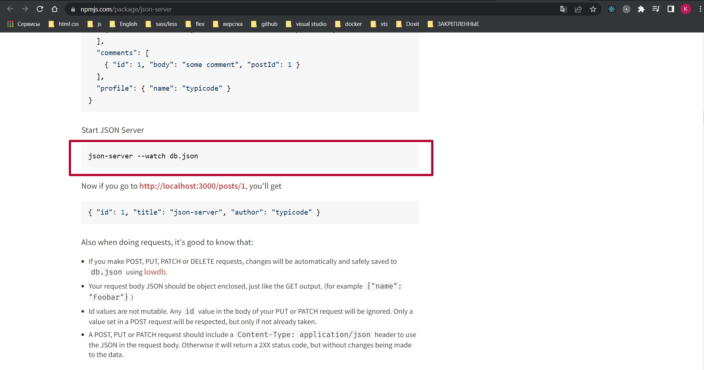
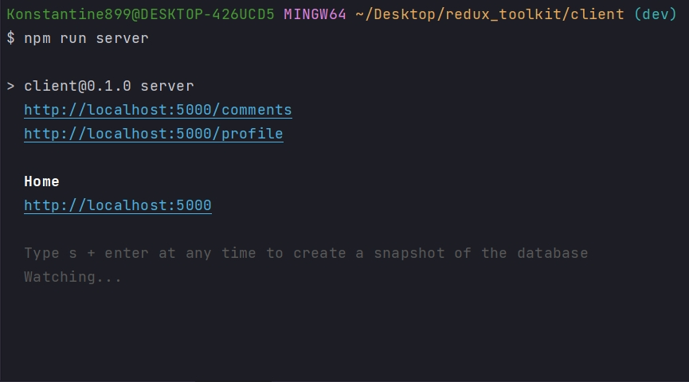
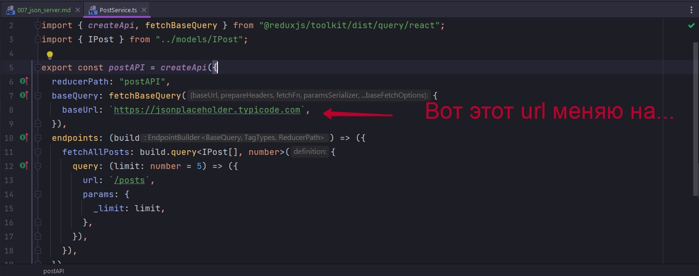
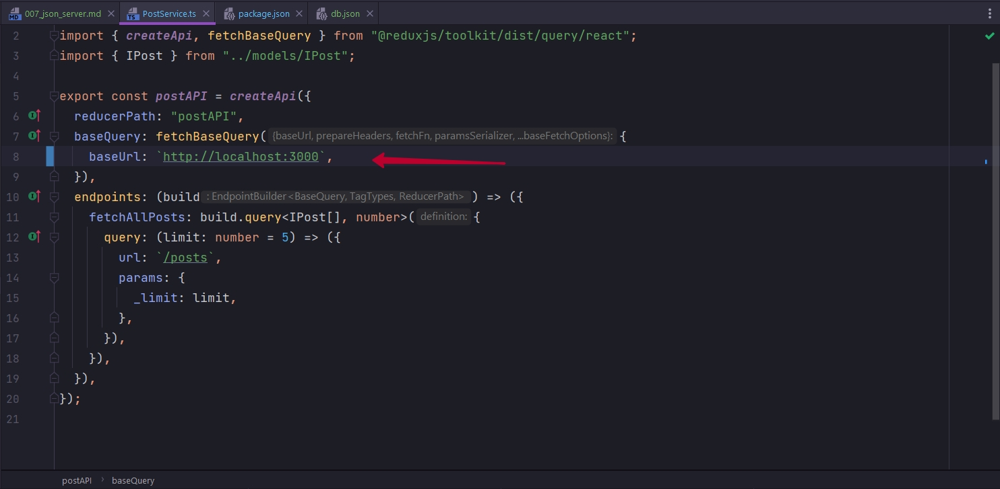
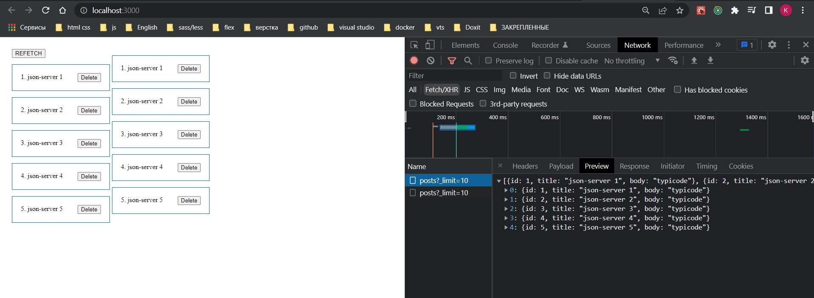

# 007_json_server

На данном этапе мы научились получать какие-то данные.

```ts
//src/service/UserService.ts
import { createApi, fetchBaseQuery } from "@reduxjs/toolkit/dist/query/react";
import { IPost } from "../models/IPost";

export const postAPI = createApi({
  reducerPath: "postAPI",
  baseQuery: fetchBaseQuery({
    baseUrl: `https://jsonplaceholder.typicode.com`,
  }),
  endpoints: (build) => ({
    fetchAllPosts: build.query<IPost[], number>({
      query: (limit: number = 5) => ({
        url: `/posts`,
        params: {
          _limit: limit,
        },
      }),
    }),
  }),
});

```

использовать query.

Но так же нужно научиться использовать мутации. Создавать новые данные, обновлять их или же удалять.

json placeholder нам для этого этого уже не подойдет поскольку там эти операции не реализованы.

Установим json-server <https://www.npmjs.com/package/json-server>

```shell
npm i json-server
```

Мы сможем буквально в два действия поднять сервер на котором будет своего роба БД. Все данные будут сохраняться в файлик  который мы создаем в корне проекта и называем db.json. 

```json
{
  "posts": [
    {"id": 1, "title": "json-server 1", "body": "typicode"},
    {"id": 2, "title": "json-server 2", "body": "typicode"},
    {"id": 3, "title": "json-server 3", "body": "typicode"},
    {"id": 4, "title": "json-server 4", "body": "typicode"},
    {"id": 5, "title": "json-server 5", "body": "typicode"}
  ],
  "comments": [
    {"id": 1, "body": "some comment", "postId": 1}
  ],
  "profile": {"name": "typicode"}
}
```

После чего токроем терминал и подымем сервер.



Вот такой вот командой мы этот сервер запустим. Но у нас на 3000 порту уже запущено приложение, по этому сервер мы запустим на 5000 порту. У себя же эту команду пропишу в package.json. И пропишу proxy то что мне нужно все запросы проксировать на 5000 порт.

```shell
json-server --watch db.json --port 5000
```

```json
{
  "name": "client",
  "version": "0.1.0",
  "private": true,
  "dependencies": {
    "@reduxjs/toolkit": "^1.8.1",
    "@testing-library/jest-dom": "^5.16.4",
    "@testing-library/react": "^13.2.0",
    "@testing-library/user-event": "^13.5.0",
    "@types/jest": "^27.5.0",
    "@types/node": "^16.11.33",
    "@types/react": "^18.0.8",
    "@types/react-dom": "^18.0.3",
    "@types/react-redux": "^7.1.24",
    "axios": "^0.27.2",
    "json-server": "^0.17.0",
    "react": "^18.1.0",
    "react-dom": "^18.1.0",
    "react-redux": "^8.0.1",
    "react-scripts": "5.0.1",
    "typescript": "^4.6.4",
    "web-vitals": "^2.1.4"
  },
  "scripts": {
    "start": "react-scripts start",
    "server": "json-server --watch db.json --port 5000",
    "build": "react-scripts build",
    "test": "react-scripts test",
    "eject": "react-scripts eject"
  },
  "proxy":"http://localhost:5000",
  "eslintConfig": {
    "extends": [
      "react-app",
      "react-app/jest"
    ]
  },
  "browserslist": {
    "production": [
      ">0.2%",
      "not dead",
      "not op_mini all"
    ],
    "development": [
      "last 1 chrome version",
      "last 1 firefox version",
      "last 1 safari version"
    ]
  }
}

```

Для того что бы запустить сервер 

```shell
npm run server
```

Без run не сработало.



И теперь вместо того что бы обращаться к json placeholder я обновлю базовый url.





Он у себя ставит 5000 порт но мне это не надо. С помощью proxy в package.json я указал куда должны проксироваться все запросы.




```ts
//src/service/UserService.ts
import { createApi, fetchBaseQuery } from "@reduxjs/toolkit/dist/query/react";
import { IPost } from "../models/IPost";

export const postAPI = createApi({
  reducerPath: "postAPI",
  baseQuery: fetchBaseQuery({
    baseUrl: `http://localhost:3000`,
  }),
  endpoints: (build) => ({
    fetchAllPosts: build.query<IPost[], number>({
      query: (limit: number = 5) => ({
        url: `/posts`,
        params: {
          _limit: limit,
        },
      }),
    }),
  }),
});

```

Вот здесь вот по GET запросу мы получаем список тех постов которые мы добавили в массив. Теперь мы можем успешно взаимодействовать с нашим сервером.


