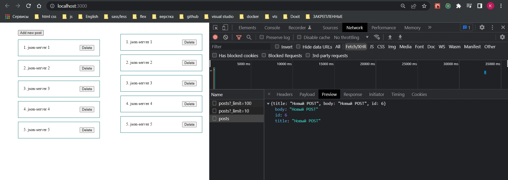
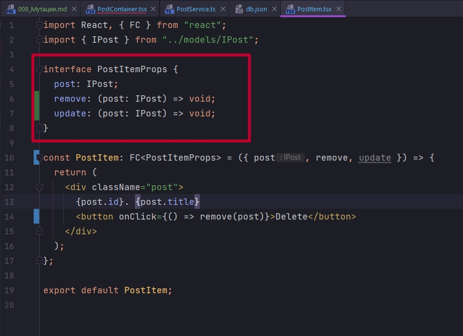

# 008_Мутации

Давайте создадим еще один endpoint c помощью которого мы будем POST создавать. Здесь обратите внимание мы используем уже не query а mutation. Но принци описания самого endpoint будет аналогичным.


Здесь аргументом будем принимать сам post, т.е. объект который мы хотим сохранить в БД. Как generic мы указываем тип объекта который нам вернется IPost и тип объекта который мы ожидаем аргументом IPost.


Поскольку это POST запрос нам нужно явно указать метод. И так же у POST запроса есть тело body в который мы помещаем наш объект post


Т.е. объект post будет уходить вместе с запросом и отправляться на сервер.

```ts
//src/service/UserService.ts
import { createApi, fetchBaseQuery } from "@reduxjs/toolkit/dist/query/react";
import { IPost } from "../models/IPost";

export const postAPI = createApi({
  reducerPath: "postAPI",
  baseQuery: fetchBaseQuery({
    baseUrl: `http://localhost:3000`,
  }),
  endpoints: (build) => ({
    fetchAllPosts: build.query<IPost[], number>({
      query: (limit: number = 5) => ({
        url: `/posts`,
        params: {
          _limit: limit,
        },
      }),
    }),

    //Создние поста
    createPost: build.mutation<IPost, IPost>({
      query: (post) => ({
        url: `/posts`,
        method: "POST",
        body: post,
      }),
    }),
  }),
});

```

И так добавим кнопку. Повесим на нее слушатель события. И при нажатии на кнопку Add new post будем вызывать функцию  handleCreate.


Мы буем получать название статьи с помощью функции prompt. Это такая функция Которая вызывает нативное браузерное окно в которое можно что-то ввести.


Поскольку мы уже описали endpoint, для нас был сгенерирован автоматический хук которым мы можем воспользоваться.


Этот хук useCreatePostMutation был сгенерирован по названию того endpoint который мы создавали.


Так же забыл сказать что в опциях сгенерированного хука мы можем указывать selector и получать например какие-то определенные данные.


selectFromResult. Т.е. данные отфильтрованные по какому-то условию. ПОЧИТАЙ ЧТО ТАКОЕ Selector!!!! 


ОБРАТИТЕ ВНИМАНИЕ ЧТО ХУК useCreatePostMutation ВОЗВРАЩАЕТ НАМ НЕ ОБЪЕКТ С КАКИМИ ТО ДАННЫМИ А МАССИВ КОРТЕЖ. ГДЕ ПЕРВЫЙ ЭЛЕМЕНТ ЭТОГО МАССИВА ЭТО ФУНКЦИЯ КОТОРУЮ МЫ МОЖЕМ ВЫЗВАТЬ ДЛЯ ТОГО ЧТО БЫ ПРОИЗОШЛА МУТАЦИЯ, А ВТОРОЙ ЭТО ОБЪЕКТ В КОТОРМ КАК РАЗ НАХОДЯТСЯ ПОЛЯ isLoading, date и т.д.!!!


Соотвественно в нашем слушателе события handleCreate мы вызываем функцию createPost, это асинхронная функция по этому используем await. И параметром в эту функцию нам необходимо передать объект типа POST. Туда мы передаем title, body сделаем аналогичным title. И поскольку id у нс будет генерировать сервер что бы TS не ругался я явно укажем что это у нас объект типа IPost.


```tsx
import React, { useEffect, useState } from "react";
import { postAPI } from "../service/PostService";
import PostItem from "./PostItem";
import { IPost } from "../models/IPost";

const PostContainer = () => {
  //Локальное состояние
  const [limit, setLimit] = useState(100);

  const {
    data: posts,
    error,
    isLoading,
  } = postAPI.useFetchAllPostsQuery(limit);

  const [createPost, {}] = postAPI.useCreatePostMutation();

  const handleCreate = async () => {
    const title = prompt();
    await createPost({ title, body: title } as IPost);
  };

  return (
    <div className="post__list">
      <button onClick={handleCreate}>Add new post</button>
      {isLoading && <h1>Идет загрузка</h1>}
      {error && <h1>Произошла ошибка</h1>}
      {posts && posts.map((post) => <PostItem key={post.id} post={post} />)}
    </div>
  );
};

export default PostContainer;


```




Как видим POST запрос произошел. Данные добавлены. Однако запрос на подгрузку новых данные не произошел, соответственно не произошло и перерисовка страницы.

Давайте разбираться. Хотелось бы сделать так что бы при создании объекта он сразу добавлялся в соответствующий список. И нам не приходилось делать дополнительные махинации, какие-то refetch, подгружать данные.

По умолчанию Redux Toolkit не знает куда нам необходимо этот объект добавить. Для этого необходимо проставить определенные теги. В данном случае у нас всего один тег это тег Post. В массиве мы можем указать несколько тегов. 

В tagTypes в массиве указываю типы тегов. И далее в endpoint fetchAllPosts я должен указать что он работает с этим тегом. Для этого в providesTag я передаю функцию которая возвращает массив тегов с которыми работает данный endpoint.


т.е. у нас могут быть несколько endpoint которые работают с разными данными. И нам необходимо правильно эти endpoint сопоставить. 

При получении данных мы указываем что этот endpoint обеспечивает доставку данных, а при создании поста, мы указываем что эти данные становятся не актуальными. И Соответственно RTK query должен эти данные снова получить.


```ts
//src/service/UserService.ts
import { createApi, fetchBaseQuery } from "@reduxjs/toolkit/dist/query/react";
import { IPost } from "../models/IPost";

export const postAPI = createApi({
  reducerPath: "postAPI",
  baseQuery: fetchBaseQuery({
    baseUrl: `http://localhost:3000`,
  }),
  tagTypes: ["Post"],
  endpoints: (build) => ({
    fetchAllPosts: build.query<IPost[], number>({
      query: (limit: number = 5) => ({
        url: `/posts`,
        params: {
          _limit: limit,
        },
      }),
      //Указываю с какими тегами работает endpoint
      providesTags: (result) => ["Post"],
    }),

    //Создние поста
    createPost: build.mutation<IPost, IPost>({
      query: (post) => ({
        url: `/posts`,
        method: "POST",
        body: post,
      }),
      invalidatesTags: ["Post"],
    }),
  }),
});

```


Таким образом нам достаточно правильно сопоставить источник данных с endpoint который как-то эти данные изменяет.

<br/>
<br/>
<br/>

Так же как я говорил чуть ранее и ошибку точно таким же способом. И обрабатывать индикацию загрузки.

Только не забывайте что у нас поле называется error, и при создании поста в нас поле так же называется error. По этому вот таки вот способом через двоеточие необходимо менять назывние.


Но на этом останавливаться мы не будем.


<br/>
<br/>
<br/>

Давайте реализуем обновление поста и его удаление.


Создаю endpoint updatePost и deletePost. Обраите внимание что значение в generic мы сохраняем.

В updatePost в url указываю id поста который я хочу обновить. И указываю метод PUT.


```ts
//src/service/UserService.ts
import { createApi, fetchBaseQuery } from "@reduxjs/toolkit/dist/query/react";
import { IPost } from "../models/IPost";

export const postAPI = createApi({
  reducerPath: "postAPI",
  baseQuery: fetchBaseQuery({
    baseUrl: `http://localhost:3000`,
  }),
  tagTypes: ["Post"],
  endpoints: (build) => ({
    fetchAllPosts: build.query<IPost[], number>({
      query: (limit: number = 5) => ({
        url: `/posts`,
        params: {
          _limit: limit,
        },
      }),
      //Указываю с какими тегами работает endpoint
      providesTags: (result) => ["Post"],
    }),

    //Создние поста
    createPost: build.mutation<IPost, IPost>({
      query: (post) => ({
        url: `/posts`,
        method: "POST",
        body: post,
      }),
      invalidatesTags: ["Post"],
    }),

    //Обновление поста
    updatePost: build.mutation<IPost, IPost>({
      query: (post) => ({
        url: `/posts/${post.id}`,
        method: "PUT",
        body: post,
      }),
      invalidatesTags: ["Post"],
    }),

    //Удаление поста
    deletePost: build.mutation<IPost, IPost>({
      query: (post) => ({
        url: `/posts/${post.id}`,
        method: "DELETE",
      }),
      invalidatesTags: ["Post"],
    }),
  }),
});

```

Открываю компонент PostItem где на кнопку мне необходимо повешать слушатель событий.

Сами функции мы будем принимать выше из компонента PostContainer. 

Первая функция remove для удаления и вторая функция update для обновления. Данные функции принимают post у которого прописываю interface IPost. И данные функции ничего не будут возвращать.



Аргументом в функцию remove передаю post. Хотя сделаю немного иначе. Создадим для этого дела отдельную функцию handleRemove. В параметры передаю event в типе указываю что это React.MouseEvent. В теле функции у event вызываю stopPropagation для того что бы предотвратить всплытие. И затем вызываю функцию remove куда передаю post.


А при нажатии на сам блок div.


Мы будем опять же с помощью функции prompt изменять как то заголовок нашего поста. Затем будем вызывать функцию update в которой будем создават новый объект на основе старого ...state, и после будем изменять поле title.

```tsx
import React, { FC } from "react";
import { IPost } from "../models/IPost";

interface PostItemProps {
  post: IPost;
  remove: (post: IPost) => void;
  update: (post: IPost) => void;
}

const PostItem: FC<PostItemProps> = ({ post, remove, update }) => {
  //Функция удаления поста
  const handleRemove = (event: React.MouseEvent) => {
    // Предотвращаю всплытие события
    event.stopPropagation();
    remove(post);
  };

  //Функция обновления поста
  const handleUpdate = (event: React.MouseEvent) => {
    const title = prompt() || "";
    update({ ...post, title });
  };

  return (
    <div className="post" onClick={handleUpdate}>
      {post.id}. {post.title}
      <button onClick={handleRemove}>Delete</button>
    </div>
  );
};

export default PostItem;

```

Теперь остается соответствующие пропсы в этот компонент пробросить. В Передаваемых пропсах компонента PostItem передаю по соответствующей функции.


Эти функции аргументом принимаю тот пост у которого происходит обновление или удаление.

Остается воспользоватся по уже известной схеме автосгенерированными хуками.


Сдесь нам точно так же возвращается КОРТЕЖ, первый элемент которого это функция которая удаляет или обновляет пост. А второй элемент это объект который содержит isLoading, error и т.д.


И остается эти функции в соответствующих хендлерах вызвать и передать в них post.


Так же пока что избавлюсь от второго компонент.

```tsx
import React from "react";
import "./App.css";
import UserContainer from "./components/UserContainer";
import PostContainer from "./components/PostContainer";
import PostContainer_2 from "./components/PostContainer_2";

function App() {
  return (
    <div className="App">
      <PostContainer />
      {/*<PostContainer_2 />*/}
    </div>
  );
}

export default App;

```


Пост id 1 удален.


