# 003_Первый_reducer_плюс_типизация

Теперь в дирректории store создаю дирректорию reducers и в ней создаю  первый редюсер который назовем userReducer. В нем будет происходить взаимодействие со списком пользователей нашего приложения.

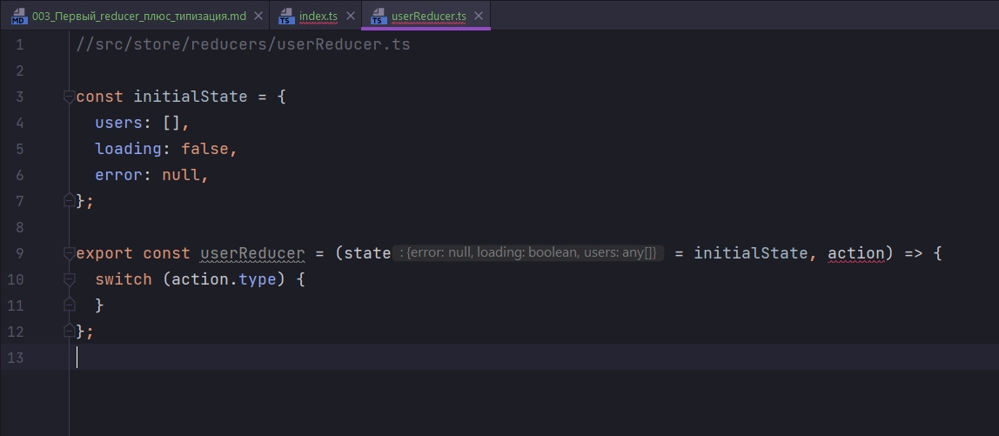

Как вы знаете reducer принимает два параметра. Это state - состояниеи и action.

Как видите TS уже ругается и говорит что нужно указать типы state и action. 

Следующим этапом проинициализируем дефолтное состояние которое будет в этом reducer. Здесь будут следующие поля. 

users - Это список пользователей, соответственно массив

loading:false - флаг отвечающий за то идет загрузка или нет.

error:false - поле которое будет содержать в себе сообщение об ошибке.

Указываем это состояние как дефолтное в reducer и ts сразу определил типы. Смотри на скрин. 

Но в error помимо null у нас может быть сообщение об ошибке. Это простая строка string. 

По этому тип нашего состояния мы опишем в interface. Назовем его UserState.

users у нас будет массив любого типа any[]. 

loading будет boolean т.е. логическая переменная 

и error будет либо null либо string.

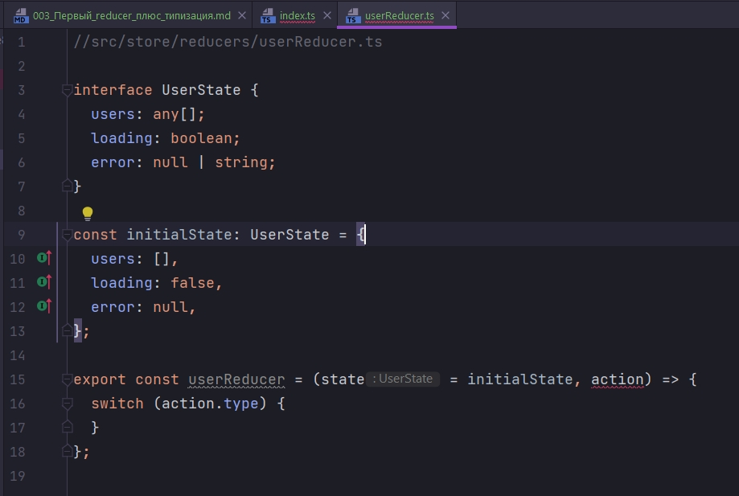

Теперь если мы попробуем записать в какое-то из этих полей значение не соответствующее его типу, например в error попробуем поместить число, то ts будет ругаться. 

Через двоеточие для дефолтного состяния указываем тип UserState.

Теперь создадим первый case. Назовем его FETCH_USERS. Мы будем вызывать case с данным типом в том случае когда будем подгружать пользователей с сервера.

Если мы прямо сейчас попытаемся обратится к state то мы сразу увидим его поля и типы этих полей.

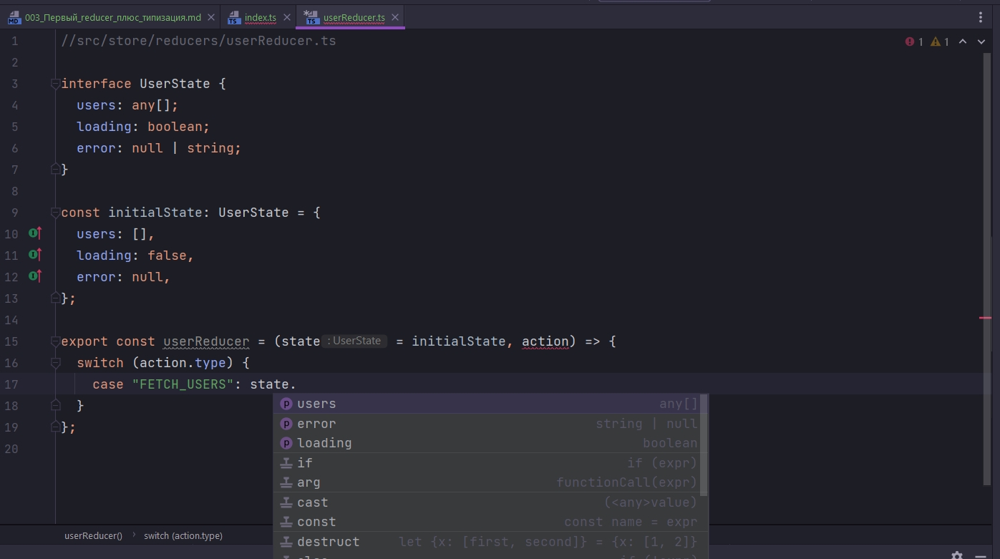

Теперь мы строго знаем в каком поле должен находится какой тип.

Поле loading делаю true, поле error делаю null, поскольку мы только начинаем подгрузку пользователей.

Посмотрите

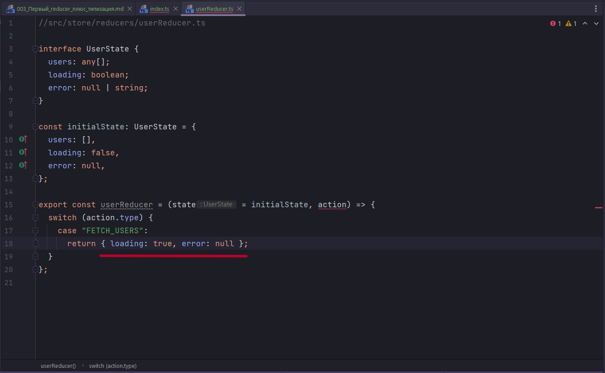

Я не передаю массив users и TS не ругается поскольку она, функция userReducer не значет что она должна возвращать.

Укажем в качестве возвращаемого значения UserState, поскольку reducer всегда должен возвращать состояние.

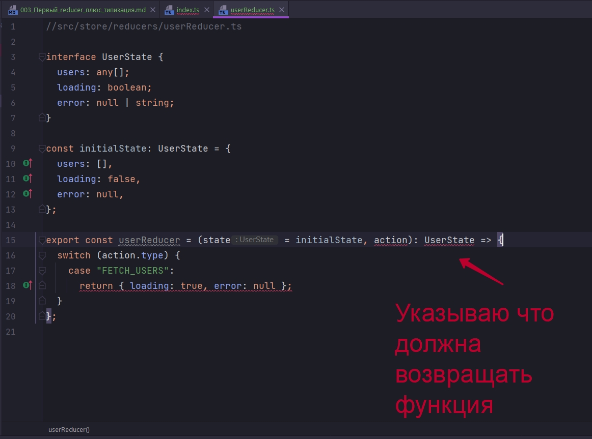

Добавляю массив users в возвращаемый объект


Т.е. одну потенциальную ошибку мы предотвратили. Но как вы знаете название типов экшенов по хорошемы лучше вынести в отдельные константы.

И так говорил то что я и так знаю. Создал несколько экшенов: 

1. Начало загрузки данных
2. Данные подгружены
3. Произошла ошибка

И прописал в них логику. На скрин не помещается. 

```ts
//src/store/reducers/userReducer.ts

const FETCH_USERS = "FETCH_USERS";
const FETCH_USERS_SUCCESS = "FETCH_USERS_SUCCESS";
const FETCH_USERS_ERROR = "FETCH_USERS_ERROR";

interface UserState {
  users: any[];
  loading: boolean;
  error: null | string;
}

const initialState: UserState = {
  users: [],
  loading: false,
  error: null,
};

export const userReducer = (state = initialState, action): UserState => {
  switch (action.type) {
    case FETCH_USERS:
      return { loading: true, error: null, users: [] };
    case FETCH_USERS_SUCCESS:
      return { loading: false, error: null, users: action.payload };
    case FETCH_USERS_ERROR:
      return { loading: false, error: action.payload, users: [] };
    default:
      return state;
  }
};

```

Одноако action у нас не типизированный. 

Теперь опишем interface для action. Интерфейс назовем UserAction и внутри мы опишем поля которые у этого action будут. Это обфзательно type: string это обязательное условие для любого action. И как дополнительный параметр не обязательный указываем payload, он может быть любого типа

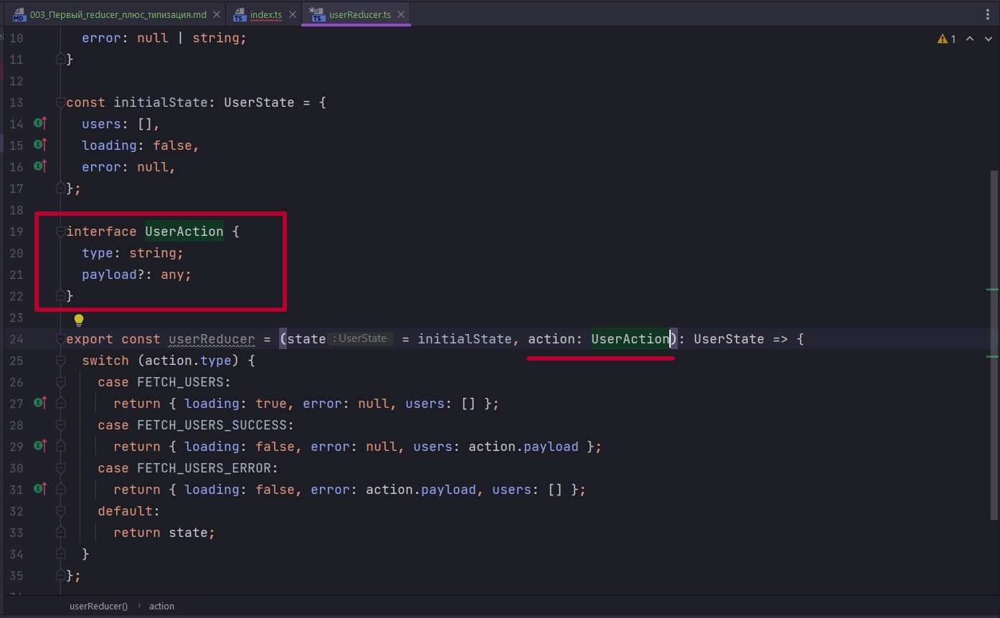

```ts
//src/store/reducers/userReducer.ts

const FETCH_USERS = "FETCH_USERS";
const FETCH_USERS_SUCCESS = "FETCH_USERS_SUCCESS";
const FETCH_USERS_ERROR = "FETCH_USERS_ERROR";

interface UserState {
  users: any[];
  loading: boolean;
  error: null | string;
}

const initialState: UserState = {
  users: [],
  loading: false,
  error: null,
};

interface UserAction {
  type: string;
  payload?: any;
}

export const userReducer = (
  state = initialState,
  action: UserAction
): UserState => {
  switch (action.type) {
    case FETCH_USERS:
      return { loading: true, error: null, users: [] };
    case FETCH_USERS_SUCCESS:
      return { loading: false, error: null, users: action.payload };
    case FETCH_USERS_ERROR:
      return { loading: false, error: action.payload, users: [] };
    default:
      return state;
  }
};

```

Но на данный момент у нас в payload может находится что угодно. И ошибку мы по сути не предотвратим. 

По этому для каждого экшена мы сейчас создадим отдельный interface. 

FetchUsersAction у него будет тип который имеет строго значение.

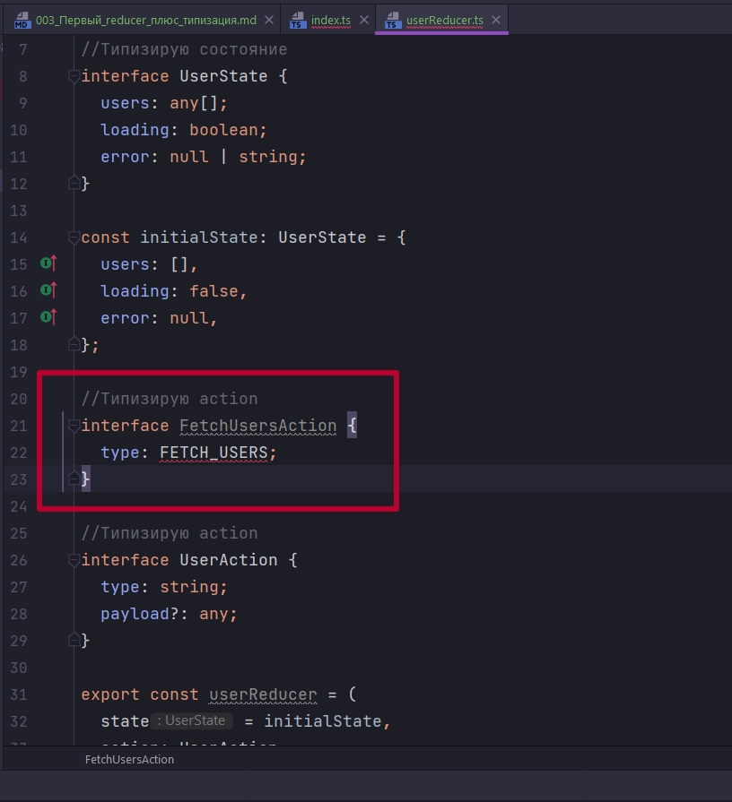

Как видим среда ругается. Но пока что мы это пропустим. payload у FetchUsersAction не будет по этому его мы не указываем.

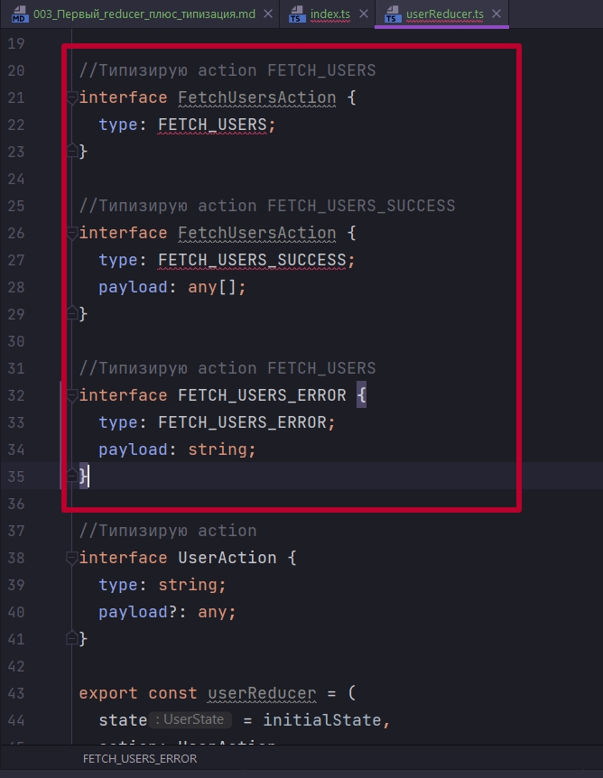

Теперь исправим ошибку с константным типом. есть два варианта. Либо использовать оператор typeof. В TS он работает немного иначе нежели в JS. И в данном случае он вернет тип этой константы.

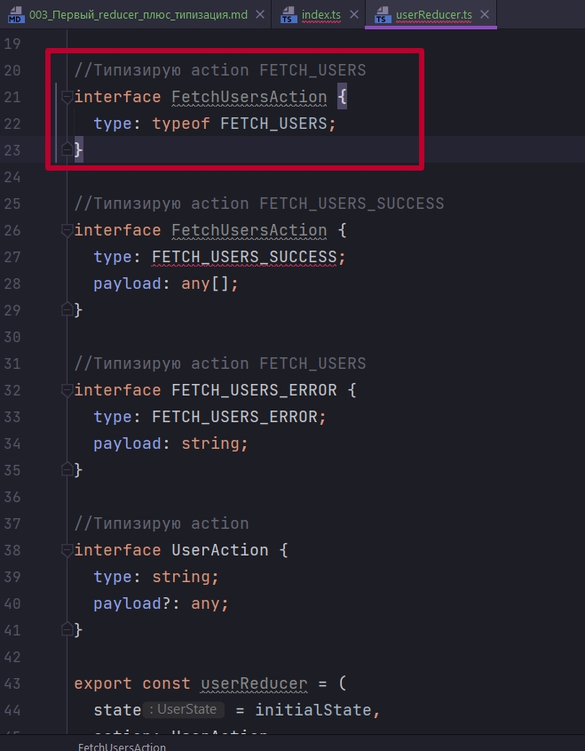

И есть второй вариант. Более так сказать элегантный. Это создать перечисления которое содержит в себе все типы actions.

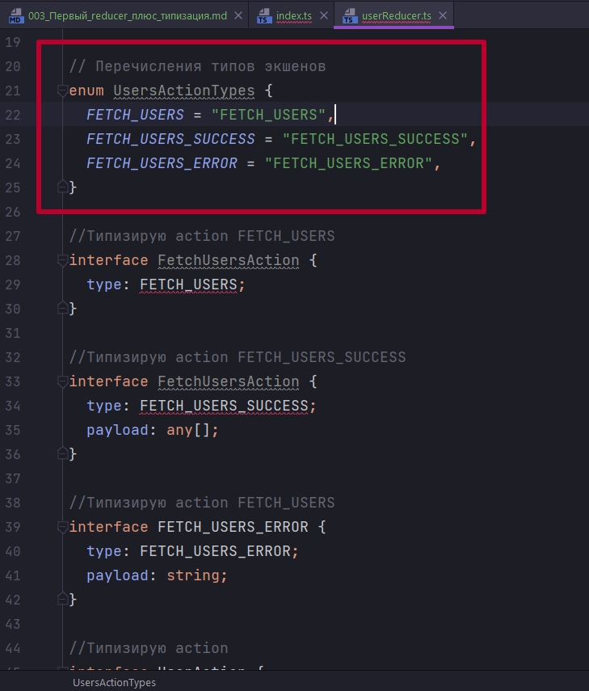

И теперь кнстанты прописанные ранее мы можем убирать.

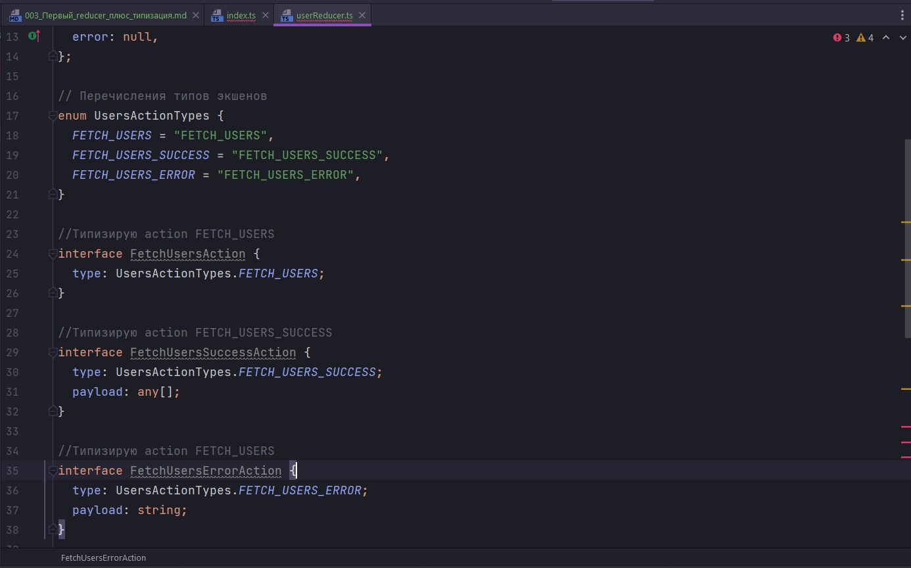

В таком случае как видите TS уже не ругается. Все константы у нас хранятся в одном месте и их разом можно будет экспортировать. 


Теперь в Reducer вместо констант мы возвращаемся опять же к перечислению и оттуда получем нужные константы.

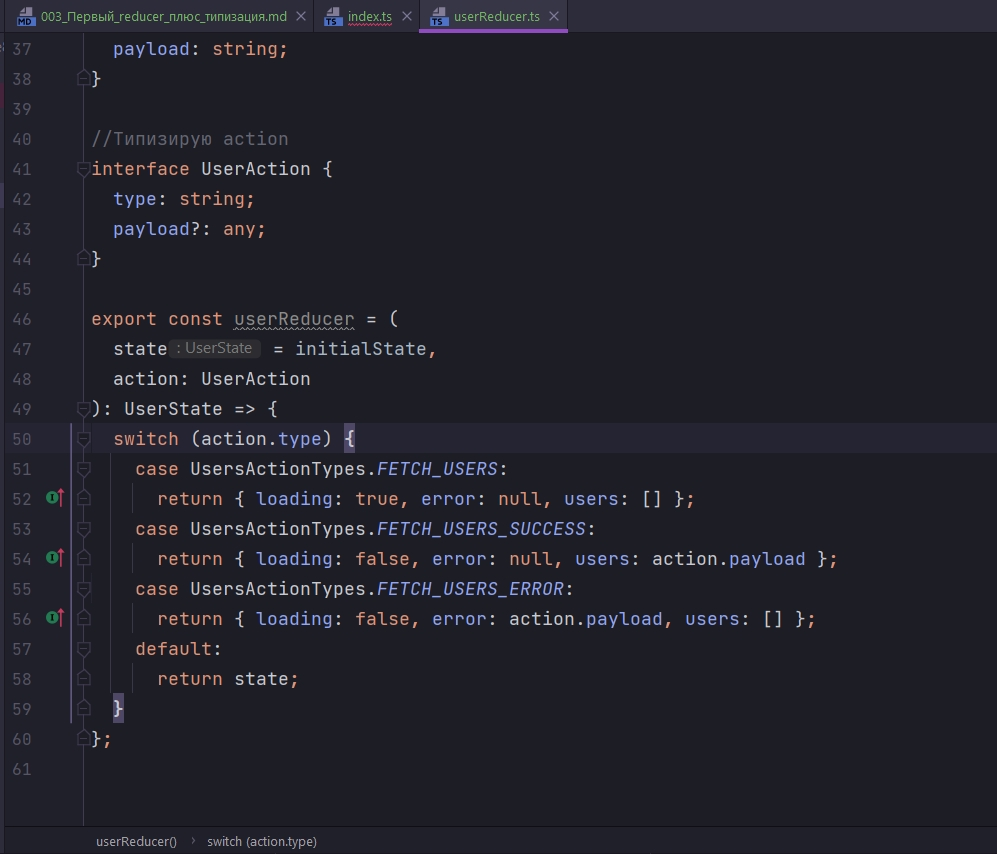

На данном этапе у нас есть три разрозненных экшена. И нам надо как то объеденить их воедино.

Для этого создадим обноименный type  и назоваем его UserAction и в нем просто перечисляем какие типы он может принимать.

```ts
//src/store/reducers/userReducer.ts

//Типизирую состояние
interface UserState {
  users: any[];
  loading: boolean;
  error: null | string;
}

// Перечисления типов экшенов
enum UsersActionTypes {
  FETCH_USERS = "FETCH_USERS",
  FETCH_USERS_SUCCESS = "FETCH_USERS_SUCCESS",
  FETCH_USERS_ERROR = "FETCH_USERS_ERROR",
}

//Типизирую action FETCH_USERS
interface FetchUsersAction {
  type: UsersActionTypes.FETCH_USERS;
}

//Типизирую action FETCH_USERS_SUCCESS
interface FetchUsersSuccessAction {
  type: UsersActionTypes.FETCH_USERS_SUCCESS;
  payload: any[];
}

//Типизирую action FETCH_USERS
interface FetchUsersErrorAction {
  type: UsersActionTypes.FETCH_USERS_ERROR;
  payload: string;
}

//Объеденяю экшены
type UserAction =
  | FetchUsersAction
  | FetchUsersSuccessAction
  | FetchUsersErrorAction;

const initialState: UserState = {
  users: [],
  loading: false,
  error: null,
};

export const userReducer = (
  state = initialState,
  action: UserAction
): UserState => {
  switch (action.type) {
    case UsersActionTypes.FETCH_USERS:
      return { loading: true, error: null, users: [] };
    case UsersActionTypes.FETCH_USERS_SUCCESS:
      return { loading: false, error: null, users: action.payload };
    case UsersActionTypes.FETCH_USERS_ERROR:
      return { loading: false, error: action.payload, users: [] };
    default:
      return state;
  }
};

```

И вот теперь action принимает один из трех типов которые мы описали.

Теперь смотрим на примере ошибки. payload принимает именно string

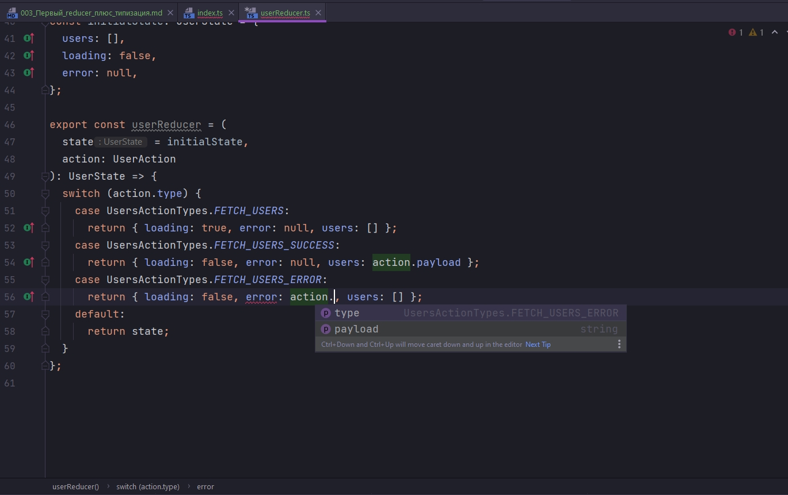

А в этом case массив

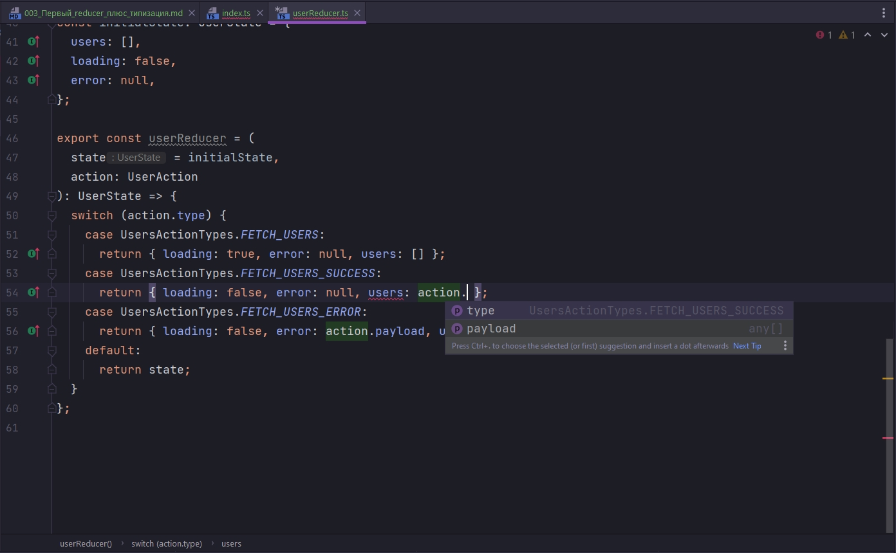

Т.е. экшен принимает тип в зависимости от того в какой case мы попали. И мы четко знаем в каком case, какие поля у action есть и какого они типа.

Теперь сделаем некий рефакторинг. В дирректории types далем файл user.ts И туда выносим все что связано с типами. Оставляем в userReducer голый reducer.

```ts
//src/store/types/user.ts
//Типизирую состояние
export interface UserState {
  users: any[];
  loading: boolean;
  error: null | string;
}

// Перечисления типов экшенов
export enum UsersActionTypes {
  FETCH_USERS = "FETCH_USERS",
  FETCH_USERS_SUCCESS = "FETCH_USERS_SUCCESS",
  FETCH_USERS_ERROR = "FETCH_USERS_ERROR",
}

//Типизирую action FETCH_USERS
interface FetchUsersAction {
  type: UsersActionTypes.FETCH_USERS;
}

//Типизирую action FETCH_USERS_SUCCESS
interface FetchUsersSuccessAction {
  type: UsersActionTypes.FETCH_USERS_SUCCESS;
  payload: any[];
}

//Типизирую action FETCH_USERS
interface FetchUsersErrorAction {
  type: UsersActionTypes.FETCH_USERS_ERROR;
  payload: string;
}

//Объеденяю экшены
export type UserAction =
  | FetchUsersAction
  | FetchUsersSuccessAction
  | FetchUsersErrorAction;

```

```ts
//src/store/reducers/userReducer.ts
import { UserState, UserAction, UsersActionTypes } from "../types/user";

const initialState: UserState = {
  users: [],
  loading: false,
  error: null,
};

export const userReducer = (
  state = initialState,
  action: UserAction
): UserState => {
  switch (action.type) {
    case UsersActionTypes.FETCH_USERS:
      return { loading: true, error: null, users: [] };
    case UsersActionTypes.FETCH_USERS_SUCCESS:
      return { loading: false, error: null, users: action.payload };
    case UsersActionTypes.FETCH_USERS_ERROR:
      return { loading: false, error: action.payload, users: [] };
    default:
      return state;
  }
};

```

И так подведем промежуточный итог:

Мы описали тип состояния. В данном случае мы четко знаем какого типа будет каждое поле. Т.е. users у нас массив, loading это boolean и error это либо null либо пустая строка. Другое значение поместить туда мы не сможем.

Затем мы указали reducer такого типа, а менно типа UserState должне возвращать объект. И если мы случайна забудем вернуть какое-то из полей. Или забудем указать дефолтный case TS нам сразу же сообщит от этом и мы не будем искать ошибку. Т.е. мы уже предотвратили каку-то часто ошибок на этапе написания кода.

Затем мы так же типизировали наш action  и теперь мы четко знаем в каком case, какие значения находяться внутри этого action  и какого типа они должны быть.

