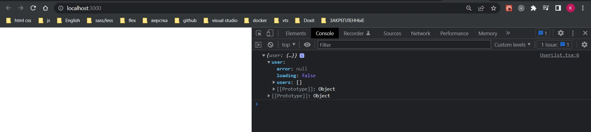

# 004_CombineReducer_Provider

Теперь в reducers создадит index.ts файл и здесь проинициализируем combineReducer котрый будет определять все reducers нашего приложения.

```ts
//src/store/reducers/index.ts
import { combineReducers } from "redux";
import { userReducer } from "./userReducer";

export const rootReducer = combineReducers({
    user: userReducer,
});

```

Затем переходим в корневой index.ts папки store и здесь первым параметром в createStore этот rootReducer передаем.

```ts
// src/store/index.js
import { createStore, applyMiddleware } from "redux";
import thunk from "redux-thunk";
import { rootReducer } from "./reducers";

export const store = createStore(rootReducer, applyMiddleware(thunk));

```

Остается прокинуть состояние в react компоненты. Это делается с помощью Provider который находится в пакете react-redux. 

Пререхожу в главный index.tsx файл приложения. Оборачиваю наш App в Provider и в качестве пропса store передаю store который мы сделали с помощью функции createStore.

```tsx
import React from "react";
import ReactDOM from "react-dom/client";
import "./index.css";
import App from "./App";
import { Provider } from "react-redux";
import { store } from "./store";

const root = ReactDOM.createRoot(
  document.getElementById("root") as HTMLElement
);
root.render(
  <Provider store={store}>
    <App />
  </Provider>
);

```

Создаю компонент UserList.tsx. C помощью React.FC указываю что это функциональный компонент.

И данные из состояния я получаю с помощью хука useSelector

```tsx
import React from "react";
import { useSelector } from "react-redux";

const UserList: React.FC = () => {
  const state = useSelector((state) => state);
  console.log(state);
  return <div></div>;
};

export default UserList;

```
```tsx
import React from "react";
import UserList from "./components/UserList";

function App() {
  return (
    <div>
      <UserList />
    </div>
  );
}

export default App;

```





