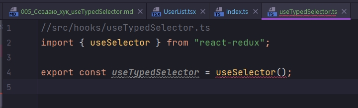
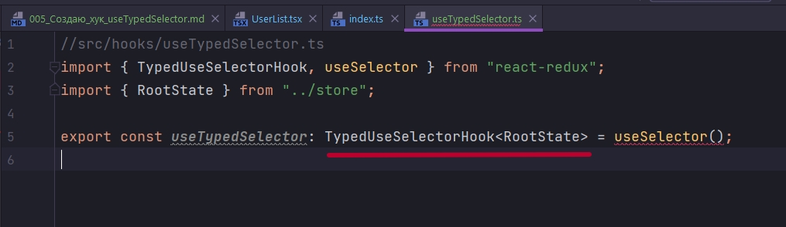

# 005_Создаю_хук_useTypedSelector

Но в компоненте UserList нам все состояние не нужно. Ны хотим получить только массив users. Однако!!!


У него по другому.


В defaultRootState поле users не существует.

Все дело в том что default useSelector особо с типами не дружит. Сейчас мы сделаем свой собвственный хук. 

Откроем файл де мы инициализировали rootReducer. И здесь с помощью TS-скриптовского ReturnType получим тип нашего reducer.


```ts
// src/store/index.js
import { createStore, applyMiddleware } from "redux";
import thunk from "redux-thunk";
import { rootReducer } from "./reducers";

export const store = createStore(rootReducer, applyMiddleware(thunk));

//Получаю тип reducer
export type RootState = ReturnType<typeof rootReducer>;

```

Таким образом мы получает тип нашего reducer-а. И с помощью этого типа мы сможем сделать хук который будет работать с уже с типизированным useSelector.

Создаю папку hooks. И внутри файл useTypedSelector т.е. это тот же useSelector только уж работающий с типами.



useTypedSelector будет равняться обычному useSelector который мы импортируем из react-redux. C одним исключением что мы должны указать для него еще и тип.

Через двоеточие обращаемся к TypedUseSelectorHook который так же  импортируем из react-redux и параметром передаем тот самый RootState который мы получали из нашего редюссера.



```ts
//src/hooks/useTypedSelector.ts
import { TypedUseSelectorHook, useSelector } from "react-redux";
import { RootState } from "../store";

export const useTypedSelector: TypedUseSelectorHook<RootState> = useSelector;

```
Теперь возвращаюсь в UserList.tsx и вместо обычного useSelector используем useTypedSelector


```tsx
import React from "react";
import { useTypedSelector } from "../hooks/useTypedSelector";

const UserList: React.FC = () => {
  const state = useTypedSelector((state) => state.user);
  return <div></div>;
};

export default UserList;

```

user это userReducer


```tsx
import React from "react";
import { useTypedSelector } from "../hooks/useTypedSelector";

const UserList: React.FC = () => {
  const {
    user: { users, loading, error },
  } = useTypedSelector((state) => state);

  return <div></div>;
};

export default UserList;

```

Мы не можем попытаться получить поле которое в нашем reducer отсутствует.

У новичков сейчас возможно возникнет вопрос. Типо нафига это нужно, я и так знаю где какие поля находятся!!

Но в больших проектах это не всегда очевидно и нужно перемещаться по файлам. Смотреть что где располагается, предполагать какого оно типа. Особенно все усложняется когда над проектом работает несколько человек. Один предполагал одно, другой предполагал другое. В случае же использования типизации множество ошибок исключается поскольку ты всегда четко знаешь где у тебя какой тип, какие поля. Ну и конечно же автокомплит в среде разработки никогда не помешает.

