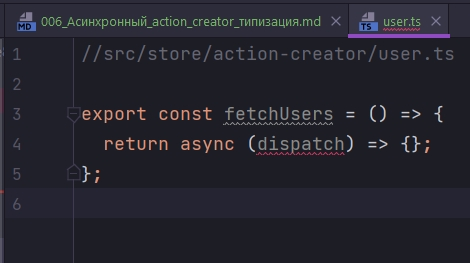
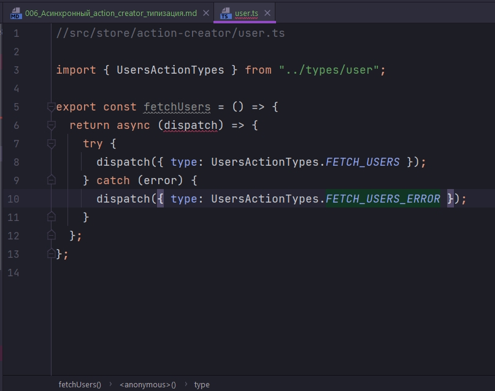
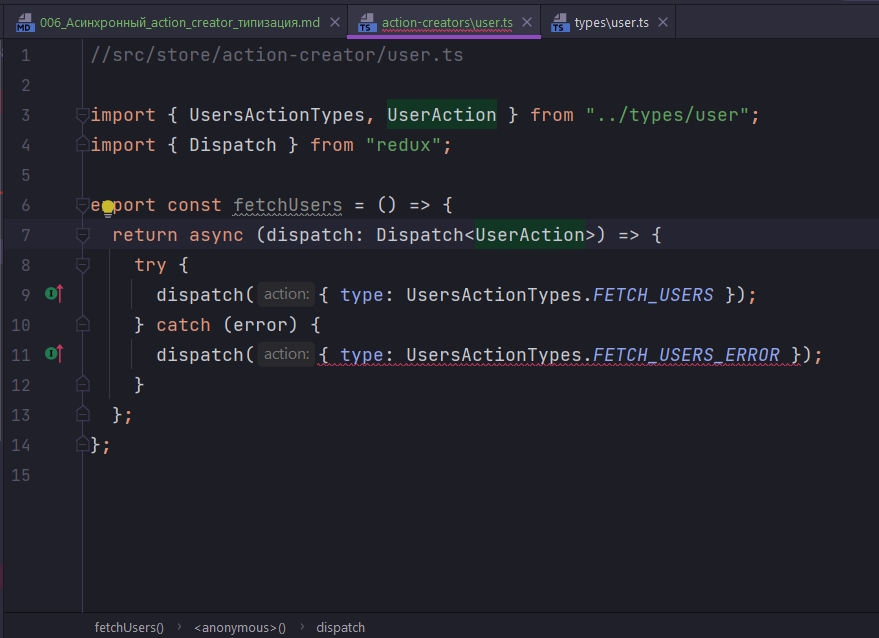
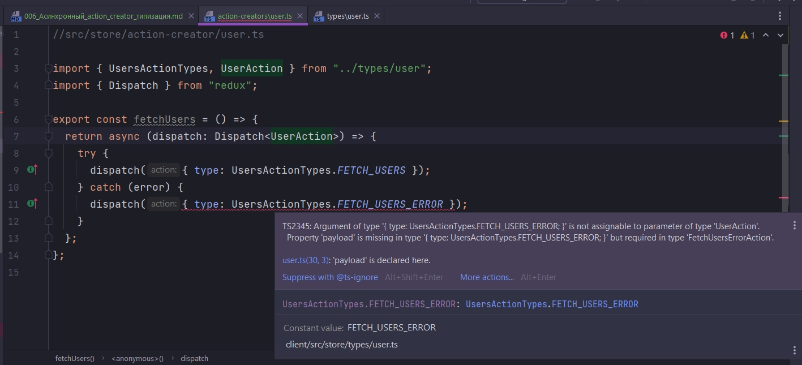
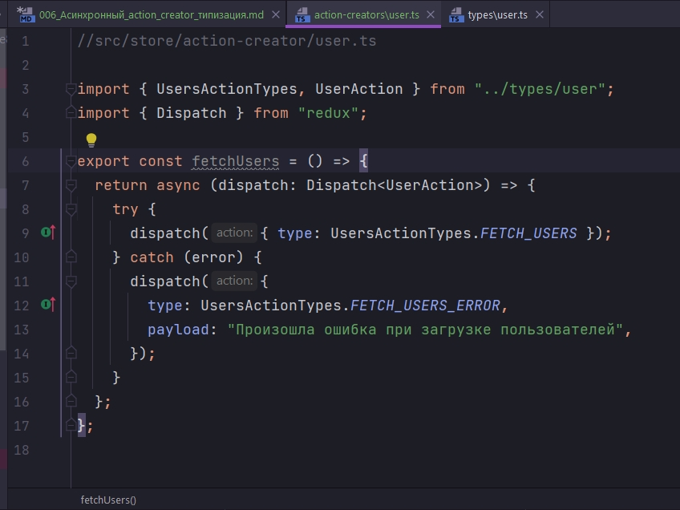
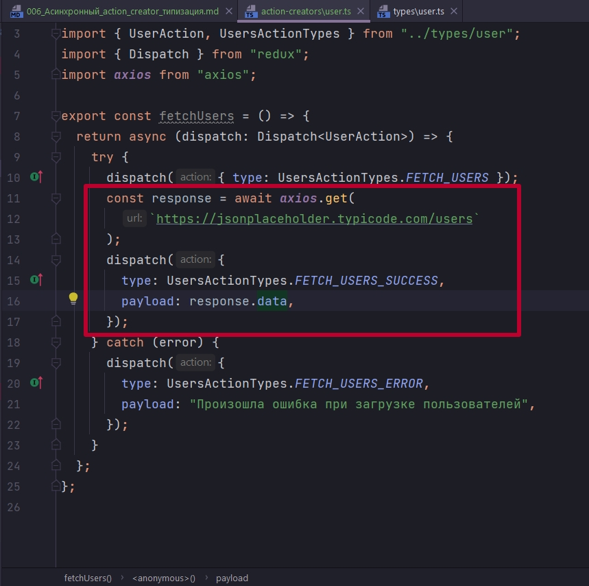
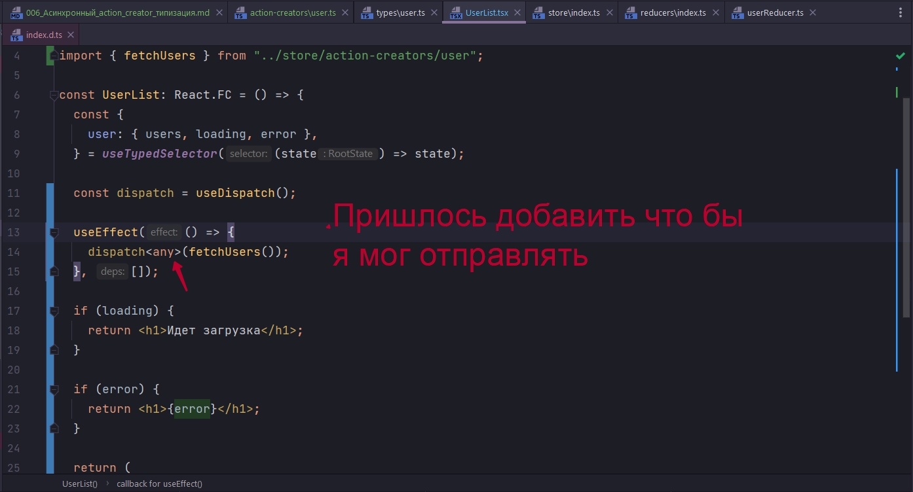
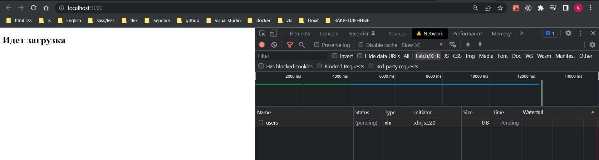
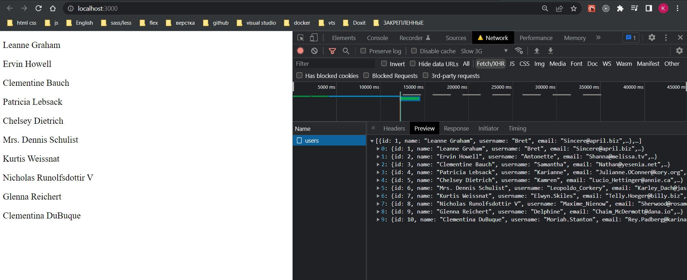
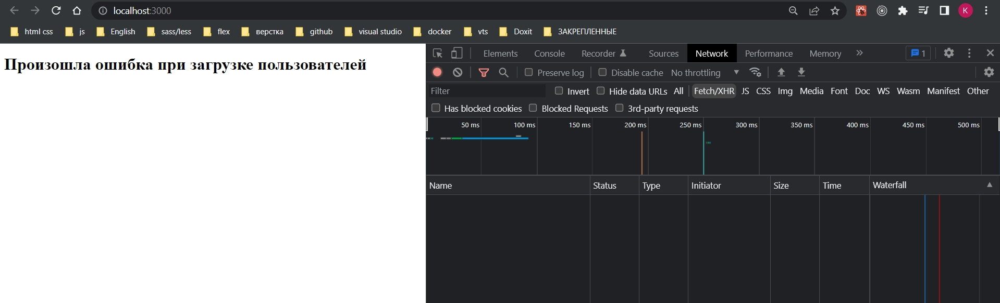

# 006_Асинхронный_action_creator_типизация

Создадим наш первый action creator с помощью которого мы будем получать данные с сервера. 

Создаем папочку action-creator. Внутри создаем одноименный файл user.ts. В нем будут находится action-creator которые связаны конкретно с пользователями.



Из fetchUsers будем возвращать асинхронную функцию которая параметром принимает dispatch. И уже внутри этой функции будем делать запрос на сервер.

Оборачиваю все в try catch что бы отлавливать потенциальные ошибки.

После чего нам в dispatch нужно передать actions FETCH_USERS который loading сделает true, и у нас на сайте появится какая-нибудь крутилка.

Для того что бы добавить тип обращаюсь к перечислению UsersActionTypes в котором храним типы и оттуда достаем FETCH_USERS.



И опять же встает вопрос. Какой толк от этой типизации если в случае ошибки мы должны передать payload, но мы его не передаем и среда ни как не ругается?

Это все потому что мы не типизировали dispatch.

Импортируем Dispatch из redux и в generic указываю как тип UserAction.



И так что бы напомнить что такое UserAction это наши типизированные actions

```ts
//src/store/types/user.ts
//Типизирую состояние
export interface UserState {
  users: any[];
  loading: boolean;
  error: null | string;
}

// Перечисления типов экшенов
export enum UsersActionTypes {
  FETCH_USERS = "FETCH_USERS",
  FETCH_USERS_SUCCESS = "FETCH_USERS_SUCCESS",
  FETCH_USERS_ERROR = "FETCH_USERS_ERROR",
}

//Типизирую action FETCH_USERS
interface FetchUsersAction {
  type: UsersActionTypes.FETCH_USERS;
}

//Типизирую action FETCH_USERS_SUCCESS
interface FetchUsersSuccessAction {
  type: UsersActionTypes.FETCH_USERS_SUCCESS;
  payload: any[];
}

//Типизирую action FETCH_USERS
interface FetchUsersErrorAction {
  type: UsersActionTypes.FETCH_USERS_ERROR;
  payload: string;
}

//Объеденяю экшены
export type UserAction =
  | FetchUsersAction
  | FetchUsersSuccessAction
  | FetchUsersErrorAction;

```

Как видим при описании логики обработки ошибок в dispatch не хватает payload, и среда разработки нам об этом подсказывает.




Свойство "payload" отсутствует в type.



Теперь необходимо реализовать логику самого запроса.



После запроса на сервер вызываю dispatch. Как тип передаем туда UsersActionTypes.FETCH_USERS_SUCCESS поскольку если запрос прошел успешно, то выполнится этот код.

Если произошла ошибка мы попадем в блок catch.

В качестве payload мы передаем те данные которые получили в теле ответа от сервера.

```ts
//src/store/action-creator/user.ts

import { UserAction, UsersActionTypes } from "../types/user";
import { Dispatch } from "redux";
import axios from "axios";

export const fetchUsers = () => {
  return async (dispatch: Dispatch<UserAction>) => {
    try {
      dispatch({ type: UsersActionTypes.FETCH_USERS });
      const response = await axios.get(
        `https://jsonplaceholder.typicode.com/users`
      );
      dispatch({
        type: UsersActionTypes.FETCH_USERS_SUCCESS,
        payload: response.data,
      });
    } catch (error) {
      dispatch({
        type: UsersActionTypes.FETCH_USERS_ERROR,
        payload: "Произошла ошибка при загрузке пользователей",
      });
    }
  };
};

```
И теперь этим action creator что бы сделать запрос на сервер необходимо им воспользоваться.

Переходим в UserList.

Воспользуемся мы им в хуке useEffect при первом рендере компонента. Здесь нам понадобится dispatch. Мы его получим с помощью хука useDispatch



```tsx
import React, { useEffect } from "react";
import { useTypedSelector } from "../hooks/useTypedSelector";
import { useDispatch } from "react-redux";
import { fetchUsers } from "../store/action-creators/user";

const UserList: React.FC = () => {
  const {
    user: { users, loading, error },
  } = useTypedSelector((state) => state);

  const dispatch = useDispatch();

  useEffect(() => {
    dispatch<any>(fetchUsers());
  }, []);

  if (loading) {
    return <h1>Идет загрузка</h1>;
  }

  if (error) {
    return <h1>{error}</h1>;
  }

  return (
    <div>
      {users.map((user) => (
        <p key={user.id}>{user.name}</p>
      ))}
    </div>
  );
};

export default UserList;

```








