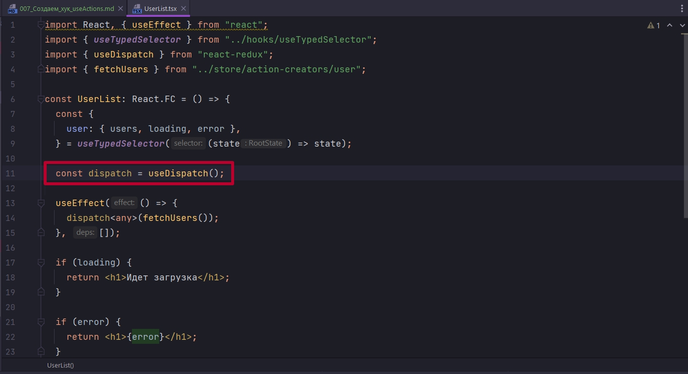

# 007_Создаем_хук_useActions

Но вот эту запись с dispatch



и action-creators/user.ts можно упростить.

Для этого создадим еще один хук useActions.ts

ВСЕ ЭТИ РЕЦЕПТЫ ХУКОВ ЕСТЬ В ДОКУМЕНТАЦИИ. 

В этом хуке инициализирую dispatch. И далее вся суть этого хука в том что мы связываем все action-creators с этим dispatch.  Т.е. нам dispatch уже не понадобится. Нам достаточно будет вызвать action creator и он сам прокинется в dispatch. Импортирую все action creator из файла user и этот объект передаю в bindActionCreators(). А вторым параметром bindActionCreators принимает функцию dispatch.

```ts
//src/hooks/useActions.ts
import { useDispatch } from "react-redux";
import { bindActionCreators } from "redux";
import * as UserActionCreators from "../store/action-creators/user";

export const useActions = () => {
    const dispatch = useDispatch();
    return bindActionCreators(UserActionCreators, dispatch);
};

```


Теперь наш хук содержит все action-creators связанные спользователями.

```tsx
import React, { useEffect } from "react";
import { useTypedSelector } from "../hooks/useTypedSelector";
import { fetchUsers } from "../store/action-creators/user";
import { useActions } from "../hooks/useActions";

const UserList: React.FC = () => {
  const {
    user: { users, loading, error },
  } = useTypedSelector((state) => state);

  const { fetchUsers } = useActions();

  useEffect(() => {
    fetchUsers();
  }, []);

  if (loading) {
    return <h1>Идет загрузка</h1>;
  }

  if (error) {
    return <h1>{error}</h1>;
  }

  return (
    <div>
      {users.map((user) => (
        <p key={user.id}>{user.name}</p>
      ))}
    </div>
  );
};

export default UserList;

```


Код становится более читабельным, нет всяких dispatch и наш компонент отрисовки абсолютно ничего не знает о Redux.


