# 008_Второй_reducer_масштабируем_приложение_постраничный_вывод

Реализуем логику, помимо пользователей, списка дел.

Сразу создадим todoReducer.ts

```ts
//src/store/reducers/todoReducer.ts

export const todoReducer = (state, action) => {
  switch (action.type) {
  }
};

```

И на этом пока притормозим. Поработаем с типами. В types создаю todo.ts.

Начну с того что создам interface для состояния. Внутри у нас будет массив списка дел. 

Помимо привычных loading и error у нас будет пагинация постраничный вывод, по этому здесь будем хранить номер текущей страницы в поле page. И количество товара которое мы будем отображать на одной странице limit.

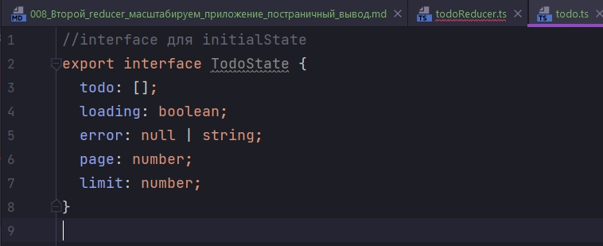

Затем создадим перечисления для типов actions.

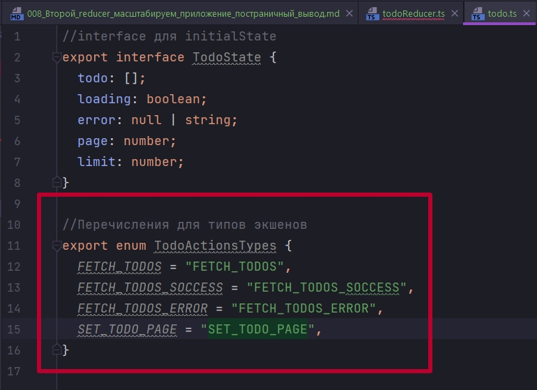

Помимо привычных FETCH запросов здесь будет SET_TODO_PAGE для изменения текущей страницы.

Следующим этапом по уже известной схеме для каждого actions создаю по interface, который будет описывать поля которые у этого actions будут.

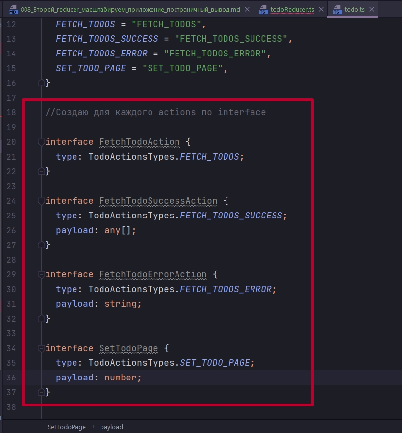

В FetchTodoSuccessAction в payload опять будет массив. Массив мы указываем как any, т.е. объекты в этом массиве могут быть любого типа. 

Но по хорошему сами объекты тоже типизировать т.е. сделать отдельный interface для todo. Отдельный interface для user. И тогда мы четко будем знать какие объекты в этом массиве находятся. Но сейчас тратить время на это мы не будем. ДЕЛАЕМ ОСНОВНОЙ УПОР НА ТИПИЗАЦИЮ ИМЕННО ЛОГИКИ ПО ВЗАИМОДЕЙСТВИЮ С REDUX.

И так interface мы описали. 

Теперь делаем один отдельный тип который назовем TodoAction,  и он будет связуещим звеном для всех типов actions которые мы описали выше.

```ts
//interface для initialState
export interface TodoState {
  todo: [];
  loading: boolean;
  error: null | string;
  page: number;
  limit: number;
}

//Перечисления для типов экшенов
export enum TodoActionsTypes {
  FETCH_TODOS = "FETCH_TODOS",
  FETCH_TODOS_SUCCESS = "FETCH_TODOS_SUCCESS",
  FETCH_TODOS_ERROR = "FETCH_TODOS_ERROR",
  SET_TODO_PAGE = "SET_TODO_PAGE",
}

//Создаю для каждого actions по interface

interface FetchTodoAction {
  type: TodoActionsTypes.FETCH_TODOS;
}

interface FetchTodoSuccessAction {
  type: TodoActionsTypes.FETCH_TODOS_SUCCESS;
  payload: any[];
}

interface FetchTodoErrorAction {
  type: TodoActionsTypes.FETCH_TODOS_ERROR;
  payload: string;
}

interface SetTodoPage {
  type: TodoActionsTypes.SET_TODO_PAGE;
  payload: number;
}

//Связываю actions
export type TodoActions =
  | FetchTodoAction
  | FetchTodoSuccessAction
  | FetchTodoErrorAction
  | SetTodoPage;

```

Возвращаемся в todoReducer. Сразу указываем тип для состояния и тип для action. И так же указываю что эта функция должна возвращать. Возвращаемое значение должно совпадать с типом состояния.

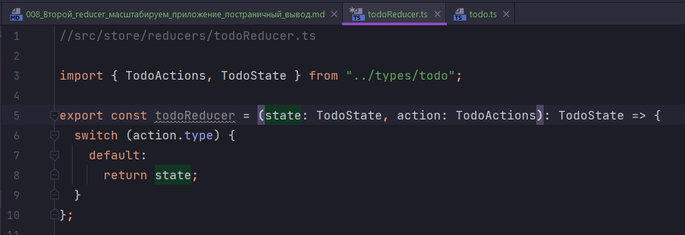

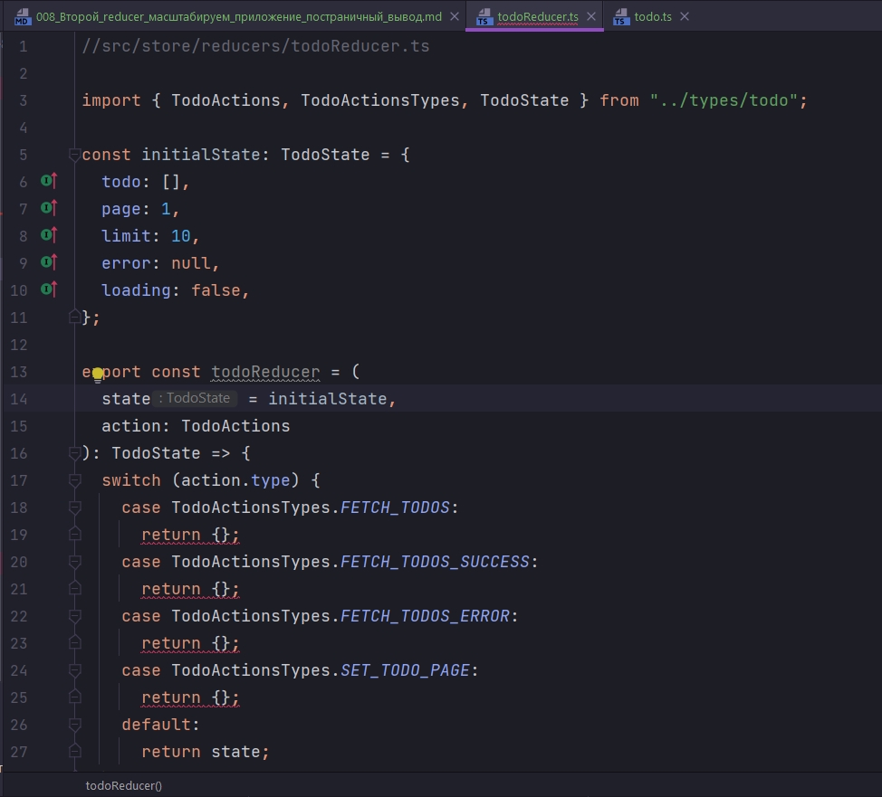

Теперь разберемся с возвращаемыми объектами.

В случае FETCH_TODOS мы возвращаем новое состояние ...stata и поле loading делаем true.

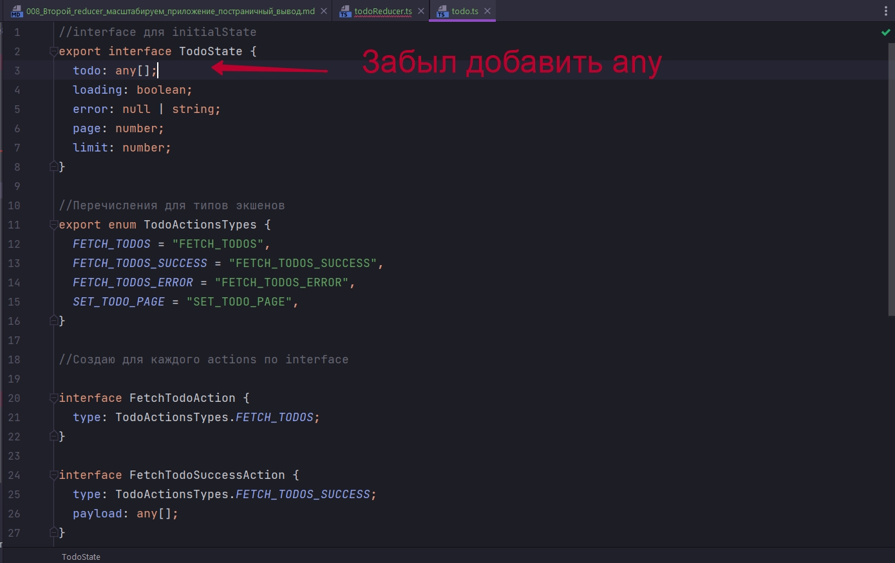

Очень быстро все трындит. На примерах кода разберешься. Не сложно.

```ts
//src/store/reducers/todoReducer.ts

import { TodoActions, TodoActionsTypes, TodoState } from "../types/todo";

const initialState: TodoState = {
  todo: [],
  page: 1,
  limit: 10,
  error: null,
  loading: false,
};

export const todoReducer = (
  state = initialState,
  action: TodoActions
): TodoState => {
  switch (action.type) {
    case TodoActionsTypes.FETCH_TODOS:
      return { ...state, loading: true, error: null };
    case TodoActionsTypes.FETCH_TODOS_SUCCESS:
      return { ...state, loading: false, error: null, todo: action.payload };
    case TodoActionsTypes.FETCH_TODOS_ERROR:
      return { ...state, loading: false, error: action.payload };
    case TodoActionsTypes.SET_TODO_PAGE:
      return { ...state, page: action.payload };
    default:
      return state;
  }
};

```

Передаю в combineReducer

```ts
//src/store/reducers/index.ts
import { combineReducers } from "redux";
import { userReducer } from "./userReducer";
import { todoReducer } from "./todoReducer";

export const rootReducer = combineReducers({
  user: userReducer,
  todo: todoReducer,
});

```

Если посмотрим на RootState то увидим что там появилось еще одно поле todo.

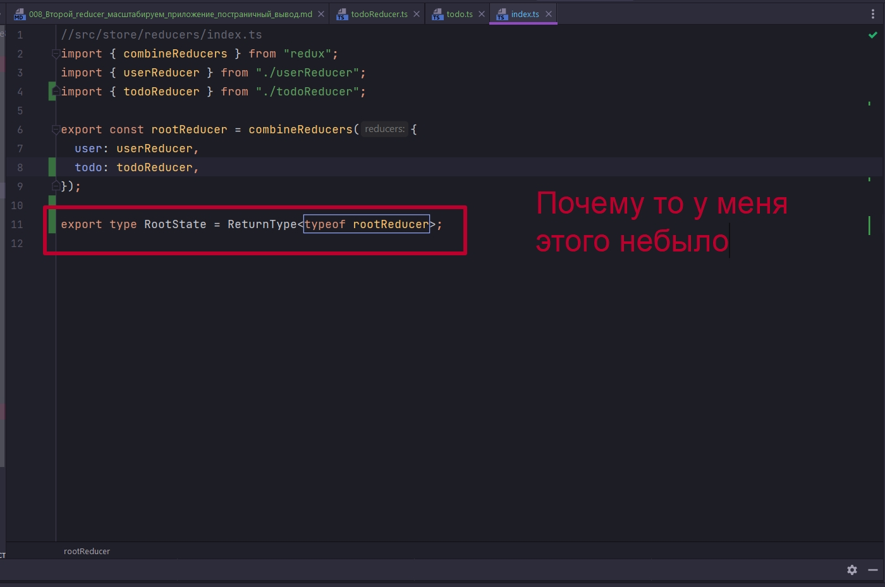

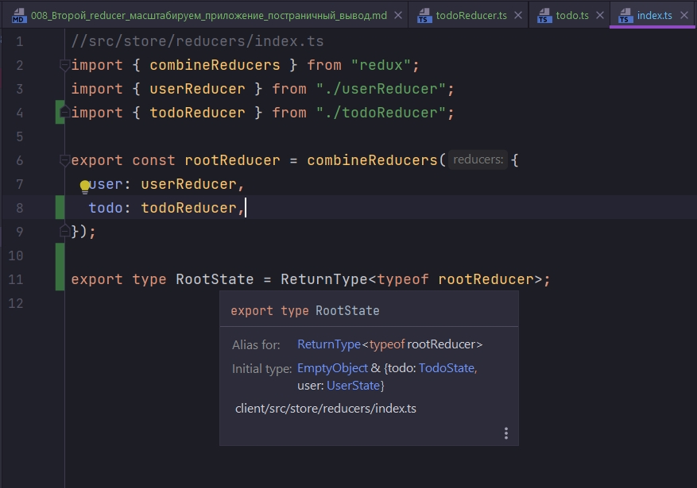

И следующим этапом займемся action-creators. Создаю в папке action-creators файл todo.js. Здесь будут находится action-creators которые непосредственно связаны со списком дел.

No comments!!!

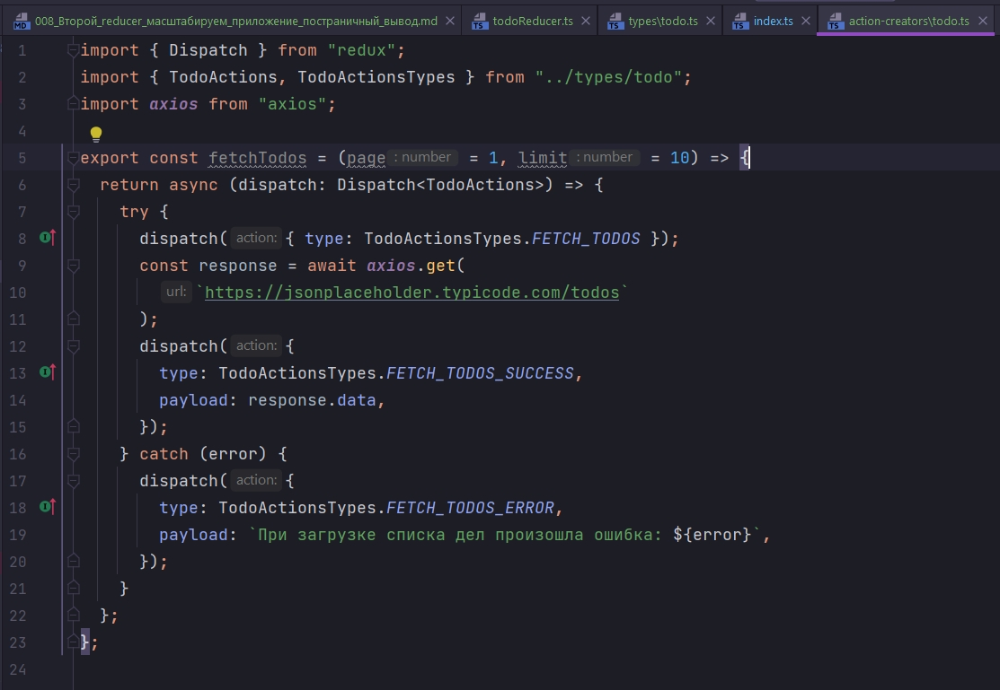

Помимо того что мы описывали ранее. По коду и так понятно. Наш action creator принимает два параметра в функцию это номер страницы page по умолчанию 1, и limit по умолчанию 10.

Теперь эти параметры нужно передать в url строку. В axios.get() вторым параметром передаю объект конфигурации, который принимает объект params:{} как параметр передаю _page:page и _limit: limit. Передаем то что приняла у нас функция.

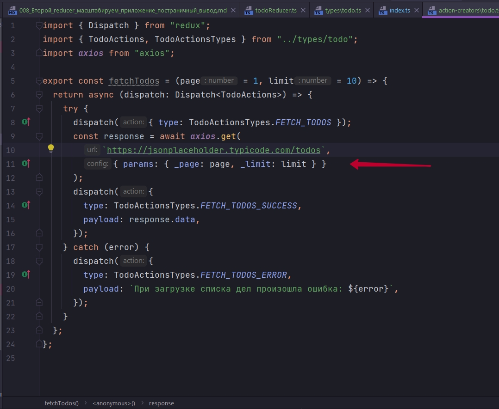

Это так называемые query параметры. Могу ошибаться... 

С action creator fetchTodos мы закончили. 

Сразу сделаем второй.  Он будет предназначен для того что бы менять номер страницы.

Для наглядности сделаю ее обычной функцией. Можно и стрелочной. Эта функция будет принимать номер страницы. Будет типа number. И возвращать этот action creator должен объект типа TodoAction.

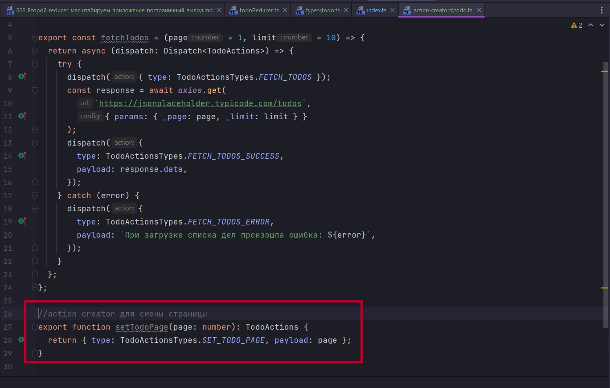

```ts
import { Dispatch } from "redux";
import { TodoActions, TodoActionsTypes } from "../types/todo";
import axios from "axios";

export const fetchTodos = (page = 1, limit = 10) => {
  return async (dispatch: Dispatch<TodoActions>) => {
    try {
      dispatch({ type: TodoActionsTypes.FETCH_TODOS });
      const response = await axios.get(
        `https://jsonplaceholder.typicode.com/todos`,
        { params: { _page: page, _limit: limit } }
      );
      dispatch({
        type: TodoActionsTypes.FETCH_TODOS_SUCCESS,
        payload: response.data,
      });
    } catch (error) {
      dispatch({
        type: TodoActionsTypes.FETCH_TODOS_ERROR,
        payload: `При загрузке списка дел произошла ошибка: ${error}`,
      });
    }
  };
};

//action creator для смены страницы
export function setTodoPage(page: number): TodoActions {
  return { type: TodoActionsTypes.SET_TODO_PAGE, payload: page };
}

```

Создаю еще один компонент. Называю его TodoList.tsx. Я везде писал todo а надо todos. И среда разработки прекрасно подсказывает.

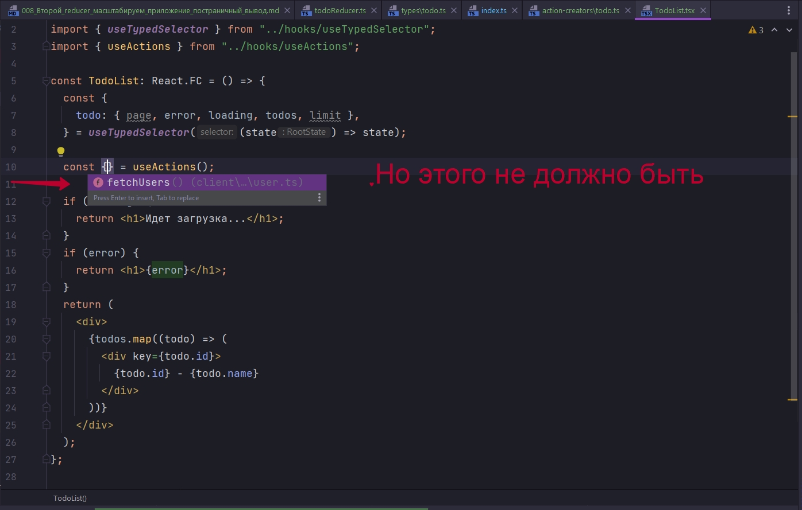

Все правильно ведь мы используем в bindActionCreators мы используем только UserActionCreators.

В папке action-creator создаю index.js и в нее импортирую все action action creators

```ts
//src/store/action-creators/index.ts
import * as UserActionCreators from "./user";
import * as TodoActionCreators from "./todo";

/*На выходе из этого файла мы должны вернуть объект
 * который объеденяет action creators для пользователя
 * и action creators для туду
 * */

export default {
  ...UserActionCreators,
  ...TodoActionCreators,
};

```

Теперь все action creators сосредоточены в одном файле index.ts. И если мы будем приложение расширять мы будем так же их добавлять в этот файл.

Теперь в useActions немного подправим.

```ts
//src/hooks/useActions.ts
import { useDispatch } from "react-redux";
import { bindActionCreators } from "redux";
import ActionCreators from "../store/action-creators/index";

export const useActions = () => {
  const dispatch = useDispatch();
  return bindActionCreators(ActionCreators, dispatch);
};

```

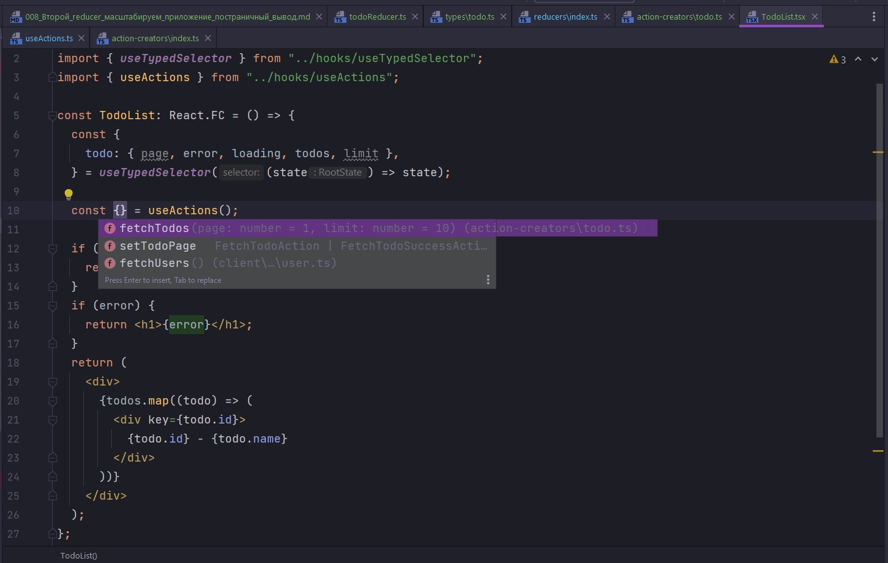

```tsx
import React, { useEffect } from "react";
import { useTypedSelector } from "../hooks/useTypedSelector";
import { useActions } from "../hooks/useActions";

const TodoList: React.FC = () => {
  const {
    todo: { page, error, loading, todos, limit },
  } = useTypedSelector((state) => state);

  const { fetchTodos } = useActions();

  useEffect(() => {
    fetchTodos(page, limit);
  }, []);

  if (loading) {
    return <h1>Идет загрузка...</h1>;
  }
  if (error) {
    return <h1>{error}</h1>;
  }
  return (
    <div>
      {todos.map((todo) => (
        <div key={todo.id}>
          {todo.id} - {todo.name}
        </div>
      ))}
    </div>
  );
};

export default TodoList;

```

```tsx
import React from "react";
import UserList from "./components/UserList";
import TodoList from "./components/TodoList";

function App() {
    return (
        <div>
            <UserList />
            <hr />
            <TodoList />
        </div>
    );
}

export default App;


```

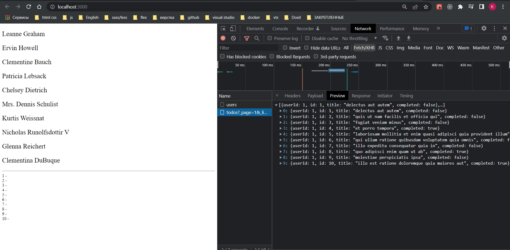

И вим почему то только id.

ВОТ НАГЛЯДНЕЙШИЙ ПРИМЕР ДЛЯ ЧЕГО НЕОБХОДИМО БЫЛО ТАК ЖЕ ТИПИЗИРОВАТЬ И ОБЪЕКТЫ КОТОРЫЕ НАХОДЯТСЯ  В МАССИВАХ Т.Е. ПОЛЬЗОВАТЕЛЕЙ И САМИ TODO. У НАС ДОЛЖЕН БЫТЬ TITLE А НЕ NAME.

```tsx
import React, { useEffect } from "react";
import { useTypedSelector } from "../hooks/useTypedSelector";
import { useActions } from "../hooks/useActions";

const TodoList: React.FC = () => {
  const {
    todo: { page, error, loading, todos, limit },
  } = useTypedSelector((state) => state);

  const { fetchTodos } = useActions();

  useEffect(() => {
    fetchTodos(page, limit);
  }, []);

  if (loading) {
    return <h1>Идет загрузка...</h1>;
  }
  if (error) {
    return <h1>{error}</h1>;
  }
  return (
    <div>
      {todos.map((todo) => (
        <div key={todo.id}>
          {todo.id} - {todo.title}
        </div>
      ))}
    </div>
  );
};

export default TodoList;

```

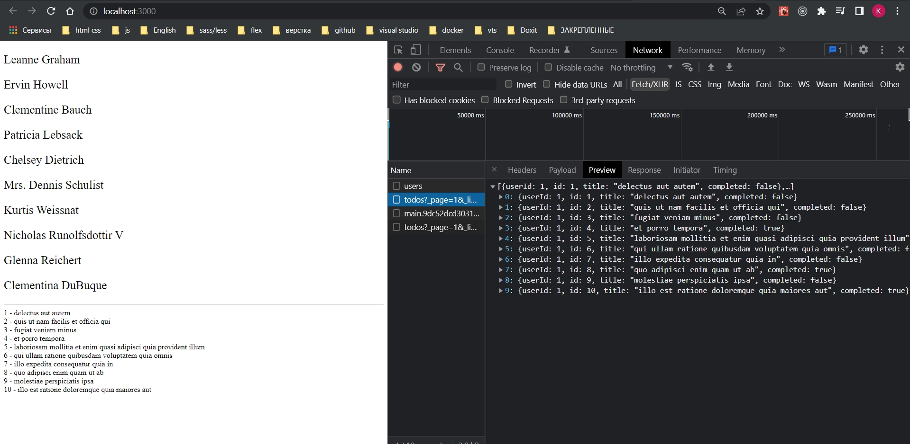

Теперь займемся пагинцией. Высчитывать количество страниц мы не будем. Представим что у нас в приложении их всего пять.

Кароче смотри по коду.

```tsx
import React, { useEffect } from "react";
import { useTypedSelector } from "../hooks/useTypedSelector";
import { useActions } from "../hooks/useActions";

const TodoList: React.FC = () => {
    const {
        todo: { page, error, loading, todos, limit },
    } = useTypedSelector((state) => state);

    const { fetchTodos, setTodoPage } = useActions();

    const pages = [1, 2, 3, 4, 5];

    useEffect(() => {
        fetchTodos(page, limit);
    }, [page]);

    if (loading) {
        return <h1>Идет загрузка...</h1>;
    }
    if (error) {
        return <h1>{error}</h1>;
    }
    return (
        <div>
            {todos.map((todo) => (
                <div key={todo.id}>
                    {todo.id} - {todo.title}
                </div>
            ))}
            <div style={{ display: "flex" }}>
                {pages.map((p) => (
                    <div
                        style={{
                            border: p === page ? "2px solid green" : "1px solid gray",
                            padding: 10,
                        }}
                        key={p}
                        onClick={() => setTodoPage(p)}
                    >
                        {p}
                    </div>
                ))}
            </div>
        </div>
    );
};

export default TodoList;


```

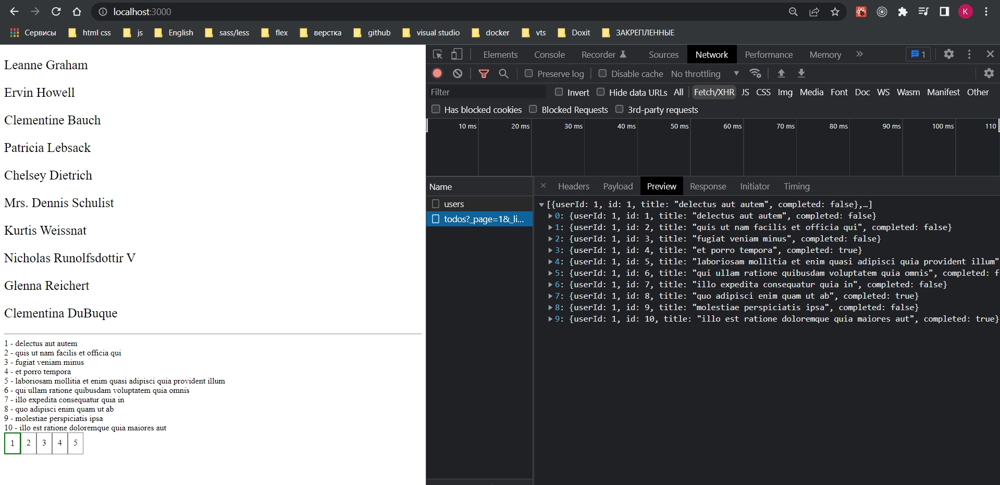

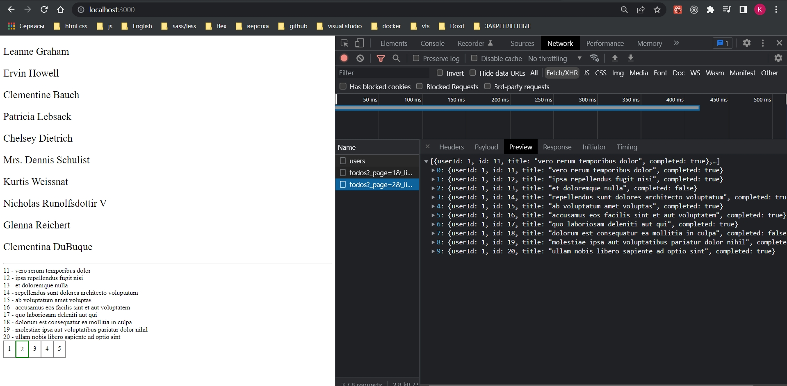

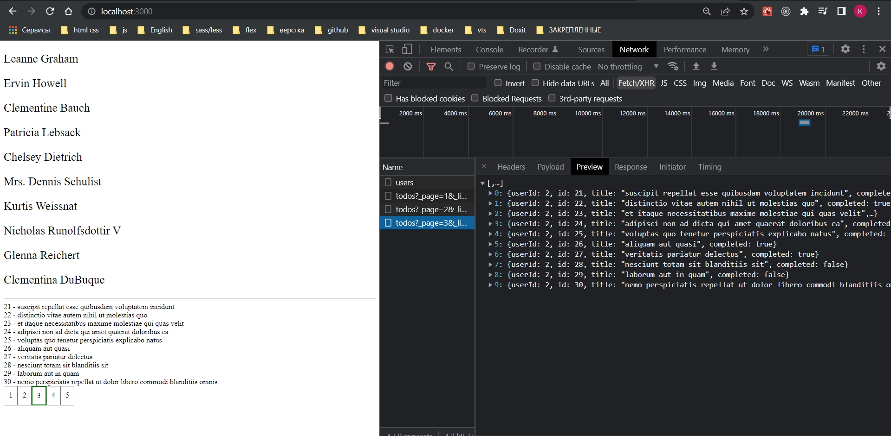


  


