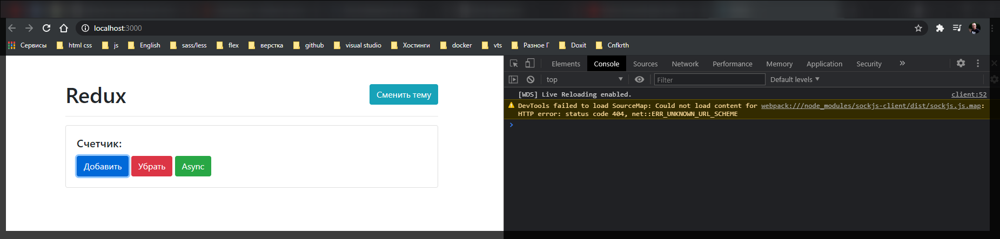
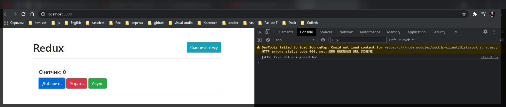
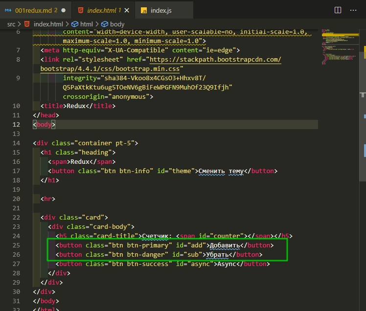
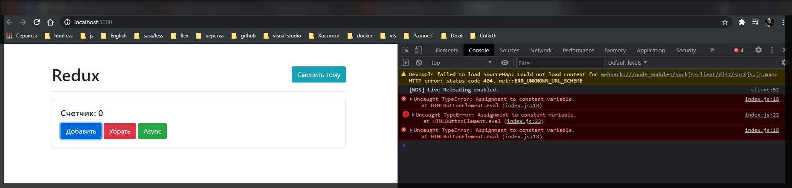
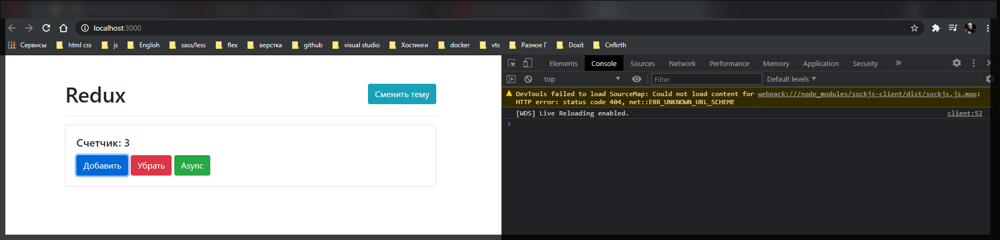
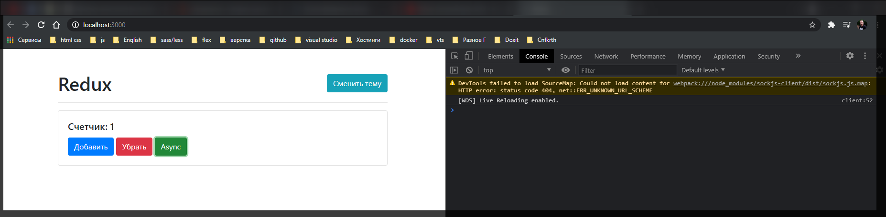
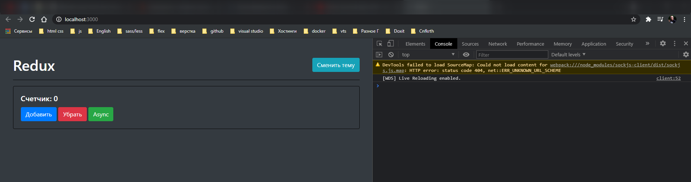
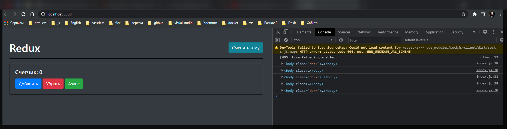

# Redux

[https://www.youtube.com/watch?v=YdYyYMFPa44](https://www.youtube.com/watch?v=YdYyYMFPa44)

Разберем все концепты которые существуют это **compose**, **applyMiddleware**, разберемся как работать со **state**. Разберемся с тем как создавать сам **redux** потому что на самом деле это всего лишь несколько строчек кода и было бы не плохо что бы понимать **redux**, как он устроен. Поговорим про **patterns** и как вообще это все можно сделать.

Ссылка на каркас приложения [https://github.com/vladilenm/redux-course-2020](https://github.com/vladilenm/redux-course-2020)

В первую очередь я хочу написать это приложение без использования **redux** т.е. на чистом **js**. Делаю это для того что бы показать какую задачу решает **redux** и как это отличается от базового использования взаимодействия.



Пока приложение не работает.

пока что всю реализацию я буду вести в **index.js**.

Представим что значение счетчика будет представлено в переменной **state** который по умолчанию будет равен нулю.

```jsx
import './styles.css';

let state = 0;
```

Т.е. мы сейчас не в шаблоне, т.е. в **index.html**, описываем значение счетчика. А описываем в **js** в модели описываем его значение.

Теперь для того что бы соеденить модель и представление нам необходимо его вывести в шаблон.

Я могу воспользоватся базовыми представлениями в **DOM** т.е. получить допустим **counter**

```jsx
//src/index.js
import './styles.css';

const counter = document.getElementById('counter');

let state = 0;
```

Данный counter я беру из представления

```html
<!DOCTYPE html>
<html lang="en">
  <head>
    <meta charset="UTF-8" />
    <meta
      name="viewport"
      content="width=device-width, user-scalable=no, initial-scale=1.0, maximum-scale=1.0, minimum-scale=1.0"
    />
    <meta http-equiv="X-UA-Compatible" content="ie=edge" />
    <link
      rel="stylesheet"
      href="https://stackpath.bootstrapcdn.com/bootstrap/4.4.1/css/bootstrap.min.css"
      integrity="sha384-Vkoo8x4CGsO3+Hhxv8T/Q5PaXtkKtu6ug5TOeNV6gBiFeWPGFN9MuhOf23Q9Ifjh"
      crossorigin="anonymous"
    />
    <title>Redux</title>
  </head>
  <body>
    <div class="container pt-5">
      <h1 class="heading">
        <span>Redux</span>
        <button class="btn btn-info" id="theme">Сменить тему</button>
      </h1>

      <hr />

      <div class="card">
        <div class="card-body">
          <h5 class="card-title">Счетчик: <span id="counter"></span></h5>
          <button class="btn btn-primary" id="add">Добавить</button>
          <button class="btn btn-danger" id="sub">Убрать</button>
          <button class="btn btn-success" id="async">Async</button>
        </div>
      </div>
    </div>
  </body>
</html>
```

Дальше я могу написать **counter.textContent = state.toString()**. Но для того что бы все заработало оборачиваю это все в функции **render** и вызываю ее.

```jsx
//src/index.js
import './styles.css';

const counter = document.getElementById('counter');

let state = 0;

function render() {
  counter.textContent = state.toString();
}

render();
```

render по факту изменяет наш шаблон.



Теперь нужно оживить шаблон.

Теперь нужно оживить кнопки **"Добавить"** и **"Убрать"**. Для этого в представлении у каждой кнопки есть свой id **add** и **sub**



Соответственно я их тоже могу получить и запихнуть их в переменные **addBtn** и **subBtn**

```jsx
//src/index.js
import './styles.css';

const counter = document.getElementById('counter');
const addBtn = document.getElementById('add');
const subBtn = document.getElementById('sub');

let state = 0;

function render() {
  counter.textContent = state.toString();
}

render();
```

Дальше для того что бы добавить это взаимодействие мы можем добавить прослушку события с помощью **addEventListener**

```jsx
//src/index.js
import './styles.css';

const counter = document.getElementById('counter');
const addBtn = document.getElementById('add');
const subBtn = document.getElementById('sub');

let state = 0;

function render() {
  counter.textContent = state.toString();
}

addBtn.addEventListener('click', () => {
  state++;
});

subBtn.addEventListener('click', () => {
  state--;
});

render();
```



Нажимаю на кнопки и ничего не происходит.

Не происходит ничего потому что мы не перерисовываем наш шаблон. Т.е. соответственно после каждого изменения модели нам необходимо вызывать **render**. Это впринципе то как работает **react**. Т.е. мы там вызываем **setState** который автоматически вызывает **render**.

```jsx
//src/index.js
import './styles.css';

const counter = document.getElementById('counter');
const addBtn = document.getElementById('add');
const subBtn = document.getElementById('sub');

let state = 0;

function render() {
  counter.textContent = state.toString();
}

addBtn.addEventListener('click', () => {
  state++;
  render();
});

subBtn.addEventListener('click', () => {
  state--;
  render();
});

render();
```



<hr/>

<br>
<br>
<br>

Теперь что касается кнопки **Async**. Кнопку эту мы можем получить по id **async** и присваиваю в переменную **asyncBtn**.

```jsx
//src/index.js
import './styles.css';

const counter = document.getElementById('counter');
const addBtn = document.getElementById('add');
const subBtn = document.getElementById('sub');
const asyncBtn = document.getElementById('async');

let state = 0;

function render() {
  counter.textContent = state.toString();
}

addBtn.addEventListener('click', () => {
  state++;
  render();
});

subBtn.addEventListener('click', () => {
  state--;
  render();
});

asyncBtn.addEventListener('click', () => {
  setTimeout(() => {
    state++;
    render();
  }, 2000);
});

render();
```



Все работает. Такой стиль написания кода более чем знаком. Помимо этого оживим кнопочку сменить тему. Эта кнопка ни как не относится к нашему счетчику и которая относится к другому состоянию нашего приложения.

В представлении у нас есть кнопка у которой id **theme**

```jsx
//src/index.js
import './styles.css';

const counter = document.getElementById('counter');
const addBtn = document.getElementById('add');
const subBtn = document.getElementById('sub');
const asyncBtn = document.getElementById('async');
const themeBtn = document.getElementById('theme');

let state = 0;

function render() {
  counter.textContent = state.toString();
}

addBtn.addEventListener('click', () => {
  state++;
  render();
});

subBtn.addEventListener('click', () => {
  state--;
  render();
});

asyncBtn.addEventListener('click', () => {
  setTimeout(() => {
    state++;
    render();
  }, 2000);
});

themeBtn.addEventListener('click', () => {});

render();
```

Для того что бы изменить тему мы должны просто добавлять тегу **body** определенный класс. Если я сейчас вручную добавлю ему класс **dark**.



Если класс убираю то тема становится **default**.

Совет. Для того что бы сделать переключалку тем. Если у вас мало кода вы можете сделать что-то подобное

```css
body {
  transition: 0.2s all ease-in;
}

body.dark {
  background: #343a40;
  color: #fff;
}

body.dark hr {
  border-top: 1px solid rgba(0, 0, 0, 0.9);
}

body.dark .card {
  background: #343a40;
  border: 1px solid rgba(0, 0, 0, 0.875);
}

.heading {
  display: flex;
  align-items: center;
  justify-content: space-between;
}
```

Для большей гибкости лючше создать **css** файл который будет отвечать за другую тему и динамически его менять.

При клике на кнопку мы можем обратиться к **document.body** далее обратиться к объекту **classList** вызвать у него метод **toggle()** который добавляет или удаляет класс который мы туту укажем.

```jsx
//src/index.js
import './styles.css';

const counter = document.getElementById('counter');
const addBtn = document.getElementById('add');
const subBtn = document.getElementById('sub');
const asyncBtn = document.getElementById('async');
const themeBtn = document.getElementById('theme');

let state = 0;

function render() {
  counter.textContent = state.toString();
}

addBtn.addEventListener('click', () => {
  state++;
  render();
});

subBtn.addEventListener('click', () => {
  state--;
  render();
});

asyncBtn.addEventListener('click', () => {
  setTimeout(() => {
    state++;
    render();
  }, 2000);
});

themeBtn.addEventListener('click', () => {
  document.body.classList.toggle('dark');
  console.log(document.body);
});

render();
```



Теперь видно что при каждом клике на кнопку класс то добавляется, то удаляется.

И вот оно все приложение на чистом **JS**. Здесь мы использовали абсолютно базовые подходы.

Смотри далее....
