# Redux

В таком коде, который был написан чуть ранее, получается что некоторое состояние храниться прямо внутри компонента. Потому что на самом деле то что мы сейчас написали в **index.js** это и есть едиственный компонент внутри нашего приложения. И **state** мы храним прямо внутри.

А что же вообще такое состояние? Допустим мы работаем в нашем приложении и существенно уменьшаем **counter** или увеличиваем его, меняем тему. Но как только мы перезагружаем страницу все сбрасывается к **default** настройкам т.е. счетчик равняется первоначальному значени, и класс **dark** у тега **body** так же теряется. Приложение вернулось в начальное свое состояние.

Так вот как раз таки то что пропало это и есть состояние. Т.е. это некоторая модель описывающая то как ведет себя приложение.

**state** может быть некоторой моделью. А модель в **JS** это в том числе объекты т.е. есть примитивные модели например строки или числа, но в общем виде это просто объекты где мы в объекте описываем просто данными то как должно вести себя наше приложение.

Сейчас наше состояние находится в переменной **state**

```jsx
//src/index.js
import './styles.css';

const counter = document.getElementById('counter');
const addBtn = document.getElementById('add');
const subBtn = document.getElementById('sub');
const asyncBtn = document.getElementById('async');
const themeBtn = document.getElementById('theme');

let state = 0;

function render() {
  counter.textContent = state.toString();
}

addBtn.addEventListener('click', () => {
  state++;
  render();
});

subBtn.addEventListener('click', () => {
  state--;
  render();
});

asyncBtn.addEventListener('click', () => {
  setTimeout(() => {
    state++;
    render();
  }, 2000);
});

themeBtn.addEventListener('click', () => {
  document.body.classList.toggle('dark');
  console.log(document.body);
});

render();
```

Хранить слой представления и слой данных в перемешку это достаточно плохо. Люди начали придумывать как нам добавить еще один абстрактный слой для работы с данными и отделить его от представления.

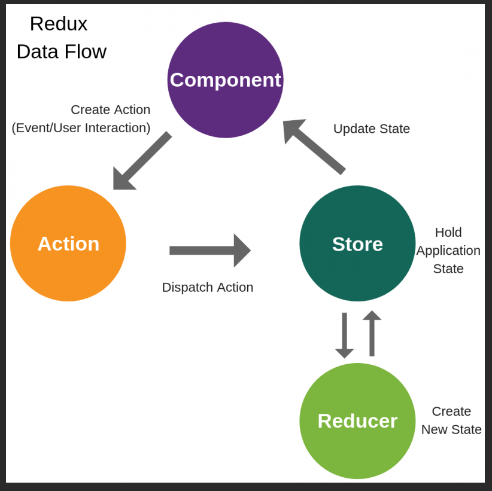

Сейчас у нас **index.js** представляет своего рода компонент. Внутри компонента что мы можем делать? Мы можем каким-то образом взаимодействовать с пользователем. Т.е. через **UI** представление с помощью **Event**.

Теперь вместо того что бы мы на прямую меняли некоторое состояние мы берем ни напрямую отправляем некоторое взаимодействие в так называемый **action** т.е. сейчас вместо того что бы на прямую изменить состояние мы берем и создаем некоторы **action**. **Action** на прямую ни как не взаимодействует ни с видом ни счем, т.е. это просто некоторый объект.

Дальше мы берем и с помощью этого **Action** взаимодействуем с таким понятием как **Store**. **Store** - это то место которое держит состояние всего нашего приложения. По сути, что бы было лучше для начало,**store** - это то место где хранится объект **state**, a **state** это и есть наше состояние. И в нашем случае это будет **counter = 0**.

Т.е. вместо того что бы на прямую просто изменить шаблон мы формируем некоторый **Action** который является объектом и с помощью этого объекта отправляем его в **store** где хранится объект состояния.

Теперь для того что бы что-то изменить в шаблоне нам необходимо изменить объект самого состояния. В этом и заключается суть **redux** по сути. Но напрямую мы не можем этого делать.

Поэтому вводится такое понятие как **Reducer**. **Reducer** - это всего лишь функция которая меняет объект. Для базового понимания этого достаточно.

Т.е. когда прилетает **Action** в **Store** мы берем и в **Reducer** согласно этому **Action** меняем объект **state**. После того как применили изменения в **Reducer** снова отправляем их в **Store**. И когда компонент видит что что-то изменилось в **Store**, например состояние **counter** c **0** на **1**, мы берем и перерисовываем компонент.

<hr>

Напишем свой собственный **redux** для того что бы очень просто и до конца разобраться что же на самом деле это такое.

Создаю новый файл **native.js**. И в **index.js** удаляю все лишнее.

```jsx
//src/index.js
import './styles.css';

const counter = document.getElementById('counter');
const addBtn = document.getElementById('add');
const subBtn = document.getElementById('sub');
const asyncBtn = document.getElementById('async');
const themeBtn = document.getElementById('theme');

addBtn.addEventListener('click', () => {});

subBtn.addEventListener('click', () => {});

asyncBtn.addEventListener('click', () => {});

themeBtn.addEventListener('click', () => {
  // document.body.classList.toggle('dark');
});

render();
```

Согласно тому что у нас есть **redux**. По сути нам нужен некоторый объект который является **store**.

Для того что бы его создать вызываю функцию **createStore()** и запихиваю ее в переменную **store**.

```jsx
//src/index.js
import './styles.css';

const counter = document.getElementById('counter');
const addBtn = document.getElementById('add');
const subBtn = document.getElementById('sub');
const asyncBtn = document.getElementById('async');
const themeBtn = document.getElementById('theme');

const store = createStore();

addBtn.addEventListener('click', () => {});

subBtn.addEventListener('click', () => {});

asyncBtn.addEventListener('click', () => {});

themeBtn.addEventListener('click', () => {
  // document.body.classList.toggle('dark');
});

render();
```

Как видите сейчас функции **createStore** нет. Для его создания создаю новый файл **createStore.js**. И из этого файля я буду экспортировать функцию **createStore** которую сейчас и создам.

```jsx
//app/createStore.js
export function createStore() {}
```

Сейчас напишем свой собственный **redux** просто для того что бы просто понять как это работает. Импортирую

```jsx
//src/index.js
import createStore from './createStore.js';
import './styles.css';

const counter = document.getElementById('counter');
const addBtn = document.getElementById('add');
const subBtn = document.getElementById('sub');
const asyncBtn = document.getElementById('async');
const themeBtn = document.getElementById('theme');

const store = createStore();

addBtn.addEventListener('click', () => {});

subBtn.addEventListener('click', () => {});

asyncBtn.addEventListener('click', () => {});

themeBtn.addEventListener('click', () => {
  // document.body.classList.toggle('dark');
});

render();
```

Теперь мы знаем что вызывая функцию **createStore** мы должны получить объект **store** который умеет взаимодействовать с данными и соответственно каким-то образом говорить компоненту что что-то в нем изменилось.

Т.е. сам по себе **store** это объект

```jsx
//app/createStore.js
export function createStore() {
  return {};
}
```

У **redux** **store** присутствует несколько методов. Базовый метод это **dispatch(){}**, другой метод это **subscribe(){}**, и третий метод **getState()**. Пока что мы просто пишем эти **interface**, мы сами методы не создаем.

```jsx
//app/createStore.js
export function createStore() {
  return {
    dispatch() {},
    subscribe() {},
    getState() {},
  };
}
```

Если вы посмотрите на название данных методов, то вы мне можете сказать что это очень похоже не паттерн **observer**(наблюдатель) [https://refactoring.guru/ru/design-patterns/observer](https://refactoring.guru/ru/design-patterns/observer)

По описанию этого паттерна становится понятно что это то что нам нужно. Т.е. если еще раз взглянуть на


**Component** может реагировать на то что происходит в других объектах. По-этому как раз таки реализация **redux** и конкретно **createStore** она использует в своем корне паттерн **observer**(наблюдатель). Поэтому тут есть метод **dispatch** говорящий что тут нужно что-то изменить, что что-то поменялось, что что-то произошло. А метод **subscribe** он говорит что все слушатели которые слушают этот объект они должны что-то поменять.

Реализация.

Здесь мы используем реализацию через функцию.

```jsx
//app/createStore.js
export function createStore() {
  return {
    dispatch() {},
    subscribe() {},
    getState() {},
  };
}
```

и делается это для того что бы мы воспользовались всей мощью замыканий.

Зачем в данном случае нам нужны замыкания? Затем что по умолчанию в большинстве форматов языка **JS** нет приватных переменных. А благодаря замыканию мы можем их получить.

Такоим образом как мыпишем **return** и объект **{}**

```jsx
//app/createStore.js
export function createStore() {
  return {
    dispatch() {},
    subscribe() {},
    getState() {},
  };
}
```

Вот это **dispatch**, **subscribe**, **getState** публичные методы.

Но то что будет находится в глобальном контектсе функции **createStore** будет не доступно для тех кусков кода которые будут использовать этот **store**. Т.е. мы создаем некоторые приватные вещи например переменную **state**. И пусть по умолчанию это будет пустой объект

```jsx
//app/createStore.js
export function createStore() {
  const state = {};

  return {
    dispatch() {},
    subscribe() {},
    getState() {},
  };
}
```

И сразу же мы можем реализовать метод **getState**. Т.е. здесь есть публичный метод позволяющий получить этот **state**.

```jsx
//app/createStore.js
export function createStore() {
  const state = {};

  return {
    dispatch() {},
    subscribe() {},
    getState() {
      return state;
    },
  };
}
```

Т.е. благодаря этому геттеру **getState** мы можем получить состояние **state**. Для того что бы понимать в каком состоянии находится все наше приложение.

теперь реализую **subscribe**. В **subscribe** мы передаем некоторый **callback** т.е. функцию которая выполниться тогда когда когда что-то произойдет.

```jsx
//app/createStore.js
export function createStore() {
  const state = {};

  return {
    dispatch() {},
    subscribe(callback) {},
    getState() {
      return state;
    },
  };
}
```

но для того что бы что-то произошло нужны сами слушатели. Их я создам при помоща массива **subscribers**

```jsx
//app/createStore.js
export function createStore() {
  const state = {};
  const subscribers = [];

  return {
    dispatch() {},
    subscribe(callback) {},
    getState() {
      return state;
    },
  };
}
```

Это у нас пустой массив. И как раз таки к этому массиву мы не имеем доступ во вне т.е. только внутри функции **createStore**.

Когда мы подписываемся на store то по сути мы просто берем и в массив **subscribers** вкладываем новый **callback**. Т.е. мы просто складываем этот **callback** и ничего с ним не делаем.

```jsx
//app/createStore.js
export function createStore() {
  const state = {};
  const subscribers = [];

  return {
    dispatch() {},

    subscribe(callback) {
      subscribers.push(callback);
    },

    getState() {
      return state;
    },
  };
}
```

Теперь что касается метода **dispatch**. По **redux** в метод **dispatch** мы принимаем некоторый **action**

```jsx
//app/createStore.js
export function createStore() {
  const state = {};
  const subscribers = [];

  return {
    dispatch(action) {},

    subscribe(callback) {
      subscribers.push(callback);
    },

    getState() {
      return state;
    },
  };
}
```

**action** - по сути он равен обычному объекту у которого есть обязательное поле, это поле **type**.

```jsx
//app/createStore.js
export function createStore() {
  const state = {};
  const subscribers = [];

  return {
    // action === {type: 'INCREMENT'} допустим INCREMENT
    dispatch(action) {},

    subscribe(callback) {
      subscribers.push(callback);
    },

    getState() {
      return state;
    },
  };
}
```

Теперь снова Посмотрим на диаграмму


Что происходит когда мы **Dispatch Action** т.е. это у нас прилетает из компонента. И этот **action** прилетает в **store**. После этого мы должны изменить наш **state**. И меняем мы его через некоторый **reducer**. Т.е. что нам важно понимать при реализации самого **redux**? Нам важно понимать что когда прилетает **action** мы должны изменить наш **state**. И сделать это мы должны через **reducer**. Но откуда берется **reducer**? Для каждого приложения он должен быть свой. Мы этот **reducer** принимаем как параметр. Я назову его **rootReducer**

```jsx
//app/createStore.js
export function createStore(rootReducer) {
  const state = {};
  const subscribers = [];

  return {
    // action === {type: ''}
    dispatch(action) {},

    subscribe(callback) {
      subscribers.push(callback);
    },

    getState() {
      return state;
    },
  };
}
```

**rootReducer** - это на самом деле функция. Функция которую мы можем вызвать. В параметры данной функции мы передаем непосредственно сам **action**, но первым параметром непосредственно передаю сам **state** т.е. предыдущее состояние. И правило **reducer** заключается в том что мы на выходе получаем объект

```jsx
//app/createStore.js
export function createStore(rootReducer) {
  const state = {};
  const subscribers = [];

  return {
    // action === {type: ''}
    dispatch(action) {
      const rootReducer(state, action)
    },

    subscribe(callback) {
      subscribers.push(callback);
    },

    getState() {
      return state;
    },
  };
}
```

На самом деле мы не создаем здесь новый объект, а мы должны изменить здесь наше текущее состояние. По этому вместо **const** мы пишем **state =**, далее что-то прогоняем через **reducer** передавая в него сам **state** и **action** и получаем новый **state**. Для того что бы само состояние менялось в глобольном **state** меняю **const** на **let**.

```jsx
//app/createStore.js
export function createStore(rootReducer) {
  let state = {};
  const subscribers = [];

  return {
    // action === {type: ''}
    dispatch(action) {
      state = rootReducer(state, action);
    },

    subscribe(callback) {
      subscribers.push(callback);
    },

    getState() {
      return state;
    },
  };
}
```

Все мы получили новое состояние прогнав его через **reducer**. Дальше нам нужно уведомить всех наших слушателей что наше состояние изменилось. Для этого у нас есть массив **subscribers** с помощью **forEach** мы пробегаемся по этому массиву. Каждый элемент этого массива это функция, которую мы можем вызвать таким вот образом **sub =>sub()**.

```jsx
//app/createStore.js
export function createStore(rootReducer) {
  let state = {};
  const subscribers = [];

  return {
    // action === {type: ''}
    dispatch(action) {
      state = rootReducer(state, action);
      subscribers.forEach((sub) => sub());
    },

    subscribe(callback) {
      subscribers.push(callback);
    },

    getState() {
      return state;
    },
  };
}
```

В принципе это и есть сам **redux**.

Однако здесь есть определенные нюансы. По умолчанию мы всегда задаем **state** пустой объект. Но пустой объект не всегда является начальным состоянием у приложения. Т.е. тут нам тоже нужно сделать его более универсальным. По этому на самом деле мы здесь тоже по умолчанию вызываем **rootReducer()**. **rootReducer** первым параметром принимает началоьное состояние. Но как нам понять какое начальное состояние у нашего приложения?

```jsx
//app/createStore.js
export function createStore(rootReducer) {
  let state = rootReducer();
  const subscribers = [];

  return {
    // action === {type: ''}
    dispatch(action) {
      state = rootReducer(state, action);
      subscribers.forEach((sub) => sub());
    },

    subscribe(callback) {
      subscribers.push(callback);
    },

    getState() {
      return state;
    },
  };
}
```

А почему бы нам его не получить в методе **createStore**. Т.е. здесь я еще принимаю один параметр **initialState**

```jsx
//app/createStore.js
export function createStore(rootReducer, initialState) {
  let state = rootReducer();
  const subscribers = [];

  return {
    // action === {type: ''}
    dispatch(action) {
      state = rootReducer(state, action);
      subscribers.forEach((sub) => sub());
    },

    subscribe(callback) {
      subscribers.push(callback);
    },

    getState() {
      return state;
    },
  };
}
```

Который я беру и просто начальное состояние передаю в **rootReducer**

```jsx
//app/createStore.js
export function createStore(rootReducer, initialState) {
  let state = rootReducer(initialState);
  const subscribers = [];

  return {
    // action === {type: ''}
    dispatch(action) {
      state = rootReducer(state, action);
      subscribers.forEach((sub) => sub());
    },

    subscribe(callback) {
      subscribers.push(callback);
    },

    getState() {
      return state;
    },
  };
}
```

По правилам **redux** я в **dispatch** должен принимать некоторый **action**. Но учитывая то что я пока не делаею ни каких действий, и мне просто нужно проинициализировать наш **state** то я могу вторым параметром вот здесь **let state = rootReducer(initialState, {});** передать специальный системный объект у которого есть обязательное поле **type**. Ну и к примеру могу обозначить его таким образом.

```jsx
//app/createStore.js
export function createStore(rootReducer, initialState) {
  let state = rootReducer(initialState, { type: '__INIT__' });
  const subscribers = [];

  return {
    // action === {type: ''}
    dispatch(action) {
      state = rootReducer(state, action);
      subscribers.forEach((sub) => sub());
    },

    subscribe(callback) {
      subscribers.push(callback);
    },

    getState() {
      return state;
    },
  };
}
```

Пока что я просто запускаю наш state.

Теперь в приципе наша функция **createStore** готова. Теперь в **index.js** мы получаем объект **store**. И теперь понятно что у этого объекта есть методы **dispatch** **subscribe** и **getState**.

```jsx
//src/index.js
import { createStore } from './createStore.js';
import './styles.css';

const counter = document.getElementById('counter');
const addBtn = document.getElementById('add');
const subBtn = document.getElementById('sub');
const asyncBtn = document.getElementById('async');
const themeBtn = document.getElementById('theme');

const store = createStore();
store.addBtn.addEventListener('click', () => {});

subBtn.addEventListener('click', () => {});

asyncBtn.addEventListener('click', () => {});

themeBtn.addEventListener('click', () => {
  // document.body.classList.toggle('dark');
});

render();
```

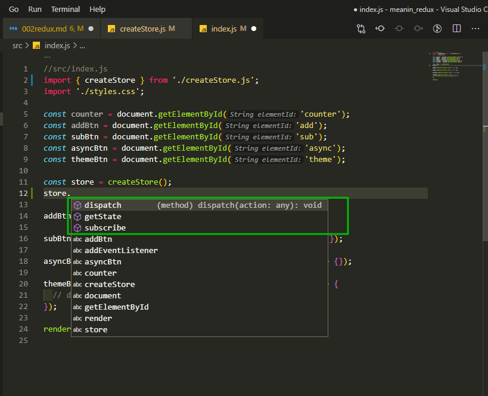

Но для того что бы наш **store** работал окончательно мы должны первым параметром, при создании **store** в **index.js**, передать некоторый **rootReducer**.

По этому создаю этот **rootReducer.js**. Для этого в приложении, в **src**, создаю новую папку **redux**. Идея заключается в том что сейчас я выношу логику приложения в отдельный файл, что бы она не была вообще ни каким образом связана с нашим компонентом.

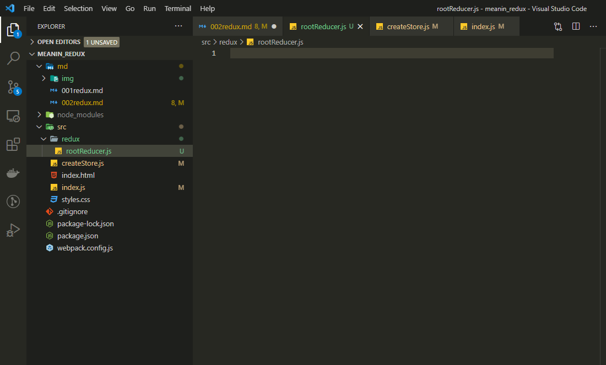

Теперь что такое вообще **reducer**? Как мы говорили ранее это просто функция

```jsx
//src/redux/rootReducer.js
export function rootReducer() {}
```

Первым пакраметром она принимает **state**. Почему она принимает **state**, да потому что мы его и передаем первым параметром **state** в **createStore.js**

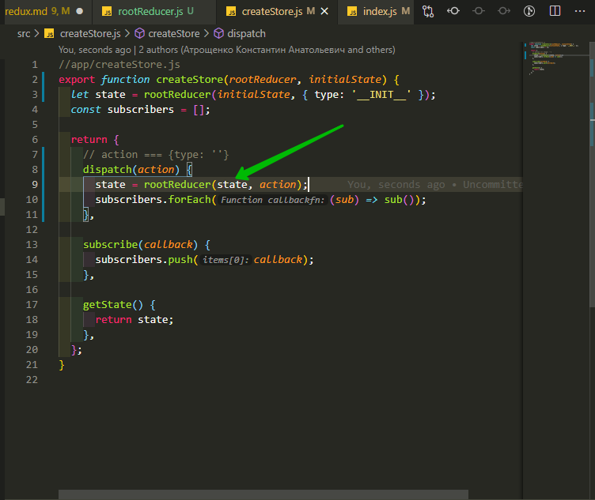

А вторым параметром передаю action.

```jsx
//src/redux/rootReducer.js
export function rootReducer(state, action) {}
```

Дальше по умолчанию **rootReducer** нам всегда должен возвращать **state**. Т.е. он нам должен вернуть новый объект.

```jsx
//src/redux/rootReducer.js
export function rootReducer(state, action) {
  return state;
}
```

Но теперь учитывая что сам по себе **action** это объект у которого есть поле **type**, то здесь мы можем просто понимать. А какой именно **action** к нам приходит? Т.е. что конкретно нам нужно сделать? И в зависимости от **action** менять наше состояние.

```jsx
//src/redux/rootReducer.js
export function rootReducer(state, action) {
  if (action.type === 'INCREMENT') {
  }

  return state;
}
```

То в таком случае нам нужно вернуть новое состояние. И например начальное состояние, всего **state...** Пока что при создании **store** в **index.js** передаю **rootReducer** и что очень важно я его не вызываю т.е. передаю как **reference** эту функцию. А вторым параметром указываю начальное состояние нашего приложения. Это объект у которого ключ **counter** равен **0**.

```jsx
//src/index.js
import { createStore } from './createStore.js';
import { rootReducer } from './redux/rootReducer.js';
import './styles.css';

const counter = document.getElementById('counter');
const addBtn = document.getElementById('add');
const subBtn = document.getElementById('sub');
const asyncBtn = document.getElementById('async');
const themeBtn = document.getElementById('theme');

const store = createStore(rootReducer, {
  counter: 0,
});

addBtn.addEventListener('click', () => {});

subBtn.addEventListener('click', () => {});

asyncBtn.addEventListener('click', () => {});

themeBtn.addEventListener('click', () => {
  // document.body.classList.toggle('dark');
});

render();
```

Ли бо же на самом деле мы можем просто передать **0**. Это тоже будет начальным состоянием.

Теперь мы знаем что наш **state** это просто какое-то число. По этому для того что бы изменить наше состояние когда происходит INCREMENT. Мы можем вернуть **state + 1**.

```jsx
//src/redux/rootReducer.js
export function rootReducer(state, action) {
  if (action.type === 'INCREMENT') {
    return state + 1;
  } else if (action.type === 'DECREMENT') {
    return state - 1;
  }

  return state;
}
```

Т.е. он просто пробегается по **action.type**, если он находит совпадаение какое-то, с каким то **case** с котором мы описали, то он изменяет состояние и возвращает его. Если допустим он не находит такого **if** то тогда он просто возвращает старое состояние.

И вот как раз таки мы вот здесь передавали системное сообщение **type: "\_\_INIT\_\_"**. Понятоно что такого **type** у нас в принципе нет, по этому ни какой **if** не сработает и мы просто вернем старое состояние.

Теперь в **index.js** мы можем просто посмотреть что такое **store**. Выношу его в **window**.

```jsx
//src/index.js
import { createStore } from './createStore.js';
import { rootReducer } from './redux/rootReducer.js';
import './styles.css';

const counter = document.getElementById('counter');
const addBtn = document.getElementById('add');
const subBtn = document.getElementById('sub');
const asyncBtn = document.getElementById('async');
const themeBtn = document.getElementById('theme');

const store = createStore(rootReducer, {
  counter: 0,
});

window.store = store;

addBtn.addEventListener('click', () => {});

subBtn.addEventListener('click', () => {});

asyncBtn.addEventListener('click', () => {});

themeBtn.addEventListener('click', () => {
  // document.body.classList.toggle('dark');
});

render();
```

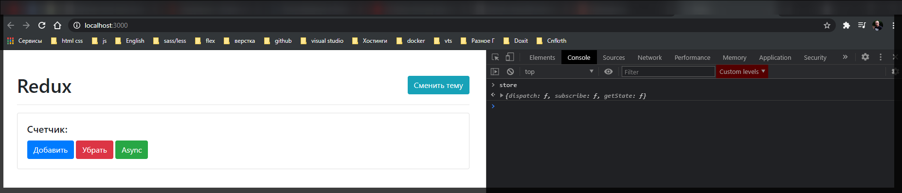

Как мы видим это у нас объект у которого есть несколько методов.

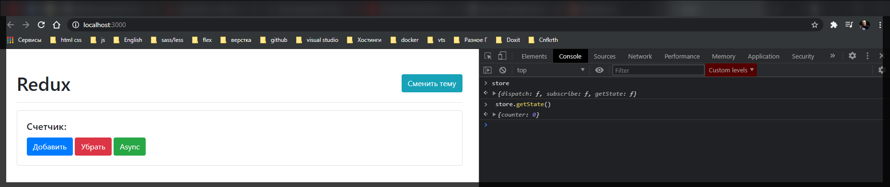

При вызове **getState()** мы видим что сейчас у нас **state** это просто число **0**. Тот **0** который мы и передавали.

Что бы допустим изменить этот **state** я могу воспользоватся методом **dispatch**. В **dispatch** мы должны передавать некоторый **type**.

И так при получении **state** у меня получилось **'[Object: 'object']1'**. Что бы от этого избавиться в **index.js** при **createStore** вторым параметром передаю просто **0** а не объект. И вот что получилось.

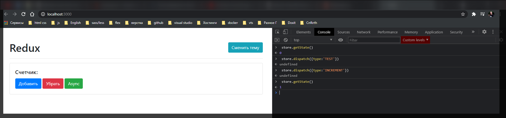

По сути когда я вызвал **store.dispatch({type:'INCREMENT'})** я вызвал его с инкрементом. Тем самым мы изменили внутреннее состояние которое было в **store**. И вот вам весь **redux**. У нас есть некоторый объект описывающий состояние приложения и мы его меняем с помощью **dispatch**.

Ну далее все просто. Теперь при клике на кнопку мы хотим вызвать соответсвующий **type**.

```jsx
//src/index.js
import { createStore } from './createStore.js';
import { rootReducer } from './redux/rootReducer.js';
import './styles.css';

const counter = document.getElementById('counter');
const addBtn = document.getElementById('add');
const subBtn = document.getElementById('sub');
const asyncBtn = document.getElementById('async');
const themeBtn = document.getElementById('theme');

const store = createStore(rootReducer, 0);

addBtn.addEventListener('click', () => {
  store.dispatch({ type: 'INCREMENT' });
});

subBtn.addEventListener('click', () => {});

asyncBtn.addEventListener('click', () => {});

themeBtn.addEventListener('click', () => {
  // document.body.classList.toggle('dark');
});

render();
```

Т.е. что там **store.dispatch({ type: 'INCREMENT' });** т.е. что там будет происходить мы понятия пока не имем. Мы просто говорим что вызвался вот такой метод **type: 'INCREMENT'** и **store** пожалуйста обработай его.

```jsx
//src/index.js
import { createStore } from './createStore.js';
import { rootReducer } from './redux/rootReducer.js';
import './styles.css';

const counter = document.getElementById('counter');
const addBtn = document.getElementById('add');
const subBtn = document.getElementById('sub');
const asyncBtn = document.getElementById('async');
const themeBtn = document.getElementById('theme');

const store = createStore(rootReducer, 0);

window.store = store;

addBtn.addEventListener('click', () => {
  store.dispatch({ type: 'INCREMENT' });
});

subBtn.addEventListener('click', () => {
  store.dispatch({ type: 'DECREMENT' });
});

asyncBtn.addEventListener('click', () => {});

themeBtn.addEventListener('click', () => {
  // document.body.classList.toggle('dark');
});

render();
```

Понятно что если мы так все оставим то ничего меняться не будет.

Верну объект **window**.

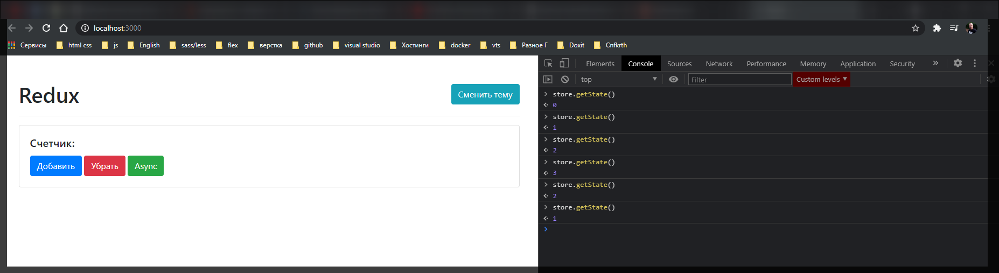

Как видим при клике на кнопки **store** у нас меняется.

Теперь как нам понять что у нас что-то в компоненте поменялось? На самом деле учитывая что **store** у нас идет по паттерну **observer**, то мы можем подписаться на эти изменения. Т.е. обратится к **store** вызвать метод **subscribe()** передать **callback** функцию и допустим в консоли посмотреть что такое **store.getState()**.

```js
//src/index.js
import { createStore } from './createStore.js';
import { rootReducer } from './redux/rootReducer.js';
import './styles.css';

const counter = document.getElementById('counter');
const addBtn = document.getElementById('add');
const subBtn = document.getElementById('sub');
const asyncBtn = document.getElementById('async');
const themeBtn = document.getElementById('theme');

const store = createStore(rootReducer, 0);

window.store = store;

addBtn.addEventListener('click', () => {
  store.dispatch({ type: 'INCREMENT' });
});

subBtn.addEventListener('click', () => {
  store.dispatch({ type: 'DECREMENT' });
});

asyncBtn.addEventListener('click', () => {});

themeBtn.addEventListener('click', () => {
  // document.body.classList.toggle('dark');
});

store.subscribe(() => console.log(store.getState()));

render();
```

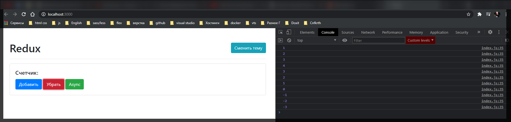

Таким образом мы следим за изменениями в **store**.

Теперь понятно что связать вот эту вот подписку **store.subscribe(() => console.log(store.getState()));** и все наше приложение будет очень просто.

Мы подписываемся на какие-либо изменения в **store** т.е. **store.subscribe(() => {});**
и далее получаем сам **const state = store.getState()**

```jsx
//src/index.js
import { createStore } from './createStore.js';
import { rootReducer } from './redux/rootReducer.js';
import './styles.css';

const counter = document.getElementById('counter');
const addBtn = document.getElementById('add');
const subBtn = document.getElementById('sub');
const asyncBtn = document.getElementById('async');
const themeBtn = document.getElementById('theme');

const store = createStore(rootReducer, 0);

window.store = store;

addBtn.addEventListener('click', () => {
  store.dispatch({ type: 'INCREMENT' });
});

subBtn.addEventListener('click', () => {
  store.dispatch({ type: 'DECREMENT' });
});

asyncBtn.addEventListener('click', () => {});

themeBtn.addEventListener('click', () => {
  // document.body.classList.toggle('dark');
});

store.subscribe(() => {
  const state = store.getState();
});

render();
```

Дальше это все по сути мы можем отрисовать в шаблоне. Обращаюсь к **DOM** узлу **counter** вызываю у него метод **textContent** и говорю что он будет равнятся **state**.

```jsx
//src/index.js
import { createStore } from './createStore.js';
import { rootReducer } from './redux/rootReducer.js';
import './styles.css';

const counter = document.getElementById('counter');
const addBtn = document.getElementById('add');
const subBtn = document.getElementById('sub');
const asyncBtn = document.getElementById('async');
const themeBtn = document.getElementById('theme');

const store = createStore(rootReducer, 0);

window.store = store;

addBtn.addEventListener('click', () => {
  store.dispatch({ type: 'INCREMENT' });
});

subBtn.addEventListener('click', () => {
  store.dispatch({ type: 'DECREMENT' });
});

asyncBtn.addEventListener('click', () => {});

themeBtn.addEventListener('click', () => {
  // document.body.classList.toggle('dark');
});

store.subscribe(() => {
  const state = store.getState();
  counter.textContent = state;
});

render();
```

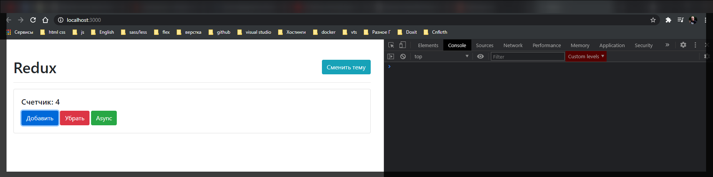

У нас все успешно работает. Но обратите внимание что теперь в нашем компоненте вообще нет ни какой логики которая что либо делала бы с данными. Мы здесь просто рисуем. Теперь есть некоторая проблема в том что при перезагрузке страницы у нас счетчик отсутствует. По умолчанию нам так же нужно его отрисовать.

Сейчас мы напрямую не можем вызывать **counter.textContent = state;** потому что это будет не правильно.

Мы можем после того как мы подписались на **store** допустим задиспатчить ему вроде этого **store.dispatch({ type: 'INIT_APPLICATION' });** Такого у нас нет **action** который мы бы обрабатывали и по этому нам вернется сам **state** не измененный.

```jsx
//src/index.js
import { createStore } from './createStore.js';
import { rootReducer } from './redux/rootReducer.js';
import './styles.css';

const counter = document.getElementById('counter');
const addBtn = document.getElementById('add');
const subBtn = document.getElementById('sub');
const asyncBtn = document.getElementById('async');
const themeBtn = document.getElementById('theme');

const store = createStore(rootReducer, 0);

window.store = store;

addBtn.addEventListener('click', () => {
  store.dispatch({ type: 'INCREMENT' });
});

subBtn.addEventListener('click', () => {
  store.dispatch({ type: 'DECREMENT' });
});

asyncBtn.addEventListener('click', () => {});

themeBtn.addEventListener('click', () => {
  // document.body.classList.toggle('dark');
});

store.subscribe(() => {
  const state = store.getState();
  counter.textContent = state;
});

store.dispatch({ type: 'INIT_APPLICATION' });

render();
```

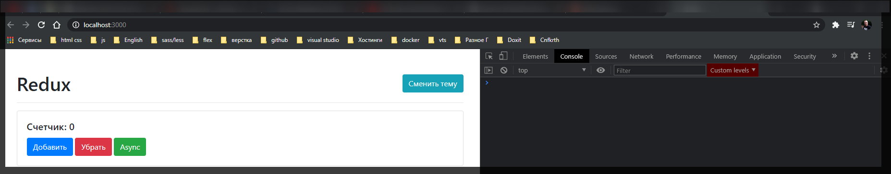

И сейчас мы не подключали ни каких библиотек, мы сами написали свой **redux**. Он представлен ввиде функции **createStore**.
