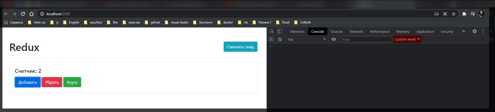
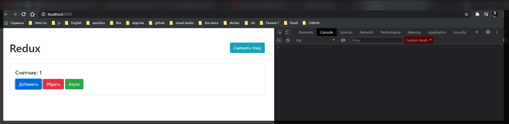
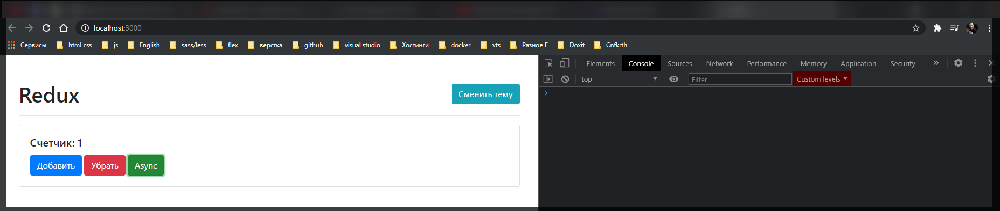
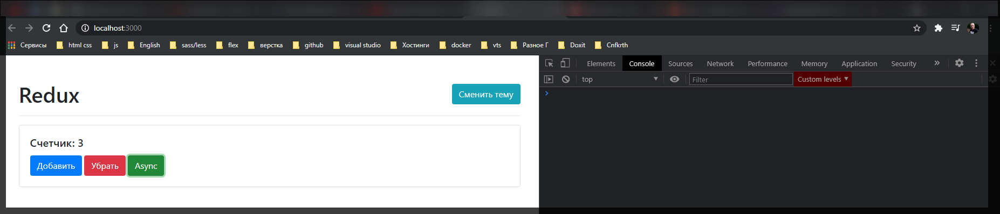
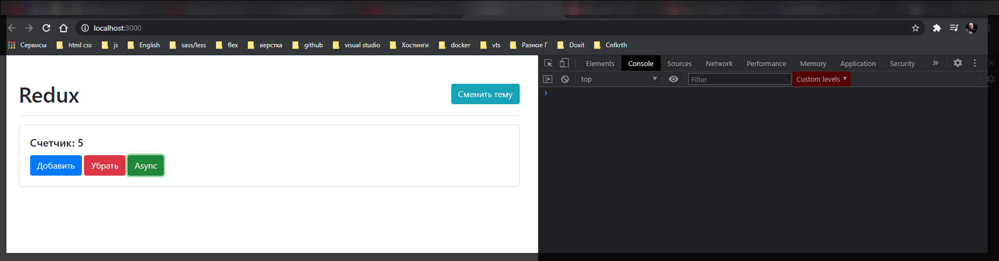

# Redux

теперь рассмотрим как это работает с самой бибилиотекой.

[https://redux.js.org/](https://redux.js.org/)

Наиболее важный раздел API Reference где присутствует createStore

[https://redux.js.org/api/createstore](https://redux.js.org/api/createstore)

Использовать ее можно точно так же как мы с вами описали ранее.

Устанавливаю

```shell
npm install redux
```

Теперь мы можем импортировать **createStore** не из нашего файла а из бибилиотеки **redux**

```jsx
//src/index.js
import { createStore } from 'redux';
import { rootReducer } from './redux/rootReducer.js';
import './styles.css';

const counter = document.getElementById('counter');
const addBtn = document.getElementById('add');
const subBtn = document.getElementById('sub');
const asyncBtn = document.getElementById('async');
const themeBtn = document.getElementById('theme');

const store = createStore(rootReducer, 0);

window.store = store;

addBtn.addEventListener('click', () => {
  store.dispatch({ type: 'INCREMENT' });
});

subBtn.addEventListener('click', () => {
  store.dispatch({ type: 'DECREMENT' });
});

asyncBtn.addEventListener('click', () => {});

themeBtn.addEventListener('click', () => {
  // document.body.classList.toggle('dark');
});

store.subscribe(() => {
  const state = store.getState();
  counter.textContent = state;
});

store.dispatch({ type: 'INIT_APPLICATION' });

render();
```

сохраним и убедимся что это все у нас осталось рабочим.



Теперь я хочу поговорить про то как мы можем улучшить наше приложение. Потому что у нас сейчас достаточно много хард кода. Например мы явно прописываем типы **'INCREMENT'** и **'DECREMENT'**.

```jsx
//src/index.js
import { createStore } from 'redux';
import { rootReducer } from './redux/rootReducer.js';
import './styles.css';

const counter = document.getElementById('counter');
const addBtn = document.getElementById('add');
const subBtn = document.getElementById('sub');
const asyncBtn = document.getElementById('async');
const themeBtn = document.getElementById('theme');

const store = createStore(rootReducer, 0);

window.store = store;

addBtn.addEventListener('click', () => {
  store.dispatch({ type: 'INCREMENT' });
});

subBtn.addEventListener('click', () => {
  store.dispatch({ type: 'DECREMENT' });
});

asyncBtn.addEventListener('click', () => {});

themeBtn.addEventListener('click', () => {
  // document.body.classList.toggle('dark');
});

store.subscribe(() => {
  const state = store.getState();
  counter.textContent = state;
});

store.dispatch({ type: 'INIT_APPLICATION' });

render();
```

Эта строчка должна полностью совпадать со строчкой в **rootReducer.js**

```jsx
//src/redux/rootReducer.js
export function rootReducer(state, action) {
  if (action.type === 'INCREMENT') {
    return state + 1;
  } else if (action.type === 'DECREMENT') {
    return state - 1;
  }

  return state;
}
```

Понятно что если мы где-то ошибемся, то у нас приложение перестанет работать.

По - этому имее смысл создавать константы. Для этого создаю новый файл **types.js**

```jsx
//src//redux/types.js

export const INCREMENT = 'INCREMENT';
export const DECREMENT = 'DECREMENT';
```

Теперь как мы можем улучшить наше приложение? Теперь в **reducer** мы не используем простые строчки, а использовать константы

```jsx
//src/redux/rootReducer.js
import { INCREMENT, DECREMENT } from './types';

export function rootReducer(state, action) {
  if (action.type === INCREMENT) {
    return state + 1;
  } else if (action.type === DECREMENT) {
    return state - 1;
  }

  return state;
}
```

И теперь получается что мы в **index.js** мы можем это тоже не хардкодить.

```jsx
//src/index.js
import { createStore } from 'redux';
import { rootReducer } from './redux/rootReducer.js';
import './styles.css';

import { INCREMENT, DECREMENT } from './redux/types';

const counter = document.getElementById('counter');
const addBtn = document.getElementById('add');
const subBtn = document.getElementById('sub');
const asyncBtn = document.getElementById('async');
const themeBtn = document.getElementById('theme');

const store = createStore(rootReducer, 0);

window.store = store;

addBtn.addEventListener('click', () => {
  store.dispatch({ type: INCREMENT });
});

subBtn.addEventListener('click', () => {
  store.dispatch({ type: DECREMENT });
});

asyncBtn.addEventListener('click', () => {});

themeBtn.addEventListener('click', () => {
  // document.body.classList.toggle('dark');
});

store.subscribe(() => {
  const state = store.getState();
  counter.textContent = state;
});

store.dispatch({ type: 'INIT_APPLICATION' });

render();
```

Более того мы можем еще улучшить приложение. Таким образом что здесь нам приходится создавать этот самый **action**, а **action** это просто объект с полем **type**.

Мы можем создавать такие сущности как **actionCreators**. Создам их в новом файле **actions.js**. т.е. **actionCreators** по сути это просто обычные функции которые умеют создавать нам определенные **actions**.

```jsx
//src/redux/actions.js

export function increment() {}
```

Здесь мы возвращаем объект у которого **type: INCREMENT**.

```js
//src/redux/actions.js
import { INCREMENT, DECREMENT } from '../redux/types';

export function increment() {
  return { type: INCREMENT };
}

export function decrement() {
  return { type: DECREMENT };
}
```

Теперь в чем заключается улучшение кода. В том что сейчас мы можем уже **dispatch** не осознанные объекты, а мы можем **dispatch** функции и сразу же их вызываем.

```jsx
//src/index.js
import { createStore } from 'redux';
import { rootReducer } from './redux/rootReducer.js';
import './styles.css';

import { increment, decrement } from './redux/actions';

const counter = document.getElementById('counter');
const addBtn = document.getElementById('add');
const subBtn = document.getElementById('sub');
const asyncBtn = document.getElementById('async');
const themeBtn = document.getElementById('theme');

const store = createStore(rootReducer, 0);

window.store = store;

addBtn.addEventListener('click', () => {
  store.dispatch(increment());
});

subBtn.addEventListener('click', () => {
  store.dispatch(decrement());
});

asyncBtn.addEventListener('click', () => {});

themeBtn.addEventListener('click', () => {
  // document.body.classList.toggle('dark');
});

store.subscribe(() => {
  const state = store.getState();
  counter.textContent = state;
});

store.dispatch({ type: 'INIT_APPLICATION' });

render();
```

Теперь выразительность кода повысилась, потому что мы конкретно говорим что мы делаем и уже не привязываемся к каким-то конкретным числам.



<hr>

<br>
<br>

Теперь что касается **asyncBtn**. По правилам здравой логики мы можем написать вот такой код

```jsx
//src/index.js
import { createStore } from 'redux';
import { rootReducer } from './redux/rootReducer.js';
import './styles.css';

import { increment, decrement } from './redux/actions';

const counter = document.getElementById('counter');
const addBtn = document.getElementById('add');
const subBtn = document.getElementById('sub');
const asyncBtn = document.getElementById('async');
const themeBtn = document.getElementById('theme');

const store = createStore(rootReducer, 0);

window.store = store;

addBtn.addEventListener('click', () => {
  store.dispatch(increment());
});

subBtn.addEventListener('click', () => {
  store.dispatch(decrement());
});

asyncBtn.addEventListener('click', () => {
  setTimeout(() => {
    store.dispatch(increment());
  }, 2000);
});

themeBtn.addEventListener('click', () => {});

store.subscribe(() => {
  const state = store.getState();
  counter.textContent = state;
});

store.dispatch({ type: 'INIT_APPLICATION' });

render();
```



Все работает и счетчик срабатывает черех две секунды. Потому что паттерн наблюдатель так же работает с асинхронным кодом.

Проблема здесь заключается в том что в нормальных проектах это не решает проблему асинхронности. Потому что, ну допустим что бы изменять асинхронно **timeout**, например нам нужно получить ответ с сервера. Т.е. я нажимаю на какую-то кнопку, и дальше когда вам сервер ответит вы не знаете. Т.е. прописать харкордно этот **setTimeout** в компоненте мы не сможем. Но при этом нужно как-то решить вопрос с асинхронными событиями.

Вы можете мне сказать что мы можем сделать что-то вроде этого. Создадим отдельный **action** который я назову **asyncIncrement**.

```js
//src/redux/actions.js
import { INCREMENT, DECREMENT, ASYNC_INCREMENT } from '../redux/types';

export function increment() {
  return { type: INCREMENT };
}

export function decrement() {
  return { type: DECREMENT };
}

export function asyncIncrement() {
  return {
    type: ASYNC_INCREMENT,
  };
}
```

```jsx
//src//redux/types.js

export const INCREMENT = 'INCREMENT';
export const DECREMENT = 'DECREMENT';
export const ASYNC_INCREMENT = 'ASYNC_INCREMENT';
```

теперь нам нужно добавить этот if в наш rootReducer.

```jsx
//src/redux/rootReducer.js
import { INCREMENT, DECREMENT, ASYNC_INCREMENT } from './types';

export function rootReducer(state, action) {
  if (action.type === INCREMENT) {
    return state + 1;
  } else if (action.type === DECREMENT) {
    return state - 1;
  } else if (action.type == ASYNC_INCREMENT) {
    setTimeout(() => {
      return state + 1;
    }, 2000);
  }

  return state;
}
```

Но я думаю что вы уже замечаете что эта конструкция работать не будет. Потому что первое правило **reducer** заключается в том что, во-первых мы должны вернуть **state**, и ни каких асинхронные событий в **rootReducer** быть не должно. Т.е. rootReducer это абсолютно синхронное событие когда мы меняем состояние нашего приложения и не более.

Когда мы пишем как в примере выше, мы уже нарушаем первое правило, мы не возвращаем здесь **state**. Потому что **return state + 1** относится к функции **setTimeout**.

И тут мы сталкиваемся с проблемой асинхронности в redux. И как решить данную проблему не понятно.

```jsx
//src/index.js
import { createStore } from 'redux';
import { rootReducer } from './redux/rootReducer.js';
import './styles.css';

import { increment, decrement, asyncIncrement } from './redux/actions';

const counter = document.getElementById('counter');
const addBtn = document.getElementById('add');
const subBtn = document.getElementById('sub');
const asyncBtn = document.getElementById('async');
const themeBtn = document.getElementById('theme');

const store = createStore(rootReducer, 0);

window.store = store;

addBtn.addEventListener('click', () => {
  store.dispatch(increment());
});

subBtn.addEventListener('click', () => {
  store.dispatch(decrement());
});

asyncBtn.addEventListener('click', () => {
  store.dispatch(asyncIncrement());
});

themeBtn.addEventListener('click', () => {});

store.subscribe(() => {
  const state = store.getState();
  counter.textContent = state;
});

store.dispatch({ type: 'INIT_APPLICATION' });

render();
```

Теперь если я даже несколько раз нажимаю на **asyncBtn** то ничего не происходит. Не работает это потому что мы не изменяем наше состояние.

Соотвтетственно нам нужно каким-то образом решить проблему асинхронности. Для этого в **redux** присутствует такой концепт который называется **middleware**

Один из них **redux-thunk**

[https://www.npmjs.com/package/redux-thunk](https://www.npmjs.com/package/redux-thunk)

```shell
npm i redux-thunk
```

Импортирую **import thunk from 'redux-thunk';**

**thunk** - является объектом **middleware** и дальше мы должны это передать как **middleware** как **store** когда мы его создаем. Первым параметром обратите внимание мы передаем **rootReducer**, а вторым параметром мы сюда передаем такую вещь как **applyMiddleware()**. На самом деле **applyMiddleware** это обычная функция которая импортируется из самого **redux**.

Мы можем на нее посмотреть на официальной документации что она делает и что она принимает

[https://redux.js.org/api/applymiddleware](https://redux.js.org/api/applymiddleware)

Начальный **state** у на уже задан это **0**, **b** третьим параметром мы передаем набор **enhancer**(усилителей)

```jsx
//src/index.js
import { createStore, applyMiddleware } from 'redux';
import thunk from 'redux-thunk';
import { rootReducer } from './redux/rootReducer.js';
import './styles.css';

import { increment, decrement, asyncIncrement } from './redux/actions';

const counter = document.getElementById('counter');
const addBtn = document.getElementById('add');
const subBtn = document.getElementById('sub');
const asyncBtn = document.getElementById('async');
const themeBtn = document.getElementById('theme');

const store = createStore(rootReducer, 0, applyMiddleware(thunk));

window.store = store;

addBtn.addEventListener('click', () => {
  store.dispatch(increment());
});

subBtn.addEventListener('click', () => {
  store.dispatch(decrement());
});

asyncBtn.addEventListener('click', () => {
  store.dispatch(asyncIncrement());
});

themeBtn.addEventListener('click', () => {});

store.subscribe(() => {
  const state = store.getState();
  counter.textContent = state;
});

store.dispatch({ type: 'INIT_APPLICATION' });

render();
```

Теперь мы можем рассмотреть всю прелесть **thunk**. Прелесть заключается в том что мы теперь можем создавать асинхронные **actionCreators**. И вот у нас есть один пример **asyncIncrement** который сейчас возвращает синхронный объект.

```jsx
//src/redux/actions.js
import { INCREMENT, DECREMENT, ASYNC_INCREMENT } from '../redux/types';

export function increment() {
  return { type: INCREMENT };
}

export function decrement() {
  return { type: DECREMENT };
}

export function asyncIncrement() {
  return {
    type: ASYNC_INCREMENT,
  };
}
```

но на самом деле если мы вернем функцию которая принимает в себя некоторый объект **dispatch**. То теперь внутри этой функции мы можем оперировать с объектом **dispatch** т.е. мы можем влюбой момент вызывать любой **action**

```jsx
//src/redux/actions.js
import { INCREMENT, DECREMENT, ASYNC_INCREMENT } from '../redux/types';

export function increment() {
  return { type: INCREMENT };
}

export function decrement() {
  return { type: DECREMENT };
}

export function asyncIncrement() {
  return function (dispatch) {
    dispatch({
      type: ASYNC_INCREMENT,
    });
  };
}
```

Сейчас правда тоже не будет работать. Причина этому такова что **ASYNC_INCREMENT** в **rootReducer** делает какую-то ерунду. На самом деле если мы уберем этот **setTimeout** и просто вернем **state + 1**.

```jsx
//src/redux/rootReducer.js
import { INCREMENT, DECREMENT, ASYNC_INCREMENT } from './types';

export function rootReducer(state, action) {
  if (action.type === INCREMENT) {
    return state + 1;
  } else if (action.type === DECREMENT) {
    return state - 1;
  } else if (action.type == ASYNC_INCREMENT) {
    return state + 1;
  }

  return state;
}
```

И **ASYNC_INCREMENT** заработал, правла не асинхронно.



Теперь возникает вопрос. Где добавлять эту асинхронность? Фишка в том когда мы получаем функцию **dispatch** в **action.js** в **asyncIncrement**, то мы можем вызывать ее вообще когда угодно. И любая асинхронность, в том числе загрузка данных с сервера, происходит именно в этом месте.

```jsx
//src/redux/actions.js
import { INCREMENT, DECREMENT, ASYNC_INCREMENT } from '../redux/types';

export function increment() {
  return { type: INCREMENT };
}

export function decrement() {
  return { type: DECREMENT };
}

export function asyncIncrement() {
  return function (dispatch) {
    setTimeout(() => {
      dispatch({ type: ASYNC_INCREMENT });
    }, 2000);
  };
}
```



И вот асинхронный счетчик тоже работает.

Для того что бы работать с асинхронностью мы в функции **asyncIncrement** возвращаю функцию, но при этом не забываем добавить **middleware**.

<hr>
 
Кстати наш код теперь можно улучшить в том плане что мы  **dispatch({ type: ASYNC_INCREMENT });** И в **rootReducer** он делает ровно тоже самое что делает обычный **increment**...

```jsx
//src/redux/rootReducer.js
import { INCREMENT, DECREMENT, ASYNC_INCREMENT } from './types';

export function rootReducer(state, action) {
  if (action.type === INCREMENT) {
    return state + 1;
  } else if (action.type === DECREMENT) {
    return state - 1;
  } else if (action.type == ASYNC_INCREMENT) {
    return state + 1;
  }

  return state;
}
```

Нам здесь не важно **async** это или не **async**. По этому этот блок **else if** я могу удалить.

```js
//src/redux/rootReducer.js
import { INCREMENT, DECREMENT } from './types';

export function rootReducer(state, action) {
  if (action.type === INCREMENT) {
    return state + 1;
  } else if (action.type === DECREMENT) {
    return state - 1;
  }

  return state;
}
```

И в **action** мы можем просто **dispatch({ type: increment() });**

```jsx
//src/redux/actions.js
import { INCREMENT, DECREMENT } from '../redux/types';

export function increment() {
  return { type: INCREMENT };
}

export function decrement() {
  return { type: DECREMENT };
}

export function asyncIncrement() {
  return function (dispatch) {
    setTimeout(() => {
      dispatch(increment());
    }, 2000);
  };
}
```

Все так же работает.
