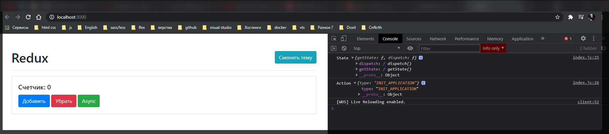
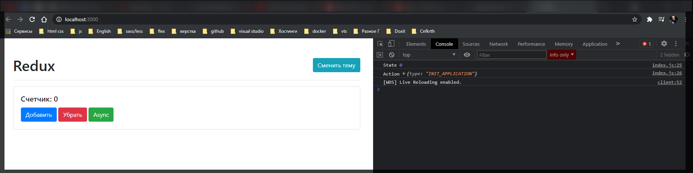
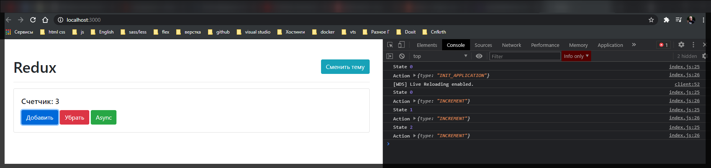
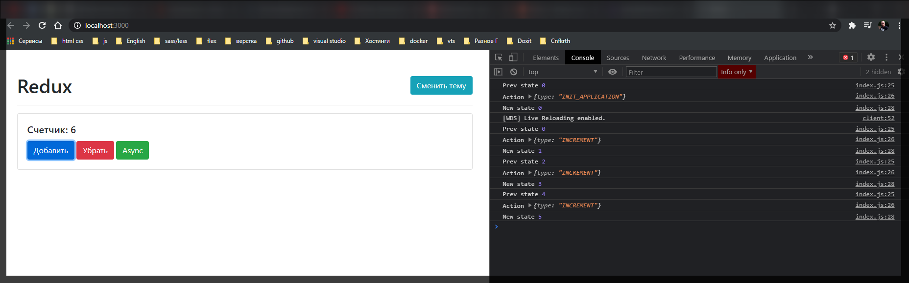
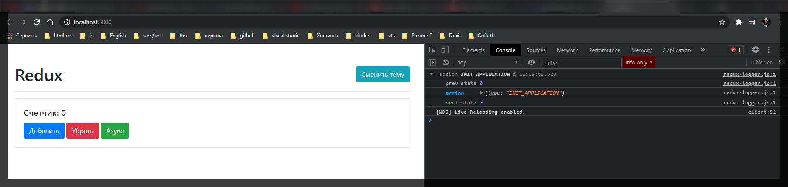

# Middleware

На самом деле мы можем создавать свои собственные **middleware**. Потому что в конечном итоге те бибилиотеки которые мы импортируем они тоже написаны другими обычными разработчиками.

Разберем базовый **middleware** который называется **logger**.

Создадим его как функцию для того что бы вы поняли весь масштаб как это взаимодействует друг с другом. Сам **middleware** это обычная функция которая принимает в себя **state**. Но дальше эта функция должна вернуть новую функцию. Вторая функция принимает в себя параметр **next**

```jsx
//src/index.js
import { createStore, applyMiddleware } from 'redux';
import thunk from 'redux-thunk';
import { rootReducer } from './redux/rootReducer.js';
import './styles.css';

import { increment, decrement, asyncIncrement } from './redux/actions';

const counter = document.getElementById('counter');
const addBtn = document.getElementById('add');
const subBtn = document.getElementById('sub');
const asyncBtn = document.getElementById('async');
const themeBtn = document.getElementById('theme');

function logger(state) {
  return function (next) {};
}

const store = createStore(rootReducer, 0, applyMiddleware(thunk));

window.store = store;

addBtn.addEventListener('click', () => {
  store.dispatch(increment());
});

subBtn.addEventListener('click', () => {
  store.dispatch(decrement());
});

asyncBtn.addEventListener('click', () => {
  store.dispatch(asyncIncrement());
});

themeBtn.addEventListener('click', () => {});

store.subscribe(() => {
  const state = store.getState();
  counter.textContent = state;
});

store.dispatch({ type: 'INIT_APPLICATION' });

render();
```

Для того что бы **middleware** был полноценным он должен вернуть еще одну функцию которая в конечном итоге будет принимать в себя **action**

```jsx
//src/index.js
import { createStore, applyMiddleware } from 'redux';
import thunk from 'redux-thunk';
import { rootReducer } from './redux/rootReducer.js';
import './styles.css';

import { increment, decrement, asyncIncrement } from './redux/actions';

const counter = document.getElementById('counter');
const addBtn = document.getElementById('add');
const subBtn = document.getElementById('sub');
const asyncBtn = document.getElementById('async');
const themeBtn = document.getElementById('theme');

function logger(state) {
  return function (next) {
    return function (action) {};
  };
}

const store = createStore(rootReducer, 0, applyMiddleware(thunk));

window.store = store;

addBtn.addEventListener('click', () => {
  store.dispatch(increment());
});

subBtn.addEventListener('click', () => {
  store.dispatch(decrement());
});

asyncBtn.addEventListener('click', () => {
  store.dispatch(asyncIncrement());
});

themeBtn.addEventListener('click', () => {});

store.subscribe(() => {
  const state = store.getState();
  counter.textContent = state;
});

store.dispatch({ type: 'INIT_APPLICATION' });

render();
```

Вы можете сказать что это какое-то безумие. Особенно если вы не сильно знакомы с замыканием.

На самом деле здесь нен ничего необычного. Просто мы порционно добавляем какие-то параметры в нашу функцию. Правило здесь такое что мы должны что-то вернуть, а точнее мы должны вернуть результат работы функции **next(action)**. И теперь мы можем использовать этот **middleware** и передать его в **applyMiddleware**

```jsx
//src/index.js
import { createStore, applyMiddleware } from 'redux';
import thunk from 'redux-thunk';
import { rootReducer } from './redux/rootReducer.js';
import './styles.css';

import { increment, decrement, asyncIncrement } from './redux/actions';

const counter = document.getElementById('counter');
const addBtn = document.getElementById('add');
const subBtn = document.getElementById('sub');
const asyncBtn = document.getElementById('async');
const themeBtn = document.getElementById('theme');

function logger(state) {
  return function (next) {
    return function (action) {
      return next(action);
    };
  };
}

const store = createStore(rootReducer, 0, applyMiddleware(thunk, logger));

window.store = store;

addBtn.addEventListener('click', () => {
  store.dispatch(increment());
});

subBtn.addEventListener('click', () => {
  store.dispatch(decrement());
});

asyncBtn.addEventListener('click', () => {
  store.dispatch(asyncIncrement());
});

themeBtn.addEventListener('click', () => {});

store.subscribe(() => {
  const state = store.getState();
  counter.textContent = state;
});

store.dispatch({ type: 'INIT_APPLICATION' });

render();
```

Т.е. если я все оставляю в таком виде у меня все продолжает работать.

Теперь зачем нам вообще этот **logger** нужен?

На самом деле мы здесь можем просто в консоли смотреть что такое **state** или что такое **action**.

```jsx
//src/index.js
import { createStore, applyMiddleware } from 'redux';
import thunk from 'redux-thunk';
import { rootReducer } from './redux/rootReducer.js';
import './styles.css';

import { increment, decrement, asyncIncrement } from './redux/actions';

const counter = document.getElementById('counter');
const addBtn = document.getElementById('add');
const subBtn = document.getElementById('sub');
const asyncBtn = document.getElementById('async');
const themeBtn = document.getElementById('theme');

function logger(state) {
  return function (next) {
    return function (action) {
      console.log('State', state);
      console.log('Action', action);
      return next(action);
    };
  };
}

const store = createStore(rootReducer, 0, applyMiddleware(thunk, logger));

window.store = store;

addBtn.addEventListener('click', () => {
  store.dispatch(increment());
});

subBtn.addEventListener('click', () => {
  store.dispatch(decrement());
});

asyncBtn.addEventListener('click', () => {
  store.dispatch(asyncIncrement());
});

themeBtn.addEventListener('click', () => {});

store.subscribe(() => {
  const state = store.getState();
  counter.textContent = state;
});

store.dispatch({ type: 'INIT_APPLICATION' });

render();
```



Теперь мы можем посмотреть на **state**. На самом деле это не **state** а объект который похож на **store**. У него есть функция **getState** с помощью которой мы можем получить **state**. Ну и соответственно **state** мы можем получить вот таким вот способом.

```jsx
//src/index.js
import { createStore, applyMiddleware } from 'redux';
import thunk from 'redux-thunk';
import { rootReducer } from './redux/rootReducer.js';
import './styles.css';

import { increment, decrement, asyncIncrement } from './redux/actions';

const counter = document.getElementById('counter');
const addBtn = document.getElementById('add');
const subBtn = document.getElementById('sub');
const asyncBtn = document.getElementById('async');
const themeBtn = document.getElementById('theme');

function logger(state) {
  return function (next) {
    return function (action) {
      console.log('State', state.getState());
      console.log('Action', action);
      return next(action);
    };
  };
}

const store = createStore(rootReducer, 0, applyMiddleware(thunk, logger));

window.store = store;

addBtn.addEventListener('click', () => {
  store.dispatch(increment());
});

subBtn.addEventListener('click', () => {
  store.dispatch(decrement());
});

asyncBtn.addEventListener('click', () => {
  store.dispatch(asyncIncrement());
});

themeBtn.addEventListener('click', () => {});

store.subscribe(() => {
  const state = store.getState();
  counter.textContent = state;
});

store.dispatch({ type: 'INIT_APPLICATION' });

render();
```





Здесь мы выводим в консоль еще до того как **state** изменился.

Для того что бы выводились актуальные данные я могу сделать например вот так.

```jsx
//src/index.js
import { createStore, applyMiddleware } from 'redux';
import thunk from 'redux-thunk';
import { rootReducer } from './redux/rootReducer.js';
import './styles.css';

import { increment, decrement, asyncIncrement } from './redux/actions';

const counter = document.getElementById('counter');
const addBtn = document.getElementById('add');
const subBtn = document.getElementById('sub');
const asyncBtn = document.getElementById('async');
const themeBtn = document.getElementById('theme');

function logger(state) {
  return function (next) {
    return function (action) {
      console.log('Prev state', state.getState());
      console.log('Action', action);
      const newState = next(action);
      console.log('New state', state.getState());
      return next(newState);
    };
  };
}

const store = createStore(rootReducer, 0, applyMiddleware(thunk, logger));

window.store = store;

addBtn.addEventListener('click', () => {
  store.dispatch(increment());
});

subBtn.addEventListener('click', () => {
  store.dispatch(decrement());
});

asyncBtn.addEventListener('click', () => {
  store.dispatch(asyncIncrement());
});

themeBtn.addEventListener('click', () => {});

store.subscribe(() => {
  const state = store.getState();
  counter.textContent = state;
});

store.dispatch({ type: 'INIT_APPLICATION' });

render();
```



**New State** он вообще показывает как **action**. Т.е. тут еще нужно поиграться для того что бы создать **logger**.

На самом деле есть много готовых вариантов **logger** для **redux**.

[https://www.npmjs.com/package/redux-logger](https://www.npmjs.com/package/redux-logger)

Устанавливай и смотри как его использовать.

```jsx
//src/index.js
import { createStore, applyMiddleware } from 'redux';
import thunk from 'redux-thunk';
import logger from 'redux-logger';
import { rootReducer } from './redux/rootReducer.js';
import './styles.css';

import { increment, decrement, asyncIncrement } from './redux/actions';

const counter = document.getElementById('counter');
const addBtn = document.getElementById('add');
const subBtn = document.getElementById('sub');
const asyncBtn = document.getElementById('async');
const themeBtn = document.getElementById('theme');

// function logger(state) {
//   return function (next) {
//     return function (action) {
//       console.log('Prev state', state.getState());
//       console.log('Action', action);
//       const newState = next(action);
//       console.log('New state', state.getState());
//       return next(newState);
//     };
//   };
// }

const store = createStore(rootReducer, 0, applyMiddleware(thunk, logger));

window.store = store;

addBtn.addEventListener('click', () => {
  store.dispatch(increment());
});

subBtn.addEventListener('click', () => {
  store.dispatch(decrement());
});

asyncBtn.addEventListener('click', () => {
  store.dispatch(asyncIncrement());
});

themeBtn.addEventListener('click', () => {});

store.subscribe(() => {
  const state = store.getState();
  counter.textContent = state;
});

store.dispatch({ type: 'INIT_APPLICATION' });

render();
```



И здесь мы видим более явную конструкцию. Есть предыдущее состояние, следующее состояние и непосредственно сам **action**.

Это и есть весь концепт **middleware**. Все **middleware** передаюсья в параметры **applyMidleware** через запятую.
