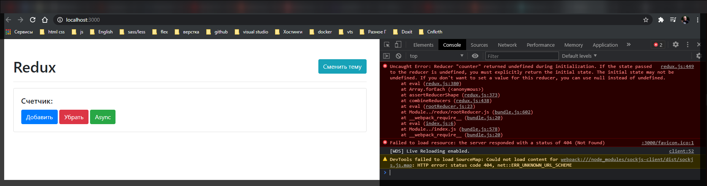
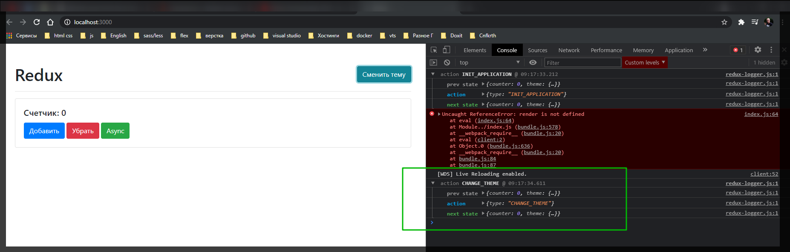

# Изменение темы

У нас есть задача реализовать кнопку сменить тему.

На самом деле это уже некоторое другое состояние которое отличается от непосредственного счетчика. Безусловно мы можем добавить еще один **type** в **types.js**. Добавить еще один **if** в **rootReducer.js**, но это будет не совсем корректно т.к. этот **reducer**

```jsx
//src/redux/rootReducer.js
import { INCREMENT, DECREMENT } from './types';

export function rootReducer(state, action) {
  if (action.type === INCREMENT) {
    return state + 1;
  } else if (action.type === DECREMENT) {
    return state - 1;
  }

  return state;
}
```

Отвечает за состояние которое непосредственно отвечает за состояние **counter**.

так же у ас есть друго состояние которое относится к теме. Правильнее будет перерефакторить наше приложение следующим образом. Переименовываю функцию **rootReducer** в **counterReducer**.

Создаю еще один **reducer** **themeReducer**

```jsx
//src/redux/rootReducer.js
import { INCREMENT, DECREMENT } from './types';

export function counterReducer(state, action) {
  if (action.type === INCREMENT) {
    return state + 1;
  } else if (action.type === DECREMENT) {
    return state - 1;
  }

  return state;
}

export function themeReducer() {}
```

И этот **themeReducer** точно такой же как и предыдущий **reducer**. У него есть свой **state** и у него есть некоторый **action**. И по умолчанию он должен возвращать **state**.

```jsx
//src/redux/rootReducer.js
import { INCREMENT, DECREMENT } from './types';

export function counterReducer(state, action) {
  if (action.type === INCREMENT) {
    return state + 1;
  } else if (action.type === DECREMENT) {
    return state - 1;
  }

  return state;
}

export function themeReducer(state, action) {
  return state;
}
```

Таким образом мы как бы декомпозируем наше приложение на логические составляющие. Т.е функция **counterReducer** отвечает за конкретный **counter** и это правильно потому что этим проще управлять. А этот **themeReducer** отвечает только за тему.

Проблема здесь в том что нам не понятно как из этих двух **redusers** сделать один? Потому что функция **createStore** принимает только один **reducer**.

Эту проблему решить просто. Теперь мы можем не **export** данные функции, а объеденить их в единый **reducer** т.е. **export** константу которая будет называться **rootReducer**. Для того что бы нам ее получить необходимо использовать функцию которая присутствует в **redux** которая называется **combineReducers**.

```js
//src/redux/rootReducer.js
import { combineReducers } from 'redux';
import { INCREMENT, DECREMENT } from './types';

function counterReducer(state, action) {
  if (action.type === INCREMENT) {
    return state + 1;
  } else if (action.type === DECREMENT) {
    return state - 1;
  }

  return state;
}

function themeReducer(state, action) {
  return state;
}

export const rootReducer = combineReducers();
```

**combineReducers()** принимает в себя объект редюсеров которые нам необходимо описать. Т.е. например если у нас есть состояние для **counter**, то мы говорим что ключ это **counter** и как значение это **counterReducer** **_и данную функцию мы не вызываем_**. И если у нас есть тема, то это **theme: themeReducer**

```jsx
//src/redux/rootReducer.js
import { combineReducers } from 'redux';
import { INCREMENT, DECREMENT } from './types';

function counterReducer(state, action) {
  if (action.type === INCREMENT) {
    return state + 1;
  } else if (action.type === DECREMENT) {
    return state - 1;
  }

  return state;
}

function themeReducer(state, action) {
  return state;
}

export const rootReducer = combineReducers({
  counter: counterReducer,
  theme: themeReducer,
});
```

И учитывая то что мы работаем с **rootReducer**, то соответственно в **index.js** мы ничего не меняем.

Однако с этим есть определенный нюанс!! Такой что у нас немного поменялась структура **state**


```jsx
//src/index.js
import { createStore, applyMiddleware } from 'redux';
import thunk from 'redux-thunk';
import logger from 'redux-logger';
import { rootReducer } from './redux/rootReducer.js';
import './styles.css';

import { increment, decrement, asyncIncrement } from './redux/actions';

const counter = document.getElementById('counter');
const addBtn = document.getElementById('add');
const subBtn = document.getElementById('sub');
const asyncBtn = document.getElementById('async');
const themeBtn = document.getElementById('theme');

// function logger(state) {
//   return function (next) {
//     return function (action) {
//       console.log('Prev state', state.getState());
//       console.log('Action', action);
//       const newState = next(action);
//       console.log('New state', state.getState());
//       return next(newState);
//     };
//   };
// }

const store = createStore(rootReducer, 0, applyMiddleware(thunk, logger));

window.store = store;

addBtn.addEventListener('click', () => {
  store.dispatch(increment());
});

subBtn.addEventListener('click', () => {
  store.dispatch(decrement());
});

asyncBtn.addEventListener('click', () => {
  store.dispatch(asyncIncrement());
});

themeBtn.addEventListener('click', () => {});

store.subscribe(() => {
  const state = store.getState();

  console.log(state);

  counter.textContent = state;
});

store.dispatch({ type: 'INIT_APPLICATION' });

render();
```



**Reduser "counter"** возвращает **undefined** в процессе инициализации.

Сейчас структура нашего **state** изменилась. До этого у нас был **state** который равнялся обычному числу.


Но теперь наш **state** является объектом у которого есть ключи **theme** и **counter**. Потому что мы разделили эту логику.

в **createStore** вообще удаляю это начальное состояние. теперь вторым параметром я буду принимать **applyMiddleware**.

```js
//src/index.js
import { createStore, applyMiddleware } from 'redux';
import thunk from 'redux-thunk';
import logger from 'redux-logger';
import { rootReducer } from './redux/rootReducer.js';
import './styles.css';

import { increment, decrement, asyncIncrement } from './redux/actions';

const counter = document.getElementById('counter');
const addBtn = document.getElementById('add');
const subBtn = document.getElementById('sub');
const asyncBtn = document.getElementById('async');
const themeBtn = document.getElementById('theme');

// function logger(state) {
//   return function (next) {
//     return function (action) {
//       console.log('Prev state', state.getState());
//       console.log('Action', action);
//       const newState = next(action);
//       console.log('New state', state.getState());
//       return next(newState);
//     };
//   };
// }

const store = createStore(rootReducer, applyMiddleware(thunk, logger));

window.store = store;

addBtn.addEventListener('click', () => {
  store.dispatch(increment());
});

subBtn.addEventListener('click', () => {
  store.dispatch(decrement());
});

asyncBtn.addEventListener('click', () => {
  store.dispatch(asyncIncrement());
});

themeBtn.addEventListener('click', () => {});

store.subscribe(() => {
  const state = store.getState();

  console.log(state);

  counter.textContent = state;
});

store.dispatch({ type: 'INIT_APPLICATION' });

render();
```

Теперь мы можем задавать начальное состояние **state** прямо в наших **redusers**. Например что **counter** у нас по умолчанию равняется **0**.

А для **themeReduser** создам отдельный объект **const initialThemeState = {}** и допустим будет ключ **value:** а значение по умолчанию будет **'light'**. И по умолчанию **state** будет равняться этому объекту.

```jsx
//src/redux/rootReducer.js
import { combineReducers } from 'redux';
import { INCREMENT, DECREMENT } from './types';

function counterReducer(state = 0, action) {
  if (action.type === INCREMENT) {
    return state + 1;
  } else if (action.type === DECREMENT) {
    return state - 1;
  }

  return state;
}

const initialThemeState = {
  value: 'light',
};

function themeReducer(state = initialThemeState, action) {
  return state;
}

export const rootReducer = combineReducers({
  counter: counterReducer,
  theme: themeReducer,
});
```

Теперь если мы посмотрим, то наше приложение заработало.


Однако счетчик теперь у нас **[object Object]**. Теперь для того что мы починить обращаюсь к **state**. И у него теперь есть ключ **counter**. Обращаюсь к нему.


```js
//src/redux/rootReducer.js
import { combineReducers } from 'redux';
import { INCREMENT, DECREMENT } from './types';

function counterReducer(state = 0, action) {
  if (action.type === INCREMENT) {
    return state + 1;
  } else if (action.type === DECREMENT) {
    return state - 1;
  }

  return state;
}

const initialThemeState = {
  value: 'light',
};

function themeReducer(state = initialThemeState, action) {
  return state;
}

export const rootReducer = combineReducers({
  counter: counterReducer,
  theme: themeReducer,
});
```


<hr>

Теперь нужно оживить кнопку **"Сменить тему"**. Для этого создаю **type** в **type.js** и назову **CHANGE_THEME**

```js
//src//redux/types.js

export const INCREMENT = 'INCREMENT';
export const DECREMENT = 'DECREMENT';
export const ASYNC_INCREMENT = 'ASYNC_INCREMENT';
export const CHANGE_THEME = 'CHANGE_THEME';
```

Теперь там где мы описываем **themeReducer**. Здесь мы так же можем дописать **if**, но чаще мы встречаем конструкцию **switch case**. По умолчанию мы возвращаем сам **state**.

```jsx
//src/redux/rootReducer.js
import { combineReducers } from 'redux';
import { INCREMENT, DECREMENT } from './types';

function counterReducer(state = 0, action) {
  if (action.type === INCREMENT) {
    return state + 1;
  } else if (action.type === DECREMENT) {
    return state - 1;
  }

  return state;
}

const initialThemeState = {
  value: 'light',
};

function themeReducer(state = initialThemeState, action) {
  switch (action.type) {
    default:
      return state;
  }
}

export const rootReducer = combineReducers({
  counter: counterReducer,
  theme: themeReducer,
});
```

Но если мы встречаем **case** который равняется константе **CHANGE_THEME:** то тогда мы должны вернуть новое состояние. И здесь обратите внимание что состояние является объектом.

Так вот еще одно очень важное провило **reducers** в том что оно не мутирует прошлое состояние. Т.е. не пише например **return state.theme = 'dark'**. Мы должны вернуть новый объект. И самый простой способ это воспользоваться **ES6** и использовать деструктуризацию. С помощью **spreed** оператора мы разворачиваем новый объект, и воторым параметром указываю что я добавляю или изменяю некоторые поля. Изменяю поле **value: 'dark'**.

```js
//src/redux/rootReducer.js
import { combineReducers } from 'redux';
import { INCREMENT, DECREMENT, CHANGE_THEME } from './types';

function counterReducer(state = 0, action) {
  if (action.type === INCREMENT) {
    return state + 1;
  } else if (action.type === DECREMENT) {
    return state - 1;
  }

  return state;
}

const initialThemeState = {
  value: 'light',
};

function themeReducer(state = initialThemeState, action) {
  switch (action.type) {
    case CHANGE_THEME:
      return { ...state, value: 'dark' };
    default:
      return state;
  }
}

export const rootReducer = combineReducers({
  counter: counterReducer,
  theme: themeReducer,
});
```

Таким образом мы получим тот же самый **state** но при этом теперь поле **value** будет находится в другом значении.

теперь допишем этот **action**. Т.е. у нас теперь будет **export function changeTheme(){}**. Буду возвращать объект у которого будет **type: CHANGE_THEME**.

```jsx
//src/redux/actions.js
import { INCREMENT, DECREMENT, CHANGE_THEME } from '../redux/types';

export function increment() {
  return { type: INCREMENT };
}

export function decrement() {
  return { type: DECREMENT };
}

export function changeTheme() {
  return {
    type: CHANGE_THEME,
  };
}

export function asyncIncrement() {
  return function (dispatch) {
    setTimeout(() => {
      dispatch(increment());
    }, 2000);
  };
}
```

И теперь мы можем это обработать в компоненте. Т.е. в слушателе события кнопки **themeBtn** я могу обратиться к **store** вызывать у него метод **dispatch(changeTheme)** и вызвать эту функцию.

```js
//src/index.js
import { createStore, applyMiddleware } from 'redux';
import thunk from 'redux-thunk';
import logger from 'redux-logger';
import { rootReducer } from './redux/rootReducer.js';
import './styles.css';

import {
  increment,
  decrement,
  asyncIncrement,
  changeTheme,
} from './redux/actions';

const counter = document.getElementById('counter');
const addBtn = document.getElementById('add');
const subBtn = document.getElementById('sub');
const asyncBtn = document.getElementById('async');
const themeBtn = document.getElementById('theme');

// function logger(state) {
//   return function (next) {
//     return function (action) {
//       console.log('Prev state', state.getState());
//       console.log('Action', action);
//       const newState = next(action);
//       console.log('New state', state.getState());
//       return next(newState);
//     };
//   };
// }

const store = createStore(rootReducer, applyMiddleware(thunk, logger));

window.store = store;

addBtn.addEventListener('click', () => {
  store.dispatch(increment());
});

subBtn.addEventListener('click', () => {
  store.dispatch(decrement());
});

asyncBtn.addEventListener('click', () => {
  store.dispatch(asyncIncrement());
});

themeBtn.addEventListener('click', () => {
  store.dispatch(changeTheme());
});

store.subscribe(() => {
  const state = store.getState();
  counter.textContent = state.counter;
});

store.dispatch({ type: 'INIT_APPLICATION' });

render();
```



Теперь при клике на кнопку состояние меняется.

Дальше это нам нужно обработать в самом компоненте. Это мы обрабатываем в нашем методе **subscribe**. Мы можем написать **document.body.className = state.theme.value**

```jsx
//src/index.js
import { createStore, applyMiddleware } from 'redux';
import thunk from 'redux-thunk';
import logger from 'redux-logger';
import { rootReducer } from './redux/rootReducer.js';
import './styles.css';

import {
  increment,
  decrement,
  asyncIncrement,
  changeTheme,
} from './redux/actions';

const counter = document.getElementById('counter');
const addBtn = document.getElementById('add');
const subBtn = document.getElementById('sub');
const asyncBtn = document.getElementById('async');
const themeBtn = document.getElementById('theme');

// function logger(state) {
//   return function (next) {
//     return function (action) {
//       console.log('Prev state', state.getState());
//       console.log('Action', action);
//       const newState = next(action);
//       console.log('New state', state.getState());
//       return next(newState);
//     };
//   };
// }

const store = createStore(rootReducer, applyMiddleware(thunk, logger));

window.store = store;

addBtn.addEventListener('click', () => {
  store.dispatch(increment());
});

subBtn.addEventListener('click', () => {
  store.dispatch(decrement());
});

asyncBtn.addEventListener('click', () => {
  store.dispatch(asyncIncrement());
});

themeBtn.addEventListener('click', () => {
  store.dispatch(changeTheme());
});

store.subscribe(() => {
  const state = store.getState();
  counter.textContent = state.counter;
  document.body.className = state.theme.value;
});

store.dispatch({ type: 'INIT_APPLICATION' });

render();
```


Правда теперь проблема в том что когда я еще раз попробую поменять тему то она не поменяется. Мы захардкодили значение **dark**. теперь еще нужно передавать значение той темы, в **themeBtn**, значение той темы которую нам нужно применить. Вначале нам нужно получить это значение **const newTheme = document.body.classList.contains('light') ? 'dark' : 'light'**. И значение новой темы передаю в **changeTheme**.

```js
//src/index.js
import { createStore, applyMiddleware } from 'redux';
import thunk from 'redux-thunk';
import logger from 'redux-logger';
import { rootReducer } from './redux/rootReducer.js';
import './styles.css';

import {
  increment,
  decrement,
  asyncIncrement,
  changeTheme,
} from './redux/actions';

const counter = document.getElementById('counter');
const addBtn = document.getElementById('add');
const subBtn = document.getElementById('sub');
const asyncBtn = document.getElementById('async');
const themeBtn = document.getElementById('theme');

// function logger(state) {
//   return function (next) {
//     return function (action) {
//       console.log('Prev state', state.getState());
//       console.log('Action', action);
//       const newState = next(action);
//       console.log('New state', state.getState());
//       return next(newState);
//     };
//   };
// }

const store = createStore(rootReducer, applyMiddleware(thunk, logger));

window.store = store;

addBtn.addEventListener('click', () => {
  store.dispatch(increment());
});

subBtn.addEventListener('click', () => {
  store.dispatch(decrement());
});

asyncBtn.addEventListener('click', () => {
  store.dispatch(asyncIncrement());
});

themeBtn.addEventListener('click', () => {
  const newTheme = document.body.classList.contains('light') ? 'dark' : 'light';
  store.dispatch(changeTheme(newTheme));
});

store.subscribe(() => {
  const state = store.getState();
  counter.textContent = state.counter;
  document.body.className = state.theme.value;
});

store.dispatch({ type: 'INIT_APPLICATION' });

render();
```

Далее в actions.js в changeTheme я получаю newTheme

```jsx
//src/redux/actions.js
import { INCREMENT, DECREMENT, CHANGE_THEME } from '../redux/types';

export function increment() {
  return { type: INCREMENT };
}

export function decrement() {
  return { type: DECREMENT };
}

export function changeTheme(newTheme) {
  return {
    type: CHANGE_THEME,
  };
}

export function asyncIncrement() {
  return function (dispatch) {
    setTimeout(() => {
      dispatch(increment());
    }, 2000);
  };
}
```

И теперь вопрос. Как нам передать это значение в наш **reducer**? На самом деле очень просто. В возвращаемый объект функции **changeTheme** мы можем передать вообще что угодно, но обычно это называется **payload: newTheme**.

```jsx
//src/redux/actions.js
import { INCREMENT, DECREMENT, CHANGE_THEME } from '../redux/types';

export function increment() {
  return { type: INCREMENT };
}

export function decrement() {
  return { type: DECREMENT };
}

export function changeTheme(newTheme) {
  return {
    type: CHANGE_THEME,
    payload: newTheme,
  };
}

export function asyncIncrement() {
  return function (dispatch) {
    setTimeout(() => {
      dispatch(increment());
    }, 2000);
  };
}
```

теперь в объекте **action** помимо поля **type** так же присутствует значение **payload**.

Давайте посмотрим как его обработать. В themeReducer мы проверяем его **type**. Но теперь вместо того что бы хардкордно передавать **value: 'dark'**. Мы обращаемся к объекту **action.payload**.

```jsx
//src/redux/rootReducer.js
import { combineReducers } from 'redux';
import { INCREMENT, DECREMENT, CHANGE_THEME } from './types';

function counterReducer(state = 0, action) {
  if (action.type === INCREMENT) {
    return state + 1;
  } else if (action.type === DECREMENT) {
    return state - 1;
  }

  return state;
}

const initialThemeState = {
  value: 'light',
};

function themeReducer(state = initialThemeState, action) {
  switch (action.type) {
    case CHANGE_THEME:
      return { ...state, value: action.payload };
    default:
      return state;
  }
}

export const rootReducer = combineReducers({
  counter: counterReducer,
  theme: themeReducer,
});
```

Все теперь происходит смена тем.

Теперь мы полностью переписали это на **redux**.
