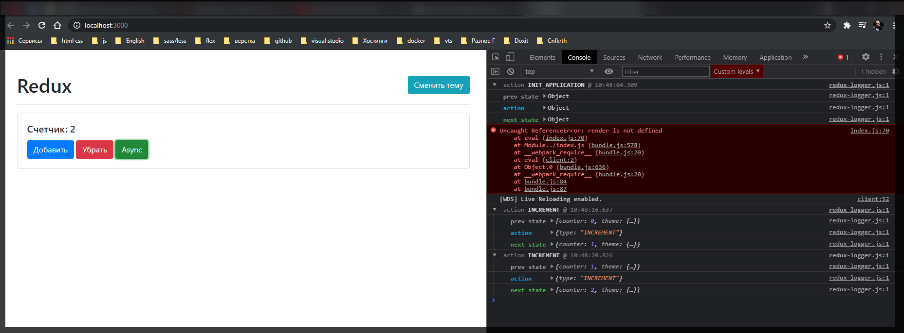
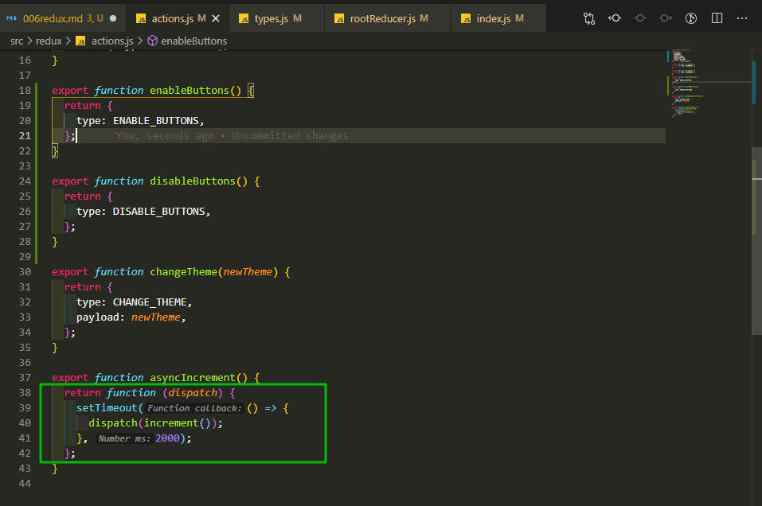
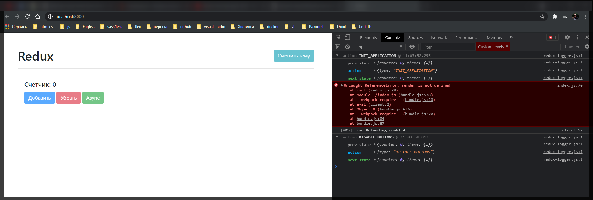
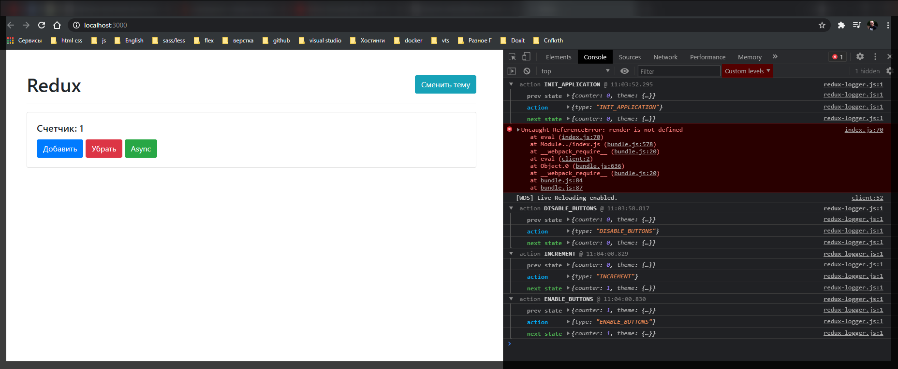

# Блокирование кнопок при асинхронной операции

С чего вообще нам стоит начать?

Начать стоит с того что нам нужно создать несколько **actions**.

```jsx
//src//redux/types.js

export const INCREMENT = 'INCREMENT';
export const DECREMENT = 'DECREMENT';
export const ASYNC_INCREMENT = 'ASYNC_INCREMENT';
export const CHANGE_THEME = 'CHANGE_THEME';

export const DISABLE_BUTTONS = 'DISABLE_BUTTONS';
export const ENABLE_BUTTONS = 'ENABLE_BUTTONS';
```

**ENABLE_BUTTONS** создаю для того что когда произойдет асинхронное событие, то кнопки нам нужно разблокировать. Предположим это будет тоже касаться нашей темы. Можно конечно создать еще один **reducer**, но как бы это относится к визуальному представлению.

У нас есть два новых **action** и **ENABLE_BUTTONS** и мы можем для них создать два новых **action** creator т.е. он называется **enableButtons** и **disableButtons**.

```js
//src/redux/actions.js
import {
  INCREMENT,
  DECREMENT,
  CHANGE_THEME,
  ENABLE_BUTTONS,
  DISABLE_BUTTONS,
} from '../redux/types';

export function increment() {
  return { type: INCREMENT };
}

export function decrement() {
  return { type: DECREMENT };
}

export function enableButtons() {
  return {
    type: ENABLE_BUTTONS,
  };
}

export function disableButtons() {
  return {
    type: DISABLE_BUTTONS,
  };
}

export function changeTheme(newTheme) {
  return {
    type: CHANGE_THEME,
    payload: newTheme,
  };
}

export function asyncIncrement() {
  return function (dispatch) {
    setTimeout(() => {
      dispatch(increment());
    }, 2000);
  };
}
```

Дальше это нам нужно обработать в **reducer**. В **themeReducer** добавляю новый **case ENABLE_BUTTONS:** и дальше нам нужно изменить какое-то состояние в **state** которого у нас пока нет.

В **initialThemeState** я его создаю **disabled: false**. Т.е. по умолчанию наши кнопки будут включены.

```jsx
//src/redux/rootReducer.js
import { combineReducers } from 'redux';
import { INCREMENT, DECREMENT, CHANGE_THEME, ENABLE_BUTTONS } from './types';

function counterReducer(state = 0, action) {
  if (action.type === INCREMENT) {
    return state + 1;
  } else if (action.type === DECREMENT) {
    return state - 1;
  }

  return state;
}

const initialThemeState = {
  value: 'light',
  disabled: false,
};

function themeReducer(state = initialThemeState, action) {
  switch (action.type) {
    case CHANGE_THEME:
      return { ...state, value: action.payload };
    case ENABLE_BUTTONS:
    default:
      return state;
  }
}

export const rootReducer = combineReducers({
  counter: counterReducer,
  theme: themeReducer,
});
```

Соответсвенно для того что бы изменить состояние я в **themeReducer** разворачиваю **...state**, и далее изменяю в нем определенное поле. Когда мы включаем кнопки нам это значение нужно ставить в **disable: false**, когда выключавем **disable: true**.

```jsx
//src/redux/rootReducer.js
import { combineReducers } from 'redux';
import {
  INCREMENT,
  DECREMENT,
  CHANGE_THEME,
  ENABLE_BUTTONS,
  DISABLE_BUTTONS,
} from './types';

function counterReducer(state = 0, action) {
  if (action.type === INCREMENT) {
    return state + 1;
  } else if (action.type === DECREMENT) {
    return state - 1;
  }

  return state;
}

const initialThemeState = {
  value: 'light',
  disabled: false,
};

function themeReducer(state = initialThemeState, action) {
  switch (action.type) {
    case CHANGE_THEME:
      return { ...state, value: action.payload };
    case ENABLE_BUTTONS:
      return { ...state, disabled: false };
    case DISABLE_BUTTONS:
      return { ...state, disabled: true };
    default:
      return state;
  }
}

export const rootReducer = combineReducers({
  counter: counterReducer,
  theme: themeReducer,
});
```

И это то как мы меняем наше состояние. Осталось обработать его в нашем компоненте.

Это у нас все находится в **index.js** в методе **store.subscribe**.

Лучше всего **store.subscribe** и **dispatch** перенести вниз, после того как мы добавили прослушку события. Иначе прослушка работать не будет.

Дальше нужно обратиться к трем нашим кнопкам. Самый простой способ, что бы это все не перечислять, мы можем объеденить это все в массив **[addBtn, subBtn, asyncBtn, themeBtn];**

```js
//src/index.js
import { createStore, applyMiddleware } from 'redux';
import thunk from 'redux-thunk';
import logger from 'redux-logger';
import { rootReducer } from './redux/rootReducer.js';
import './styles.css';

import {
  increment,
  decrement,
  asyncIncrement,
  changeTheme,
} from './redux/actions';

const counter = document.getElementById('counter');
const addBtn = document.getElementById('add');
const subBtn = document.getElementById('sub');
const asyncBtn = document.getElementById('async');
const themeBtn = document.getElementById('theme');

// function logger(state) {
//   return function (next) {
//     return function (action) {
//       console.log('Prev state', state.getState());
//       console.log('Action', action);
//       const newState = next(action);
//       console.log('New state', state.getState());
//       return next(newState);
//     };
//   };
// }

const store = createStore(rootReducer, applyMiddleware(thunk, logger));

window.store = store;

addBtn.addEventListener('click', () => {
  store.dispatch(increment());
});

subBtn.addEventListener('click', () => {
  store.dispatch(decrement());
});

asyncBtn.addEventListener('click', () => {
  store.dispatch(asyncIncrement());
});

themeBtn.addEventListener('click', () => {
  const newTheme = document.body.classList.contains('light') ? 'dark' : 'light';
  store.dispatch(changeTheme(newTheme));
});

store.subscribe(() => {
  const state = store.getState();
  counter.textContent = state.counter;
  document.body.className = state.theme.value;

  [addBtn, subBtn, asyncBtn, themeBtn];
});

store.dispatch({ type: 'INIT_APPLICATION' });

render();
```

И далее делаю просто **forEach()** и говорим что каждой кнопке **btn =>** нам необходимо присвоить значение **btn.disabled =** на значение которое находится в нашем **state.theme.disabled**

```jsx
//src/index.js
import { createStore, applyMiddleware } from 'redux';
import thunk from 'redux-thunk';
import logger from 'redux-logger';
import { rootReducer } from './redux/rootReducer.js';
import './styles.css';

import {
  increment,
  decrement,
  asyncIncrement,
  changeTheme,
} from './redux/actions';

const counter = document.getElementById('counter');
const addBtn = document.getElementById('add');
const subBtn = document.getElementById('sub');
const asyncBtn = document.getElementById('async');
const themeBtn = document.getElementById('theme');

// function logger(state) {
//   return function (next) {
//     return function (action) {
//       console.log('Prev state', state.getState());
//       console.log('Action', action);
//       const newState = next(action);
//       console.log('New state', state.getState());
//       return next(newState);
//     };
//   };
// }

const store = createStore(rootReducer, applyMiddleware(thunk, logger));

window.store = store;

addBtn.addEventListener('click', () => {
  store.dispatch(increment());
});

subBtn.addEventListener('click', () => {
  store.dispatch(decrement());
});

asyncBtn.addEventListener('click', () => {
  store.dispatch(asyncIncrement());
});

themeBtn.addEventListener('click', () => {
  const newTheme = document.body.classList.contains('light') ? 'dark' : 'light';
  store.dispatch(changeTheme(newTheme));
});

store.subscribe(() => {
  const state = store.getState();
  counter.textContent = state.counter;
  document.body.className = state.theme.value;

  [addBtn, subBtn, asyncBtn, themeBtn].forEach(
    (btn) => (btn.disabled = state.theme.disabled)
  );
});

store.dispatch({ type: 'INIT_APPLICATION' });

render();
```



Я нажимаю на кнопки и ничего не происходит. Потому что я не вызываю эти **actions** в нужный момент. Я их создал но нигде не использую.

А когда нам нужно их использовать?

Мы можем их использовать когда делаем асинхронный инкремент, но мы не знаем когда он закончется. По этому лучше это делать в **actions.js** на самом деле это единственное место где их стоит делать. Т.е. когда мы мопадаем вот в эту функцию



еще до асинхронного события мы берем и выключаем наши кнопки **dispatch(disableButtons());** а когда асинхронное событие произошло тогда мы так же диспатчим новое событие

```jsx
//src/redux/actions.js
import {
  INCREMENT,
  DECREMENT,
  CHANGE_THEME,
  ENABLE_BUTTONS,
  DISABLE_BUTTONS,
} from '../redux/types';

export function increment() {
  return { type: INCREMENT };
}

export function decrement() {
  return { type: DECREMENT };
}

export function enableButtons() {
  return {
    type: ENABLE_BUTTONS,
  };
}

export function disableButtons() {
  return {
    type: DISABLE_BUTTONS,
  };
}

export function changeTheme(newTheme) {
  return {
    type: CHANGE_THEME,
    payload: newTheme,
  };
}

export function asyncIncrement() {
  return function (dispatch) {
    dispatch(disableButtons());
    setTimeout(() => {
      dispatch(increment());
      dispatch(enableButtons());
    }, 2000);
  };
}
```

Обратите внимание мы как бы здесь не ограничены тем набором этих инструментов которые мы можем **dispatch(отправлять)**. И таким образом мы меняем состояние как нам нужно.



Как видим во время совершения асинхронной операции кнопки блокируются. А после отработки синхронного события кнопки разблокируются



```jsx
//src/index.js
import { createStore, applyMiddleware } from 'redux';
import thunk from 'redux-thunk';
import logger from 'redux-logger';
import { rootReducer } from './redux/rootReducer.js';
import './styles.css';

import {
  increment,
  decrement,
  asyncIncrement,
  changeTheme,
} from './redux/actions';

const counter = document.getElementById('counter');
const addBtn = document.getElementById('add');
const subBtn = document.getElementById('sub');
const asyncBtn = document.getElementById('async');
const themeBtn = document.getElementById('theme');

// function logger(state) {
//   return function (next) {
//     return function (action) {
//       console.log('Prev state', state.getState());
//       console.log('Action', action);
//       const newState = next(action);
//       console.log('New state', state.getState());
//       return next(newState);
//     };
//   };
// }

const store = createStore(rootReducer, applyMiddleware(thunk, logger));

window.store = store;

addBtn.addEventListener('click', () => {
  store.dispatch(increment());
});

subBtn.addEventListener('click', () => {
  store.dispatch(decrement());
});

asyncBtn.addEventListener('click', () => {
  store.dispatch(asyncIncrement());
});

themeBtn.addEventListener('click', () => {
  const newTheme = document.body.classList.contains('light') ? 'dark' : 'light';
  store.dispatch(changeTheme(newTheme));
});

store.subscribe(() => {
  const state = store.getState();
  counter.textContent = state.counter;
  document.body.className = state.theme.value;

  [addBtn, subBtn, asyncBtn, themeBtn].forEach(
    (btn) => (btn.disabled = state.theme.disabled)
  );
});

store.dispatch({ type: 'INIT_APPLICATION' });

// render();
```
