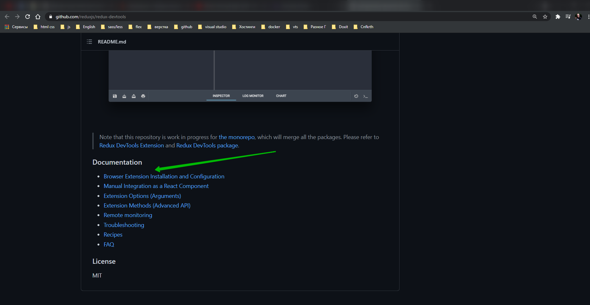
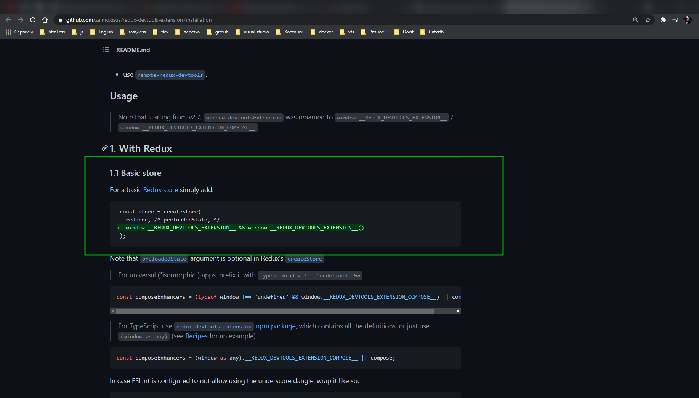
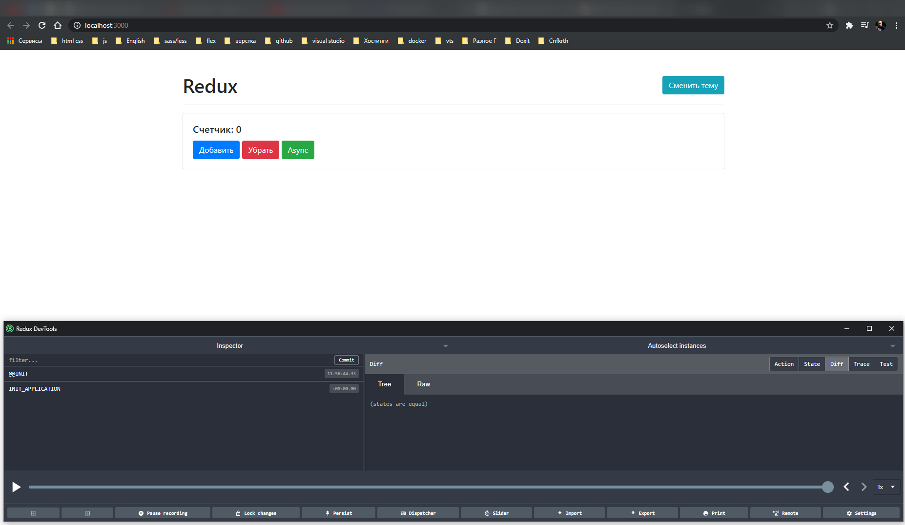
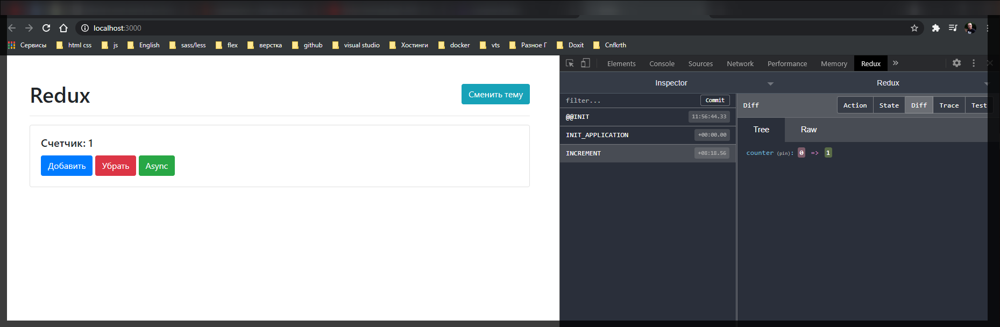
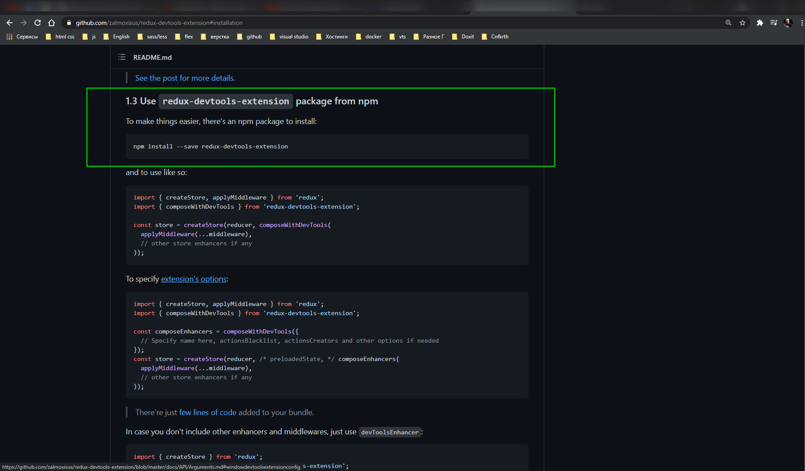
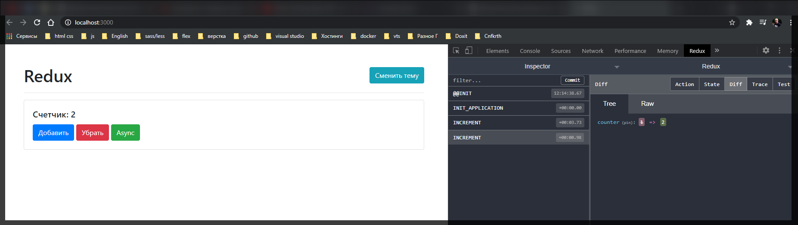

# redux devTools

На официальном сайте **redux** я могу перейти в **API Reference** найти функцию **compose** [https://redux.js.org/api/compose](https://redux.js.org/api/compose). И в **example** показано. Функция **compose** может быть использована с пакетом [redux-devtools](https://github.com/reduxjs/redux-devtools). Мы можем перейти и посмотреть что это за монстр.

Но меня интерисует документация по тому как это все интегрировать в браузер.



[Browser Extension Installation and Configuration](https://github.com/zalmoxisus/redux-devtools-extension#installation)

Во - первых нужно установить дополнительное расширение в браузер.

Далее по сути нам нужнопросто в **createStore** передать этот объект **devtools**



Я беру просто копирую строчку

```
window.__REDUX_DEVTOOLS_EXTENSION__ && window.__REDUX_DEVTOOLS_EXTENSION__()
```

Перехожу в свой **store**. И здесь возникает вопрос. Здесь у меня поле **applyMiddleware**. И если я его уберу то наше приложение будет сломано. По этому нужно придумать другую функцию как это сделать.

На самом деле **redux** нам предлагает воспользоватся функцией **compose**. Мы можем взять функцию **compose** и самого расширения если оно присутствует. Или мы можем его забрать из самого **redux**. И второй вариант лучше.

Импортирую функцию **compose** из **redux**. И далее переписываю определение **createStore** таким образом. Я вызываю функцию **compose()** в нее передаю **applyMiddleware**, и после него я могу передавать что мне угодно т.е. ту строчку.

```js
//src/index.js
import { createStore, applyMiddleware, compose } from 'redux';
import thunk from 'redux-thunk';
import logger from 'redux-logger';
import { rootReducer } from './redux/rootReducer.js';
import './styles.css';

import {
  increment,
  decrement,
  asyncIncrement,
  changeTheme,
} from './redux/actions';

const counter = document.getElementById('counter');
const addBtn = document.getElementById('add');
const subBtn = document.getElementById('sub');
const asyncBtn = document.getElementById('async');
const themeBtn = document.getElementById('theme');

// function logger(state) {
//   return function (next) {
//     return function (action) {
//       console.log('Prev state', state.getState());
//       console.log('Action', action);
//       const newState = next(action);
//       console.log('New state', state.getState());
//       return next(newState);
//     };
//   };
// }

const store = createStore(
  rootReducer,
  compose(
    applyMiddleware(thunk, logger),
    window.__REDUX_DEVTOOLS_EXTENSION__ && window.__REDUX_DEVTOOLS_EXTENSION__()
  )
);

window.store = store;

addBtn.addEventListener('click', () => {
  store.dispatch(increment());
});

subBtn.addEventListener('click', () => {
  store.dispatch(decrement());
});

asyncBtn.addEventListener('click', () => {
  store.dispatch(asyncIncrement());
});

themeBtn.addEventListener('click', () => {
  const newTheme = document.body.classList.contains('light') ? 'dark' : 'light';
  store.dispatch(changeTheme(newTheme));
});

store.subscribe(() => {
  const state = store.getState();
  counter.textContent = state.counter;
  document.body.className = state.theme.value;

  [addBtn, subBtn, asyncBtn, themeBtn].forEach(
    (btn) => (btn.disabled = state.theme.disabled)
  );
});

store.dispatch({ type: 'INIT_APPLICATION' });

// render();
```



И теперь у меня есть расширение которое следит за событиями. Либо же в **devtools** есть поле **redux** которое мы можем посмотреть.

Здесь мы видим что первым событием диспатчелось **INIT** а вторым **INIT_APPLICATION**.

Допустим диспатчим событие **INCREMENT**.



Кстати более удобно мы можем это использовать если установим специальную библиотеку.



И теперь я могу не заморачиваться с этими глобальными объектами **window**.

```js
//src/index.js
import { createStore, applyMiddleware, compose } from 'redux';
import thunk from 'redux-thunk';
import { composeWithDevTools } from 'redux-devtools-extension';
import logger from 'redux-logger';
import { rootReducer } from './redux/rootReducer.js';
import './styles.css';

import {
  increment,
  decrement,
  asyncIncrement,
  changeTheme,
} from './redux/actions';

const counter = document.getElementById('counter');
const addBtn = document.getElementById('add');
const subBtn = document.getElementById('sub');
const asyncBtn = document.getElementById('async');
const themeBtn = document.getElementById('theme');

// function logger(state) {
//   return function (next) {
//     return function (action) {
//       console.log('Prev state', state.getState());
//       console.log('Action', action);
//       const newState = next(action);
//       console.log('New state', state.getState());
//       return next(newState);
//     };
//   };
// }

// const store = createStore(
//   rootReducer,
//   compose(
//     applyMiddleware(thunk, logger),
//     window.__REDUX_DEVTOOLS_EXTENSION__ && window.__REDUX_DEVTOOLS_EXTENSION__()
//   )
// );

const store = createStore(
  rootReducer,
  composeWithDevTools(applyMiddleware(thunk, logger))
);

window.store = store;

addBtn.addEventListener('click', () => {
  store.dispatch(increment());
});

subBtn.addEventListener('click', () => {
  store.dispatch(decrement());
});

asyncBtn.addEventListener('click', () => {
  store.dispatch(asyncIncrement());
});

themeBtn.addEventListener('click', () => {
  const newTheme = document.body.classList.contains('light') ? 'dark' : 'light';
  store.dispatch(changeTheme(newTheme));
});

store.subscribe(() => {
  const state = store.getState();
  counter.textContent = state.counter;
  document.body.className = state.theme.value;

  [addBtn, subBtn, asyncBtn, themeBtn].forEach(
    (btn) => (btn.disabled = state.theme.disabled)
  );
});

store.dispatch({ type: 'INIT_APPLICATION' });

// render();
```


