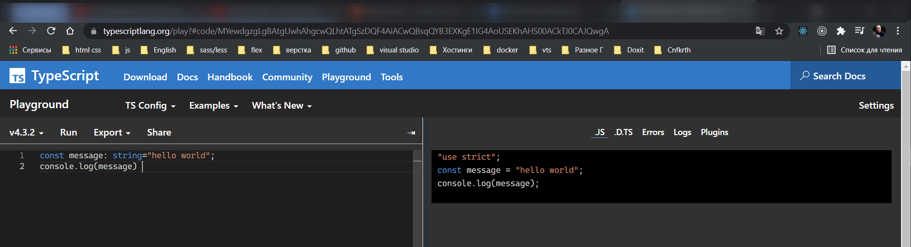

# Введение

<https://www.youtube.com/watch?v=nyIpDs2DJ_c>

**TypeScript** - это статически типезируемый **JavaScript** который в основном служит для создания сложных и больших приложений. Так же у него есть кодовое название **JS** который масштабируется.

**ОфСайт:** <https://www.typescriptlang.org/>.

Зачем он нужен и в каких случаях его следует использовать? За последние годы **JS** существенно эволюционировал. Теперь это уже не просто скриптовый язык, а теперь это полнценный язык программирования который служит для создания клиентских приложений, для серверных приложений. Он так же может создавать мобильные приложения, **desktop** приложения.

Когда **JS** создавался он не был предназначен для больших и сложных приложений. В нем изначально была заложена динамическия типизация. Это означает что любую переменную, любого типа вы могли присвоить другой переменной. К примеру у вас была переменная строкового формата и вы могли ей присвоить например массив.

Если язык потдерживает статическую типизацию, то это означает что вообще качество кода увеличивается. Увеличивается понимание этого кода. Данный код проще потдерживать. И на этапе разработки вы можете отлавливать большое количество ошибок.

Однако без статической системы очень сложно построить какие-то сложные приложения с большим количеством взаимодействий и вообще работать в больших командах.

По этому **Microsoft** и разработала язык **TypeScript** который по сути нам нужен только на этапе разработки. Т.е. он берет ядро **JS** и поверх него накладывает какие-то новые абстракции которые мы рассмотрим.

Какие есть плюсы у **TS**.

- Отлавливает ошибки на этапе разработки.
- Позволяет писать более сложные приложения и соответственно делать это более комфортно.
- Рефакторить код тоже становиться проще потому что у вас есть типы и вы соотственно вы сразу можете понять где что-то может пойти не так.
- Намного проще работать в командах разработчиков. Потому что у каждого разработчика свой собственный стиль написания кода. Но когда есть статическая типизация то вещи становятся проще.

Кстати на официальном сайте очень богатая документация <https://www.typescriptlang.org/docs/>.

В чем минусы **TypeScript**?

- Это лишняя дополнительная прослойка которую вам необходимо внедрить на этапе разработки. Но зачастую она себя окупает.

Рассмотрим все базовые возможности **TS**. Во вкладке **PlayGround** в режиме реального времени посмотреть На какие-то возможности **TS** и псмотреть во что он компилируется.

Теперь как мы будем проходить. Я создаю абсолютно чистый проект с называнием **typescript** и по сути здесь я буду создавать файлы которые будут относиться к какой-то тематике и в ней мы будем рассмотривать функционал.

Например мы начнем с **types**.
