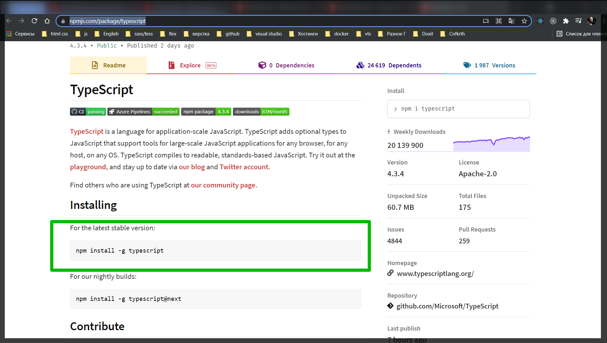
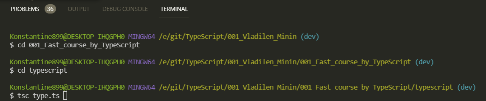
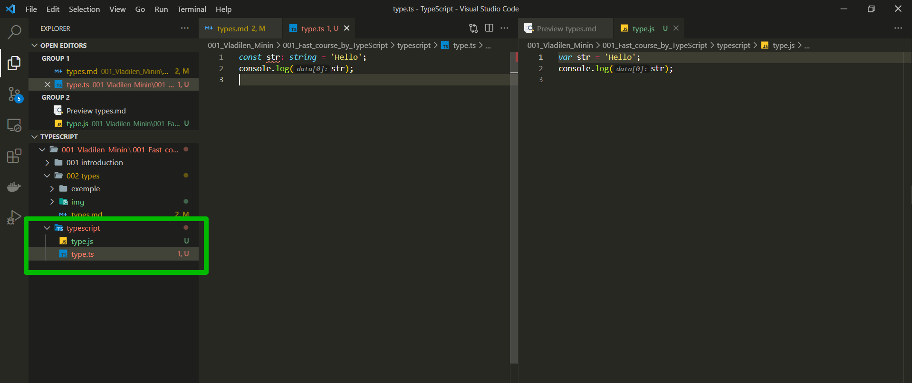
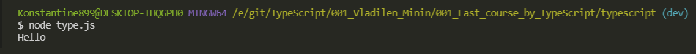
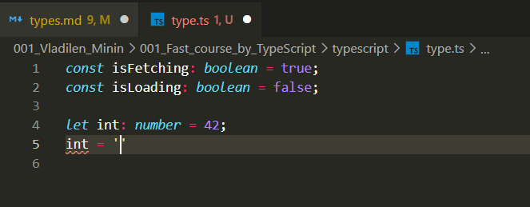
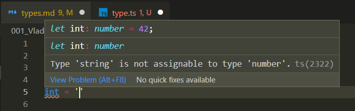
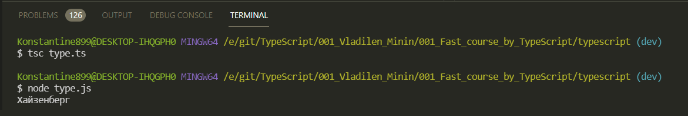

# Type

Создаю файл **type.ts**.

Как нам запускать данный файл и вообще проверить что все это работает?

В первую очередь нам необходимо установить глобально **TS** на компьютере <https://www.npmjs.com/package/typescript>

Так как он нам нужет глобольно прописываю вот эту команду.



```ts
const str: string = 'Hello';
console.log(str);
```

Теперь для того что бы скомпилировать данный файл в терминале пишу.

```shell
tsc type.ts
```

В терминале перехожу в папку с данным файлом и запускаю данную команду.



И получаю скомпилированный файл



И как видим я действительно получаю скомпилированный файл который я теперь могу запустить с помощью **node.js**.



И теперь рассмотрим базовые типы в **TS**.

Первый примитивный тип который мы рассмотрим это **Boolean**.

И он принимает в себя два значения. Рассмотрим на примере двух переменных

```ts
const isFetching: boolean = true;
const isLoading: boolean = false;
```

Вы можете обратить внимание на то что типы мы указываем перед присвоением и через двоеточие. После двоеточия идет указание типа.

<br>
<br>
<br>

Рассмотрим следующий примитивный тип число.

```js
const int: number = 42;
```

Что интересно. Если я теперь сделаю переменную через ключевое слово **let** и после чего я ее попробую переопределить на строку, то мы сразуже получаем ошибку.





Даже, не смотря на то что это let, мы не можем присвоить другое значение потому что это другой тип. Это касается и любых других типов. Как работать с данной ситуацией мы рассмотрим чуть позже.

Помимо того чтомы можем задавать целочисленные значения мы так же можем задавать **float** значения.

```ts
const int: number = 42;
const float: number = 4.2;
```

Мы можем задавать какие-нибудь другие значения.

```js
const int: number = 42;
const float: number = 4.2;
const num: number = 3e10;
```

<br>
<br>
<br>

Следующий примитивный тип это **string**.

```ts
//string
const message: string = 'Hello TypeScript';
```

<br>
<br>
<br>
<br>

Далее у нас идут массивы.

Массивы это некоторая структура данных которая содержит в себе разные другие данные. И как нам указать в **TS** что допустим массив состоит из чисел например? Или например из строк. Создам массив из чисел фибоначчи.

```ts
//Array
const numberArray = [1, 1, 2, 3, 5, 8, 13];
```

И для того что бы указать что данный массив у нас является массивом из чисел так же указываю тип **number**, но после этого я указываю что это массив т.е. ставлю квадратные скобки.

```js
const numberArray: number[] = [1, 1, 2, 3, 5, 8, 13];
```

Однако у массивов есть и другая форма указания типа. При указании типа я могу указать глобальный класс **Array** и дальше в треугольных скобках указываю из чего этот массив состоит т.е. в моем случае это **number**.

```ts
//Array
const numberArray: number[] = [1, 1, 2, 3, 5, 8, 13];
const numberArray2: Array<number> = [1, 1, 2, 3, 5, 8, 13];
```

Вообще такая запись называется [Generic type](https://canonium.com/articles/typescript-generics). По сути она указывает в треугольных скобках из чего состоит данный класс или данный объект.

Если привести пример со строками то это может выглядеть следующим образом.

```ts
const words: string[] = ['Hello', 'Typescript'];
```

Однако в **TS** присутствует один интересный тип данных который называется [Tuple](https://webformyself.com/typescript-tuple-kortezhi/). Его идея заключается в том что мы так же создаем какой-то массив состоящий из разных типов данных.

```ts
//Tuple
const contact = ['Konstantine', +375298918971];
```

И мы хотим явно указать тип переменной **contact**. Для этого я после объявления переменной ставлю двоеточие, после указываю квадратные скобки, в них указываю **string**, **number**.

```js
//Tuple
const contact: [string, number] = ['Konstantine', +375298918971];
```

Во время разработки часто бывает ситуация когда необходимо переопределить тип данных. Особенно учитывая что мы работаем в **JS**. Потому что **TS** только для разработки. Браузеры как понимали, так и понимают только **JS**.

Для переопределения существует специальный тип **Any**.

```ts
//Any
let variable: any = 42;
variable = 'New string';
```

<br>
<br>
<br>

Рассмотрим функции

```ts
function sayMyName(name: string) {
  console.log(name);
}
```

Если мы возовем данную функцию то она нам ничего не вернет. И мы можем явно указывать возвращаемый тип данных у функции. Так же через двоеточие, том где мы у функции передаем параметры. Т.е. после круглых скобок указываю двоеточие. И учитывая то что мы ничего не возвращаем мы можем указать тип **void**. Это означает что функция нам ничего не вернет. И теперь я могу вызвать эту функция со значением.

```ts
function sayMyName(name: string) {
  console.log(name);
}

sayMyName('Хайзенберг');
```



Есть еще интересный тип в **TS** который был анонсирован в относительно новых версиях. Он называется **Never**. В каких случаях нам следует указывать данный тип? В двух случаях:

1. Когда функция либо возвращает нам ошибку и никогда не заканчивает своего выполнения.
2. Либо когда она постоянно что либо делает.

```ts
// Never
function throwError(message: string): never {
  throw new Error(message);
}
```

Так же есть и другой случай.

```ts
function infinite(): never {
  while (true) {}
}
```

Т.е. это функция будет работать постоянно так как у нее нет ложного условия. Данная функция всегда истинна.

<br>
<br>
<br>
<br>

Далее рассмотрим конструкцию которая нам позволяет создавать свой собственные типы.

Например мы можем использовать примитивные типы и создавать для них элиасы. Для этого существует специальное ключевое слово которое называется **type**. Я могу создать тип со значением **string**.

```ts
// Создание Type
type Login = string;
```

Теперь данный тип я могу казывать для каких-либо переменных.

```ts
// Создание Type
type Login = string;
const login: Login = 'admin';
```

В данном случае мы как бы создаем элиас. Порой это бывает удобно для разработки потому что какие-то именованные типы дают больше понимания того что происходит.

Так же мы можем указывать потенциально различные типы данных для одной и той же переменной с помощью **type**. Т.е. допустим встречаются такие ситуации когда **id** может либо строкой либо числом.

Поэтому я могу создать тип **ID** который будет принимать в себя значение либо **string** либо **number**.

```ts
type ID = string | number;
const id1: ID = 1234;
const id2: ID = '1234';
```

Но я не могу создать переменную **boolean** типа потому что она может быть либо **number** либо **string**.

Кстати когда мы компилируем такие вещи в **JS** они просто исчезают

```ts
type ID = string | number;
```

Они нам нужны только на этапе разработки.

<br>
<br>
<br>

И последние два примитивные типа которые я хотел бы рассмотреть это **null** и **undefined**. Они не очень часто используются. В основном они используются для определени типов.

```ts
type SomeType = string | null | undefined;
```

Вы зачастую можете их встретить вот в таком контексте. Но если мы прописываем пустой тип для функции **void**, что функция ничего не возвращает, то обычно используется именно **void**.
