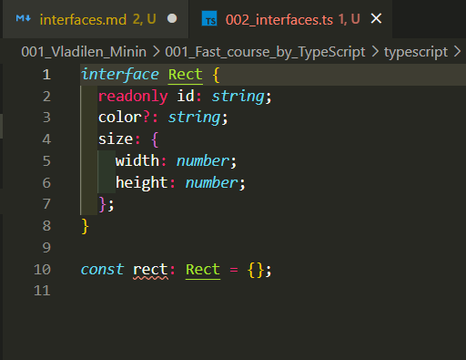
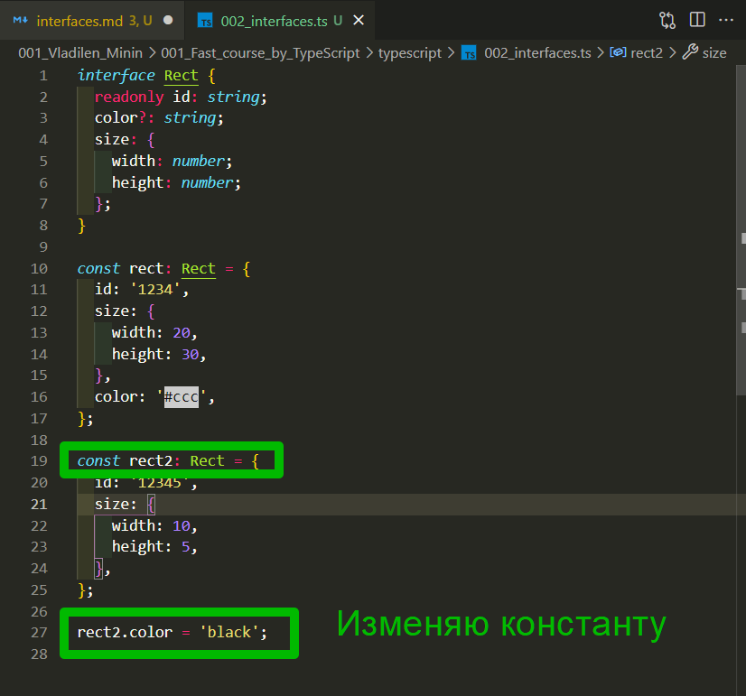
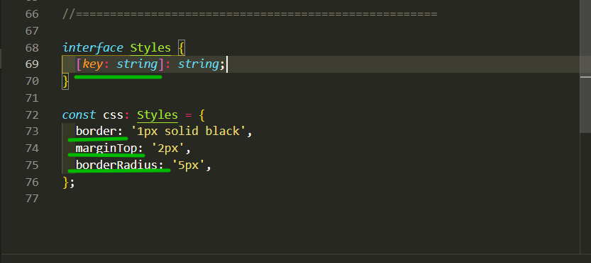
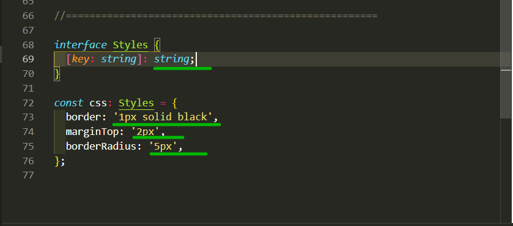

# interfaces

Что такое интерфейсы и зачем они вообще нужны?

По сути мы создаем некоторый тип который служит для объектов или для классов где мы указываем какие поля, какие функции и какие вообще элементы должны присутствовать у этих объектов. Опять же **interfaces** они ни во что не компилируются. Они нам так же нужны на этапе разработки.

Рассмотрим простой пример. Пишу ключевое слово **interface** и к примеру назову ее **Rect**

```ts
interface Rect {}
```

Какие могут быть параметры у **Rectangle** который мы заводим. У него может быть **id** например типа **string**. И что класно в **interfaces** я могу сразу сказать что данное поле у нас будет только для чтения т.е. мы не сможем его изменять. Для этого ямогу применить модификатор **readonly**

```ts
interface Rect {
  readonly id: string;
}
```

Далее допустим у нас будет свойство **color** типа **string**. И тоже что класно я могу добавлять эти параметры как не обязательные. Путем добавления в ключ занака ?

```ts
interface Rect {
  readonly id: string;
  color?: string;
}
```

Далее я могу указывать другие параметры к примеру объект **size**.

```ts
interface Rect {
  readonly id: string;
  color?: string;
  size: {
    width: number;
    height: number;
  };
}
```

Мы создали **interface** и теперь мы можем создавать различные объекты которые будут являться типом **Rect**. И посмотрим как это работает.

Создаю переменную **rect1** и сразу указываю ее тип. И видно что переменная **rect** у нас не валидная



Не валидная потому что мы не реализовали необходимые поля. Первое поле это **id**. И смотрите, мне **IDE** подсказывает какие поля нужно реализовать. В webStorm у него подсказывает. У меня нет

```js
interface Rect {
  readonly id: string;
  color?: string;
  size: {
    width: number;
    height: number;
  };
}

const rect: Rect = {
  id: '1234',
  size: {
    width: 20,
    height: 30,
  },
};
```

И теперь наша переменная **rect** она валидна. Но мы так же можем добавлять для нее **color** и все будет работать хорошо.

```ts
interface Rect {
  readonly id: string;
  color?: string;
  size: {
    width: number;
    height: number;
  };
}

const rect: Rect = {
  id: '1234',
  size: {
    width: 20,
    height: 30,
  },
  color: '#ccc',
};
```

Создаю еще переменную.

```ts
interface Rect {
  readonly id: string;
  color?: string;
  size: {
    width: number;
    height: number;
  };
}

const rect: Rect = {
  id: '1234',
  size: {
    width: 20,
    height: 30,
  },
  color: '#ccc',
};

const rect2: Rect = {
  id: '12345',
  size: {
    width: 10,
    height: 5,
  },
};
```

Теперь color я могу указать где-нибудь внизу

```ts
interface Rect {
  readonly id: string;
  color?: string;
  size: {
    width: number;
    height: number;
  };
}

const rect: Rect = {
  id: '1234',
  size: {
    width: 20,
    height: 30,
  },
  color: '#ccc',
};

const rect2: Rect = {
  id: '12345',
  size: {
    width: 10,
    height: 5,
  },
};

rect2.color = 'black';
```

И как видите все работает корректоно.

Едиственное вас может смутить то что **rect2** это костанта. Но в последствии я ее изменяю



Происходит это потому что в конечном итоге мы все равно работаем в **JS**. И в **JS** те вещи которые являются константами, если это объект или это массив, то мы можем изменять их внутреннее состояние. Но мы не можем переопределять сами константы.

Так же я хочу разобрать еще два момента которые я могу делать с объектами и с интерфейсами.

Мы можем указывать какому типу будет относиться объект.

```ts
const rect3 = {};
```

Но я могу его строго привести к какому нибудь типу написать as **Rect**.

```ts
const rect3 = {} as Rect;
```

и есть альтернативная старая запись

```ts
const rect3 = {} as Rect;
const rect4 = <Rect>{};
```

<br>
<br>
<br>
<br>

Наследование **interface**.

**Typescript** позволяет нам очень гибко взаимодействовать с интерфейсами.

Для этого я создам новый интерфейс **RectWithArea** и данный интерфейс будет наследоваться от интерфейса **Rect**.

```ts
interface Rect {
  readonly id: string;
  color?: string;
  size: {
    width: number;
    height: number;
  };
}

const rect: Rect = {
  id: '1234',
  size: {
    width: 20,
    height: 30,
  },
  color: '#ccc',
};

const rect2: Rect = {
  id: '12345',
  size: {
    width: 10,
    height: 5,
  },
};

rect2.color = 'black';

//========================

const rect3 = {} as Rect;
const rect4 = <Rect>{};

//=========================

interface RectWithArea extends Rect {}
```

И в данном интерфейсе реализую функцию которая будет считать площадь фигуры. Допустим пусть это будет функция **getArea**. прописываю стрелочную функцию, после стрелки указываю возвращаемый тип данных **getArea: () => number**.

```ts
interface RectWithAria extends Rect {
  getArea: () => number;
}
```

Теперь я создаю **rect5** после двоеточия указываю тип данный а имеено **RectWithAria**. После чего присваиваю объект со всеми необходимыми полями.

```ts
interface RectWithAria extends Rect {
  getArea: () => number;
}

const rect5: RectWithAria = {
  id: '123',
  size: {
    width: 20,
    height: 20,
  },
  // Обязательно добавляю функцию getArea
  getArea(): number {
    return this.size.width * this.size.height;
  },
};
```

И полный файл

```ts
interface Rect {
  readonly id: string;
  color?: string;
  size: {
    width: number;
    height: number;
  };
}

const rect: Rect = {
  id: '1234',
  size: {
    width: 20,
    height: 30,
  },
  color: '#ccc',
};

const rect2: Rect = {
  id: '12345',
  size: {
    width: 10,
    height: 5,
  },
};

rect2.color = 'black';

//========================

const rect3 = {} as Rect;
const rect4 = <Rect>{};

//=========================

interface RectWithAria extends Rect {
  getArea: () => number;
}

const rect5: RectWithAria = {
  id: '123',
  size: {
    width: 20,
    height: 20,
  },
  // Обязательно добавляю функцию getArea
  getArea(): number {
    return this.size.width * this.size.height;
  },
};
```

Так же интерфейсы могут взаимодействовать с классами. Создаю **interface** **IClock**. Очень часто называют с большой буквы I для того что бы в скомпилированном **JS** четко было видно что это интерфейс. Создаю поле **time** типа **Date**. И класс который будет имплиментороватся от данного интерфейса который должен будет реализовать метод **setTime**. И обратите внимание на то как мы можем указывать методы. Метод **setTime** будет принимать в себя **date:** типа **Date**.

```ts
interface IClock {
  time: Date;
  setTime(date: Date): void;
}
```

Теперь мы можем создать какой-нибудь класс

```ts
interface IClock {
  time: Date;
  setTime(date: Date): void;
}

class Clock {}
```

И теперь для того что бы **TS** понял что данный класс имплиментируется он **interface** и должен реализовать его методы. Мы так и пишем ключевое слово **implements** и название интерфейса **IClock**

```ts
interface IClock {
  time: Date;
  setTime(date: Date): void;
}

class Clock implements IClock {}
```

Теперь видно что данный класс у нас не валидный. Реализую поля. **time: Date** по умолчанию будет **new Date()**. И так же мне необходимо реализовать мтод **setTime**

```ts
interface IClock {
  time: Date;
  setTime(date: Date): void;
}

class Clock implements IClock {
  time: Date = new Date();
  setTime(date: Date): void {
    this.time = date;
  }
}
```

<br>
<br>
<br>
<br>

И последнее. Бывают ситуации когда нам необходимо создать **interface** для объекта у которого будет большое количество динамических ключей.

Допустим я создам переменную **css**.

```ts
const css = {
  border: '1px solid black',
  marginTop: '2px',
  borderRadius: '5px',
};
```

Безусловно мы можем описать **interface** для данного объекта

```ts
interface Styles {
  border: string;
}

const css = {
  border: '1px solid black',
  marginTop: '2px',
  borderRadius: '5px',
};
```

Но мы не можем перечислить все **css** свойства. Это будет просто не эффективно.

И для таких ситуаций мы можем указать специальный синтаксис. В **interface** я указываю квадратные скобки, в которых я указываю тип ключа. И для этого есть ключевое слово **key** для которого мы указываем тип допустим **string**. И далее после квадратных скобок ставлю двоеточие и указываю как значение будет **string**.

```ts
interface Styles {
  [key: string]: string;
}

const css: Styles = {
  border: '1px solid black',
  marginTop: '2px',
  borderRadius: '5px',
};
```





```ts
interface Rect {
  readonly id: string;
  color?: string;
  size: {
    width: number;
    height: number;
  };
}

const rect: Rect = {
  id: '1234',
  size: {
    width: 20,
    height: 30,
  },
  color: '#ccc',
};

const rect2: Rect = {
  id: '12345',
  size: {
    width: 10,
    height: 5,
  },
};

rect2.color = 'black';

//========================

const rect3 = {} as Rect;
const rect4 = <Rect>{};

//=========================

interface RectWithAria extends Rect {
  getArea: () => number;
}

const rect5: RectWithAria = {
  id: '123',
  size: {
    width: 20,
    height: 20,
  },
  // Обязательно добавляю функцию getArea
  getArea(): number {
    return this.size.width * this.size.height;
  },
};

//================================================

interface IClock {
  time: Date;
  setTime(date: Date): void;
}

class Clock implements IClock {
  time: Date = new Date();
  setTime(date: Date): void {
    this.time = date;
  }
}

//=====================================================

interface Styles {
  [key: string]: string;
}

const css: Styles = {
  border: '1px solid black',
  marginTop: '2px',
  borderRadius: '5px',
};
```
