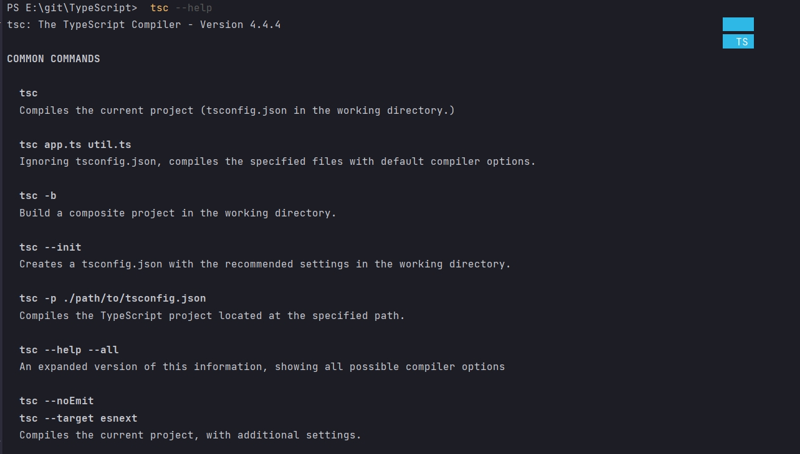

# Установка среды разработки

Для начало установим Typescript компилятор.

```shell
npm install -global typescript ts-node
```

- typescript - сам глобальный модуль
- ts-node - инструмент командной строки который позволяет нам компилировать и перезапускать typescript при помощи одно команды в терминале.

Мы в первой части курса будем запускать не большие части typescript кода.

Для того что бы убедиться что все установлено нормально.

```shell
 tsc --help
```
- tsc - typescript compiled  мы будем использовать этот компилятор для того что бы преобразовывать typescript код в обычный js.

Для того что бы это решить разрешаю выполнение файлов PowerShel в Windows

Проблема заключается в том, что политика выполнения скриптов запрещает выполнять эти самые скрипты. Узнать текущее значение политики можно командой:

```shell
Get-ExecutionPolicy
```

Чтобы разрешить выполнение файлов с расширением .ps1, то есть чтобы запустить скрипт PowerShell в Windows, выполните команду:

```shell
Set-ExecutionPolicy unrestricted
```

огда поступит запрос, введите Y.

Данные команды нужно выполнять в PowerShell, а не в CMD.


После чего выполняю интересующую команду.


```shell
 tsc --help
```

И вот все выполнено успешно



