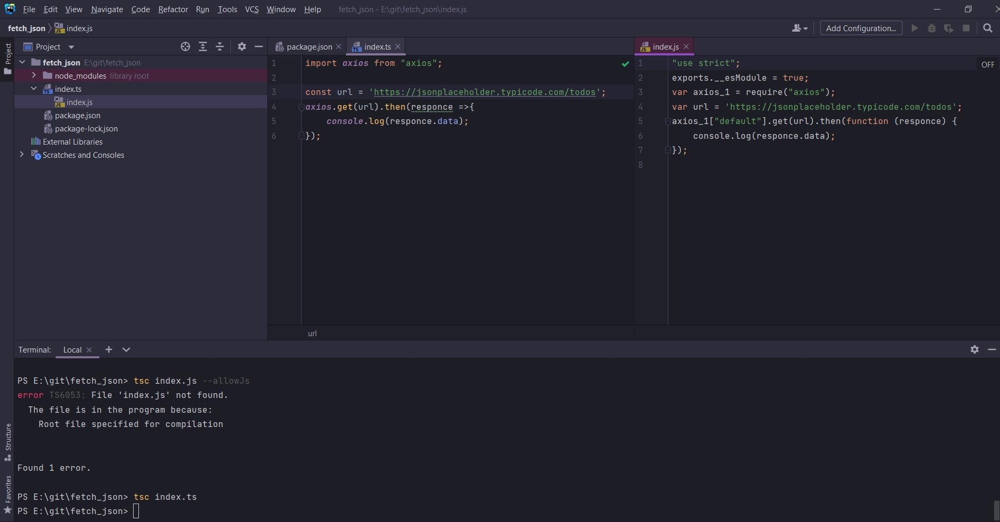
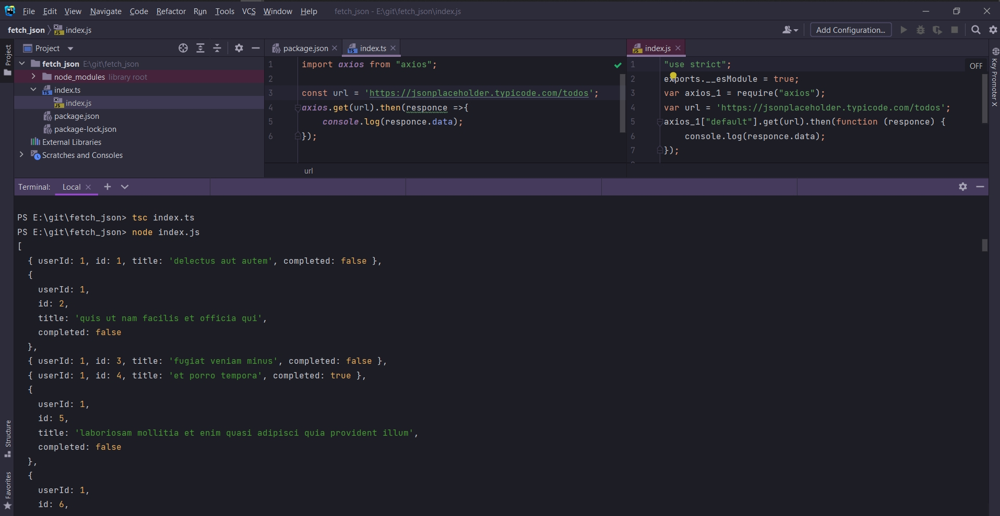
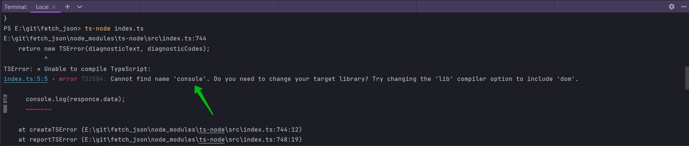
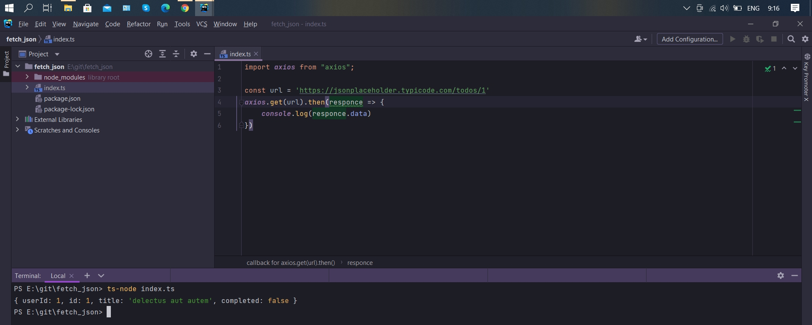

# Запуск TypeScript кода

В проекте создаю index.ts.

```ts
import axios from "axios";

const url = 'https://jsonplaceholder.typicode.com/todos';
axios.get(url).then(responce =>{
    console.log(responce.data)
});
```

В консоли.

```shell
tsс index.ts
```



Как видите index.js содержит скомпилированный код.

И теперь именно этот файл мы будем запускать с расширением js при помощи нашего терминала.

```shell
node index.js
```



Каждый раз для того что бы запустить TS код нам нужно сначало скомполировать его, послечего при помощь node запускать скомпилированный файл.

Но мы можем объеденить эти два команды при помощи модуля ts-node который мы установили в прошлом видео.

```shell
ts-node index.ts
```

И так же у меня возникала ошибка.



станановил пакет

```shell
npm install @types/node --save-dev
```



